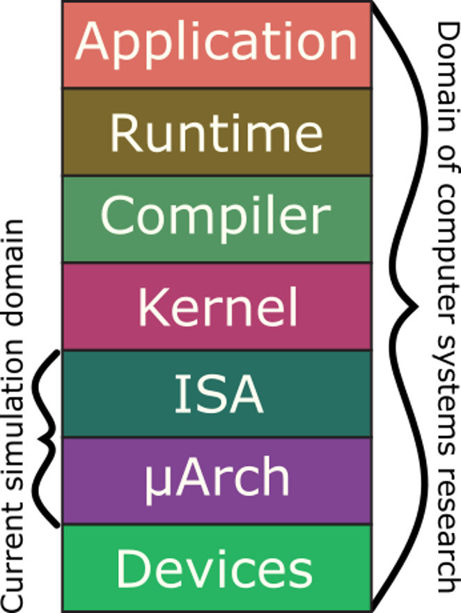
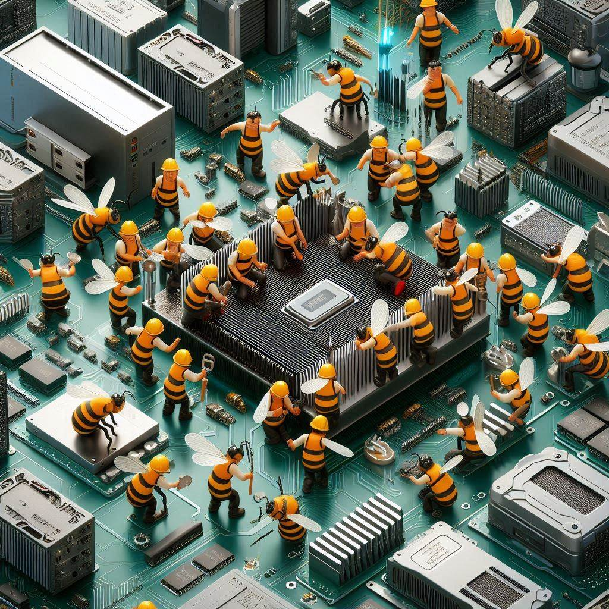
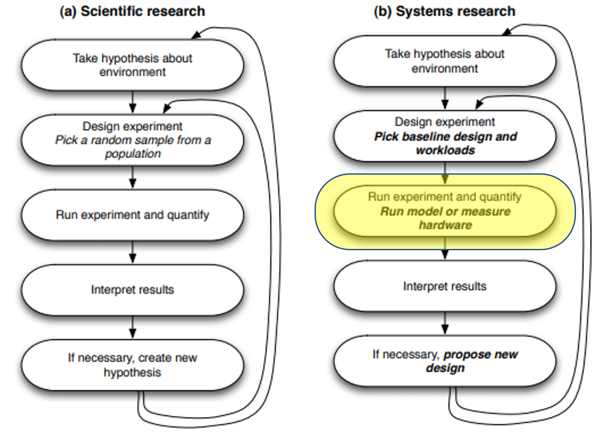
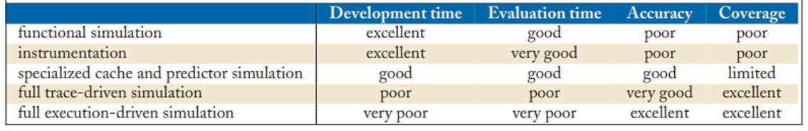
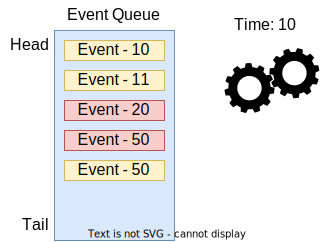
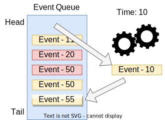
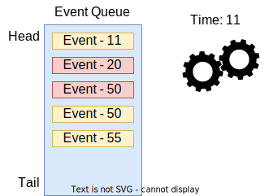
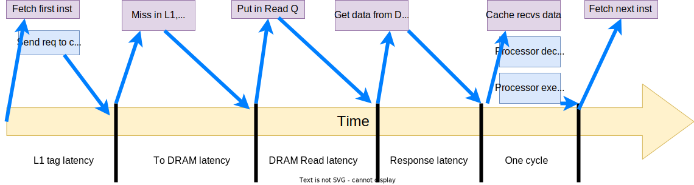
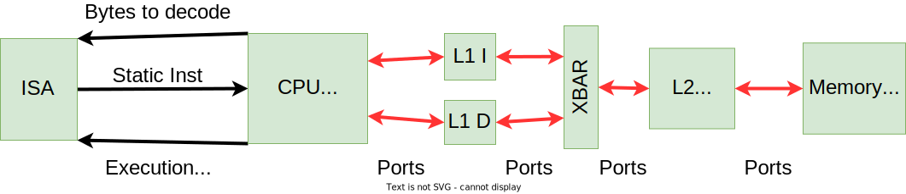

<!-- _class: title -->

## Computer Architecture Simulation

---

## Outline

### What is gem5 and a bit of history

### My perspective on architecture simulation

### gem5's software architecture

---

## First there was M5


---

## M5 at ISCA 2005


---

## Then there was GEMS


---

## GEMS at ISCA 2005


---

## Now, we have two simulators...


---

## What is gem5?

### Michigan m5 + Wisconsin GEMS = gem5

> "The gem5 simulator is a modular platform for computer-system architecture research, encompassing system-level architecture as well as processor microarchitecture."

### Citations for gem5

Lowe-Power et al. The gem5 Simulator: Version 20.0+. ArXiv Preprint ArXiv:2007.03152, 2021. <https://doi.org/10.48550/arXiv.2007.03152>

Nathan Binkert, Bradford Beckmann, Gabriel Black, Steven K. Reinhardt, Ali Saidi, Arkaprava Basu, Joel Hestness, Derek R. Hower, Tushar Krishna, Somayeh Sardashti, Rathijit Sen, Korey Sewell, Muhammad Shoaib, Nilay Vaish, Mark D. Hill, and David A. Wood. 2011. The gem5 simulator. SIGARCH Comput. Archit. News 39, 2 (August 2011), 1-7. DOI=<http://dx.doi.org/10.1145/2024716.2024718>

---

## gem5-20+: A new era in computer architecture simulation


---

## gem5's goals




---

## gem5's goals

### Anyone (including non-architect) can download and use gem5

### Used for cross-stack research:

- Change kernel, change runtime, change hardware, all in concert
- Run full ML stacks, full AR/VR stacks… other emerging apps

### We're close… just a lot of rough edges! You can help!

---

## The gem5 community

100s of contributors & 1000s(?) of users

### Aim to meet the needs of

- Academic research (most of you all!)
- Industry research and development
- Classroom use

Code of conduct (see repo)

### _I want to see the community grow!_



---

<!-- _class: start -->

## My views on simulation

---



From [Computer Architecture Performance Evaluation Methods](https://link.springer.com/book/10.1007/978-3-031-01727-8) by Lieven Eeckhout

Highlighted block is where computer architecture simulation fits in

---

## Why simulation?

---

## Why simulation? (Answer)

- Need a tool to evaluate systems that don't exist (yet)
  - Performance, power, energy, etc.
- Very costly to actually make the hardware
- Computer systems are complex with many interdependent parts
  - Not easy to be accurate without the full system
- Simulation can be parameterized
  - Design-space exploration
  - Sensitivity analysis

---

## Alternatives to cycle-level simulation: Analytical modeling

### Amdahl's Law

$$ S_{latency}(s) = \frac{1}{(1-p) + \frac{p}{s}} $$

### Queuing theory


<br><br> <!-- needed for image above -->

$$ L = \lambda W $$

---

## Kinds of simulation

- Functional simulation
- Instrumentation-based
- Trace-based
- Execution-driven
- Full system

---

## Kinds of simulation: details

- Functional simulation
  - Executes programs correctly. Usually no timing information
  - Used to validate correctness of compilers, etc.
  - RISC-V Spike, QEMU, gem5 "atomic" mode
- Instrumentation-based
  - Often binary translation. Runs on actual hardware with callbacks
  - Like trace-based. Not flexible to new ISA. Some things opaque
  - PIN, NVBit
- Trace-based simulation
  - Generate addresses/events and re-execute
  - Can be fast (no need to do functional simulation). Reuse traces
  - If execution depends on timing, this will not work!
  - "Specialized" simulators for single aspect (e.g., just cache hit/miss)

---

## Kinds of simulation: Execution-driven and full system

### Execution-driven

- Functional and timing simulation is combined
- gem5 and many others
- gem5 is "execute in execute" or "timing directed"

### Full system

- Components modeled with enough fidelity to run mostly unmodified apps
- Often "Bare metal" simulation
- All of the program is functionally emulated by the simulator
- Often means running the OS in the simulator, not faking it

"Full system" simulators are often combine functional and execution-based

---

## Nomenclature (VMs)

- **Host:** the actual hardware you're using
- Running things directly on the hardware:
  - **Native execution**
- **Guest:** Code running on top of "fake" hardware
  - OS in virtual machine is guest OS
  - Running "on top of" hypervisor
  - Hypervisor is emulating hardware


---

## Nomenclature (gem5)

- **Host:** the actual hardware you're using
- **Simulator:** Runs on the host
  - Exposes hardware to the guest
- **Guest:** Code running on simulated hardware
  - OS running on gem5 is guest OS
  - gem5 is simulating hardware
- **Simulator's code:** Runs natively
  - executes/emulates the guest code
- **Guest's code:** (or benchmark, workload, etc.)
  - Runs on gem5, not on the host.


---

## Nomenclature (more gem5)

- **Host:** the actual hardware you're using
- **Simulator:** Runs on the host
  - Exposes hardware to the guest
- **Simulator's performance:**
  - Time to run the simulation on host
  - Wallclock time as you perceive it
- **Simulated performance:**
  - Time predicted by the simulator
  - Time for guest code to run on simulator


---

## Tradeoffs in types of simulation

- Development time: time to make the simulator/models
- Evaluation time: wallclock time to run the simulator
- Accuracy: How close is the simulator to real hardware
- Coverage: How broadly can the simulator be used?



---

## What level should we simulate?

- Ask yourself: What fidelity is required for this question?
  - Example: New register file design
  - Often, the answer is a mix.
- gem5 is well suited for this mix
  - Models with different fidelity
  - Drop-in replacements for each other

### "Cycle level" vs "cycle accurate"

---

## RTL simulation

- RTL: Register transfer level/logic
  - The "model" is the hardware design
  - You specify every wire and every register
  - Close to the actual ASIC
- This is "cycle accurate" as it should be the same in the model and in an ASIC
- Very high fidelity, but at the cost of configurability
  - Need the entire design
  - More difficult to combine functional and timing

---

## Cycle-_level_ simulation

- Models the system cycle-by-cycle
- Often "event-driven" (we'll see this soon)
- Can be highly accurate
  - Not the exact same cycle-by-cycle as the ASIC, but similar timing
- Easily parameterizeable
  - No need for a full hardware design
- Faster than cycle-accurate
  - Can "cheat" and functionally emulate some things

---

<!-- _class: start -->

## gem5's software architecture

---

## Software architectures


---

## gem5 architecture: SimObject

### Model

This is the `C++` code in **`src/`**

### Parameters

Python code in **`src/`**
In SimObject declaration file

### Instance or Configuration

A particular choice for the parameters
In standard library, your extension, or python runscript

---

## Model vs parameter

- **Model:** The `C++` code that does the timing simulation
  - Generic
- Expose **parameters** to python
- Set **parameters** and connections in python


---

## Some nomenclature

### You can **_extend_** a model to model new things

In this case, you should _inherit_ from the object in C++

```cpp
class O3CPU : public BaseCPU
{
```

### You can **_specialize_** a model to model with specific parameters

In this case, you should _inherit_ from the object in Python

```python
class i7CPU(O3CPU):
    issue_width = 10
```

---

## gem5 architecture: Simulation

gem5 is a **_discrete event simulator_**

At each timestep, gem5:

1. Event at the head is dequeued
2. The event is executed
3. New events are scheduled



---

<!-- _paginate: hold -->

## gem5 architecture: Simulation

gem5 is a **_discrete event simulator_**

At each timestep, gem5:

1. Event at the head is dequeued
2. The event is executed
3. New events are scheduled



---

<!-- _paginate: hold -->

## gem5 architecture: Simulation

gem5 is a **_discrete event simulator_**

At each timestep, gem5:

1. Event at the head is dequeued
2. The event is executed
3. New events are scheduled

> ### All SimObjects can enqueue events onto the event queue



---

## Discrete event simulation example


---

<!-- _paginate: hold -->

## Discrete event simulation example


---

<!-- _paginate: hold -->

## Discrete event simulation example



To model things that take time, schedule the _next_ event in the future (latency of current event).
Can call functions instead of scheduling events, but they occur _in the same tick_.

---

## Discrete event simulation

"Time" needs a unit
In gem5, we use a unit called "Tick"

Need to convert a simulation "tick" to user-understandable time
E.g., seconds

This is the global simulation tick rate
Usually this is 1 ps per tick or $10^{12}$ ticks per second

---

## gem5's main abstractions: Memory

### Memory requests

- **Ports** allow you to send requests and receive responses
- Ports are unidirectional (two types, request/response)
- Anything* with a Request port can be connected to any Response port
- More on this in [Ports and memory-based SimObjects](../03-Developing-gem5-models/04-ports.md)


---

## gem5's main abstractions: CPU

### ISA vs CPU model

- ISAs and CPU models are orthogonal.
- Any ISA should work with any CPU model.
- "Execution Context" is the interface.
- More on this in [modeling cores](../03-Developing-gem5-models/05-modeling-cores.md)


