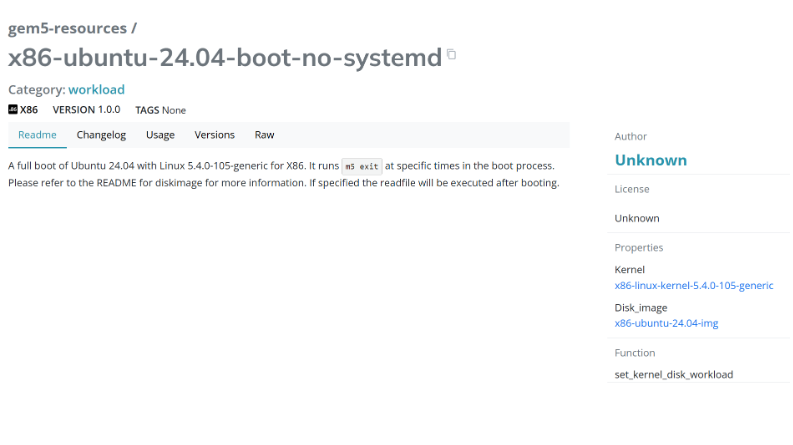

<!-- _class: title -->

## Getting started with gem5

In this section, we will get familiar the tutorial's codespace environment and run our first gem5 simulation.

---

## Let’s hit the ground running

### This example will show

1. How someone obtains gem5.
2. How you build it.
3. Running a very basic "Hello World" simulation.

- Getting and compiling gem5 is often the hardest part.
- There's a lot of complicated things happening behind the scenes. We will explain them later.

---

## Typical Downloading

```sh
> git clone https://github.com/gem5/gem5
> cd gem5
```

> There are two main branches in the gem5 repository:
> **stable**: The default branch for gem5. Updated at stable releases. Currently v24.0.
> **develop**: The branch in which new features, improvements, etc. are added regularly for the next release.

In this tutorial we’re going to use codespaces with a repo which includes some example materials. Though all the gem5 code is v24.0

---

## Using codespaces

- We will be using the "bootcamp environment"
  - Note: That's also where the source for these slides are

> **Step 1:** Go to the classroom <https://classroom.github.com/...>

You need to be in the github organization (via the classroom) to get free codespaces.

---

## Using codespaces 2

**AFTER** joining the classroom, you can go to the repository and click on the green "Code" button.
Again, note that this is the repo where the slides are.

<https://github.com/gem5bootcamp-2024/>


---

## Using codespaces 3

> **Step 3:** Wait for the environment to load.


---

## Navigating the repository

- **`gem5/`**
  - The gem5 source code (v24.0). A sub-repository
- **`gem5-resources/`**
  - Source code for gem5's resources (workloads, disks, etc.). Also a sub-repository
- **`slides/`**
  - Markdown version of these slides. Used to build the website/slides.
  - You can also preview the slides in vs code.
- **`materials/`**
  - Python scripts and other materials for the tutorial.
  - Most of the live coding examples will be here.
  - Completed examples are in the `completed` directories.
- A few other things for the website, automatic building, vs code configurations, etc.

Both the slides and materials are broken down into sections and lessons.
We use numbering to keep them in order.

---

## Building gem5

> Don't do this right now!

```sh
> scons build/ALL/gem5.opt
```

- This takes a while (10-15 minutes with 16 cores, ~1hr on 1 core).
- If you're using codespaces, we have prebuilt binaries for you.
- We'll talk more about the build system and options later.

<script src="https://asciinema.org/a/6rAd24brgGqb3Sj8Kmvy1msaG.js" id="asciicast-6rAd24brgGqb3Sj8Kmvy1msaG" async="true"></script>

---

## Time for a live coding example

While we do this, feel free to follow along in the slides.

The slides (found in `slides/01-Introduction/02-getting-started.md`) contain the code snippets we will be using. You can copy-paste from there if you get behind.

Press the "Preview" button in VS Code to see a rendered version of the slides locally.


---

## Let’s start by writing a simulation configuration

```python
from gem5.prebuilt.demo.x86_demo_board import X86DemoBoard
from gem5.resources.resource import obtain_resource
from gem5.simulate.simulator import Simulator
```

This template code is available in the `materials/01-Introduction/02-getting-started/` directory.
Open the [`basic.py`](../../materials/01-Introduction/02-getting-started/basic.py) file and start editing.

Throughout this bootcamp we will be editing/extending files in the materials directory.

Links to the code are available in the slides if you're using VS Code.

---

## Let’s be lazy and use a prebuild board

```python
board = X86DemoBoard()
```

The X86DemoBoard has the following properties:

- Single Channel DDR3, 2GB Memory.
- A 4 core 3GHz processor (using gem5’s ‘timing’ model).
- A MESI Two Level Cache Hierarchy, with 32kB data and instruction case and a 1MB L2 Cache.
- Will be run as a Full-System simulation.

Source is available: [src/python/gem5/prebuilt/demo/x86_demo_board.py](../../gem5/src/python/gem5/prebuilt/demo/x86_demo_board.py).

---

## Let's load some software

```python
board.set_workload(
    obtain_resource("x86-ubuntu-24.04-boot-no-systemd")
)
```

- `obtain_resource` downloads the files needed to run workload
  - Boots Ubuntu without systemd then exits the simulation
  - Downloads disk image, kernel, and sets default parameters

See the [gem5 resource page](https://resources.gem5.org/resources/x86-ubuntu-24.04-boot-no-systemd?version=1.0.0)

---

## gem5 resources web portal

[Link](https://resources.gem5.org/resources/x86-ubuntu-24.04-boot-no-systemd?version=1.0.0)



---

## Now, let's create a simulator to actually run

```python
sim = Simulator(board)
sim.run(20_000_000_000) # 20 billion ticks or 20 ms
```

---

## That's it!

```python
from gem5.prebuilt.demo.x86_demo_board import X86DemoBoard
from gem5.resources.resource import obtain_resource
from gem5.simulate.simulator import Simulator
board = X86DemoBoard()
board.set_workload(
    obtain_resource("x86-ubuntu-24.04-boot-no-systemd")
)
sim = Simulator(board)
sim.run(20_000_000_000) # 20 billion ticks or 20 ms
```

To run it:

```sh
> gem5 basic.py
```

---

## Results

gem5 has a lot of output.
It's both verbose on stdout, but also writes many files in `m5out/`.

### gem5's output

In `m5out/` you'll see:

- `stats.txt`: The statistics from the simulation.
- `board.pc.com_1.device`: The console output from the simulation.
- `citations.bib`: Citations for the models and resources used.
- `config.ini/json`: The configuration file used.
- `config*.pdf/svg`: A visualization of the configuration for the system and the caches.

---

## Take aways

- `gem5` is a Python interpreter.
- The *interface* to `gem5` is Python scripts.
- `gem5` contains many Python libraries.
  - All of the models in gem5 (e.g., caches, CPUs, etc.).
  - The standard library (stdlib)
- The output of gem5 is in `m5out/` by default.
  - Details of configuration
  - Other output
  - **Statistics** (the most important part)
- The codespaces environment is configured to make things easy.
  - You'll need to do some work to set up your own environment.
