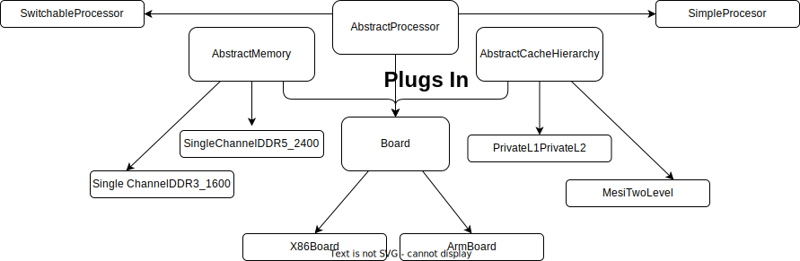
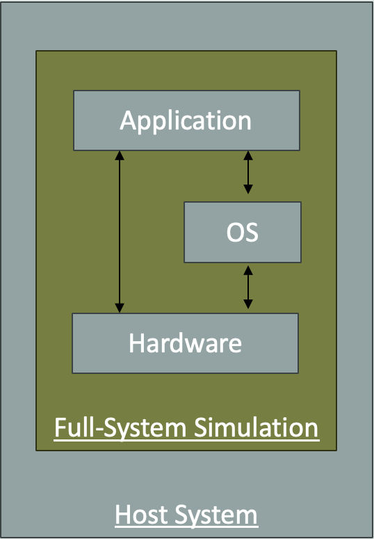
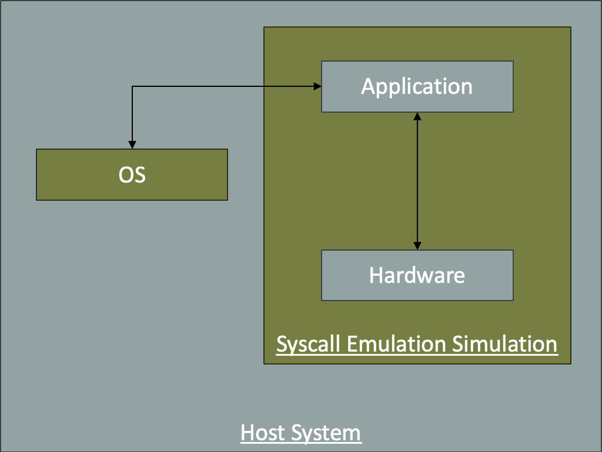
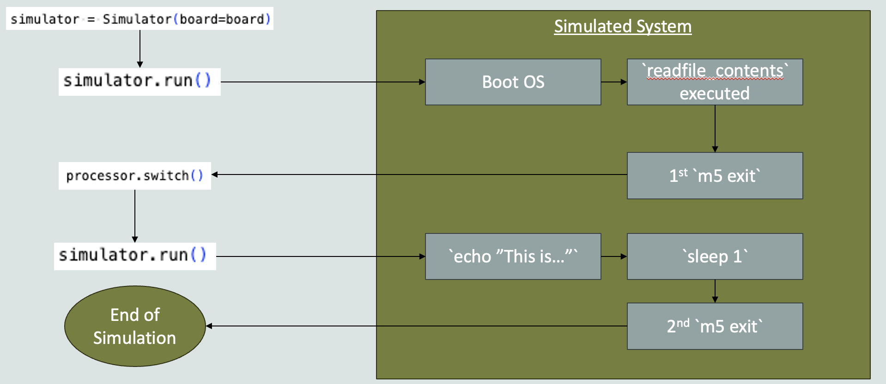
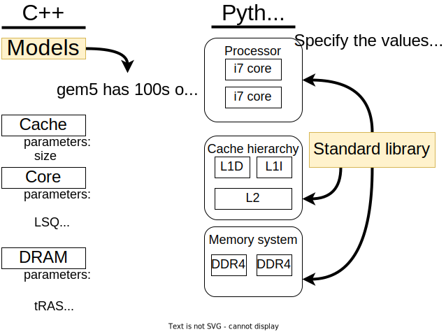

<!-- _class: title -->

## gem5's Standard Library

---

## Why a Standard Library?

When done without the library you must define *every part* of your simulation: Every SimObject, connected correctly to every port, for every part, no matter now small.
This can result in scripts with hundreds of lines of code even for the most basic of simulations.

This causes:

- A lot of duplicated code.
- Error-prone configurations.
- A lack of portability between different simulation setups.

In addition, while there is no "one size fits all" for gem5 users, most users have similar needs and requirements for their simulations, requiring only a few modifications off of some commonly used configuration systems. Prior to the creation of the standard library users would regularly circulate long, complex scripts and hack at them endlessly. Such practices inspired the creation of the gem5 Standard Library.

---

## What is the Standard Library?

The purpose of the gem5 Standard Library is to provide a set of predefined components that can be used to build a simulation that does the majority of the work for you.

For the remainder that is not supported by the standard library, APIs are provided that make it easy to extend the library for your own use.

---

## The metaphor: Plugging components together into a board



---

## Main idea

Due to its modular, object-oriented design, gem5 can be thought of as a set of components that can be plugged together to form a simulation.

The types of components are *boards*, *processors*, *memory systems*, and *cache hierarchies*:

- **Board**: The "backbone" of the system. You plug components into the board. The board also contains the system-level things like devices, workload, etc. It's the boards job to negotiate the connections between other components.
- **Processor**: Processors connect to boards and have one or more *cores*.
- **Cache hierarchy**: A cache hierarchy is a set of caches that can be connected to a processor and memory system.
- **Memory system**: A memory system is a set of memory controllers and memory devices that can be connected to the cache hierarchy.

---

## Quick note on relationship to gem5 models

The C++ code in gem5 specifies *parameterized* **models** (typically referred to "SimObjects" in most gem5 literature). These models are then instantiated in the Python scripts.

The standard library is a way to *wrap* these models in a standard API into, what we call, *components*. The standard library consists of pre-made Python scripts instantiating these models provided by gem5.

The gem5 models are fine grained concepts which make little sense for us to divide down further into sub-models or hardcore parameters for (for example, a *core*). A component works on coarser grained concepts typically containing many models instantiated with sensible parameters. For, example a *processor* which contains multiple cores and specifies how they are connected to buses and each other with all parameters set to sensible values.

If you want to create a new component you are encouraged to *extend* (i.e., subclass) the components in the standard library or create new components. This allows you to choose the models within the component and the value of their parameters. We will see some examples of this over the coming lectures.

---

## Let's get started!

<!-- _class: code-80-percent -->

In [`materials/02-Using-gem5/01-stdlib/01-components.py`](../../materials/02-Using-gem5/01-stdlib/01-components.py) you'll see some imports already included for you.

```python
from gem5.components.boards.simple_board import SimpleBoard
from gem5.components.processors.simple_processor import SimpleProcessor
from gem5.components.cachehierarchies.ruby.mesi_two_level_cache_hierarchy import (
    MESITwoLevelCacheHierarchy,
)
from gem5.components.memory.single_channel import SingleChannelDDR4_2400
from gem5.components.processors.cpu_types import CPUTypes
from gem5.isas import ISA
from gem5.resources.resource import obtain_resource
from gem5.simulate.simulator import Simulator
```

---

## Let's build a system with a cache hierarchy

```python
cache_hierarchy = MESITwoLevelCacheHierarchy(
    l1d_size="16kB",
    l1d_assoc=8,
    l1i_size="16kB",
    l1i_assoc=8,
    l2_size="256kB",
    l2_assoc=16,
    num_l2_banks=1,
)
```

`MESITwoLevelCacheHierarchy` is a component that represents a two-level MESI cache hierarchy.
This uses the [Ruby memory model](05-cache-hierarchies.md).

The component for the cache hierarchy is parameterized with the sizes and associativities of the L1 and L2 caches.

---

## Next, let's add a memory system

```python
memory = SingleChannelDDR4_2400()
```

This component represents a single-channel DDR3 memory system.

There is a `size` parameter that can be used to specify the size of the memory system of the simulated system. You can reduce the size to save simulation time, or use the default for the memory type (e.g., one channel of DDR3 defaults to 8 GiB).

There are also multi channel memories available.
We'll cover this more in [Memory Systems](06-memory.md).

---

## Next, let's add a processor

```python
processor = SimpleProcessor(cpu_type=CPUTypes.TIMING, isa=ISA.ARM, num_cores=1)
```

`SimpleProcessor` is a component that allows you to customize the model for the underlying cores.

The `cpu_type` parameter specifies the type of CPU model to use.

---

## Next, plug components into the board

A `SimpleBoard` is a board which can run any ISA in Syscall Emulation (SE) mode.
It is "Simple" due the relative simplicity of SE mode.
 Most boards are tied to a specific ISA and require more complex designs to run Full System (FS) simulation.

```python
board = SimpleBoard(
    clk_freq="3GHz",
    processor=processor,
    memory=memory,
    cache_hierarchy=cache_hierarchy,
)
```

---

## Next, set up the workload

```python
board.set_workload(obtain_resource("arm-gapbs-bfs-run"))
```

The `obtain_resource` function downloads the files needed to run the specified workload. In this case "arm-gapbs-bfs-run" is a BFS workload from the GAP Benchmark Suite.

---

## gem5 Resources

We will return to gem5 Resources later in the bootcamp, but for now, you can think of it as a way to download and manage files needed for your simulation but don't actually specify the simulated computer system hardware.
Typically it is used to download and manage workloads, disk images, checkpoints needed for the simulation.

Here we can search the available resources: <https://resources.gem5.org/>.

Here is the arm-gabps-bfs-run resource: <https://resources.gem5.org/resources/arm-gapbs-bfs-run?version=1.0.0>.

---

## Next, set up the simulation

Set up the simulation:

```python
simulator = Simulator(board=board)
simulator.run()
```

(More on this later, but this is object that controls the simulation loop).

### Run it

```bash
gem5-mesi 01-components.py
```

---

<!-- _class: code-70-percent -->

## Output

```text
Generate Time:       0.00462
Build Time:          0.00142
Graph has 1024 nodes and 10496 undirected edges for degree: 10
Trial Time:          0.00010
Trial Time:          0.00008
Trial Time:          0.00008
Trial Time:          0.00008
Trial Time:          0.00008
Trial Time:          0.00009
Trial Time:          0.00008
Trial Time:          0.00008
Trial Time:          0.00008
Trial Time:          0.00011
Average Time:        0.00009
```

### stats.txt

```text
simSeconds                                   0.009093
simTicks                                   9093461436
```

---

<!-- _class: two-col -->

## Components included in gem5

```text
gem5/src/python/gem5/components
----/boards
----/cachehierarchies
----/memory
----/processors

gem5/src/python/gem5/prebuilt
----/demo/x86_demo_board
----/riscvmatched
```

###

- gem5 stdlib in [`src/python/gem5`](../../gem5/src/python/gem5/)
- Two types
  - Prebuilt: full systems with set parameters
  - Components: Components to build systems
- Prebuilt
  - Demo: Just examples to build off of
  - riscvmatched: Model of SiFive Unmatched

---

<!-- _class: two-col -->

## Components: Boards

```text
gem5/src/python/gem5/components
----/boards
    ----/simple
    ----/arm_board
    ----/riscv_board
    ----/x86_board
----/cachehierarchies
----/memory
----/processors
```

###

- Boards: Things to plug into
  - Have "set_workload" and "connect_things"
- Simple: SE-only, configurable
- Arm, RISC-V, and X86 versions for full system simulation

---

<!-- _class: two-col -->

## Components: Cache hierarchies

```text
gem5/src/python/gem5/components
----/boards
----/cachehierarchies
    ----/chi
    ----/classic
    ----/ruby
----/memory
----/processors
```

###

- Have fixed interface to processors and memory
- **Ruby:** detailed cache coherence and interconnect
- **CHI:** Arm CHI-based protocol implemented in Ruby
- **Classic caches:** Hierarchy of crossbars with inflexible coherence

---

## A bit more about cache hierarchies

- Quick caveat: You need different gem5 binaries for different protocols
- Any binary can use classic caches
- Only one Ruby protocol per gem5 binary

### In your codespaces, we have some pre-built binaries

- `gem5`: CHI (Fully configurable; based on Arm CHI)
- `gem5-mesi`: MESI_Two_Level (Private L1s, Shared L2)
- `gem5-vega`: GPU_VIPER (CPU: Private L1/L2 core pairs, shared L3; GPU: Private L1, shared L2)

---

<!-- _class: two-col -->

## Components: Memory systems

```text
gem5/src/python/gem5/components
----/boards
----/cachehierarchies
----/memory
    ----/single_channel
    ----/multi_channel
    ----/dramsim
    ----/dramsys
    ----/hbm
----/processors
```

###

- Pre-configured (LP)DDR3/4/5 DIMMs
  - Single and multi channel
- Integration with DRAMSim and DRAMSys
  - Not needed for accuracy, but useful for comparisons
- HBM: An HBM stack

---

<!-- _class: two-col -->

## Components: Processors

```text
gem5/src/python/gem5/components
----/boards
----/cachehierarchies
----/memory
----/processors
    ----/generators
    ----/simple
    ----/switchable
```

###

- Mostly "configurable" processors to build off of.
- Generators
  - Synthetic traffic, but act like processors.
  - Have linear, random, and more interesting patterns
- Simple
  - Only default parameters, one ISA.
- Switchable
  - We'll see this later, but you can switch from one to another during simulation.

---

## More on processors

- Processors are made up of cores.
- Cores have a "BaseCPU" as a member. This is the actual CPU model.
- `Processor` is what interfaces with `CacheHierarchy` and `Board`
- Processors are organized, structured sets of cores. They define how cores connect with each other and with outside components and the board though standard interface.

### gem5 has three (or four or five) different processor models

More details coming in the [CPU Models](04-cpu-models.md) section.

- `CPUTypes.TIMING`: A simple in-order CPU model
  - This is a "single cycle" CPU. Each instruction takes the time to fetch and executes immediately.
  - Memory operations take the latency of the memory system.
  - OK for doing memory-centric studies, but not good for most research.

---

## CPU types

Other options for CPU types

- `CPUTypes.O3`: An out-of-order CPU model
  - Highly detailed model based on the Alpha 21264.
  - Has ROB, physical registers, LSQ, etc.
  - Don't use `SimpleProcessor` if you want to configure this.
- `CPUTypes.MINOR`: An in-order core model
  - A high-performance in-order core model.
  - Configurable four-stage pipeline
  - Don't use `SimpleProcessor` if you want to configure this.
- `CPUTypes.ATOMIC`: Used in "atomic" mode (more later)
- `CPUTypes.KVM`: More later

---

## A slightly more complex example

We have went over a basic "getting started" example, then went over the various components we offer.
Let's create a more complex example, incorporating more features delivered by the standard library.

In this example we will create a system using multiple cores, on an X86 board, in Full System mode.

### First: Let's discuss SE mode and FS mode

SE mode relays application syscalls to the host OS. This means we don't need to simulate an OS for applications to run.

In addition, we can access host resources such as files of libraries to dynamically link in.

---

## FS mode



---

## SE mode



---

## FS and SE mode: Common pitfalls

- **Don't treat SE mode as "FS  but faster"**: You must understand what you're simulating and whether it will impact results.
- **Not all syscalls will ever be implemented**: We'd love to have all the syscalls implemented but Linux changes rapidly. We try to cover common use-cases but we can't cover everything. If a Syscall is missing, you can implement it, ignore it, or use FS mode.
- **Binaries with elevated privileges do not work in SE mode**: If you're running a binary that requires elevated privileges, you'll need to run it in FS mode.

---

## SE mode: If in doubt, use FS mode

FS mode does everything SE mode does (and more!) but can take longer to get to the region of interest. You have to wait for the OS to boot each time (unless you [accelerate the simulation](08-accelerating-simulation.md)).

However, as SE mode doesn't simulate the OS, you risk missing important events triggered via syscalls, I/O, or the operating system, which may mean your simulated system doesn't properly reflect the real system.

**Think through what SE mode is doing and if it's right for your use-case.** If in doubt, use FS mode. It's (generally) not worth the risk using SE mode if you're not sure.

---

## How to specify FS mode using the standard library

Go to [`materials/02-Using-gem5/01-stdlib/01-02-fs-mode.py`](../../materials/02-Using-gem5/01-stdlib/01-02-fs-mode.py) and and work on this example.

---

## Template code (imports)

```python
from gem5.components.boards.x86_board import X86Board
from gem5.components.cachehierarchies.ruby.mesi_two_level_cache_hierarchy import (
    MESITwoLevelCacheHierarchy,
)
from gem5.components.memory.single_channel import SingleChannelDDR3_1600
from gem5.components.processors.cpu_types import CPUTypes
from gem5.components.processors.simple_switchable_processor import (
    SimpleSwitchableProcessor,
)
from gem5.isas import ISA
from gem5.resources.resource import obtain_resource
from gem5.simulate.exit_event import ExitEvent
from gem5.simulate.simulator import Simulator
```

---

## More template code

This adds a two-level cache hierarchy and a memory system.

```python
cache_hierarchy = MESITwoLevelCacheHierarchy(
    l1d_size="16kB",
    l1d_assoc=8,
    l1i_size="16kB",
    l1i_assoc=8,
    l2_size="256kB",
    l2_assoc=16,
    num_l2_banks=1,
)

memory = SingleChannelDDR3_1600(size="3GB")
```

---

## Let's add a SimpleSwitchableProcessor

Here we set up the processor. This is a special switchable processor in which a starting core type and a switch core type must be specified. Once a configuration is instantiated a user may call `processor.switch()` to switch from the starting core types to the switch core types. In this simulation we start with Timing cores to simulate the OS boot, then switch to the Out-of-order (O3) cores for the command we wish to run after boot.

```python
processor = SimpleSwitchableProcessor(
    starting_core_type=CPUTypes.TIMING,
    switch_core_type=CPUTypes.O3,
    isa=ISA.X86,
    num_cores=2,
)
```

---

## Next, plug components into the board

Here we set up the board. The X86Board allows for Full-System X86 simulations.

```python
board = X86Board(
    clk_freq="3GHz",
    processor=processor,
    memory=memory,
    cache_hierarchy=cache_hierarchy,
)
```

---

## What to do when Linux boots

Here we set the Full System workload.
The `set_kernel_disk_workload` function for the X86Board takes a kernel, a disk image, and, optionally, a command to run.

This is the command to run after the system has booted. The first `m5 exit` will stop the simulation so we can switch the CPU cores from timing to o3 and continue the simulation to run the echo command, sleep for a second, then, again, call `m5 exit` to terminate the simulation. After simulation has ended you may inspect `m5out/board.pc.com_1.device` to see the echo output.

```python
command = (
    "m5 exit;"
    + "echo 'This is running on O3 CPU cores.';"
    + "sleep 1;"
    + "m5 exit;"
)
```

---

## Setting the workload

This a slightly more convoluted way of specifying a workload.
Here we specify the kernel, disk image, and the command to run after booting the system.

```python
board.set_kernel_disk_workload(
    kernel=obtain_resource("x86-linux-kernel-4.4.186"),
    disk_image=obtain_resource("x86-ubuntu-18.04-img"),
    readfile_contents=command,
)
```

---

## Create the simulator object

Here we set up the simulator. We pass the board to the simulator and run it but also specify what to do when the simulation exits with the `EXIT` exit event. In this case we call the `processor.switch` function on the first exit event. For the 2nd the default action will be triggered which exits the simulator.

Warning: This is using a generator expression to create a tuple of functions to call.

```python
simulator = Simulator(
    board=board,
    on_exit_event={ExitEvent.EXIT: (func() for func in [processor.switch])},
)

simulator.run()
```

---

## What does the exit event generator do?

An equivalent to this would be run the following commands:

```python
simulator = Simulator(board=board)

simulator.run()
processor.switch()
simulator.run()
```

---

## The simulation loop



---

## Exit Events

Going back to what we implemented:

```python
simulator = Simulator(
    board=board,
    on_exit_event={ExitEvent.EXIT: (func() for func in [processor.switch])},
)

simulator.run()
```

We passed objects to specify exactly what to do on each exit event type via Python generators generator expression. In this case the generator yields `processor.switch` which is called when the exit event `ExitEvent.EXIT` is triggered.
When the 2nd exit is triggered the default action is triggered as there is nothing left to yield. The default action is to exit the simulation loop.

---

## Exit event types

- ExitEvent.EXIT
- ExitEvent.CHECKPOINT
- ExitEvent.FAIL
- ExitEvent.SWITCHCPU
- ExitEvent.WORKBEGIN
- ExitEvent.WORKEND
- ExitEvent.USER_INTERRUPT
- ExitEvent.MAX_TICK

The Simulator has default behavior for these events, but they can be overridden.

---

## Key idea: The `Simulator` object controls simulation

To place our idea of gem5:

- *models* (or *SimObjects*) are the fine-grained objects that are connected together in Python scripts to form a simulation.
- *components* are the coarse-grained objects that are connected defined as a set of configured models in Python scripts to form and delivered as part of the Standard Library
- The standard library allows users to specify a board and specify the properties of the board by specify the components that are connected to it.
- The Simulator takes a board and launches the simulation and gives an API which allows for control of the simulation: specifying the simulation stopping and restarting condition, replacing components "on the fly", defining when the simulation should stop and start, etc.

See [`src/python/gem5/simulate/simulator.py`](../../gem5/src/python/gem5/simulate/simulator.py) for the Simulator source.

We'll see more about this in [Accelerating Simulation](08-accelerating-simulation.md).

---

## Simulator parameters

- **`board`**: The `Board` to simulate (required)
- **`full_system`**: Whether to simulate a full system (default: `False`, can be inferred from the board, not needed specified in most cases)
- **`on_exit_event`**: A complex data structure that allows you to control the simulation. The simulator exits for many reasons, this allows you to customize what happens. We just saw an example.
- **`checkpoint_path`**: If we're restoring from a checkpoint, this is the path to the checkpoint. More on checkpoints later.
- **`id`**: An optional name for this simulation. Used in multisim. More on this in the future.

---

## Some useful functions

- **`run()`**: Run the simulation
- **`get/set_max_ticks(max_tick)`**: Set the absolute tick to stop simulation. Generates a `MAX_TICK` exit event that can be handled.
- **`schedule_max_insts(inst_number)`**: Set the number of instructions to run before stopping. Generates a `MAX_INSTS` exit event that can be handled. Note that if running multiple cores, this happens if *any* core reaches this number of instructions.
- **`get_stats()`**: Get the statistics from the simulation. Returns a dictionary of statistics.

See [`src/python/gem5/simulate/simulator.py`](../../gem5/src/python/gem5/simulate/simulator.py) for more details.

We will be covering much more about how to use the `Simulator` object in other parts of the bootcamp.

---

## Standard Library components

We've seen how to use the standard library components.

Now we haven't seen how to create new components.

### Designed around *Extension* and *Encapsulation*

> NOT designed for "parameterization"

If you want to create a processor/cache hierarchy/etc. with different parameters:
Extend using object-oriented semantics.

Let's see an example.

---

## Quick reminder of gem5's architecture

We will now create a new component.

We will specialize/extend the "BaseCPUProcessor" to create an ARM processor with a singular out-of-order core.



---

## Let's create a processor with out-of-order cores

Use [`materials/02-Using-gem5/01-stdlib/02-processor.py`](../../materials/02-Using-gem5/01-stdlib/02-processor.py) as a starting point.

Mostly the same as the last example, but now we have the following code instead of using the `SimpleProcessor`:

```python
my_ooo_processor = MyOutOfOrderProcessor(
    width=8, rob_size=192, num_int_regs=256, num_fp_regs=256
)
```

---

<!-- _class: two-col -->

## Create subclass of BaseCPUProcessor/Core

To specialize the parameters, create a subclass.

> Remember, don't just change the parameters of the `BaseCPUProcessor` directly.

```python
from m5.objects import ArmO3CPU
from m5.objects import TournamentBP
class MyOutOfOrderCore(BaseCPUCore):
    def __init__(self, width, rob_size,
                 num_int_regs, num_fp_regs):
        super().__init__(ArmO3CPU(), ISA.Arm)
```

See [`...gem5/components/processors/base_cpu_core.py`](../../gem5/src/python/gem5/components/processors/base_cpu_core.py)
And [`src/cpu/o3/BaseO3CPU.py`](../../gem5/src/cpu/o3/BaseO3CPU.py)

```python
  self.core.fetchWidth = width
  self.core.decodeWidth = width
  self.core.renameWidth = width
  self.core.issueWidth = width
  self.core.wbWidth = width
  self.core.commitWidth = width

  self.core.numROBEntries = rob_size
  self.core.numPhysIntRegs = num_int_regs
  self.core.numPhysFloatRegs = num_fp_regs

  self.core.branchPred = TournamentBP()

  self.core.LQEntries = 128
  self.core.SQEntries = 128
```

---

## Now the `MyOutOfOrderProcessor`

The `BaseCPUProcessor` assumes a list of cores that are `BaseCPUCores`.

```python
class MyOutOfOrderProcessor(BaseCPUProcessor):
    def __init__(self, width, rob_size, num_int_regs, num_fp_regs):
        cores = [MyOutOfOrderCore(width, rob_size, num_int_regs, num_fp_regs)]
        super().__init__(cores)
```

We'll just make one core and we'll pass the parameters through to it.

---

## Now, run it and compare!

```bash
gem5-mesi 02-processor.py
```

Takes 2-3 minutes

### Questions

- Is this faster than simple in order?
- Use `--outdir=m5out/ooo` and `--outdir=simple`
- Compare the stats.txt (which stat?)

---

## Stat comparison

### Simple CPU

```text
simSeconds                                   0.009073
board.processor.cores.core.ipc               0.362353
```

### Our out-of-order CPU

```text
simSeconds                                   0.003114
board.processor.cores.core.ipc               1.055705
```

### Host seconds: `17.09` vs `43.39`

O3 CPU takes more than 2x longer to simulate. More fidelity costs more time.

---

## Summary

- gem5's standard library is a set of components that can be used to build a simulation that does the majority of the work for you.
- The standard library is designed around *extension* and *encapsulation*.
- The main types of components are *boards*, *processors*, *memory systems*, and *cache hierarchies*.
- The standard library is designed to be modular and object-oriented.
- The `Simulator` object controls the simulation.
