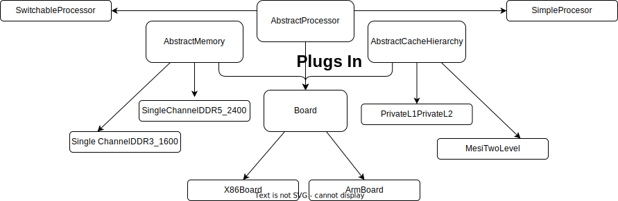

<!-- _class: title -->

## gem5's Standard Library

---

## Why a Standard Library?

When done without the library you must define *every part* of your simulation: Every Simobject, connected correctly to every port, for every part, no matter now small.
This can result in scripts of hundreds of lines of code even for the most basic of simulations.

This resulted in:

- A lot of duplicated code.
- Error-prone configurations.
- A lock of portability between different simulations setups.


In addition, while there is no "one size fits all" for gem5 users, most users have similar needs and requirements for their simulations; requiring only a few modifications off some commonly used configuration systems.
Prior to the creation of the standard library users would regularly circulte long complex scripts and hack at them endlessly.
Such practises inspired the creation of the gem5 Standard Library.

The purpose of the gem5 Standard library is to provide a set of pre-defined components that can be used to build a simulation that does the majority of the work for you.
The the remainder not supported by the standard library, APIs are provided that make it easy to extend the library for your own use.

---

## The metaphor: Plugging components together into a board



---

Due to is modular, object-oriented design, gem5 can be thought of as a set of components that can be plugged together to form a simulation.
A _board_ which provides interfaces for the _components_ to connect to be added.

---

## Where to find stuff: Importing in a script

```python
from gem5.components import *
```
