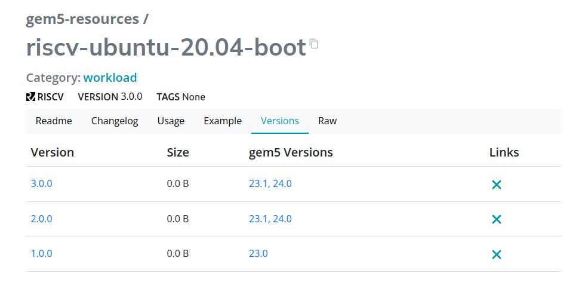

<!-- _class: title -->

## gem5 Resources

---

## What are Resources? (Disks, kernels, binaries, etc.)

- gem5 resources are prebuilt artifacts that can be used to run gem5 simulations.
- Each gem5 resource falls into one of 13 categories (such as binary or kernel) and supports one of 6 ISAs (including ARM, x86, and RISC-V).
- For more information about categories, visit [resources.gem5.org/category](https://resources.gem5.org/category)
- The [gem5 resources website](https://resources.gem5.org) is an easy way to search for the resources you want to use.
  - There are filters based on category, ISA, and gem5 version that help you narrow down the resources based on your requirements.

---

## Important categories and their description

**Kernel**: A computer program that acts as the core of an operating system by managing system resources.
**disk-image**: A file that contains an exact copy of the data stored on a storage device.
**binary**: A program that is used to test the performance of a computer system.
**bootloader**: A small program that is responsible for loading the operating system into memory when a computer starts up.
**checkpoint**: A snapshot of a simulation.
**simpoint**: This resource stores all information required to create and restore a Simpoint.
**file**: A resource consisting of a single file.
**workload**: Bundles of resources and any input parameters that can be run directly in gem5.
**suite**: A collection of workloads.

---

## Resource Versioning

- In gem5, all resources have an `id` and any update to the resource will update the `resource_version`.
- Each unique resource is represented by its `id` and `resource_version`.
- When an existing resource is updated the `id` remains the same but the `resource_version` is updated.
- Each resource also has a field called `gem5_versions` which shows which releases of gem5 the resource is compatible with.



---

## Using Resources in gem5 Simulations

To use the resources in gem5, we can use the `obtain_resource` function.

Let's do an example to use the `x86-hello64-static` binary in an example.

Go to the [materials/02-Using-gem5/02-gem5-resources/01-hello-example.py](../../materials/02-Using-gem5/02-gem5-resources/01-hello-example.py)

This file builds a basic board and we will use the `x86-hello64-static` resource and run the simulation.

---

## Run the hello binary

To get the binary we write the line:

```python
board.set_se_binary_workload(obtain_resource("x86-hello64-static"))
```

Let's break down this code

- The part `obtain_resource("x86-hello64-static")` gets the binary from gem5 resources <!-- go into detail about the parameters -->
- The part `board.set_se_binary_workload` tells the board to run the binary that it is given.

Then we run the simulation

```bash
cd materials/02-Using-gem5/02-gem5-resources
gem5 01-hello-example.py
```

---

## Workloads

A workload is a package of one or more resources that can have pre-defined parameters.

Let's see the `x86-npb-is-size-s-run` workload.

This workload runs the NPB IS benchmark in SE mode.

You can see the JSON of the workloads in the [raw](https://resources.gem5.org/resources/x86-npb-is-size-s-run/raw?database=gem5-resources&version=1.0.0) tab on the resources website.


---

## Workloads (Conti.)

Let's see the `x86-ubuntu-24.04-boot-with-systemd` workload, you can see the [raw](https://resources.gem5.org/resources/x86-ubuntu-24.04-boot-with-systemd/raw?database=gem5-resources&version=1.0.0) tab to see how the resource is made.

- The `function` field has the name of the function that the workload calls.
- The `resources` field contains the resources that the workload uses.
  - The key of the `resources` field like `kernel`, `disk_image`, etc are named the same as the parameter name in the `function` that the workload calls.
- The `additional_params` fields contains values of non-resource parameters that we want the workload to have.
  - We are using the `kernel_args` parameter in the above workload.

---

## Suites

Suites are a collection of workloads that can be run in parallel using multiprocessing (this will be shown later).

All workloads in a suite have something called `input_groups` that can be used to filter the suite.

Let's do an example where we will:

- Print all the workloads in the suite
- Filter the suite with `input_groups`
- Run a workload from the suite

---

<!-- _class: code-80-percent -->

## Printing all the workloads in a suite

The `SuiteResource` class acts as a generator so we can iterate through the workloads.

Let's print some workload information from  the `x86-getting-started-benchmark-suite` suite.

Let's modify [02-suite-workload-example.py](../../materials/02-Using-gem5/02-gem5-resources/02-suite-workload-example.py). Below, we get the resource and iterate through the suite, printing the `id` and `version` of each workload. Add this to the bottom of the script:

```python
getting_started_suite = obtain_resource("x86-getting-started-benchmark-suite")
for workload in getting_started_suite:
    print(f"Workload ID: {workload.get_id()}")
    print(f"workload version: {workload.get_resource_version()}")
    print("=========================================")
```

Now run:

```bash
gem5 02-suite-workload-example.py
```

---

## Filtering suites by `input_groups`

Each workload in a suite has one or more `input_groups` that we can filter by.

Let's print all the unique input groups in the suite.

We can do this by using the `get_input_groups()` function:

```python
print("Input groups in the suite")
print(getting_started_suite.get_input_groups())
```

---

<!-- _class: code-80-percent -->

## Running a workload from the suite (single code block)

Let's run the NPB IS benchmark in this suite.

First, we need to filter the suite to get this workload. We can do this by filtering to get all workloads that have the input tag `"is"`.

We convert the returned object to a list and get the first workload in it. This works because `"is"` is a unique tag that only one workload has, the NPB IS workload we're looking for.

Let's print the `id` of our workload and then run it with the board we have:

```python
npb_is_workload = list(getting_started_suite.with_input_group("is"))[0]
print(f"Workload ID: {npb_is_workload.get_id()}")
board.set_workload(npb_is_workload)

simulator = Simulator(board=board)
simulator.run()
```

---

## Local resources

You can also use resources that you have created locally in gem5.

You can create a local JSON file to use as a data source, then set the:

- `GEM5_RESOURCE_JSON` environment variable to point to the JSON, if you want to just use the resources in the JSON.
- `GEM5_RESOURCE_JSON_APPEND` environment variable to point to the JSON, if you want to use local resources along with gem5 resources.

For more details on how to use local resources, read the [local resources documentation](https://www.gem5.org/documentation/gem5-stdlib/using-local-resources)

---

## Why use local resources

gem5 has two main ways to use local resources.

- Directly create the resource object by passing the local path of the resource.
  - `BinaryResource(local_path=/path/to/binary)`
  - We can use this method when we are making new resources and want to quickly test the resource.
- If we are going to use or share the resource that we created, it is better to create a JSON file and update the data source as mentioned in the above slide.
  - With this method we can use `obtain_resource`.
  - This method makes the simulations more reproducible and consistent.

Let's do an example that creates a local binary and runs that binary in gem5.

---

## Let's create a binary

Let's use [this C program that prints a simple triangle pattern](../../materials/02-Using-gem5/02-gem5-resources/03-local-resources/pattern.c).

Compile this program. This will be the binary that we will run in gem5.

```bash
gcc -o pattern pattern.c
```

Now, let's use the local path method.

In [03-run-local-resource-local-path.py](../../materials/02-Using-gem5/02-gem5-resources/03-run-local-resource-local-path.py), create the binary resource object as follows:

```python
binary = BinaryResource(local_path="./pattern")
```

Let's run the simulation and see the output

```bash
gem5 03-run-local-resource-local-path.py
```

---

<!-- _class: code-50-percent -->

## Let's create a JSON file for the binary resource

The [JSON resource](../../materials/02-Using-gem5/02-gem5-resources/03-local-resources/local_resources.json) for the binary would look like this:

```json
{
  "category": "binary",
  "id": "x86-pattern-print",
  "description": "A simple X86 binary that prints a pattern",
  "architecture": "X86",
  "size": 1,
  "tags": [],
  "is_zipped": false,
  "md5sum": "2a0689d8a0168b3d5613b01dac22b9ec",
  "source": "",
  "url": "file://./pattern",
  "code_examples": [],
  "license": "",
  "author": [
      "Harshil Patel"
  ],
  "source_url": "",
  "resource_version": "1.0.0",
  "gem5_versions": [
      "23.0",
      "23.1",
      "24.0"
  ],
  "example_usage": "obtain_resource(resource_id=\"x86-pattern-print\")"
}
```

---

## Let's get the resource and run the simulation

In [04-run-local-resource-json.py](../../materials/02-Using-gem5/02-gem5-resources/04-run-local-resource-json.py), we can get the binary by using obtain resource:

```python
board.set_se_binary_workload(obtain_resource("x86-pattern-print"))
```

Let's run the simulation.

We do this by defining `GEM5_RESOURCE_JSON_APPEND` with our JSON resource before the usual `gem5` command:

```bash
GEM5_RESOURCE_JSON_APPEND=local_resources.json gem5 04-run-local-resource-json.py
```


