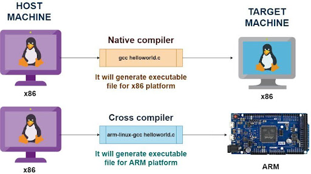
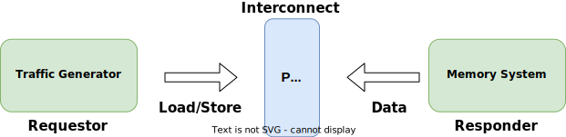
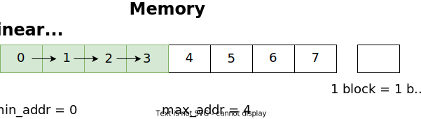
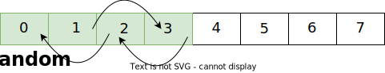
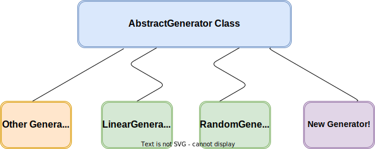
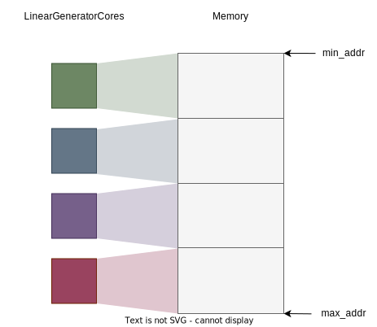
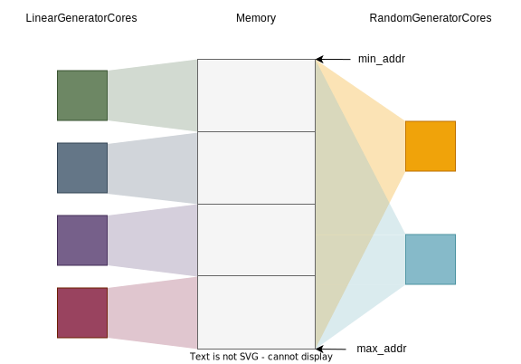

<!-- _class: title -->

## Running Things on gem5

---

## What we will cover

- Intro to Syscall Emulation mode
- m5ops
- Annotating workloads
- Cross-compiling workloads
- Traffic generator

---

<!-- _class: start -->
## Intro to Syscall Emulation Mode

---

## What is Syscall Emulation mode, and when to use/avoid it

**Syscall Emulation (SE)** mode does not model all the devices in a system. It focuses on simulating the CPU and memory system. It only emulates Linux system calls, and only models user-mode code.

SE mode is a good choice when the experiment does not need to model the OS (such as page table walks), does not need a high fidelity model (emulation is ok), and faster simulation speed is needed.

However, if the experiment needs to model the OS interaction, or needs to model a system in high fidelity, then we should use the full-system (FS) mode. The FS mode will be covered in [07-full-system](07-full-system.md).

---

## Example

### 00-SE-hello-world

Under `materials/02-Using-gem5/03-running-in-gem5/00-SE-hello-world`, there is a small example of an SE simulation.
[00-SE-hello-world.py](../../materials/02-Using-gem5/03-running-in-gem5/00-SE-hello-world/00-SE-hello-world.py) will run [00-SE-hello-world](../../materials/02-Using-gem5/03-running-in-gem5/00-SE-hello-world/00-SE-hello-world.c) binary with a simply X86 configuration.
This binary does a print of the string `Hello, Worlds!`.
If we use the debug flag `SyscallAll` with it, we will able to see what syscalls are simulated.
We can do it with the following command:

```bash
gem5 -re --debug-flags=SyscallAll 00-SE-hello-world.py
```

---

## 00-SE-hello-world

Then in the [simout.txt](../../materials/02-Using-gem5/03-running-in-gem5/00-SE-hello-world/m5out/simout.txt), we should see:
```bash
280945000: board.processor.cores.core: T0 : syscall Calling write(1, 21152, 14)...
Hello, World!
280945000: board.processor.cores.core: T0 : syscall Returned 14.
```

On the left, it is the timestamp for the simulation.
As the timestamp suggests, **SE simulation DOES NOT record the time for the syscall**.

---

<!-- _class: start -->

## m5ops

---

## What is m5ops

- The **m5ops** (short for m5 opcodes) provide different functionalities that can be used to communicate between ​the simulated workload and the simulator.
- The commonly used functionalities are below. More can be found in [the m5ops documentation](https://www.gem5.org/documentation/general_docs/m5ops/):
  - exit [delay]: Stop the simulation in delay nanoseconds
  - workbegin: Cause an exit event of type "workbegin" that can be used to mark the begining of an ROI
  - workend: Cause and exit event of type "workend" that can be used to mark the ending of an ROI
  - resetstats [delay[period]]: Reset simulation statistics in delay nanoseconds; repeat this every period nanoseconds
  - dumpstats [delay[period]]: Save simulation statistics to a file in delay nanoseconds; repeat this every period nanoseconds
  - checkpoint [delay [period]]: Create a checkpoint in delay nanoseconds; repeat this every period nanoseconds
  - switchcpu: Cause an exit event of type, “switch cpu,” allowing the Python to switch to a different CPU model if desired

---

## IMPORTANT

- **_Not all of the ops do what they say automatically_**
- Most of these just only exit the simulation
- For example:
  - exit: Actually exits
  - workbegin: Only exits, if configured in `System`
  - workend: Only exits, if configured in `System`
  - resetstats: Resets the stats
  - dumpstats: Dumps the stats
  - checkpoint: Only exits
  - switchcpu: Only exits
- See [gem5/src/sim/pseudo_inst.cc](https://github.com/gem5/gem5/blob/stable/src/sim/pseudo_inst.cc) for details
- The gem5 standard library might have default behaviors for some of the  m5ops. See [src/python/gem5/simulate/simulator.py](https://github.com/gem5/gem5/blob/stable/src/python/gem5/simulate/simulator.py#L301) for the default behaviors

---

## More about m5ops

There are three versions of m5ops:

1. Instruction mode: it only works with native CPU models
2. Address mode: it works with native CPU models and KVM CPU (only supports Arm and X86)
3. Semihosting: it works with native CPU models and Fast Model

Different modes should be used depending on the CPU type and ISA.

The address mode m5ops will be covered in [07-full-system](07-full-system.md) as gem5-bridge and [08-accelerating-simulation](08-accelerating-simulation.md) after the KVM CPU is introduced.
**In this session, we will only cover the instruction mode.**

---

## When to use m5ops

There are two main ways of using the m5ops:

1. Annotating workloads
2. Making gem5-bridge calls in disk images

In this session, we will focus on learning how to use the m5ops to annotate workloads.

---

## How to use m5ops

m5ops provides a library of functions for different functionalities. All functions can be found in [gem5/include/gem5/m5ops.h](https://github.com/gem5/gem5/blob/stable/include/gem5/m5ops.h).
The commonly used functions (they are matched with the commonly used functionailites above):

- `void m5_exit(uint64_t ns_delay)`
- `void m5_work_begin(uint64_t workid, uint64_t threadid)`
- `void m5_work_end(uint64_t workid, uint64_t threadid)`
- `void m5_reset_stats(uint64_t ns_delay, uint64_t ns_period)`
- `void m5_dump_stats(uint64_t ns_delay, uint64_t ns_period)`
- `void m5_checkpoint(uint64_t ns_delay, uint64_t ns_period)`
- `void m5_switch_cpu(void)`

In order to call these functions in the workload, we will need to link the m5ops library to the workload.
So first, we need to build the m5ops library.

---

## Building the m5ops library

The m5 utility is in [gem5/util/m5](https://github.com/gem5/gem5/tree/stable/util/m5) directory.​
In order to build the m5ops library,

1. `cd` into the ```gem5/util/m5``` directory
2. run ```scons [{TARGET_ISA}.CROSS_COMPILE={TARGET_ISA CROSS COMPILER}] build/{TARGET_ISA}/out/m5​```
3. the compiled library (`m5` is for command line utility, and `libm5.a` is a C library) will be at ```gem5/util/m5/build/{TARGET_ISA}/out```


### Notes

- If the host system ISA does not match with the target ISA, then we will need to use the cross-compiler
- `TARGET_ISA` has to be in lower case

---

## Hands-on Time!

### 01-build-m5ops-library

### Let's build the m5ops library for x86 and arm64

```bash
cd /workspaces/2024/gem5/util/m5
scons build/x86/out/m5
scons arm64.CROSS_COMPILE=aarch64-linux-gnu- build/arm64/out/m5
```

---

## Linking the m5ops library to C/C++ code​

After building the m5ops library, we can link them to our workload by:​

1. Include **gem5/m5ops.h** in the workload's source file(s) (`<gem5/m5ops.h>`)

2. Add **gem5/include** to the compiler's include search path (`-Igem5/include`)

3. Add **gem5/util/m5/build/{TARGET_ISA}/out** to the linker search path
(`-Lgem5/util/m5/build/{TARGET_ISA}/out`)

4. Link against **libm5.a** with (`-lm5`)

---

## Hands-on Time!

### 02-annotate-this

### Let's annotate the workload with `m5_work_begin` and `m5_work_end`

In `materials/02-Using-gem5/03-running-in-gem5/02-annotate-this`, there is a workload source file [02-annotate-this.cpp](../../materials/02-Using-gem5/03-running-in-gem5/02-annotate-this/02-annotate-this.cpp) and a [Makefile](../../materials/02-Using-gem5/03-running-in-gem5/02-annotate-this/Makefile).

The workload mainly does two things:

1. Write a string to the standard out

```cpp
write(1, "This will be output to standard out\n", 36);
```

---

<!-- _class: code-80-percent -->

## 02-annotate-this

2. Output all the file and folder names in the current directory

```cpp
struct dirent *d;
DIR *dr;
dr = opendir(".");
if (dr!=NULL) {
    std::cout<<"List of Files & Folders:\n";
    for (d=readdir(dr); d!=NULL; d=readdir(dr)) {
        std::cout<<d->d_name<< ", ";
    }
    closedir(dr);
}
else {
    std::cout<<"\nError Occurred!";
}
std::cout<<std::endl;
```

---

## 02-annotate-this

### Our goal in this exercise

- Mark ```write(1, "This will be output to standard out\n", 36);``` as our region of interest so we can see the execution trace of the syscall.

### How do we do that?

1. Include the m5ops header file with ```#include <gem5/m5ops.h>```
2. Call ```m5_work_begin(0, 0);``` right before ```write(1, "This will be output to standard out\n", 36);```.
3. Call ```m5_work_end(0, 0);``` right after ```write(1, "This will be output to standard out\n", 36);```
4. Compile the workload with the following requirments
    1. Add **gem5/include** to the compiler's include search path
    2. Add **gem5/util/m5/build/x86/out** to the linker search path
    3. Link against **libm5.a**

---

## 02-annotate-this

For step 4, we can modifiy the [Makefile](../../materials/02-Using-gem5/03-running-in-gem5/02-annotate-this/Makefile) to have it run
```Makefile
$(GXX) -o 02-annotate-this 02-annotate-this.cpp \
  -I$(GEM5_PATH)/include \
  -L$(GEM5_PATH)/util/m5/build/$(ISA)/out \
  -lm5
```

If you are having any troubles, the completed version of everything is under ```materials/02-Using-gem5/03-running-in-gem5/02-annotate-this/complete```.

---

## 02-annotate-this

If the workload is successfully compiled, we can try to run it with

```bash
./02-annotate-this
```

<!-- I think ./02-annotate-this is what should go above. It was previously blank.-->
However, we will see the following error:

```bash
Illegal instruction (core dumped)
```

This is because the host does not recognize the instruction version of m5ops.
This is also the reason why we will need to use the address version of m5ops if we use the KVM CPU for our simulation.

---

## Hands-on Time!

### 03-run-x86-SE

### Let's write a handler to handle the m5 exit events

<!-- What I want to do in this exercies:
1. Have people run ```gem5 -re 03-run-x86-SE.py``` without any modification and show them what is the default handler for workbegin and workend in stdlib.
2. Have people to add a workbegin handler and a workend handler that uses debug.flags["ExecAll] to enable and disable debug flag to see the execution trace of the syscall.
3. Point out that SE mode do not time the syscall and it can read/write the host directory -->

First, let's see what the default behavior is. Go to the folder `materials/02-Using-gem5/03-running-in-gem5/03-run-x86-SE` and run [03-run-x86-SE.py](../../materials/02-Using-gem5/03-running-in-gem5/03-run-x86-SE/03-run-x86-SE.py) with the following command:

```bash
gem5 -re 03-run-x86-SE.py
```

After running the simulation, we should see a directory called `m5out` in `materials/02-Using-gem5/03-running-in-gem5/03-run-x86-SE`. Open the file `simerr.txt` in `m5out`. We should see two lines that look like this:

```bash
warn: No behavior was set by the user for work begin. Default behavior is resetting the stats and continuing.

warn: No behavior was set by the user for work end. Default behavior is dumping the stats and continuing.
```

---

## 03-run-x86-SE

As mentioned before, the gem5 standard library might have default behaviors for some of the m5ops. In here, we can see that it has default behaviors for `m5_work_begin` and `m5_work_end`.
Let's detour a bit to see how the gem5 standard library recognize the exit event and assign it a default exit event.
All standard library defined exit events can be found in [src/python/gem5/simulate/exit_event.py](https://github.com/gem5/gem5/blob/stable/src/python/gem5/simulate/exit_event.py). It uses the exit string of exit events to categories exit events. For example, both `"workbegin"` and `"m5_workend instruction encountered"` exit strings are categorized as `ExitEvent.WORKBEGIN`.
All pre-defined exit event handler can be found in [src/python/gem5/simulate/exit_event_generators.py](https://github.com/gem5/gem5/blob/stable/src/python/gem5/simulate/exit_event_generators.py).

For example, the `ExitEvent.WORKBEGIN` defaults to use the `reset_stats_generator`. It means that when we are using the standard library `Simulator` object, if there is an exit with exit string `"workbegin"` or `"m5_workbegin instruction encountered"`, it will automatically execute `m5.stats.reset()` unless we over-write the default behavior using the `on_exit_event` parameter in the gem5 stdlib `Simulator` parameter.

---
<!-- _class: two-col code-70-percent -->

## 03-run-x86-SE

Let's add custom workbegin and workend handlers, and use the `on_exit_event` parameter in `Simulator` parameter to over-write the default behaviors. To do this, add the following into [03-run-x86-SE.py](../../materials/02-Using-gem5/03-running-in-gem5/03-run-x86-SE/03-run-x86-SE.py):

```python
# define a workbegin handler
def workbegin_handler():
    print("Workbegin handler")
    m5.debug.flags["ExecAll"].enable()
    yield False
#
# define a workend handler
def workend_handler():
    m5.debug.flags["ExecAll"].disable()
    yield False
#
```

###

Also, register the handlers using the `on_exit_event` parameter in the `Simulator` object construction

```python
# setup handler for ExitEvent.WORKBEGIN and ExitEvent.WORKEND
    on_exit_event= {
        ExitEvent.WORKBEGIN: workbegin_handler(),
        ExitEvent.WORKEND: workend_handler()
    }
#
```

---

## 03-run-x86-SE

Let's run this simulation again with the following command

```bash
gem5 -re 03-run-x86-SE.py
```

Now, we will see the following in [materials/02-Using-gem5/03-running-in-gem5/03-run-x86-SE/m5out/simout.txt](../../materials/02-Using-gem5/03-running-in-gem5/03-run-x86-SE/m5out/simout.txt)

```bash
3757178000: board.processor.cores.core: A0 T0 : 0x7ffff7c82572 @_end+140737350460442    :   syscall                  : IntAlu :   flags=()
This will be output to standard out
3757180000: board.processor.cores.core: A0 T0 : 0x7ffff7c82574 @_end+140737350460444    : cmp	rax, 0xfffffffffffff000
```

This shows the log of the debug flag `ExecAll` that we enabled for our ROI using the `m5.debug.flags["ExecAll"].enable()`, it shows all the execution trace for our ROI. As the timestamp on the left suggested again, SE mode **DOES NOT** time the emulated system calls. Also, as the log suggested, we over-wrote the default behavior of the `m5_work_begin` and `m5_work_end`.

---

Then, with the output

```bash
List of Files & Folders:
., .., 03-run-SE.py, m5out,
Simulation Done
```

it indicates that SE mode is able to read files on the host machine. Additionally, SE mode is able to write files on the host machine.

However, again, SE mode is **NOT** able to time the emulated system calls.

---

<!-- _class: code-80-percent -->

## Tips on SE mode

With the gem5 stdlib, we usually use the `set_se_binary_workload` function in the `board` object to setup the workloads. We can pass in files, arguments, enviornment variables, and output file paths to the `set_se_binary_workload` function using the corresponding parameters.

```python
def set_se_binary_workload(
    self,
    binary: BinaryResource,
    exit_on_work_items: bool = True,
    stdin_file: Optional[FileResource] = None,
    stdout_file: Optional[Path] = None,
    stderr_file: Optional[Path] = None,
    env_list: Optional[List[str]] = None,
    arguments: List[str] = [],
    checkpoint: Optional[Union[Path, CheckpointResource]] = None,
) -> None:
```

For more information, we can look at [src/python/gem5/components/boards/se_binary_workload.p](https://github.com/gem5/gem5/blob/stable/src/python/gem5/components/boards/se_binary_workload.py#L71).

---

<!-- _class: start -->

## Cross-compiling

---

## Cross-compiling from one ISA to another.​

<!-- _class: center-image -->



---

## Hands-on Time!

### 04-cross-compile-workload

### Let's cross compile the workload to arm64 statically and dynamically
<!--
What I want to do in this execerise:

1. have people to cross compile the workload statically and dynamically by modifying the Makefile
2. point out the cross compiler and "-static" -->

For static compilation, add the following command to the Makefile in `materials/02-Using-gem5/03-running-in-gem5/04-cross-compile-workload`:

```make
$(GXX) -o 04-cross-compile-this-static 04-cross-compile-this.cpp -static -I$(GEM5_PATH)/include -L$(GEM5_PATH)/util/m5/build/$(ISA)/out -lm5
```

For dynamic compilation, add the following command:

```make
$(GXX) -o 04-cross-compile-this-dynamic 04-cross-compile-this.cpp -I$(GEM5_PATH)/include -L$(GEM5_PATH)/util/m5/build/$(ISA)/out -lm5
```

Next, run `make` in the same directory as the Makefile.

---

## 04-cross-compile-workload

### Notes:

Note that we are using `arm64` as the ISA and `aarch64-linux-gnu-g++` for the cross compiler. This is in contrast to exercise 2, where the ISA was `x86` and the compiler was `g++`.

Also note that the the static compilation command has the flag `-static`, while the dynamic command has no additional flags.

---

## Hands-on Time!

### 05-run-arm-SE

### Let's run the compiled arm64 workloads and see what happens

<!-- What I want to do in this execerise:
1. first let people run the static one, and let them know this is arm
2. then let people run the dynamic one which will lead to errors
3. show people how to redirect lib -->

First, let's run the statically compiled workload. `cd` into the directory `materials/02-Using-gem5/03-running-in-gem5/05-run-arm-SE` and run `05-run-arm-SE.py` using the following command:

```bash
gem5 -re --outdir=static 05-run-arm-SE.py --workload-type=static
```
<!-- Not sure what to say for "and let them know this is arm" -->

Next, let's run the dynamically compiled workload with the following command:

```bash
gem5 -re --outdir=dynamic 05-run-arm-SE.py --workload-type=dynamic
```

---

## 05-run-arm-SE

You will see the following error output in `dynamic/simout.txt` from running the dynamically compiled workload:

```text
src/base/loader/image_file_data.cc:105: fatal: fatal condition fd < 0 occurred: Failed to open file /lib/ld-linux-aarch64.so.1.
This error typically occurs when the file path specified is incorrect.
Memory Usage: 217652 KBytes
```

To use the dynamically compiled workload, we will have to redirect the library path. We can do this by adding the following to the configuration script, under `print("Time to redirect the library path")`:

```python
setInterpDir("/usr/aarch64-linux-gnu/")
board.redirect_paths = [RedirectPath(app_path=f"/lib",
                        host_paths=[f"/usr/aarch64-linux-gnu/lib"])]

```

---

## Summary

### SE mode does NOT implement many things!​

- Filesystem​
- Most of systemcalls
- I/O devices
- Interrupts
- TLB misses
- Page table walks
- Context switches
- multiple threads
  - You may have a multithreaded execution, but there's no context switches & no spin locks​

---
<!-- _class: start -->

## Traffic Generator in gem5

---
<!-- _class: center-image -->

## Synthetic Traffic Generation

Synthetic traffic generation is a technique for driven memory subsystems without requiring the simulation of processor models and running workload programs. We have to note the following about synthetic traffic generation.

- It can be used for the following: measuring maximum theoretical bandwidth, testing correctness of cache coherency protocol
- It can not be used for: measuring the execution time of workload (even if you have their memory trace)

Synthetic traffic could follow a certain pattern like `sequential (linear)`, `strided`, and `random`. In this section we will look at tools in gem5 that facilitate synthetic traffic generation.



---

## gem5: stdlib Components for Synthetic Traffic Generation

gem5's standard library has a collection of components for generating synthetic traffic. All such components inherit from `AbstractGenerator`, found in `src/python/gem5/components/processors`.

- These components simulate memory accesses. They are intended to replace a processor in a system that you configure with gem5.
- Examples of these components include `LinearGenerator` and `RandomGenerator`.

We will see how to use `LinearGenerator` and `RandomGenerator` to stimulate a memory subsystem. The memory subsystem that we are going to use is going to consist of a cache hierarchy with `private l1 caches and a shared l2 cache` with one channel of `DDR3` memory.

In the next slides we will look at `LinearGenerator` and `RandomGenerator` at a high level. We'll see how to write a configuration script that uses them.

---
<!-- _class: two-col code-70-percent -->
##

### LinearGenerator

[Python Here](/gem5/src/python/gem5/components/processors/linear_generator.py)

```python
class LinearGenerator(AbstractGenerator):
    def __init__(
        self,
        num_cores: int = 1,
        duration: str = "1ms",
        rate: str = "100GB/s",
        block_size: int = 64,
        min_addr: int = 0,
        max_addr: int = 32768,
        rd_perc: int = 100,
        data_limit: int = 0,
    ) -> None:
```

### RandomGenerator

[Python Here](/gem5/src/python/gem5/components/processors/random_generator.py)

```python
class RandomGenerator(AbstractGenerator):
    def __init__(
        self,
        num_cores: int = 1,
        duration: str = "1ms",
        rate: str = "100GB/s",
        block_size: int = 64,
        min_addr: int = 0,
        max_addr: int = 32768,
        rd_perc: int = 100,
        data_limit: int = 0,
    ) -> None:
```

---
<!-- _class: two-col -->

## LinearGenerator/RandomGenerator: Knobs

- **num_cores**
  - The number of cores in your system
- **duration**
  - Length of time to generate traffic
- **rate**
  - Rate at which to request data from memory
    - **Note**: This is *NOT* the rate at which memory will respond. This is the **maximum** rate at which requests will be made
- **block_size**
  - The number of bytes accessed with each read/write

###

- **min_addr**
  - The lowest memory address for the generator to access (via reads/writes)
- **max_addr**
  - The highest memory address for the generator to access (via reads/writes)
- **rd_perc**
  - The percentage of accesses that should be reads
- **data_limit**
  - The maximum number of bytes that the generator can access (via reads/writes)
    - **Note**: if `data_limit` is set to 0, there will be no data limit.

---
<!-- _class: two-col -->

## Traffic Patterns Visualized

`min_addr`: 0, `max_addr`: 4, `block_size`: 1

**Linear**: We want to access addresses 0 through 4 so a linear access would mean accessing memory in the following order.

**Random**: We want to access addresses 0 through 4 so a random access would mean accessing memory in any order. (In this example, we are showing the order: 1, 3, 2, 0).

###





----

## Hands-on Time!

### 06-traffic-gen

### Let's run an example on how to use the traffic generator

Open the following file.
[materials/02-Using-gem5/03-running-in-gem5/06-traffic-gen/simple-traffic-generators.py](../../materials/02-Using-gem5/03-running-in-gem5/06-traffic-gen/simple-traffic-generators.py)

Steps:

1. Run with a Linear Traffic Generator.
2. Run with a Hybrid Traffic Generator.

---
<!-- _class: two-col -->

## 06-traffic-gen: LinearGenerator: Looking at the Code


Go to this section of the code on the right.

Right now, we have set up a board with a Private L1 Shared L2 Cache Hierarchy (go [here](../../materials/02-Using-gem5/03-running-in-gem5/06-traffic-gen/components/cache_hierarchy.py) to see how it's constructed), and a Single Channel memory system.

Add a traffic generator right below
`memory = SingleChannelDDR3_1600()` with the following lines.

```python
generator = LinearGenerator(num_cores=1, rate="1GB/s")
```

###

```python
cache_hierarchy = MyPrivateL1SharedL2CacheHierarchy()

memory = SingleChannelDDR3_1600()

motherboard = TestBoard(
    clk_freq="3GHz",
    generator=generator,
    memory=memory,
    cache_hierarchy=cache_hierarchy,
)
```

---
<!-- _class: two-col code-70-percent -->

## 06-traffic-gen: LinearGenerator: Completed Code

The completed code snippet should look like this.

```python
cache_hierarchy = MyPrivateL1SharedL2CacheHierarchy()

memory = SingleChannelDDR3_1600()

generator = LinearGenerator(num_cores=1, rate="1GB/s")

motherboard = TestBoard(
    clk_freq="3GHz",
    generator=generator,
    memory=memory,
    cache_hierarchy=cache_hierarchy,
)
```

---
<!-- _class: code-100-percent -->

## 06-traffic-gen: LinearGenerator: Running the Code

### Run the following commands to see a Linear Traffic Generator in action

```sh
cd ./materials/02-Using-gem5/03-running-in-gem5/06-traffic-gen/

gem5 --debug-flags=TrafficGen --debug-end=1000000 \
simple-traffic-generators.py
```

We will see some of the expected output in the following slide.

---

## 06-traffic-gen: LinearGenerator Results

```sh
  59605: system.processor.cores.generator: LinearGen::getNextPacket: r to addr 0, size 64
  59605: system.processor.cores.generator: Next event scheduled at 119210
 119210: system.processor.cores.generator: LinearGen::getNextPacket: r to addr 40, size 64
 119210: system.processor.cores.generator: Next event scheduled at 178815
 178815: system.processor.cores.generator: LinearGen::getNextPacket: r to addr 80, size 64
 178815: system.processor.cores.generator: Next event scheduled at 238420
```

Throughout this output, we see `r to addr --`. This means that the traffic generator is simulating a **read** request to access memory address `0x--`.

<!-- Is the sentence above accurate? -->

Above, we see `r to addr 0` in line 1, `r to addr 40` in line 3, and `r to addr 80` in line 5.

This is because the Linear Traffic Generator  is simulating requests to access memory addresses 0x0000, 0x0040, 0x0080.

As you can see, the simulated requests are very linear. Each new memory access is 0x0040 bytes above the previous one.

---

## 06-traffic-gen: Random

We are not going to do this right now, but if you swapped `LinearGenerator` with `RandomGenerator` and kept the parameters the same, the output is going to look like below. Notice how the pattern of addresses is not a linear sequence anymore.

```sh
  59605: system.processor.cores.generator: RandomGen::getNextPacket: r to addr 2000, size 64
  59605: system.processor.cores.generator: Next event scheduled at 119210
 119210: system.processor.cores.generator: RandomGen::getNextPacket: r to addr 7900, size 64
 119210: system.processor.cores.generator: Next event scheduled at 178815
 178815: system.processor.cores.generator: RandomGen::getNextPacket: r to addr 33c0, size 64
 178815: system.processor.cores.generator: Next event scheduled at 238420
```

---
<!-- _class: center-image -->

## Our Focus: LinearGenerator and AbstractGenerator

- We will be focusing on `LinearGenerator` and `RandomGenerator` generators (and a new one later!).
  - They are essentially the same, but one performs linear memory accesses and one performs random memory accesses



---

## Detailed Look on Some Components

- Looking at `AbstractGenerator.__init__`, you'll see that this class takes a list of `AbstractGeneratorCore` as the input. Example classes that inherit from `AbstractGenerator` are `LinearGenerator` and `RandomGenerator`.
- We will look at classes that extend `AbstractGeneratorCore` that will will create **synthetic traffic** by using a `SimObject` called `PyTrafficGen`, for more information you can look at `src/cpu/testers/traffic_gen`.
- `LinearGenerator` can have multiple `LinearGeneratorCores` and `RandomGenerator` can have multiple `RandomGeneratorCores`.

Next we will look at extending `AbstractGenerator` to create `HybridGenerator` that has both `LinearGeneratorCores` and `RandomGeneratorCores`.

---
## Extending AbstractGenerator

gem5 has a lot of tools in its standard library, but in your research, if you want to simulate specific memory accesses patterns, there might not be anything in the standard library to do this.

In this case, you would have to extend `AbstractGenerator` to create a concrete generator that is tailored to your needs.

To do this, we will go through an example called `HybridGenerator`.

The goal of `HybridGenerator` is to simultaneously simulate both linear and random memory accesses.

To do this, we need `LinearGeneratorCores` (to simulate linear traffic) and `RandomGeneratorCores` (to simulate random traffic).

---

## 06-traffic-gen: HybridGenerator: A Quick Side Note about LinearGeneratorCores

`LinearGeneratorCores` simulate linear traffic.

When we have multiple `LinearGeneratorCores`, we should not configure each one to have the same `min_addr` and `max_addr`.

If we do that, each one will start simulating memory accesses at the same `min_addr` and go up to the same `max_addr`. They will be accessing the same addresses at the same time.

We want `LinearGeneratorCore` to simulate accesses to different areas of memory.

Therefore, we have to split up memory into equal-sized chunks and configure each `LinearGeneratorCore` to simulate accesses to one of these chunks.

---
<!-- _class: center-image -->

## 06-traffic-gen: HybridGenerator: A Quick Side Note about LinearGeneratorCores Cont.

Here's a diagram that shows how each `LinearGeneratorCore` should access memory.




---

## 06-traffic-gen: HybridGenerator: Dividing Memory Address Range

When we create a `HybridGenerator`, we have to determine which `LinearGeneratorCore` gets what chunk of memory.

As previously discussed, we need to partition the memory address range into equally sized sections and configure each `LinearGeneratorCore` to simulate accesses to a different section.

To partition, we will use the `partition_range()` function in [`gem5/src/python/gem5/components/processors/abstract_generator.py`](../../gem5/src/python/gem5/components/processors/abstract_generator.py).

This function takes the range of `min_addr` to `max_addr` and partitions it into `num_partitions` equal-length pieces.

For example, if `min_addr` = 0, `max_addr` = 9, and `num_partitions` = 3, then `partition_range` would return <0,3>, <3,6>, <6,9>.

---

## 06-traffic-gen: HybridGenerator: A quick reminder about RandomGenerator

We also have to consider the `RandomGenerators`.

It would be reasonable to assume that we should partition them like the `LinearGenerators`, but this is not the case.

Even if each `RandomGeneratorCore` has the same `min_addr` and `max_addr`, since each one simulates a random memory access, each one will be simulating accesses to different (random) memory addresses.

---

<!-- _class: center-image -->

## 06-traffic-gen: HybridGenerator: Dividing Memory Address Range Cont.

In the end, this is how each core will simulate memory accesses.



---

<!-- _class: code-70-percent -->

## 06-traffic-gen: HybridGenerator: Choosing a Distribution of Cores

Now that we know how each core will access memory, next, we need to determine how many `LinearGeneratorCores` and `RandomGeneratorCores` we need.

There are many correct ways to do this, but we will use the following function to determine the number of `LinearGeneratorCores`.

```python
        def get_num_linear_cores(num_cores: int):
            """
            Returns the largest power of two that is smaller than num_cores
            """
            if (num_cores & (num_cores - 1) == 0):
                return num_cores//2
            else:
                return 2 ** int(log(num_cores, 2))
```

The rest of the cores will be `RandomGeneratorCores`

---

<!-- _class: two-col code-60-percent -->

## 06-traffic-gen: HybridGenerator Constructor

Let's start looking at the code!

Make sure you have the following file open.
[`materials/02-Using-gem5/03-running-in-gem5/06-traffic-gen/components/hybrid_generator.py`](../../materials/02-Using-gem5/03-running-in-gem5/06-traffic-gen/components/hybrid_generator.py)

On the right, you'll see the constructor for `HybridGenerator`.

When we initialize `HybridGenerator` (via `def __init__`), we will be initializing an `AbstractGenerator` (via `super() __init__`) with the values on the right.

```python
class HybridGenerator(AbstractGenerator):
    def __init__(
        self,
        num_cores: int = 2,
        duration: str = "1ms",
        rate: str = "1GB/s",
        block_size: int = 8,
        min_addr: int = 0,
        max_addr: int = 131072,
        rd_perc: int = 100,
        data_limit: int = 0,
    ) -> None:
        if num_cores < 2:
            raise ValueError("num_cores should be >= 2!")
        super().__init__(
            cores=self._create_cores(
                num_cores=num_cores,
                duration=duration,
                rate=rate,
                block_size=block_size,
                min_addr=min_addr,
                max_addr=max_addr,
                rd_perc=rd_perc,
                data_limit=data_limit,
            )
        )
```

---

## 06-traffic-gen: Designing a HybridGenerator

Right now, our `HybridGenerator` class has a constructor, but we need to return a list of cores.

In gem5, the method that returns a list of cores is conventionally named `_create_cores`.

If you look at our file, [`hybrid_generator.py`](../../materials/02-Using-gem5/03-running-in-gem5/06-traffic-gen/components/hybrid_generator.py), you'll see this method called `_create_cores`.

---

## 06-traffic-gen: HybridGenerator: Initializing Variables

Let's define `_create_cores`!

Let's start by declaring/defining some important variables.

First, we'll declare our list of cores.

Then, we'll define the number of `LinearGeneratorCores` and `RandomGeneratorCores`.

Add the following lines under the comment labeled `(1)`.

```python
core_list = []

num_linear_cores = biggest_power_of_two_smaller_than(num_cores)
num_random_cores = num_cores - num_linear_cores
```

---

## 06-traffic-gen: HybridGenerator: Partitioning Memory Address Range

Next, let's define the memory address range for each `LinearGeneratorCore`.

If we want to give each `LinearGeneratorCore` an equal chunk of the given memory address range, we need to partition the range of `min_addr` to `max_addr` into `num_linear_cores` pieces.

To do this, we need to add the following line to our code under the comment labeled `(2)`.

```python
addr_ranges = partition_range(min_addr, max_addr, num_linear_cores)
```

`addr_ranges` will be a `num_linear_cores`-long list of equal-length partitions from `min_addr` to `max_addr`.

---

## 06-traffic-gen: Partitioning Memory Address Range Cont.

For example, we have `min_addr=0`, `max_addr=32768`, and `num_cores=16` (8 `LinearGeneratorCores`), then

```sh
addr_ranges=
  [(0, 4096), (4096, 8192), (8192, 12288), (12288, 16384),
  (16384, 20480), (20480, 24576), (24576, 28672), (28672, 32768)]
```

For the `i`'th `LinearGeneratorCore`, we take the `i`'th entry in `addr_ranges`. `min_addr` is the first value that entry, and `max_addr` is the second value in that entry.

In this example, `LinearGeneratorCore` 0 gets initialized with `min_addr=0` and `max_addr=4096`, `LinearGeneratorCore` 2 gets initialized with `min_addr=4096` and `max_addr=8192`, etc.

---
<!-- _class: two-col -->

## 06-traffic-gen: HybridGenerator: Creating a List of Cores: LinearGeneratorCore

Next, let's start creating our list of cores.

First, let's add all the `LinearGeneratorCores`.

Add the lines on the right under the comment labeled `(3)`.

```python
for i in range(num_linear_cores):
            core_list.append(LinearGeneratorCore(
                duration=duration,
                rate=rate,
                block_size=block_size,
                min_addr=addr_ranges[i][0],
                max_addr=addr_ranges[i][1],
                rd_perc=rd_perc,
                data_limit=data_limit,)
            )
```

---
<!-- _class: two-col -->

## 06-traffic-gen: HybridGenerator: Creating a List of Cores Explained: LinearGeneratorCore

In the for loop, we create `num_linear_cores` `LinearGeneratorCores` and append each one to our `core_list`.

Each `LinearGeneratorCore` parameter is initialized with the same values from the constructor, except for `min_addr` and `max_addr`.

We change `min_addr` and `max_addr` so that each `LinearGeneratorCore` only simulates accesses to a section of the range of `HybridGenerator's` `min_addr` to `max_addr`.

###

```python
for i in range(num_linear_cores):
            core_list.append(LinearGeneratorCore(
                duration=duration,
                rate=rate,
                block_size=block_size,
                min_addr=addr_ranges[i][0],
                max_addr=addr_ranges[i][1],
                rd_perc=rd_perc,
                data_limit=data_limit,)
            )
```

---
<!-- _class: two-col -->

## 06-traffic-gen: HybridGenerator: Creating a List of Cores: RandomGeneratorCore

Now that we've added the `LinearGeneratorCores`, let's add all the `RandomGeneratorCores`.

Add the lines on the right under the comment labeled `(4)`.

###

```python
for i in range(num_random_cores):
            core_list.append(RandomGeneratorCore(
                duration=duration,
                rate=rate,
                block_size=block_size,
                min_addr=min_addr,
                max_addr=max_addr,
                rd_perc=rd_perc,
                data_limit=data_limit,)
            )
```

---
<!-- _class: two-col -->

## 06-traffic-gen: HybridGenerator: Creating a List of Cores Explained: RandomGeneratorCore

Once again, in the for loop, we create `num_linear_cores` `RandomGeneratorCores` and append each one to our core_list.

Each `RandomGeneratorCore` parameter is initialized with the same values from the constructor, including `min_addr` and `max_addr`.

`min_addr` and `max_addr` do not change because each `RandomGeneratorCore` should be able to access the entire range of `HybridGenerator's` `min_addr` to `max_addr`.

###

```python
for i in range(num_random_cores):
            core_list.append(RandomGeneratorCore(
                duration=duration,
                rate=rate,
                block_size=block_size,
                min_addr=min_addr,
                max_addr=max_addr,
                rd_perc=rd_perc,
                data_limit=data_limit,)
            )
```

---

## 06-traffic-gen: HybridGenerator: Returning and Beginning Configuration

We're almost done with this file!

Let's return our `core_list` by adding the following line under the comment labeled `(5)`.

```python
return core_list
```

Now, open the file [materials/02-Using-gem5/03-running-in-gem5/06-traffic-gen/simple-traffic-generators.py](../../materials/02-Using-gem5/03-running-in-gem5/06-traffic-gen/simple-traffic-generators.py).

Let's replace our `LinearGenerator` with a `HybridGenerator`.

First, add the following line somewhere at the top of your code to import the `HybridGenerator`.

```python
from components.hybrid_generator import HybridGenerator
```

---

<!-- _class: two-col code-70-percent -->

## 06-traffic-gen: HybridGenerator: Configuring

In this section of code to the right, you should currently have a `LinearGenerator`.

Let's replace it with a `HybridGenerator`.

Replace the following lines

```python
generator = LinearGenerator(
    num_cores=1
)
```

with

```python
generator = HybridGenerator(
    num_cores=6
)
```

###

```python
cache_hierarchy = MyPrivateL1SharedL2CacheHierarchy()

memory = SingleChannelDDR3_1600()

generator = LinearGenerator(
    num_cores=1
)

motherboard = TestBoard(
    clk_freq="3GHz",
    generator=generator,
    memory=memory,
    cache_hierarchy=cache_hierarchy,
)
```

---
<!-- _class: two-col code-70-percent -->

## 06-traffic-gen: HybridGenerator: Configuring Cont.

This is what it should look like now.

###

```python
cache_hierarchy = MyPrivateL1SharedL2CacheHierarchy()

memory = SingleChannelDDR3_1600()

generator = HybridGenerator(
    num_cores=6
)

motherboard = TestBoard(
    clk_freq="3GHz",
    generator=generator,
    memory=memory,
    cache_hierarchy=cache_hierarchy,
)
```

---

## 06-traffic-gen: HybridGenerator: Running

Now, that we've created a `HybridGenerator`, let's run the program again!

Make sure you're in the following directory.

**`materials/02-Using-gem5/03-running-in-gem5/06-traffic-gen/`**

Now run with the following command.

```sh
gem5 --debug-flags=TrafficGen --debug-end=1000000 \
simple-traffic-generators.py
```

---

## 06-traffic-gen: HybridGenerator: Output

After running the command, you should see something like below.

```sh
   7451: system.processor.cores5.generator: RandomGen::getNextPacket: r to addr 80a8, size 8
   7451: system.processor.cores5.generator: Next event scheduled at 14902
   7451: system.processor.cores4.generator: RandomGen::getNextPacket: r to addr 10a90, size 8
   7451: system.processor.cores4.generator: Next event scheduled at 14902
   7451: system.processor.cores3.generator: LinearGen::getNextPacket: r to addr 18000, size 8
   7451: system.processor.cores3.generator: Next event scheduled at 14902
   7451: system.processor.cores2.generator: LinearGen::getNextPacket: r to addr 10000, size 8
   7451: system.processor.cores2.generator: Next event scheduled at 14902
   7451: system.processor.cores1.generator: LinearGen::getNextPacket: r to addr 8000, size 8
   7451: system.processor.cores1.generator: Next event scheduled at 14902
   7451: system.processor.cores0.generator: LinearGen::getNextPacket: r to addr 0, size 8
   7451: system.processor.cores0.generator: Next event scheduled at 14902
```

As you can see, cores 0, 1, 2, and 3 are `LinearGeneratorCores`, and cores 4 and 5 are `RandomGeneratorCores`!

---

## 06-traffic-gen: HybridGenerator: Statistics

Now, let's look at some of the statistical differences between our `LinearGeneratorCores` and `RandomGeneratorCores`.

Run the following command to see the miss rate for each core's l1 data cache.

```sh
grep ReadReq.missRate::processor m5out/stats.txt
```

On the next slide, you'll see the expected output (with some text removed for readbility).

---

## 06-traffic-gen: HybridGenerator: Statistics Cont.

```sh
system.cache_hierarchy.l1dcaches0.ReadReq.missRate::processor.cores0.generator     0.132345
system.cache_hierarchy.l1dcaches1.ReadReq.missRate::processor.cores1.generator     0.133418
system.cache_hierarchy.l1dcaches2.ReadReq.missRate::processor.cores2.generator     0.133641
system.cache_hierarchy.l1dcaches3.ReadReq.missRate::processor.cores3.generator     0.132971
system.cache_hierarchy.l1dcaches4.ReadReq.missRate::processor.cores4.generator     0.876426
system.cache_hierarchy.l1dcaches5.ReadReq.missRate::processor.cores5.generator     0.875055
```

Cores 0, 1, 2, and 3 (`LinearGeneratorCores`) have a miss rate of **0.13309375** (~13.3%) on average.

Cores 4 and 5 (`RandomGeneratorCores`) have a miss rate of **0.8757405** (~87.5%) on average.

This is because `LinearGeneratorCores` access memory linearly, so everytime there's a cache miss, the entire `block_size` worth of data is fetched. (When there's a cache miss, instead of fetching only one piece of data, it'll fetch multiple pieces of data.)

On the other hand, since the `RandomGeneratorCores` access memory randomly, the caches can't take advantage of locality in the same way.

---

## 06-traffic-gen: Summary

Overall, we discussed two diffent types of traffic generators: **Linear** and **Random**.

`LinearGenerators` simulate linear memory accesses, and `RandomGenerators` simulate random memory accesses.

We looked into how to configure a board that uses these traffic generators.

We also extended the `AbstractGenerator` class to create a `HybridGenerator`, which simulates linear and random memory acesses simultaneously.

Finally, we saw some of the statistical differences `LinearGeneratorCores` and `RandomGeneratorCores`.

---

## More summaries

### m5ops can be used to communicate between simulated workload and the simulator

### Traffic generator can abstract away the details of a data requestor such as CPU for generating test cases for memory systems
