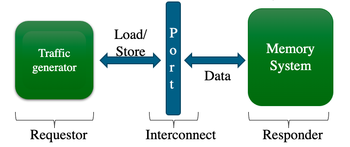
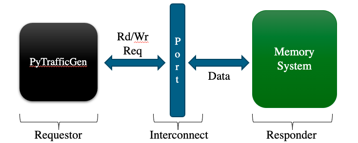
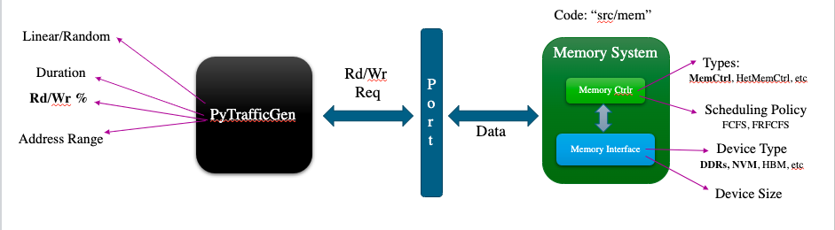

<!-- _class: title -->

## Running Things on gem5

---

## What we will cover

- Intro to Syscall Emulation mode
- m5ops
- Annotating workloads
- Cross-compiling workloads
- Traffic generator

---

<!-- _class: start -->
## Intro to Syscall Emulation Mode

---

## What is Syscall Emulation mode, and when to use/avoid it

**Syscall Emulation (SE)** mode does not model all the devices in a system. It focuses on simulating the CPU and memory system. It only emulates Linux system calls, and only models user-mode code.

SE mode is a good choice when the experiment does not need to model the OS (such as translations), does not need a high fidelity model, and faster simulation speed is needed.

However, if the experiment needs to model the OS interaction, or needs to model a system in high fidelity, then we should use the full-system (FS) mode. The FS mode will be covered in [07-full-system](07-full-system.md).

---

<!-- _class: start -->

## m5ops

---

## What is m5ops

- The **m5ops** provides different funcitonilties that can be used to communicate between ​the simulated workload and the simulator
  - the commonly used functionailites, and more can be found in [the m5ops doucmentation](https://www.gem5.org/documentation/general_docs/m5ops/):
    - exit [delay]: Stop the simulation in delay nanoseconds
    - workbegin: Cause an exit event of type, "workbegin", that can be used to mark the begining of an ROI
    - workend: Cause and exit event of type, "workend", that can be used to mark the ending of an ROI
    - resetstats [delay[period]]: Reset simulation statistics in delay nanoseconds; repeat this every period nanoseconds
    - dumpstats [delayp[period]]: Save simulation statistics to a file in delay nanoseconds; repeat this every period nanoseconds
    - checkpoint [delay [period]]: Create a checkpoint in delay nanoseconds; repeat this every period nanoseconds
    - switchcpu: Cause an exit event of type, “switch cpu,” allowing the Python to switch to a different CPU model if desired

---

## More about m5ops

There are three versions of the m5ops:

1. Instruction mode: it only works with native CPU models
2. Address mode: it works with native CPU models and KVM CPU (only supports arm and X86)
3. Semihosting: it works with native CPU models and Fast Model

Different mode should be used depending on the CPU type and ISA.

The address mode m5ops will be covered in [07-full-system](07-full-system.md) as gem5-bridge and [08-accelerating-simulation](08-accelerating-simulation.md) after introducing the KVM CPU.
**In this session, we will only cover the instruction mode.**

---

## When to use m5ops

There are two main ways of using the m5ops:

1. annotate workloads
2. gem5-bridge calls in disk image

In this session, we will focus on learning how to use the m5ops to annotate workloads.

---

## How to use m5ops
>>>>>>> 8f1346e (modified up to 'How to use m4ops')

m5ops provides a library of functions for different functionailities. All functions can be found in [gem5/include/gem5/m5ops.h](../../gem5/include/gem5/m5ops.h).
The commonly used functions (they are matched with the commonly used functionailites above):

-`void m5_exit(uint64_t ns_delay)`
-`void m5_work_begin(uint64_t workid, uint64_t threadid)`
-`void m5_work_end(uint64_t workid, uint64_t threadid)`
-`void m5_reset_stats(uint64_t ns_delay, uint64_t ns_period)`
-`void m5_dump_stats(uint64_t ns_delay, uint64_t ns_period)`
-`void m5_checkpoint(uint64_t ns_delay, uint64_t ns_period)`
-`void m5_switch_cpu(void)`

In order to call these functions in the workload, we will need to link the m5ops library to the workload.
So, first, we need to build the m5ops library.

---

## Building the m5ops library

The m5 utility is in [gem5/util/m5](../../gem5/util/m5) directory.​
In order to build the m5ops library,

1. cd into the ```gem5/util/m5``` directory
2. run ```scons [{TARGET_ISA}.CROSS_COMPILE={TARGET_ISA CROSS COMPILER}] build/{TARGET_ISA}/out/m5​```
3. the compiled library (`m5` is for command line utility, and `libm5.a` is a C library) will be at ```gem5/util/m5/build/{TARGET_ISA}/out```


### Note

- if the host system ISA does not match with the target ISA, then we will need to use the cross-compiler
- `TARGET_ISA` has to be in lower case

---

## Hand-on Time!

### Let's build a m5ops library for x86 and riscv

```bash
cd gem5/util/m5
scons build/x86/out/m5
scons riscv.CROSS_COMPILE=riscv64-unknown-linux-gnu- build/riscv/out/m5
```
<!-- example output -->

---

## Linking the m5ops library to C/C++ code​

After building the m5ops library, we can link them to our workload by:​

1. Include **gem5/m5ops.h** in the workload's source file(s)

2. Add **gem5/include** to the compiler's include search path

3. Add **gem5/util/m5/build/{TARGET_ISA}/out** to the linker search path

>>>>>>> bb51e46 (modified a bit in the SE part)
4. Link against **libm5.a** with `-lm5`

---

## Example 1: print in std out​

###

<!-- _class: two-col -->

  ```c++
  #include <unistd.h>
  #include "gem5/m5ops.h"

  int main()
  {
      m5_reset_stats(0, 0);
      write(1, "This will be output to standard out\n", 36);
      m5_exit(0);
      return 0;
  }
  ```

<!-- The original has empty lines between each line in main.
Removed to save space in slides -->

###

- Example 1 code: ​materials/using-gem5/03-running/example1/se_example.cpp

- Config file:​ materials/using-gem5/03-running/simple.py

**Commands**

- Compile the code:​ `gcc materials/using-gem5/03-running/example1/se_example.cpp -o exampleBin​`
- Run workload: `./exampleBin​`
- Run gem5: `gem5/build/X86/gem5.debug materials/using-gem5/03-running/simple.py​`

---

## Example 1​

```c++
#include <unistd.h>
#include "gem5/m5ops.h"     //Include gem5/m5ops.h​

int main()
{
    m5_reset_stats(0, 0);   //Adding m5 util option​
    write(1, "This will be output to standard out\n", 36);
    m5_exit(0);             // Adding m5 util option​
    return 0;
}
```

---

## Example 1: building x86 m5 utility​

- `cd gem5/util/m5​`
- `scons build/x86/out/m5​`

---

## Example 1​

```bash
gcc materials/using-gem5/03-running/example1/se_example.cpp -o exampleBin​

-I gem5/include/                # Add gem5/include to your compiler's include
                                # search path.
-lm5 ​                           # Link against libm5.a.​

-Lgem5/util/m5/build/x86/out​    # Add gem5/util/m5/build/{TARGET_ISA}/out to
                                # the linker search path.​
```

- Note: if you try to locally run the output binary in your host, it will generate error:​
`Illegal instruction (core dumped)`

---

## SE mode uses the host for many things.​

<!-- _class: two-col -->

###

- SE mode treats a system call as one instruction for the guest.​
<!-- Note to self: when trying to run the config script, I am only able to get "Error occurred!" as the printed output -->

```c++
#include <unistd.h>
#include "gem5/m5ops.h"

int main()
{
    m5_reset_stats(0, 0);

    write(1, "This will be output to standard out\n", 36);

    m5_exit(0);

    return 0;
}

```

###

```txt
8401562000: system.cpu: A0 T0 : 0x7ffff7c8256b @_end+140737350460435. 1 :   JZ_I : limm   t2, 0x13   : IntAlu :  D=0x0000000000000013  flags=(IsInteger|IsMicroop|IsDelayedCommit)
148401562000: system.cpu: A0 T0 : 0x7ffff7c8256b @_end+140737350460435. 2 :   JZ_I : wrip   t1, t2     : IntAlu :   flags=(IsInteger|IsControl|IsDirectControl|IsCondControl|IsMicroop|IsLastMicroop)
148401660000: system.cpu: A0 T0 : 0x7ffff7c8256d @_end+140737350460437    : mov	eax, 0x1
148401660000: system.cpu: A0 T0 : 0x7ffff7c8256d @_end+140737350460437. 0 :   MOV_R_I : limm   eax, 0x1 : IntAlu :  D=0x0000000000000001  flags=(IsInteger|IsMicroop|IsLastMicroop|IsFirstMicroop)
148401709000: system.cpu: A0 T0 : 0x7ffff7c82572 @_end+140737350460442    :   syscall                  : IntAlu :   flags=()
Error Occurred!
```

- Run gem5:
`gem5/build/X86/gem5.debug  --debug-flags=ExecAll  materials/using-gem5/03-running/simple.py > debugOut.txt​`

<!-- The c++ file appears to be 2024/materials/using-gem5/03-running/example1/se_example.cpp -->

<!-- The debug file is really big. I got an "Error occurred!" message for this
example as well
-->

---
<!-- _class: two-col -->

## Example 2: checking a directory​

```c++
#include<iostream>
#include<dirent.h>

using namespace std;

int main()
{
    struct dirent *d;
    DIR *dr;
    dr = opendir("/workspaces/2024/materials/using-gem5/03-running");
    if (dr!=NULL) {
        std::cout<<"List of Files & Folders:\n";
        for (d=readdir(dr); d!=NULL; d=readdir(dr)) {
            std::cout<<d->d_name<< ", ";
        }
        closedir(dr);
    }
    else {
        std::cout<<"\nError Occurred!";
    }
    std::cout<<endl;
    return 0;
}

```

###

- Example 2 code: ​materials/using-gem5/03-running/example2/dir_example.cpp

- Config file:​ materials/using-gem5/03-running/simple.py

**Commands**

- Compile the code:​ `g++ materials/using-gem5/03-running/example2/dir_example.cpp -o exampleBin​`
- Run gem5:​ `gem5/build/X86/gem5.debug materials/using-gem5/03-running/simple.py​`

<!-- Important note: 03-running/simple.py doesn't seem to work right out of the box anymore -->
<!-- I modified two lines that had to do with ISAs and changed the path to the compiled C++ code  -->
<!-- This code also looks old and according to the copyright, was written in 2015-->
<!-- After this, it runs until an error occurs in the c++ file-->

<!-- I copied a gem5-library config script, changed the path in the example code, then recompiled. Try as I might, the simulation always ends with "Error Occurred!" -->

---

## SE mode uses the host for many things.​ (cont.)

<!-- _class: two-col -->

```c++
//path: materials/using-gem5/03-running/example2/dir_example.cpp
#include<iostream>
#include<dirent.h>

using namespace std;

int main()
{
    struct dirent *d;
    DIR *dr;
    dr = opendir("/workspaces/2024/materials/using-gem5/03-running");
    if (dr!=NULL) {
        std::cout<<"List of Files & Folders:\n";
        for (d=readdir(dr); d!=NULL; d=readdir(dr)) {
            std::cout<<d->d_name<< ", ";
        }
        closedir(dr);
    }
    else {
        std::cout<<"\nError Occurred!";
    }
    std::cout<<endl;
    return 0;
}
```

###

- For things like creating/reading a file, it will create/read files on the host.​
<!-- Insert images here. page 21 on old slides -->

```txt
src/sim/syscall_emul.cc:74: warn: ignoring syscall mprotect(...)
src/sim/syscall_emul.cc:74: warn: ignoring syscall mprotect(...)
src/sim/syscall_emul.cc:74: warn: ignoring syscall mprotect(...)

Error Occurred!
Exiting @ tick 149336343000 because exiting with last active thread context
```

---

## SE mode does NOT implement many things!​

- Filesystem​
- Most of systemcalls
- I/O devices
- Interrupts
- TLB misses
- Page table walks
- Context switches
- multiple threads
  - You may have a multithreaded execution, but there's no context switches & no spin locks​

---

<!-- _class: start -->

## Cross-compiling

---

## Cross-compiling from one ISA to another.​

<!-- Insert image here -->


---

## Example: Cross-compiling​

<!-- _class: two-col -->

###

- Host = X86  Target: ARM64​

```c++
#include <unistd.h>
#include "gem5/m5ops.h"

int main()
{
    m5_reset_stats(0, 0);

    write(1, "This will be output to standard out\n", 36);

    m5_exit(0);

    return 0;
}
```

###

1. Build m5 utility for arm64​
`cd gem5/util/m5​`
`scons arm64.CROSS_COMPILE=aarch64-linux-  build/arm64/out/m5​`

2. Cross-compile the program with m5 utility​
`aarch64-linux-g++  materials/using-gem5/03-running/example1/se_example.cpp -o exampleBin -I gem5/include/  -lm5 -Lgem5/util/m5/build/arm64/out -static​`

3. Run gem5
`gem5/build/ARM/gem5.debug materials/using-gem5/03-running/simple.py​`

###
- Example 2 code: ​materials/using-gem5/03-running/example2/dir_example.cpp

- Config file:​ materials/using-gem5/03-running/simple.py


**Commands**

- Compile the code:​ `g++ materials/using-gem5/03-running/example2/dir_example.cpp -o exampleBin​`
- Run gem5:​ `gem5-x86 materials/using-gem5/03-running/simple.py​`

---

<!-- _class: start -->

## Cross-compiling

---

## Cross-compiling from one ISA to another.​

<!-- Insert image here -->


---

## Example: Cross-compiling​

- Host = X86  Target: ARM64​
<!-- Insert code or image here. old slides slide 25 -->


1. Build m5 utility for arm64​
`cd gem5/util/m5​`
`scons arm64.CROSS_COMPILE=aarch64-linux-  build/arm64/out/m5​`

2. Cross-compile the program with m5 utility​
`aarch64-linux-g++  materials/using-gem5/03-running/example1/se_example.cpp -o exampleBin -I gem5/include/  -lm5 -Lgem5/util/m5/build/arm64/out -static​`

3. Run gem5
`gem5-arm materials/using-gem5/03-running/simple.py​`

---

## Example: Cross-compiling (Dynamic)​
<!-- Insert code example here. From page 26 of old slides -->

1. Build m5 utility for ARM, as shown before.​
2. Cross-compile the program with m5 utility​

`aarch64-linux-g++  materials/using-gem5/03-running/example1/se_example.cpp -o exampleBin -I gem5/include/  -lm5 -Lgem5/util/m5/build/arm64/out​`

- Also, you need to let gem5 know where the libraries associated with the guest ISA are located, using “redirect”.​

---

## Example: Cross-compiling (Dynamic)​ (cont.)

You should modify the config file (simple.py) as follows:

```python
from m5.core import setInterpDir
```

```python
binary = "/workspaces/gem5-bootcamp-env/exampleBin"

setInterpDir("/usr/aarch64-linux-genu/")
system.redirect_paths = [RedirectPath(app_path="/lib", host_paths=["/usr/aarch64-linux-genu/lib"])]
```

3. Run gem5

`gem5/build/ARM/gem5.debug materials/using-gem5/03-running/simple.py​`

---

<!-- _class: start -->
## Traffic Generator in gem5

---

## Traffic Generator

- A traffic generator module generates stimuli for the memory system.​

- Used for creating test cases for caches, interconnects, and memory controllers, etc.​



---

## gem5’s Traffic Gen: PyTrafficGen​

- PyTrafficGen is a traffic generator module (SimObject) located in: `gem5/src/cpu/testers/traffic_gen`

- Used as a black box replacement for any generator of read/write requestor.​



---

## PyTrafficGen: Params​

- PyTrafficGen’s parameters allow you to control the characteristics of the generated traffic.​

| Parameter | Definition |
| :--------- | ---------- |
| pattern | The pattern of generated addresses: linear/ random ​|
| duration | The duration of generating requests in ticks (quantum of time in gem5).​ |
| start address​ | The lower bound for addresses that the synthetic traffic will access.​ |
| end address​ | The upper bound for addresses that the synthetic traffic will access.​ |
| minimum period​ | The minimum timing difference between two consecutive requests in ticks. ​|
| maximum period​ | The maximum timing difference between two consecutive requests in ticks. ​|
| request size | The number of bytes that are read/written by each request. ​|
| read percentage​ | The percentage of reads among all the requests, the rest of requests are write requests.​ |

---

## Example3: PyTrafficGen​



- Command to run tests for this example: `./materials/using-gem5/03-running/example3/traffGen_run.sh​`

---

## Summary​

- SE mode is easy to configure and fast for development purposes, if OS is not involved.​

- m5 utility API is a useful tool for simulation behavior and performance analysis.​
- Cross compilers should be used if the host and guest ISAs are different.​

- Traffic generator can abstract away the details of a data requestor such as CPU for generating test cases for memory systems.​
