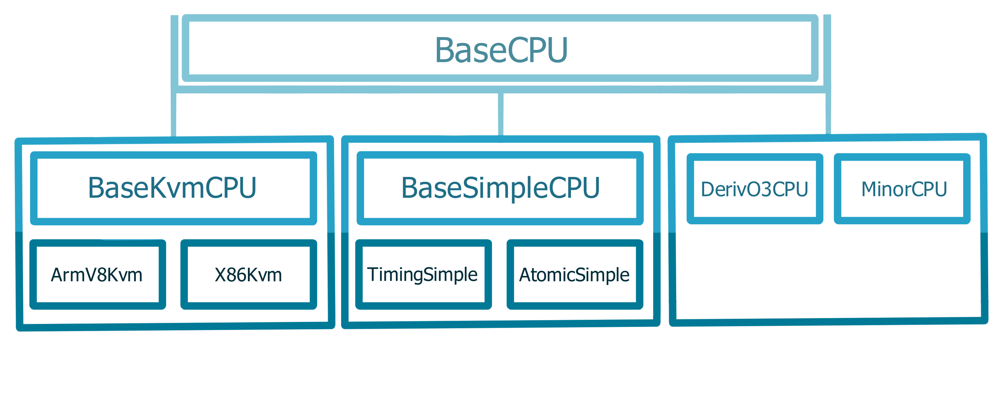
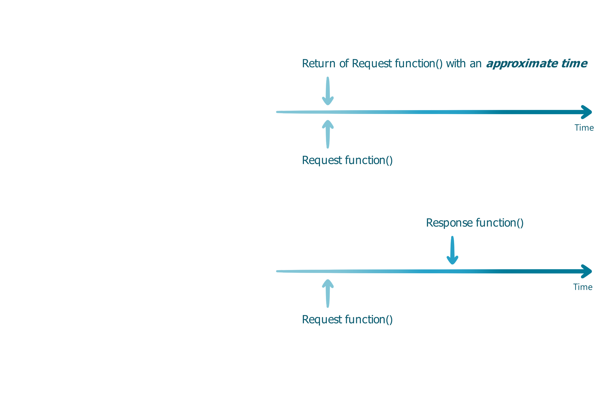
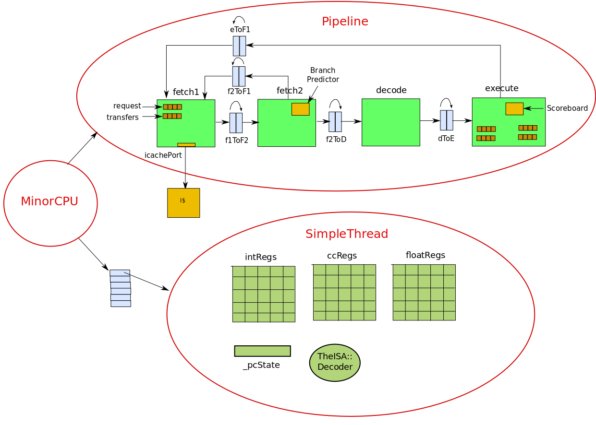
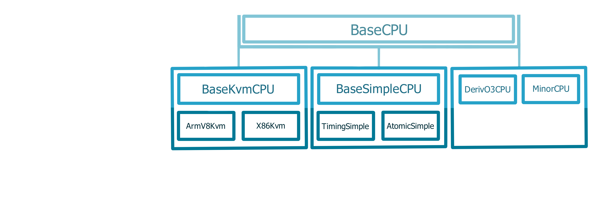
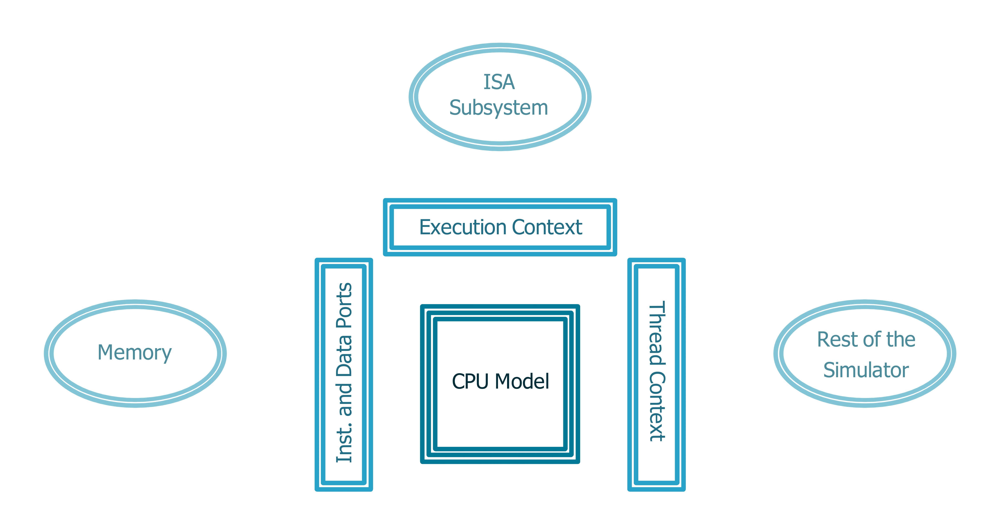

<!-- _class: title -->

## Modeling CPU cores in gem5

---

## Outline

> - **CPU models in gem5​**
>
>   - AtomicSimpleCPU, TimingSimpleCPU, O3CPU, MinorCPU, KvmCPU​

- Using the CPU models​

  - Set-up a simple system with two cache sizes and three CPU models​

- Look at the gem5 generated statistics​

  - To understand differences among CPU models

- Create a custom processor

  - Change parameters of a processor based on O3CPU

---

## Summary of gem5 CPU Models



---

<style scoped>
  div.line{
    padding-top: 250px;
    font-size: 4rem;
    text-align: center;
    font-weight: bold;
    line-height: 75px;
    background: linear-gradient(to right,rgb(67,124,205), rgb(69,214,202));
    -webkit-background-clip: text;
    -webkit-text-fill-color: transparent;
  }
</style>

<div class="line">Simple CPU</div>

---

## SimpleCPU

### **Atomic**

Seq. of nested calls
Use: Warming up, FF
<!-- </br> -->

### **Functional**

Backdoor access to mem.
(loading binaries)
No effect on coherency states

### **Timing**

Split transactions
Models queuing delay and
resource contention



---

## Other Simple CPUS


### AtomicSimpleCPU

- Uses **_Atomic_** memory accesses
  - No resource contentions or queuing delay
  - Mostly used for fast-forwarding and warming of caches

### TimingSimpleCPU

- Uses **_Timing_** memory accesses
  - Execute non-memory operations in one cycle
  - Models the timing of memory accesses in detail

---

## O3CPU (Out of Order CPU Model)

- **_Timing_** memory accesses _execute-in-execute_ semantics
- Time buffers between stages

---

## The O3CPU Model has many parameters

[src/cpu/o3/BaseO3CPU.py](../../gem5/src/cpu/o3/BaseO3CPU.py)

```python
...
decodeToFetchDelay = Param.Cycles(1, "Decode to fetch delay")
renameToFetchDelay = Param.Cycles(1, "Rename to fetch delay")
iewToFetchDelay = Param.Cycles(1, "Issue/Execute/Writeback to fetch delay")
commitToFetchDelay = Param.Cycles(1, "Commit to fetch delay")
fetchWidth = Param.Unsigned(8, "Fetch width")
fetchBufferSize = Param.Unsigned(64, "Fetch buffer size in bytes")
fetchQueueSize = Param.Unsigned(
    32, "Fetch queue size in micro-ops per-thread"
)
renameToDecodeDelay = Param.Cycles(1, "Rename to decode delay")
...
```

---

## The O3CPU Model Parameters are easy to configure

[src/cpu/o3/BaseO3CPU.py](../../gem5/src/cpu/o3/BaseO3CPU.py)

In the following code, there are 256 physical integer registers

```python
    numPhysIntRegs = Param.Unsigned(
        256, "Number of physical integer registers"
    )
```

We can update the code so that there are only 32 physical integer registers

```python
    numPhysIntRegs = Param.Unsigned(
        32, "Number of physical integer registers"
    )
```

---

## MinorCPU



<!-- 'https://nitish2112.github.io/post/gem5-minor-cpu/' Add "footer: " within the comment to make it appear on the slide-->

---

## KvmCPU

- KVM – Kernel-based virtual machine

- Used for native execution on x86 and ARM host platforms

- Guest and the host need to have the same ISA

- Very useful for functional tests and fast-forwarding

---

## Summary of gem5 CPU Models

### **BaseKvmCPU**

- Very fast
- No timing
- No caches, BP

### **BaseSimpleCPU**

- Fast
- Some timing
- Caches, limited BP

### **DerivO3CPU and MinorCPU**

- Slow
- Timing
- Caches, BP



---

## Interaction of CPU model with other parts of gem5



---

## Outline

- CPU models in gem5​

  - AtomicSimpleCPU, TimingSimpleCPU, O3CPU, MinorCPU, KvmCPU​

> - **Using the CPU models​**
>
>   - Set-up a simple system with two cache sizes and three CPU models​

- Look at the gem5 generated statistics​

  - To understand differences among CPU models

- Create a custom processor

  - Change parameters of a processor based on O3CPU

---

<style scoped>
  div.line{
    padding-top: 250px;
    font-size: 4rem;
    text-align: center;
    font-weight: bold;
    line-height: 75px;
    background: linear-gradient(to right,rgb(67,124,205), rgb(69,214,202));
    -webkit-background-clip: text;
    -webkit-text-fill-color: transparent;
  }
</style>

<div class="line">Let's use these CPU Models!</div>

---

## Material to use

### Start by opening the following file

> [materials/developing-gem5-models/04-cores/cores.py](../../materials/developing-gem5-models/04-cores/cores.py)

### Steps

1. Configure a simple system with Atomic CPU
2. Configure the same system with Timing CPU
3. Reduce the cache size
4. Change the CPU type back to Atomic

We will be running a program (workload) called **matrix-multiply** on our board

---

## Let's configure a simple system with Atomic CPU

[materials/developing-gem5-models/04-cores/cores.py](../../materials/developing-gem5-models/04-cores/cores.py)

```python
from gem5.resources.resource import obtain_resource
from gem5.simulate.simulator import Simulator
from gem5.components.boards.simple_board import SimpleBoard
from gem5.components.cachehierarchies.classic.private_l1_cache_hierarchy import PrivateL1CacheHierarchy
from gem5.components.memory.single_channel import SingleChannelDDR3_1600
from gem5.components.processors.simple_processor import SimpleProcessor
from gem5.components.processors.cpu_types import CPUTypes
from gem5.isas import ISA


# A simple script to test with different CPU models
# We will run a simple application (matrix-multiply) with AtomicSimpleCPU, TimingSimpleCPU,
# and O3CPU using two different cache sizes

...
```

---

## Let's start with Atomic CPU

`cpu_type` in cores.py should already be set to Atomic

```python
# Comment out the cpu_types you don't want to use and
# Uncomment the one you do want to use
cpu_type = CPUTypes.ATOMIC
# cpu_type = CPUTypes.TIMING
# cpu_type = CPUTypes.O3
```

> Let's run it!
>
> ```sh
> gem5 --outdir=atomic-normal-cache ./materials/developing-gem5-models/04-cores/cores.py
> ```
>
> Make sure the out directory is set to **atomic-normal-cache**
---

## Next, try Timing CPU

Change `cpu_type` in cores.py to Timing

```python
# Comment out the cpu_types you don't want to use and
# Uncomment the one you do want to use
# cpu_type = CPUTypes.ATOMIC
cpu_type = CPUTypes.TIMING
# cpu_type = CPUTypes.O3
```

> Let's run it!
>
> ```sh
> gem5 --outdir=timing-normal-cache ./materials/developing-gem5-models/04-cores/cores.py
>  ```
>
> Make sure the out directory is set to **timing-normal-cache**

---

## Now, try changing the Cache Size

Go to this line of code.

```python
cache_hierarchy = PrivateL1CacheHierarchy(l1d_size="32KiB", l1i_size="32KiB")
```

Change `l1d_size` and `l1i_size` to 1KiB.

```python
cache_hierarchy = PrivateL1CacheHierarchy(l1d_size="1KiB", l1i_size="1KiB")
```

> Let's run it!
>
>```sh
> gem5 --outdir=timing-small-cache ./materials/developing-gem5-models/04-cores/cores.py
>```
>
> Make sure the out directory is set to **timing-small-cache**

---

## Now let's try a Small Cache with Atomic CPU

Set `cpu_type` in cores.py to Atomic

```python
# Comment out the cpu_types you don't want to use and
# Uncomment the one you do want to use
cpu_type = CPUTypes.ATOMIC
# cpu_type = CPUTypes.TIMING
# cpu_type = CPUTypes.O3
```

> Let's run it!
>
> ```sh
> gem5 --outdir=atomic-small-cache ./materials/developing-gem5-models/04-cores/cores.py
> ```
>
> Make sure the out directory is set to **atomic-small-cache**

---

## Outline

- CPU models in gem5​

  - AtomicSimpleCPU, TimingSimpleCPU, O3CPU, MinorCPU, KvmCPU​

- Using the CPU models​

  - Set-up a simple system with two cache sizes and three CPU models​

> - **Look at the gem5 generated statistics​**
>
>   - To understand differences among CPU models

- Create a custom processor

  - Change parameters of a processor based on O3CPU

---

<style scoped>
  div.line{
    padding-top: 250px;
    font-size: 4rem;
    text-align: center;
    font-weight: bold;
    line-height: 75px;
    background: linear-gradient(to right,rgb(67,124,205), rgb(69,214,202));
    -webkit-background-clip: text;
    -webkit-text-fill-color: transparent;
  }
</style>

<div class="line">Statistics</div>

---

## Look at the Number of Operations

Run the following command

```sh
grep -ri "simOps" atomic-normal-cache atomic-small-cache timing-normal-cache timing-small-cache
```

Here are the expected results

```sh
atomic-normal-cache/stats.txt:simOps                                       33954560
atomic-small-cache/stats.txt:simOps                                        33954560
timing-normal-cache/stats.txt:simOps                                       33954560
timing-small-cache/stats.txt:simOps                                        33954560
```

---
## Look at the Number of Execution Cycles

Run the following command

```sh
grep -ri "numCycles" atomic-normal-cache atomic-small-cache timing-normal-cache timing-small-cache | grep "cores0"
```

Here are the expected results (Note: Some text is removed for readability)

```sh
atomic-normal-cache/stats.txt:board.processor.cores0.core.numCycles        38157549
atomic-small-cache/stats.txt:board.processor.cores0.core.numCycles         38157549
timing-normal-cache/stats.txt:board.processor.cores0.core.numCycles        62838389
timing-small-cache/stats.txt:board.processor.cores0.core.numCycles         96494522
```

Note that for Atomic CPU, the number of cycles is the **same** for a large cache *and* a small cache

This is because Atomic CPU ignores memory access latency

---

## Extra Notes about gem5 Statistics

When you specify the out-directory for the stats file (when you use the flag `--outdir=<outdir-name>`), go to **\<outdir-name>/stats.txt** to look at the entire statistics file

For example, to look at the statistics file for the Atomic CPU with a small cache, go to **atomic-small-cache/stats.txt**

In general, if you don't specify the out-directory, it will be **m5out/stats.txt**

### Other statistics to look at

- Host time (time taken by gem5 to run your simulation)
  - _hostSeconds_

---

## Outline

- CPU models in gem5​

  - AtomicSimpleCPU, TimingSimpleCPU, O3CPU, MinorCPU, KvmCPU​

- Using the CPU models​

  - Set-up a simple system with two cache sizes and three CPU models​

- Look at the gem5 generated statistics​

  - To understand differences among CPU models

> - **Create a custom processor**
>
>   - Change parameters of a processor based on O3CPU

---

<style scoped>
  div.line{
    padding-top: 250px;
    font-size: 4rem;
    text-align: center;
    font-weight: bold;
    line-height: 75px;
    background: linear-gradient(to right,rgb(67,124,205), rgb(69,214,202));
    -webkit-background-clip: text;
    -webkit-text-fill-color: transparent;
  }
</style>

<div class="line">Let's configure a custom processor!</div>

---

## Material to use

### Start by opening the following files

> [materials/developing-gem5-models/04-cores/cores-complex.py](../../materials/developing-gem5-models/04-cores/cores-complex.py)
> [materials/developing-gem5-models/04-cores/components/processors.py](../../materials/developing-gem5-models/04-cores/components/processors.py)

### Steps

1. Update class big(O3CPU) and class LITTLE(O3CPU)
2. Run with big processor
3. Run with LITTLE processor
4. Compare statistics

We will be running the same workload (**matrix-multiply**) on our board

---

<!-- _class: twoCol -->

## Configuring two processors

Open the following file:
[materials/developing-gem5-models/04-cores/components/processors.py](../../materials/developing-gem5-models/04-cores/components/processors.py)

In class big, set

- width=**10**

- rob_size=**40**

- num_int_regs=**50**

- num_fp_regs=**50**


###

```python
class big(O3CPU):
    def __init__(self):
        super().__init__(
            width=0,
            rob_size=0,
            num_int_regs=0,
            num_fp_regs=0,
        )
```
---

<!-- _class: twoCol -->

## Configuring two processors

Keep working in the following file:
[materials/developing-gem5-models/04-cores/components/processors.py](../../materials/developing-gem5-models/04-cores/components/processors.py)

In class LITTLE, set

- width=**2**

- rob_size=**30**

- num_int_regs=**40**

- num_fp_regs=**40**


###
```python
class LITTLE(O3CPU):
    def __init__(self):
        super().__init__(
            width=0,
            rob_size=0,
            num_int_regs=0,
            num_fp_regs=0,
        )
```

---

## Run with big processor

Open the following file:
[materials/developing-gem5-models/04-cores/cores-complex.py](../../materials/developing-gem5-models/04-cores/cores-complex.py)

First, we will run matrix-multiply with our big processor

```python
processor = big()

# processor = LITTLE()
```

> Run with the following command
>
> `gem5 --outdir=big-proc ./materials/developing-gem5-models/04-cores/cores-complex.py`
>
> Make sure the out directory is set to **big-proc**

---

## Run with LITTLE processor

Keep the following file open:
[materials/developing-gem5-models/04-cores/cores-complex.py](../../materials/developing-gem5-models/04-cores/cores-complex.py)

Next, we will run matrix-multiply with our LITTLE processor

```python
# processor = big()

processor = LITTLE()
```

> Run with the following command
>
> `gem5 --outdir=LITTLE-proc ./materials/developing-gem5-models/04-cores/cores-complex.py`
>
> Make sure the out directory is set to **LITTLE-proc**

---

## Comparing big and LITTLE processors

Run the following command

```sh
grep -ri "simSeconds" big-proc LITTLE-proc && grep -ri "numCycles" big-proc LITTLE-proc
```

Here are the expected results (Note: Some text is removed for readability)

```sh
big-proc/stats.txt:simSeconds                                           0.028124
LITTLE-proc/stats.txt:simSeconds                                        0.036715
big-proc/stats.txt:board.processor.cores.core.numCycles                 56247195
LITTLE-proc/stats.txt:board.processor.cores.core.numCycles              73430220
```

Our LITTLE processor takes more time and more cycles than out big processor

<!-- This is likely mostly because our LITTLE processor has to access the cache more times since it has less physical registers to work with

grep -ri "l1dcaches.overallAccesses::total" big-proc LITTLE-proc -->
