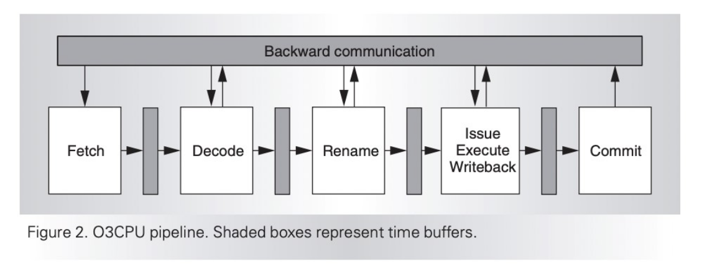

<!-- _class: title -->

## Modeling CPU cores in gem5

---

## Outline

- **Learn about CPU models in gem5​**
  - AtomicSimpleCPU, TimingSimpleCPU, O3CPU, MinorCPU, KvmCPU​
- Using the CPU models​
  - Set-up a simple system with two cache sizes and three CPU models​
- Look at the gem5 generated statistics​
  - To understand differences among CPU models
- Create a custom processor
  - Change parameters of a processor based on O3CPU

---

## gem5 CPU Models


---

<!-- _class: start --->

## Simple CPU

---

## SimpleCPU

### Atomic

Sequency of nested calls
Use: Warming up, fast-forwarding

### Functional

Backdoor access to mem.
(loading binaries)
No effect on coherency states

### Timing

Split transactions
Models queuing delay and
resource contention


---

## Other Simple CPUs

### AtomicSimpleCPU

- Uses **_Atomic_** memory accesses
  - No resource contentions or queuing delay
  - Mostly used for fast-forwarding and warming of caches

### TimingSimpleCPU

- Uses **_Timing_** memory accesses
  - Execute non-memory operations in one cycle
  - Models the timing of memory accesses in detail

---

## O3CPU (Out of Order CPU Model)

- **_Timing_** memory accesses _execute-in-execute_ semantics
- Time buffers between stages



---

## The O3CPU Model has many parameters

[src/cpu/o3/BaseO3CPU.py](../../gem5/src/cpu/o3/BaseO3CPU.py)

```python
decodeToFetchDelay = Param.Cycles(1, "Decode to fetch delay")
renameToFetchDelay = Param.Cycles(1, "Rename to fetch delay")
...
fetchWidth = Param.Unsigned(8, "Fetch width")
fetchBufferSize = Param.Unsigned(64, "Fetch buffer size in bytes")
fetchQueueSize = Param.Unsigned(
    32, "Fetch queue size in micro-ops per-thread"
)
...
```

Remember, do not update the parameters directly in the file. Instead, create a new _stdlib component_ and extend the model with new values for parameters.
We will do this soon.

---

## MinorCPU


<!-- 'https://nitish2112.github.io/post/gem5-minor-cpu/' Add "footer: " within the comment to make it appear on the slide-->

---

## KvmCPU

- KVM – Kernel-based virtual machine
- Used for native execution on x86 and ARM host platforms
- Guest and the host need to have the same ISA
- Very useful for functional tests and fast-forwarding

---

## Summary of gem5 CPU Models

### BaseKvmCPU

- Very fast
- No timing
- No caches, BP

### BaseSimpleCPU

- Fast
- Some timing
- Caches, limited BP

### DerivO3CPU and MinorCPU

- Slow
- Timing
- Caches, BP


---

## Interaction of CPU model with other parts of gem5


---

## Outline

- CPU models in gem5​
  - AtomicSimpleCPU, TimingSimpleCPU, O3CPU, MinorCPU, KvmCPU​
- **Using the CPU models​**
  - Set-up a simple system with two cache sizes and three CPU models​
- Look at the gem5 generated statistics​
  - To understand differences among CPU models
- Create a custom processor
  - Change parameters of a processor based on O3CPU

---

<!-- _class: start -->

## Let's use these CPU Models!

---

## Material to use

### Start by opening the following file

[materials/developing-gem5-models/04-cores/cores.py](../../materials/developing-gem5-models/04-cores/cores.py)

### Steps

1. Configure a simple system with Atomic CPU
2. Configure the same system with Timing CPU
3. Reduce the cache size
4. Change the CPU type back to Atomic

We will be running a program (workload) called **matrix-multiply** on our board

---

## Let's configure a simple system with Atomic CPU

[materials/developing-gem5-models/04-cores/cores.py](../../materials/developing-gem5-models/04-cores/cores.py)

```python
from gem5.resources.resource import obtain_resource
from gem5.simulate.simulator import Simulator
from gem5.components.boards.simple_board import SimpleBoard
from gem5.components.cachehierarchies.classic.private_l1_cache_hierarchy import PrivateL1CacheHierarchy
from gem5.components.memory.single_channel import SingleChannelDDR3_1600
from gem5.components.processors.simple_processor import SimpleProcessor
from gem5.components.processors.cpu_types import CPUTypes
from gem5.isas import ISA


# A simple script to test with different CPU models
# We will run a simple application (matrix-multiply) with AtomicSimpleCPU, TimingSimpleCPU,
# and O3CPU using two different cache sizes

...
```

---

## Let's start with Atomic CPU

`cpu_type` in cores.py should already be set to Atomic

```python
# Comment out the cpu_types you don't want to use and
# Uncomment the one you do want to use
cpu_type = CPUTypes.ATOMIC
# cpu_type = CPUTypes.TIMING
```

Let's run it!

```sh
gem5 --outdir=atomic-normal-cache cores.py
```

Make sure the out directory is set to **atomic-normal-cache**

---

## Next, try Timing CPU

Change `cpu_type` in cores.py to Timing

```python
# Comment out the cpu_types you don't want to use and
# Uncomment the one you do want to use
# cpu_type = CPUTypes.ATOMIC
cpu_type = CPUTypes.TIMING
```

Let's run it!

```sh
gem5 --outdir=timing-normal-cache cores.py
```

Make sure the out directory is set to **timing-normal-cache**

---

## Now, try changing the Cache Size

Go to this line of code.

```python
cache_hierarchy = PrivateL1CacheHierarchy(l1d_size="32KiB", l1i_size="32KiB")
```

Change `l1d_size` and `l1i_size` to 1KiB.

```python
cache_hierarchy = PrivateL1CacheHierarchy(l1d_size="1KiB", l1i_size="1KiB")
```

Let's run it!

```sh
gem5 --outdir=timing-small-cache cores.py
```

Make sure the out directory is set to **timing-small-cache**

---

## Now let's try a Small Cache with Atomic CPU

Set `cpu_type` in cores.py to Atomic

```python
# Comment out the cpu_types you don't want to use and
# Uncomment the one you do want to use
cpu_type = CPUTypes.ATOMIC
# cpu_type = CPUTypes.TIMING
```

Let's run it!

```sh
gem5 --outdir=atomic-small-cache cores.py
```

Make sure the out directory is set to **atomic-small-cache**

---

## Outline

- CPU models in gem5​
  - AtomicSimpleCPU, TimingSimpleCPU, O3CPU, MinorCPU, KvmCPU
- Using the CPU models​
  - Set-up a simple system with two cache sizes and three CPU models​
- **Look at the gem5 generated statistics​**
  - To understand differences among CPU models
- Create a custom processor
  - Change parameters of a processor based on O3CPU

---

<!-- _class: start -->

## Statistics

---

## Look at the Number of Operations

Run the following command

```sh
grep -ri "simOps" atomic-normal-cache atomic-small-cache timing-normal-cache timing-small-cache
```

Here are the expected results

```sh
atomic-normal-cache/stats.txt:simOps                                       33954560
atomic-small-cache/stats.txt:simOps                                        33954560
timing-normal-cache/stats.txt:simOps                                       33954560
timing-small-cache/stats.txt:simOps                                        33954560
```

---

## Look at the Number of Execution Cycles

Run the following command

```sh
grep -ri "numCycles" atomic-normal-cache atomic-small-cache timing-normal-cache timing-small-cache | grep "cores0"
```

Here are the expected results (Note: Some text is removed for readability)

```sh
atomic-normal-cache/stats.txt:board.processor.cores0.core.numCycles        38157549
atomic-small-cache/stats.txt:board.processor.cores0.core.numCycles         38157549
timing-normal-cache/stats.txt:board.processor.cores0.core.numCycles        62838389
timing-small-cache/stats.txt:board.processor.cores0.core.numCycles         96494522
```

Note that for Atomic CPU, the number of cycles is the **same** for a large cache _and_ a small cache

This is because Atomic CPU ignores memory access latency

---

## Extra Notes about gem5 Statistics

When you specify the out-directory for the stats file (when you use the flag `--outdir=<outdir-name>`), go to **\<outdir-name>/stats.txt** to look at the entire statistics file

For example, to look at the statistics file for the Atomic CPU with a small cache, go to **atomic-small-cache/stats.txt**

In general, if you don't specify the out-directory, it will be **m5out/stats.txt**

### Other statistics to look at

- Host time (time taken by gem5 to run your simulation)
  - _hostSeconds_

---

## Outline

- CPU models in gem5​
  - AtomicSimpleCPU, TimingSimpleCPU, O3CPU, MinorCPU, KvmCPU​
- Using the CPU models​
  - Set-up a simple system with two cache sizes and three CPU models​
- Look at the gem5 generated statistics​
  - To understand differences among CPU models
- **Create a custom processor**
  - Change parameters of a processor based on O3CPU

---

<!-- _class: start -->

## Let's configure a custom processor!

---

## Material to use

[materials/developing-gem5-models/04-cores/cores-complex.py](../../materials/developing-gem5-models/04-cores/cores-complex.py)

[materials/developing-gem5-models/04-cores/components/processors.py](../../materials/developing-gem5-models/04-cores/components/processors.py)

### Steps

1. Update class big(O3CPU) and Little(O3CPU)
2. Run with big processor
3. Run with Little processor
4. Compare statistics

We will be running the same workload (**matrix-multiply**) on our board

---

## Configuring two processors

We will make one fast processor (**_Big_**) and one slow processor (**_Little_**)

To do this, we will change **4** parameters in each processor

- **width**
  - width of fetch, decode, raname, issue, wb, and commit stages.
- **rob_size**
  - the number of entries in the reorder buffer.
- **num_int_regs**
  - the number of physical integer registers
- **num_fp_regs**
  - the number of physical vector/floating point registers.

---

<!-- _class: two-col -->

## Configuring Big

Open the following file:
[materials/developing-gem5-models/04-cores/components/processors.py](../../materials/developing-gem5-models/04-cores/components/processors.py)

In class big, set

- width=**10**
- rob_size=**40**
- num_int_regs=**50**
- num_fp_regs=**50**

###

```python
class Big(O3CPU):
    def __init__(self):
        super().__init__(
            width=0,
            rob_size=0,
            num_int_regs=0,
            num_fp_regs=0,
        )
```

---

<!-- _class: two-col -->

## Configuring Little

Keep working in the following file:
[materials/developing-gem5-models/04-cores/components/processors.py](../../materials/developing-gem5-models/04-cores/components/processors.py)

In class Little, set

- width=**2**
- rob_size=**30**
- num_int_regs=**40**
- num_fp_regs=**40**

###

```python
class Little(O3CPU):
    def __init__(self):
        super().__init__(
            width=0,
            rob_size=0,
            num_int_regs=0,
            num_fp_regs=0,
        )
```

---

## Run with big processor

Open the following file:
[materials/developing-gem5-models/04-cores/cores-complex.py](../../materials/developing-gem5-models/04-cores/cores-complex.py)

First, we will run matrix-multiply with our big processor

```python
processor = big()

# processor = Little()
```

Run with the following command

```sh
gem5 --outdir=big-proc cores-complex.py
```

Make sure the out directory is set to **big-proc**

---

## Run with Little processor

Keep the following file open:
[materials/developing-gem5-models/04-cores/cores-complex.py](../../materials/developing-gem5-models/04-cores/cores-complex.py)

Next, we will run matrix-multiply with our Little processor

```python
# processor = big()

processor = Little()
```

Run with the following command

```sh
gem5 --outdir=little-proc cores-complex.py
```

Make sure the out directory is set to **little-proc**

---

## Comparing big and Little processors

Run the following command

```sh
grep -ri "simSeconds" big-proc Little-proc && grep -ri "numCycles" big-proc Little-proc
```

Here are the expected results (Note: Some text is removed for readability)

```sh
big-proc/stats.txt:simSeconds                                           0.028124
little-proc/stats.txt:simSeconds                                        0.036715
big-proc/stats.txt:board.processor.cores.core.numCycles                 56247195
little-proc/stats.txt:board.processor.cores.core.numCycles              73430220
```

Our little processor takes more time and more cycles than out big processor

<!-- This is likely mostly because our Little processor has to access the cache more times since it has less physical registers to work with

grep -ri "l1dcaches.overallAccesses::total" big-proc Little-proc -->
