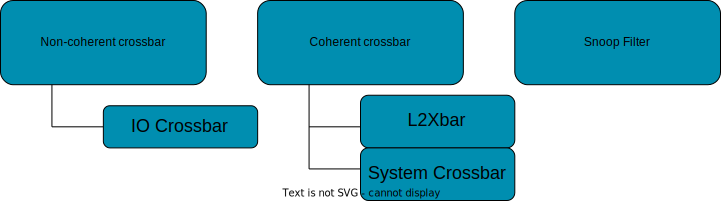
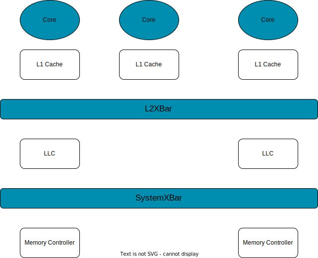

<!-- _class: title -->

## Modeling caches in gem5

---


## Before We Start

```bash
cd gem5
scons build/NULL_MESI_Two_Level/gem5.opt --default=NULL PROTOCOL=MESI_Two_Level SLICC_HTML=True -j17
```

---

<!-- _class: twoCol -->

## Cache Hierarchy in gem5

1. **Classic Cache**: Simplified, faster, and less flexible
2. **Ruby**: Models cache coherence in detail

###


---

## Outline

* Background on cache coherency
* Simple Cache
    * Coherency protocol in simple cache
    * How to use simple cache
* Ruby cache
    * Ruby components
    * Example of MESI two level protocol


---

## What is Coherency

A coherence problem can arise if multiple cores have access to multiple copies of a data (e.g., in multiple caches) and at least one access is a write


---

## What is Coherency

A coherence problem can arise if multiple cores have access to multiple copies of a data (e.g., in multiple caches) and at least one access is a write


---

## What is Coherency

A coherence problem can arise if multiple cores have access to multiple copies of a data (e.g., in multiple caches) and at least one access is a write


* Coherency protocols
    1. Snooping
    2. Directory

---

<!-- _class: twoCol -->

## Snoop Protocol

* Each processor snoops the bus to verify whther it has a copy of a requested cache line
* Before a processor writes data, other processor cache copies must be invalidated
* The coherence requests typically travel on an ordered broadcast network such as a bus

- **This technique does not scale since it requires an all-to-all broadcast**

###


---

<!-- _class: twoCol -->

## Directory Protocol

* Directory tracks which processor have data when in the shared state
    * Local node where a request originates (interact with CPU cache)
    * Home node where the memory location of an address resides
    * Remote node has a copy of a cache block whether exclusive or shared (interact with CPU cache)
* A general interconnection network allows processor to communicate

###


---

<!-- _class: center-title -->

## Simple Cache

<div style="text-align: center; margin-top: 60px; font-size: 3rem">
    Snooping Based
</div>

---

## Classic Cache: Coherence protocol (Snooping)



---

## Classic Cache: Coherent Crossbar

* Has snooping request and response bus

* Each core uses the snooping bus to fetch or invalidate a cache line

---

## Classic Cache: Snoop Filter

* Instead of using a snooping bus to find a cache line each Private cache has a snooping directory

* It keeps track of which connected port has a particular line of data

* Instead of snooping the caches it snoops the directory

---

## Example of system with simple cache



---

## Classic Cache: Pameters

* build/src/mem/cache/Cache.py
    *  build/src/mem/cache/cache.cc
    * build/src/mem/cache/noncoherent_cache.cc

Parameters:

    size, associativity, number of miss status handler register (MSHR) entries, prefetcher, replacement policy

---

<!-- _class: center-title -->

## Ruby

<div style="text-align: center; margin-top: 60px; font-size: 3rem">
    Directory Based
</div>

---

## Ruby Cache

1. Coherence Controller
2. Caches + Interface
3. Interconnect

---

## Ruby

---

## Ruby Components

* Controller models (cache controller, directory controller)
* Controller topology (Mesh, all-to-all, etc.)
* Network models
* Interface (classic ports)

---

## Ruby Cache: Controller Models

Code for controllers is "generated" via SLICC compilers

---

## Ruby Cache: Example of Controller

---

## Ruby Cache: Caches + Memory

---

## Ruby Cache: Caches + Memory

---

## Ruby Cache: Caches + Memory

---

## Ruby Cache: Caches + CPU

---

## Ruby Cache: Caches + CPU

---

## Ruby Cache System

---

## How to use Ruby

1. Create controllers
2. Create sequencers
3. Connect L1 controllers to sequencers
4. Connect Sequencers to CPUs
5. Connect directories to memory controllers

---

## Example

* Ruby - MESI Two level coherency protocol
* Private L1 cache
* 4 CPUs, 4 private L1 caches
* 1 Shared L2 cache
* 1 Memory channel

---

Build:


```bash
cd gem5
scons build/NULL_MESI_Two_Level/gem5.opt --default=NULL PROTOCOL=MESI_Two_Level -j17
```

Run:

```bash
cd ../
.gem5/build/NULL_MESI_Two_Level/gem5.opt materials/using-gem5/04-cache-models/simple_cache_run.py 2 MESITwoLevel 512MB
```
