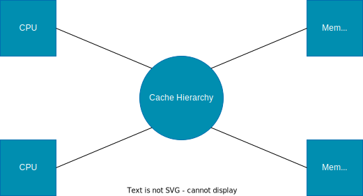
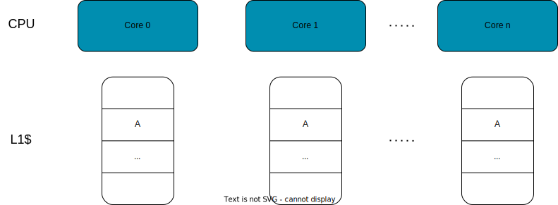
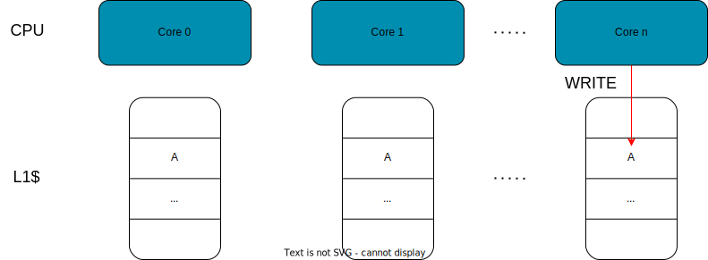
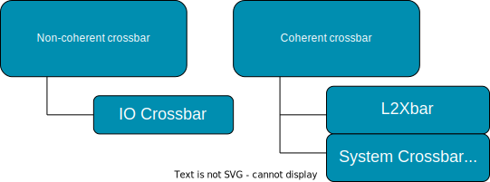
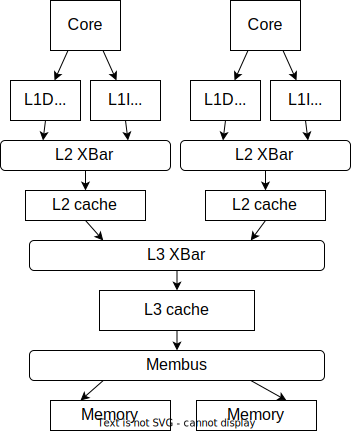
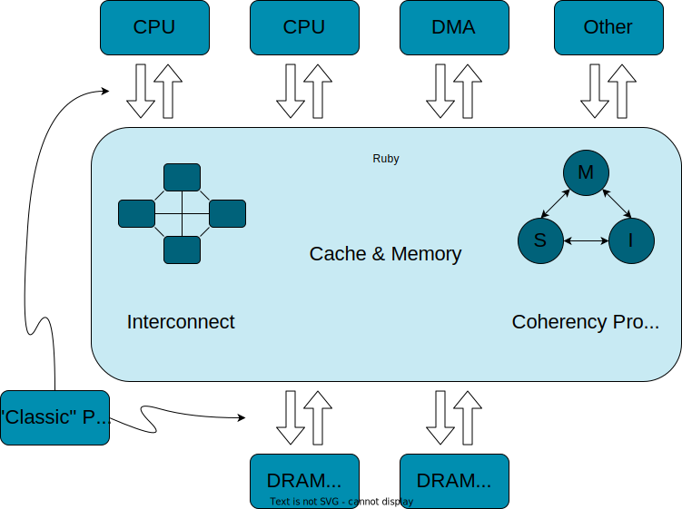
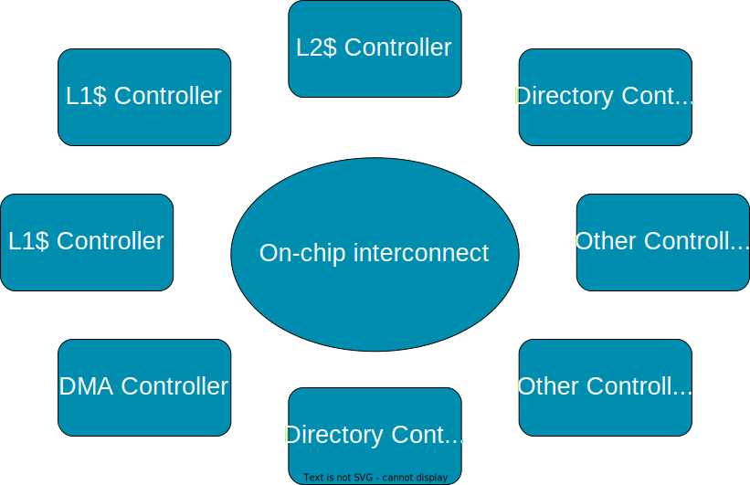
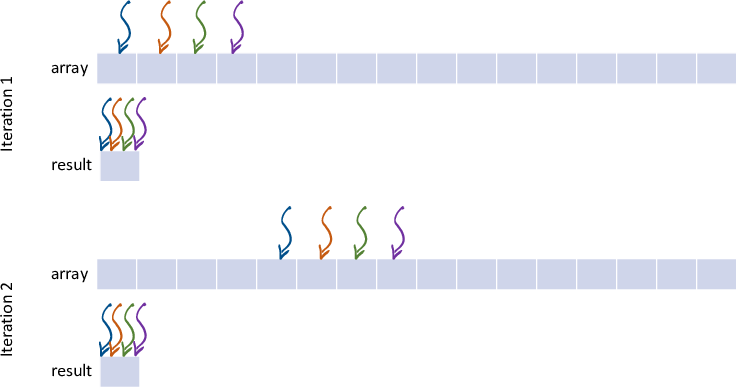
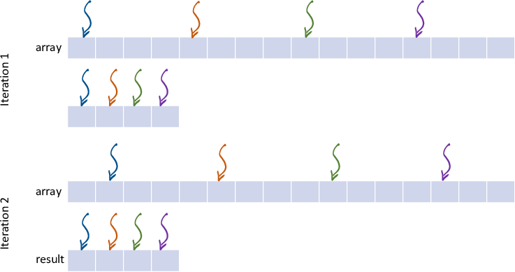
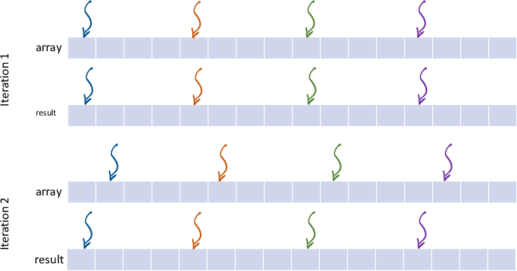

<!-- _class: title -->

## Modeling caches in gem5

---

<!-- _class: two-col -->

## Cache Hierarchy in gem5

One of the main types of components in gem5 is the **cache hierarchy**.

In the standard library, the cache hierarchy has the `Processor` (with multiple cores) on one side and the `Memory` on the other side.

Between the cores and the caches (and the memory controllers and caches) are `Ports`.

**`Ports`** allow models in gem5 to send *Packets* to each other (more on this in [Modeling memory objects in gem5: Ports](../03-Developing-gem5-models/04-ports.md)).

###



---

## Types of caches in gem5

There are two types of cache models in gem5:

1. **Classic Cache**: Simplified, faster, and less flexible
2. **Ruby**: Models cache coherence in detail

This is a historical quirk of the combination of *GEMS* which had Ruby and *m5* whose cache model we now call "classic" caches.

**Ruby** is a highly-detailed model with many different coherence protocols (specified in a language called "SLICC")
More on Ruby in [Modeling Cache Coherence in gem5](../03-Developing-gem5-models/06-modeling-cache-coherence.md).

**Classic** caches are simpler and faster, but less flexible and detailed. The coherence protocol is not parameterized and the hierarchies and topologies are fixed.

---

## Outline

- Background on cache coherency
- Simple Cache
  - Coherency protocol in simple cache
  - How to use simple cache
- Ruby cache
  - Ruby components
  - Example of MESI two level protocol

---

## What is Coherency

A coherence problem can arise if multiple cores have access to multiple copies of a data (e.g., in multiple caches) and at least one access is a write



---

## What is Coherency

A coherence problem can arise if multiple cores have access to multiple copies of a data (e.g., in multiple caches) and at least one access is a write



---

## What is Coherency

A coherence problem can arise if multiple cores have access to multiple copies of a data (e.g., in multiple caches) and at least one access is a write


---

## Classic Cache: Hierarchy of crossbars



---

## Classic Cache: Coherent Crossbar

Each crossbar can connect *n* cpu-side ports and *m* memory-side ports.



Let's create a three level hierarchy with private L1s, private L2s, and a shared L3 connected to multiple memory channels.

---

## Step 1: declare the hierarchy

Open [`materials/02-Using-gem5/05-cache-hierarchies/three_level.py`](../../materials/02-Using-gem5/05-cache-hierarchies/three_level.py)

The constructor is already provided.

```python
class PrivateL1PrivateL2SharedL3CacheHierarchy(AbstractClassicCacheHierarchy):
    def __init__(self, l1d_size, l1i_size, l2_size, l3_size, l1d_assoc=8, l1i_assoc=8, l2_assoc=16, l3_assoc=32):
        AbstractClassicCacheHierarchy.__init__(self)
        self._l1d_size = l1d_size
        self._l1i_size = l1i_size
        self._l2_size = l2_size
        self._l3_size = l3_size
        self._l1d_assoc = l1d_assoc
        self._l1i_assoc = l1i_assoc
        self._l2_assoc = l2_assoc
        self._l3_assoc = l3_assoc
```

---

## Add a membus

```python
self.membus = SystemXBar(width=64)
```

This will be what connects the cache to memory.

We will make it 64 Bytes wide (as wide as the cache line) so that it's maximum bandwidth.

---

## Implement the hierarchy interface

The board needs to be able to get the port to connect memory

```python
def get_mem_side_port(self):
    return self.membus.mem_side_ports
```

The "cpu_side_port" is used for coherent IO access from the board.

```python
def get_cpu_side_port(self):
    return self.membus.cpu_side_ports
```

The main function is **`incorporate_cache`** which is called by the board after the `Processor` and `Memory` are ready to be connected together.

```python
def incorporate_cache(self, board):
```

---

## Incorporate the caches

In the `incorporate_cache` function, we will create the caches and connect them together.

First, connect the system port (for functional accesses) and connect the memory to the membus.
We will also go ahead and create the L3 crossbar based on the L2 crossbar parameters.

```python
board.connect_system_port(self.membus.cpu_side_ports)

# Connect the memory system to the memory port on the board.
for _, port in board.get_memory().get_mem_ports():
    self.membus.mem_side_ports = port

# Create an L3 crossbar
self.l3_bus = L2XBar()
```

---

<!-- _class: code-80-percent  -->

## Creating core clusters

Since each core is going to have a many private caches, let's create a cluster.
In this cluster, we will create L1I/D and L2 caches, the L2 crossbar and connect things.

```python
def _create_core_cluster(self, core, l3_bus, isa):
    cluster = SubSystem()
    cluster.l1dcache = L1DCache(size=self._l1d_size, assoc=self._l1d_assoc)
    cluster.l1icache = L1ICache(
        size=self._l1i_size, assoc=self._l1i_assoc, writeback_clean=False
    )
    core.connect_icache(cluster.l1icache.cpu_side)
    core.connect_dcache(cluster.l1dcache.cpu_side)

    cluster.l2cache = L2Cache(size=self._l2_size, assoc=self._l2_assoc)
    cluster.l2_bus = L2XBar()
    cluster.l1dcache.mem_side = cluster.l2_bus.cpu_side_ports
    cluster.l1icache.mem_side = cluster.l2_bus.cpu_side_ports

    cluster.l2cache.cpu_side = cluster.l2_bus.mem_side_ports

    cluster.l2cache.mem_side = l3_bus.cpu_side_ports
```

---

<!-- _class: code-60-percent  -->

## Full-system specific things

You have been given some code to set up other caches, interrupts, etc. that are needed for full system simulation in x86 and Arm.

You can ignore this for now.

```python
cluster.iptw_cache = MMUCache(size="8KiB", writeback_clean=False)
cluster.dptw_cache = MMUCache(size="8KiB", writeback_clean=False)
core.connect_walker_ports(
    cluster.iptw_cache.cpu_side, cluster.dptw_cache.cpu_side
)

# Connect the caches to the L2 bus
cluster.iptw_cache.mem_side = cluster.l2_bus.cpu_side_ports
cluster.dptw_cache.mem_side = cluster.l2_bus.cpu_side_ports

if isa == ISA.X86:
    int_req_port = self.membus.mem_side_ports
    int_resp_port = self.membus.cpu_side_ports
    core.connect_interrupt(int_req_port, int_resp_port)
else:
    core.connect_interrupt()

return cluster
```

---

## Back to incorporate_cache

Now that we have the cluster, we can create the clusters.

```python
self.clusters = [
    self._create_core_cluster(
        core, self.l3_bus, board.get_processor().get_isa()
    )
    for core in board.get_processor().get_cores()
]
```

---

## The L3 cache

For the L1/L2 caches we used pre-configured caches from the standard library. For the L3, we will create our own configuration. We need to specify the values for the parameters in [Cache](../../gem5/src/mem/cache/Cache.py).

```python
class L3Cache(Cache):
    def __init__(self, size, assoc):
        super().__init__()
        self.size = size
        self.assoc = assoc
        self.tag_latency = 20
        self.data_latency = 20
        self.response_latency = 1
        self.mshrs = 20
        self.tgts_per_mshr = 12
        self.writeback_clean = False
        self.clusivity = "mostly_incl"
```

---

## Connect the L3 cache

Now, we can finish `incorporate_cache` by connecting the L3 cache to the L3 crossbar.

```python
self.l3_cache = L3Cache(size=self._l3_size, assoc=self._l3_assoc)

# Connect the L3 cache to the system crossbar and L3 crossbar
self.l3_cache.mem_side = self.membus.cpu_side_ports
self.l3_cache.cpu_side = self.l3_bus.mem_side_ports

if board.has_coherent_io():
    self._setup_io_cache(board)
```

---

## Testing our cache hierarchy

See [`materials/02-Using-gem5/05-cache-hierarchies/test-cache.py`](../../materials/02-Using-gem5/05-cache-hierarchies/test-cache.py).

Run the test script to see if the cache hierarchy is working.

```bash
gem5 test-cache.py
```

This uses linear traffic, though we could also use your traffic generator from the previous section.

You can also run a real workload with the cache hierarchy.

```bash
gem5 run-is.py
```

This has both full-system (with x86) and SE mode (with Arm).

---

## Classic Cache: Parameters

- src/mem/cache/Cache.py
  - src/mem/cache/cache.cc
  - src/mem/cache/noncoherent_cache.cc

Parameters:

- size
- associativity
- number of miss status handler register (MSHR) entries
- prefetcher
- replacement policy

---

<!-- _class: start -->

## Ruby

---

## Ruby Cache

1. Coherence Controller
2. Caches + Interface
3. Interconnect



---

## Ruby



---

## Ruby Components

- **Controller models** (cache controller, directory controller)
- **Controller topology** (Mesh, all-to-all, etc.)
- **Network models**
- **Interface** (classic ports)

### Ruby Cache: Controller Models

Code for controllers is "generated" via SLICC compilers

We'll see much more detail in [Modeling Cache Coherence in gem5](../03-Developing-gem5-models/06-modeling-cache-coherence.md).

---

## Ruby Cache: Example

Let's do an example using the MESI protocol and see what new stats we can get with Ruby.

We're going to look at some different implementations of a parallel algorithm (summing an array).

```c
parallel_for (int i=0; i < length; i++) {
    *result += array[i];
}
```

---

## Different implementations: Naive

Three different implementations: Naive, false sharing on the output, and chunking with no false sharing.

### "Naive" implementation



---

## False sharing



---

## Chunking and no false sharing



---

## Using Ruby

We can use Ruby to see the difference in cache behavior between these implementations.

Run the script [`materials/02-Using-gem5/05-cache-hierarchies/ruby-example/run.py`](../../materials/02-Using-gem5/05-cache-hierarchies/test-ruby.py).

```bash
gem5-mesi --outdir=m5out/naive run.py naive
```

```bash
gem5-mesi --outdir=m5out/false_sharing run.py false_sharing
```

```bash
gem5-mesi --outdir=m5out/chunking run.py chunking
```

---

## Stats to compare

Compare the following stats:

The time it took in simulation and the read/write sharing

- `board.cache_hierarchy.ruby_system.L1Cache_Controller.Fwd_GETS`: Number of times things were read-shared
- `board.cache_hierarchy.ruby_system.L1Cache_Controller.Fwd_GETX`: Number of times things were write-shared

(Note: Ignore the first thing in the array for these stats. It's a long story...)

We'll cover more about how to configure Ruby in [Modeling Cache Coherence in gem5](../03-Developing-gem5-models/06-modeling-cache-coherence.md).

---

## Summary

- Cache hierarchies are a key part of gem5
- Classic caches are simpler and faster
- Classic caches are straightforward to configure and use
- Ruby caches are more detailed and can model cache coherence
- We can use Ruby to compare different cache behaviors
