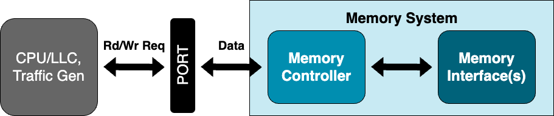
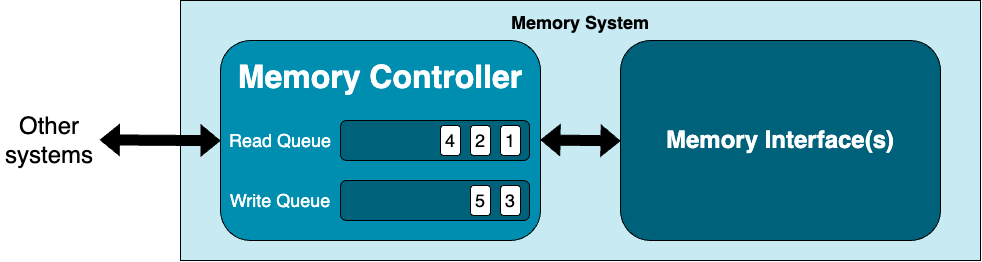
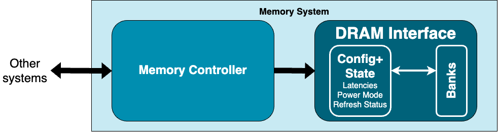
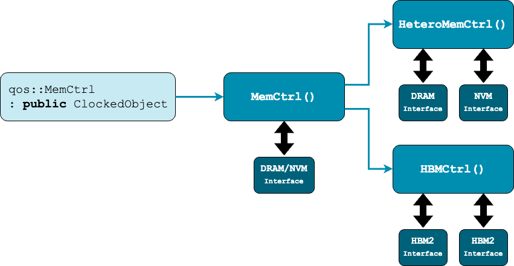
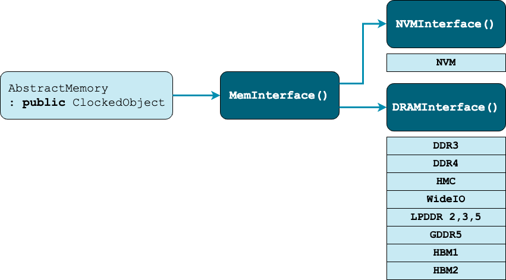
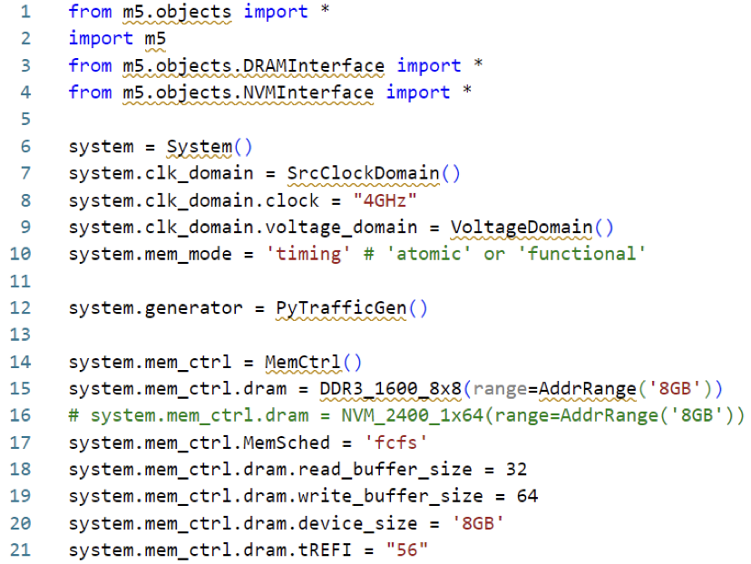
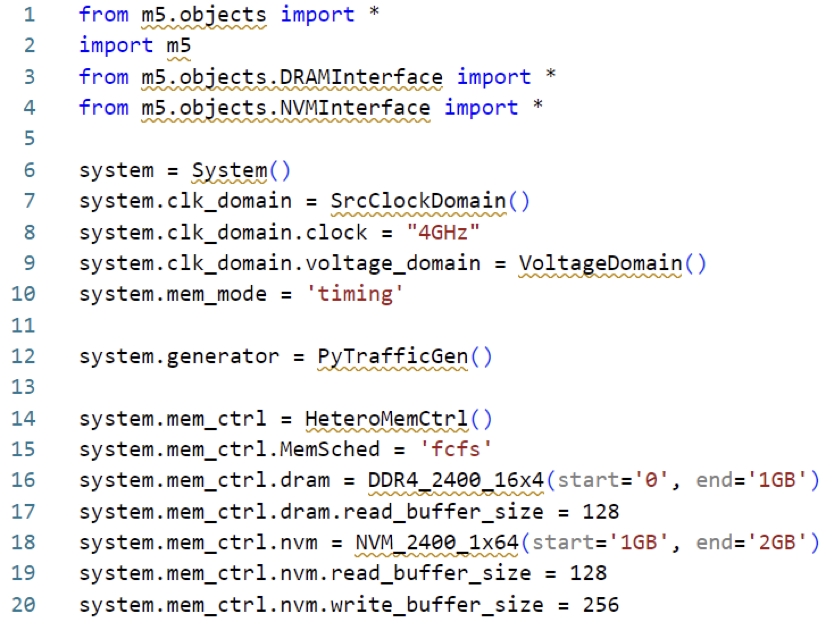
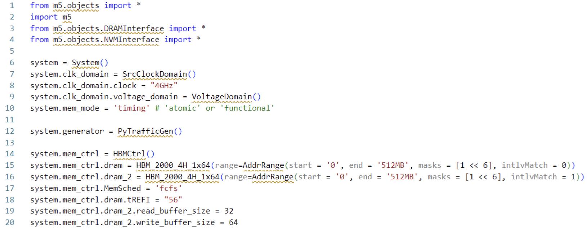

<!-- _class: title -->

## Modeling DRAM in gem5

Description Goes Here

---

<!-- _class: center-image -->

## Memory System

### gem5's Memory system consists of two main components

1. Memory Controller

2. Memory Interface(s)
 

---

<!-- _class: center-image -->

## Memory Controller

### When `MemCtrl` receives packets...

1. Packets enqueued into the read and/or write queues

2. Applies **scheduling algorithm** (FCFS, FR-FCFS, ...) to issue read and write requests
 

---

<!-- _class: center-image -->

## Memory Interface

-  The memory interface implements the **architecture** and **timing parameters** of the chosen memory type.

- It manages the **media specific operations** like activation, pre-charge, refresh and low-power modes, etc.
 

---

<!-- _class: center-image -->

## gem5's Memory Controllers

---

<!-- _class: center-image -->

## gem5's Memory Interfaces

---

## Configuring Memory Controllers & Interfaces

 

For full list of their configuration options, investigate their Python object files in: `gem5/src/mem`

---

## Configuring Memory Controllers & Interfaces

For full list of their configuration options, investigate their Python object files in: `gem5/src/mem`

---

## CommMonitor

- SimObject monitoring communication happening between two ports

- Does not have any effect on timing

- `gem5/src/mem/CommMonitor.py`

---

<!-- _class: center-image -->

## CommMonitor

### Simple system to modify

### Let's simulate:

    > gem5-x86 –outdir=results/simple materials/extra-topics/02-monitor-and-trace/simple.py

---

<!-- _class: center-image -->

## CommMonitor

### Let's add the CommMonitor

### Let's simulate:

    > gem5-x86 –outdir=results/simple_comm materials/extra-topics/02-monitor-and-trace/simple_comm.py
    > diff results/simple/stats.txt results/simple_comm/stats.txt
