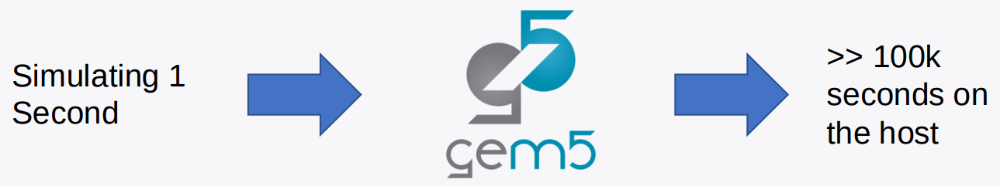
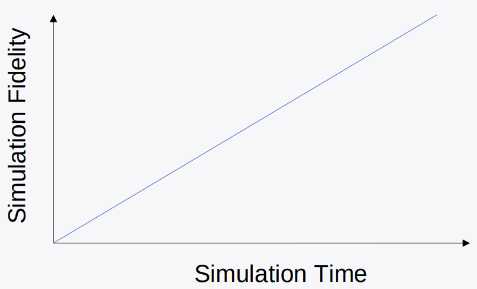
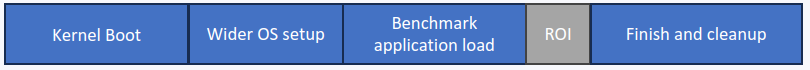

<!-- _class: title -->

## Accelerating gem5 simulations

In this section, we will cover how to accelerate gem5 simulations using fast-forwarding and checkpointing.

---

## gem5 is sllooww

(Not our fault: It’s the natural of simulation)

  

---

## Fortunately, there are some work arounds

### You don't need to simulate everything perfectly, or at all

  

---

## Simulations can always be made faster by simulating less

  

---

## This isn't always a bad thing... a lot of a simulation is of no interest to us

  

---

## Some techiques we provide

<ul style="font-size: 1.5em; line-height: 2em;">
  <li style="margin-bottom: 10px;">Different CPU models</li>
  <li style="margin-bottom: 10px;">KVM Mode</li>
  <li style="margin-bottom: 10px;">SE Mode</li>
  <li style="margin-bottom: 10px;">Checkpointing</li>
  <li style="margin-bottom: 10px;">Sampling: SimPoint and LoopPoint</li>
</ul>

---

<!-- ## SE mode vs FS mode -->

## What we will focus on this session

<ul style="font-size: 1.5em; line-height: 2em;">
  <li style="margin-bottom: 10px;">Annotate region of interest</li>
  <li style="margin-bottom: 10px;">Using KVM</li>
  <li style="margin-bottom: 10px;">Taking and restoring checkpoints</li>
</ul>

---

## Annotate region of interest

### our goal is to just run the ROI in detailed mode

  

### But how does the simulation knows when it gets to the ROI?

Exit Events in gem5 allows us to communicate from the simulator to the host.

---

## gem5 Exit Events

### There are different types of exit events in gem5

<ul style="list-style-type: disc; padding-left: 20px; font-size: 1.2em;">
  <li style="margin-bottom: 20px;">ExitEvent.EXIT</li>
  <li style="margin-bottom: 20px;">ExitEvent.CHECKPOINT</li>
  <li style="margin-bottom: 20px;">ExitEvent.FAIL</li>
  <li style="margin-bottom: 20px;">ExitEvent.SWITCHCPU</li>
  <li style="margin-bottom: 20px;">ExitEvent.WORKBEGIN</li>
  <li style="margin-bottom: 20px;">ExitEvent.WORKEND</li>
  <li style="margin-bottom: 20px;">ExitEvent.USER_INTERRUPT</li>
  <li style="margin-bottom: 20px;">ExitEvent.MAX_TICK</li>
</ul>

More info can be found on [gem5 website](https://www.gem5.org/documentation/general_docs/m5ops/)

---

## (Holder for example slides on annotation)

---

## Now we mark the ROI, how can we get to it

### There are two ways:

<ol style="margin-top: 50px; padding-left: 20px; font-size: 1.2em;">
  <li style="margin-bottom: 30px;">Fast-forwarding with KVM</li>
  <li style="margin-bottom: 30px;">Checkpoint</li>
</ol>

---

## Fast-forwarding with KVM

