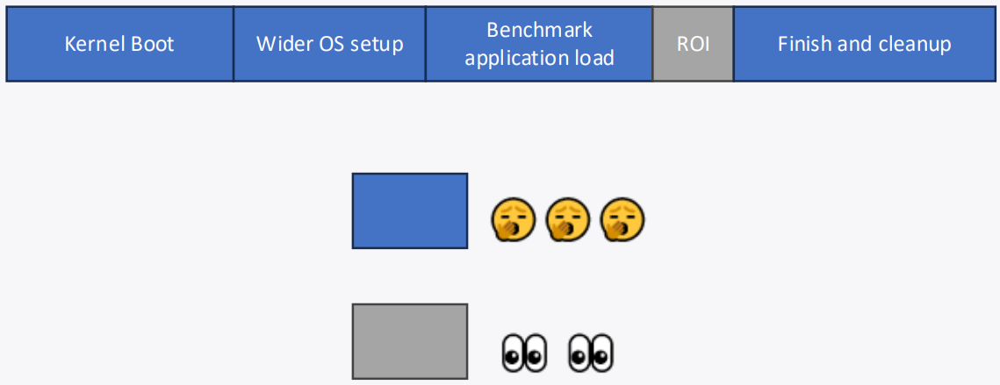

<!-- _class: title -->

## Accelerating gem5 simulations

In this section, we will cover how to accelerate gem5 simulations using fast-forwarding and checkpointing.

---

## gem5 is sllooww

(Not our fault. It’s the nature of simulation)
<!-- class: center-image -->


---

## Fortunately, there are some workarounds

### You don't need to simulate everything perfectly, or at all

<!-- class: center-image -->


---

## Simulations can always be made faster by simulating less


---

## This isn't always a bad thing... large parts of simulations are not interesting to us



---

## Our goal is to just run the region of interest in detailed mode

### How do we get to the ROI fast?

- Using KVM to fast-forward

- Taking and restoring a checkpoint

---

## Fast-forwarding with KVM

- KVM: Kernel-based virtual machine
- Uses hardware virtualization extensions (e.g. nested page tables, vmexit, etc.)
- gem5 uses KVM as the “CPU model”, i.e. the code is actually executing on the host CPU
- **It is fast!**

### Things to be aware of when using KVM to fast forward

- **The guest ISA (the ISA that is simulating) must match the host ISA**
- **The m5ops annotation must be address version**

---

## Address version m5ops annotation

The instruction version of the m5ops annotation we did in [03-running-in-gem5](./03-running-in-gem5.md) will not work with KVM because the host does not recognize the m5ops instructions.

As shown in that session, the following error message will appear:

```console
illegal instruction (core dumped)
```

In order to use the address version of the m5ops, we need to open `/dev/mem` during the process and set up a "magic" address range for triggering the gem5 operations.

---

## Note

"magic" address for:

**X86 is `0XFFFF0000`**

**arm64 is `0x10010000`**

You can config these "magic" addresses by changing the `m5ops_base` address in the `System` SimObject. The source code is under [`gem5/src/sim/System.py`](../../gem5/src/sim/System.py).

One high level example can be found under [`gem5/src/python/gem5/components/boards/x86_board.py`](../../gem5/src/python/gem5/components/boards/x86_board.py).

```python
@overrides(AbstractSystemBoard) <- it inherits (System, AbstractBoard)
def _setup_board(self) -> None:
    ...
    self.m5ops_base = 0xFFFF0000
```

---

## Hands-on Time!

### 01-annotate-this

Materials are under [materials/02-Using-gem5/08-accelerating-simulation/01-annotate-this](/materials/02-Using-gem5/08-accelerating-simulation/01-annotate-this/).
[`01-annotate-this.cpp`](../../materials/02-Using-gem5/08-accelerating-simulation/01-annotate-this/01-annotate-this.cpp) is the same workload we used in [03-running-in-gem5](03-running-in-gem5.md), but this time, we need to use the address version of m5ops to annotate it.

We first need to get the functions we need from the m5ops library.

```cpp
// Include the gem5 m5ops header file
#include <gem5/m5ops.h>
//
// Include the gem5 m5_mmap header file
#include <m5_mmap.h>
//
```

---

<!-- _class: code-80-percent -->

## 01-annotate-this

Then, we will need to input the "magic" address depending on the ISA.
Note that the default "magic" address is `0xFFFF0000`, which is X86's "magic" address.
Therefore, if we do not do this step for this example, the address version of m5ops will still work. However, it will not work if we are on an Arm machine.

```cpp
// Use the m5op_addr to input the "magic" address
    m5op_addr = 0XFFFF0000;
//
```

Next, we need to open `/dev/mem/` and set up the address range for the m5ops.
Note that this step requires the process to have permission to access `/dev/mem`.

```cpp
// Use the map_m5_mem to map the "magic" address range to /dev/mem
    map_m5_mem();
//
```

---

<!-- _class: code-70-percent -->

## 01-annotate-this

Just like we did in [03-running-in-gem5](03-running-in-gem5.md), we want to use `m5_work_begin` and `m5_work_end` to mark the ROI. For address version m5ops, we need to add `_addr` behind the original function name.
Therefore, we need to call `m5_work_begin_addr` and `m5_work_end_addr`.

```cpp
// Use the gem5 m5ops to annotate the start of the ROI
    m5_work_begin_addr(0, 0);
//
    write(1, "This will be output to standard out\n", 36);
// Use the gem5 m5ops to annotate the end of the ROI
    m5_work_end_addr(0, 0);
//
```

Lastly, we need to unmap the address range after everything is done.

```cpp
// Use unmap_m5_mem to unmap the "magic" address range
    unmap_m5_mem();
//
```

---

<!-- _class: no-logo code-70-percent -->

## 01-annotate-this

For the compiler command, aside from

1. Including **`gem5/m5ops.h`** in the workload's source file(s)
2. Adding **`gem5/include`** to the compiler's include search path
3. Adding **`gem5/util/m5/build/{TARGET_ISA}/out`** to the linker search path
4. Linking against **`libm5.a`** with `-lm5`

We also need to

1. Add **`gem5/util/m5/src`** to the compiler's include search path
2. Add `-no-pie` to not make a position independent executable

For our [Makefile](../../materials/02-Using-gem5/08-accelerating-simulation/01-annotate-this/Makefile), we have the following compiler command:

```Makefile
$(GXX) -o 01-annotate-this 01-annotate-this.cpp -no-pie \
  -I$(GEM5_PATH)/include \
  -L$(GEM5_PATH)/util/m5/build/$(ISA)/out \
  -I$(GEM5_PATH)/util/m5/src -lm5
```

---

## 01-annotate-this

Now, let's try running the compiled workload:

```bash
./01-annotate-this
```

We should now see this without any errors:

```console
This will be output to standard out
List of Files & Folders:
., 01-annotate-this.cpp, .., Makefile, 01-annotate-this,
```

Since it runs on the host, we know that we can use it with X86 KVM.

---

## Hands-on Time!

### 02-kvm-time

### Let's use KVM to fast forward to the ROI

Let's run the Class A EP benchmark in the NPB benchmark suite.
gem5 resources provides us with the `npb-ep-a` workload that allows us to run it with a single line:

```python
board.set_workload(obtain_resource("npb-ep-a"))
```

so we don't need to worry about building the disk image, the workload, and annotating it for now.

In this workload, there will be a `m5_work_begin_addr` call after EP's initialization and a `m5_work_end_addr` call after EP's ROI finishes.

You can find the details of the workload at the [gem5 resources website](https://resources.gem5.org/) and the source code in the [gem5 resources GitHub](https://github.com/gem5/gem5-resources). For example, for EP, here is the [source file](https://github.com/gem5/gem5-resources/blob/stable/src/npb/disk-image/npb/npb-hooks/NPB/NPB3.4-OMP/EP/ep.f90#L125) with m5 addr version annotation.

---

## 02-kvm-time

All materials can be found in [materials/02-Using-gem5/08-accelerating-simulation/02-kvm-time](/materials/02-Using-gem5/08-accelerating-simulation/02-kvm-time).

We will be editing [`02-kvm-time.py`](../../materials/02-Using-gem5/08-accelerating-simulation/02-kvm-time/02-kvm-time.py)

### Goal

1. Use KVM to fast-forward the simulation until the beginning of the ROI.
2. When the simulation reaches the ROI begin, switch the CPU from KVM CPU to TIMING CPU.
3. Dump the stats so we can look at it later.
4. Reset the stats before collecting meaningful stats.
5. Schedule an exit event so the simulation can stop earlier for us to look at the detailed stats.
6. Start detailed simulation.
7. Look at the stats after detailed simulation ends.

---

## 02-kvm-time

First, we will need to set up a switchable processor that allows us to start with the KVM CPU, then switch to the detailed timing CPU.

```python
# Here we set up the processor. The SimpleSwitchableProcessor allows for
# switching between different CPU types during simulation, such as KVM to Timing
processor = SimpleSwitchableProcessor(
    starting_core_type=CPUTypes.KVM,
    switch_core_type=CPUTypes.TIMING,
    isa=ISA.X86,
    num_cores=2,
)
#
```

---

## 02-kvm-time

Then, we will need to set up the workbegin handler to

1. Dump the stats at the end of the KVM fast-forwarding
2. Switch from the KVM CPU to the TIMING CPU
3. Reset stats
4. Schedule an exit event after running for 1,000,000,000 Ticks
5. Fall back to simulation

---

<!-- _class: code-80-percent -->

```python
# Set up workbegin handler to reset stats and switch to TIMING CPU
def workbegin_handler():
    print("Done booting Linux")

    print("Dump the current stats")
    m5.stats.dump()

    print("Switching from KVM to TIMING CPU")
    processor.switch()

    simulator.set_max_ticks(1000_000_000)

    print("Resetting stats at the start of ROI!")
    m5.stats.reset()

    yield False
#
```

---

## 02-kvm-time

Now, let's register the exit event handlers.

```python
simulator = Simulator(
    board=board,
# Set up the exit event handlers
    on_exit_event= {
        ExitEvent.WORKBEGIN: workbegin_handler(),
    }
#
)
```

---

<!-- _class: no-logo code-80-percent -->

## 02-kvm-time

If we run it with

```bash
cd materials/02-Using-gem5/08-accelerating-simulation/02-kvm-time
gem5 -re 02-kvm-time.py
```

We will see the following error in our terminal

```bash
Aborted (core dumped)
```

If we open the `simerr.txt`, we will see the following error

```bash
src/sim/simulate.cc:199: info: Entering event queue @ 0.  Starting simulation...
src/cpu/kvm/perfevent.cc:191: panic: PerfKvmCounter::attach failed (2)
Memory Usage: 3539020 KBytes
src/cpu/kvm/perfevent.ccProgram aborted at tick 0
:191: panic: PerfKvmCounter::attach failed (2)
Memory Usage: 3539020 KBytes
```

---

## 02-kvm-time

This happens to some kernels due to permission issues.
When this happens, we can avoid the error by disabling the use of perf in the KVM CPU.

```python
# Here we tell the KVM CPU (the starting CPU) not to use perf.
for proc in processor.start:
    proc.core.usePerf = False
#
```

Now, let's run it again

```bash
gem5 -re 02-kvm-time.py
```

---

## 02-kvm-time

It might take a minute to boot up the kernel and fast-forward to the ROI begin.

We can see what is happening in the terminal with the file `board.pc.com_1.device` under the `m5out` directory.

The following log

```bash
 NAS Parallel Benchmarks (NPB3.3-OMP) - EP Benchmark

 Number of random numbers generated:       536870912
 Number of available threads:                      2

 -------------------- ROI BEGIN --------------------
```

indicates that we reached the beginning of the ROI.

---

## 02-kvm-time

If we look at `simout.txt`, we will see that the simulation ran our `workbegin_handler` and switched the CPU from the KVM CPU to the TIMING CPU.

```bash
info: Using default config
Running the simulation
Using KVM cpu
Global frequency set at 1000000000000 ticks per second
      0: board.pc.south_bridge.cmos.rtc: Real-time clock set to Sun Jan  1 00:00:00 2012
Done booting Linux
Dump the current stats
Switching from KVM to TIMING CPU
switching cpus
Resetting stats at the start of ROI!
```

---

## 02-kvm-time

Because we schedule an exit event that will be triggered after running for 1,000,000,000 Ticks, the simulation will exit before `work_begin_addr` is called so we can look at the stats sooner for the tutorial.
Let's look at the stats now.
It should be in the `stats.txt` file under the `m5out` folder.

There are two stats dumps, one from the end of the KVM fast-forwarding and the other from the end of the detailed simulation after simulating 100,000 instructions in any thread.

`---------- Begin Simulation Statistics ----------`
and
`---------- End Simulation Statistics   ----------`
indicate different stats dumps.

---

<!-- _class: code-80-percent -->

## 02-kvm-time

Let's look at the first stats dump.

We can find the stats for the KVM CPU with the keyword `start0.core` and `start1.core` since we are using 2 cores.
If we search for ```board.processor.start0.core.commitStats0.numOps``` and `board.processor.start1.core.commitStats0.numOps` in the stats file,
we should get the following results

```bash
board.processor.start0.core.commitStats0.numOps            0
board.processor.start1.core.commitStats0.numOps            0
```

It indicates that the KVM CPU did not simulate any operations, so any stats that are produced by the KVM CPU should be ignored. This includes `simSeconds` and `simTicks`.
Importantly, it also indicates that KVM fast-forwarding does not warm up micro-architectural components, such as caches, so we should consider having a period of warmup simulation before measuring the actual detailed simulation.

---

<!-- _class: no-logo -->

## 02-kvm-time

Let's look at the second stats dump.

We can find the stats for the TIMING CPU with the keyword `switch0.core` and `switch1.core`.

For example, if we search for ```board.processor.switch0.core.commitStats0.numInsts``` and ```board.processor.switch1.core.commitStats0.numInsts```, we will find the total committed instructions for the TIMING CPUs

```bash
board.processor.switch0.core.commitStats0.numInsts      1621739
board.processor.switch1.core.commitStats0.numInsts      1091463
```

Now the `simSeconds` and `simTicks` are also meaningful, and as we expected, it should be 0.001 and 1,000,000,000, since we scheduled the exit event to exit after 1,000,000,000 Ticks.

```bash
simSeconds                                   0.001000
simTicks                                   1000000000
```

---

## Downsides of using KVM to fast-forward

1. KVM fast-forwarding requires the actual hardware KVM thread, so it might constrain the amount of simulations we can run in parallel.
2. We need to spend time in fast-forwarding for every run. If the fast-forward region is large, it can still be time-consuming.
3. The simulated system has to have the same ISA as the host.
4. It is not deterministic.

We can work around the above downsides by using the checkpoint feature in gem5.

---

<!-- _class: start -->

## Checkpoint in gem5

---

## Checkpoint in gem5

- Saves the architectural state of the system
- Saves *some* microarchitectural state
- With some limitations, a checkpoint that is taken with one system configuration can be restored with different system configurations
  - the number of cores has to be the same
  - the size of the memory has to be the same
  - the workload and its dependencies (i.e. the disk image) have to be the same

---

## Hands-on Time!

### 03-checkpoint-and-restore

### Let's take a checkpoint

We will be using KVM to fast-forward to the ROI of EP like we did for the last example.
However, we have a different goal this time. Also we will have a much simpler system than the one we used previously.

### Goal

1. Use KVM to fast-forward the simulation until the beginning of the ROI
2. When reaching the ROI begin, take a checkpoint
3. Exit the simulation

---

## 03-checkpoint-and-restore

All materials can be found under [materials/02-Using-gem5/08-accelerating-simulation/03-checkpoint-and-restore](/materials/02-Using-gem5/08-accelerating-simulation/03-checkpoint-and-restore).
We will first edit [`03-take-a-checkpoint.py`](../../materials/02-Using-gem5/08-accelerating-simulation/03-checkpoint-and-restore/03-take-a-checkpoint.py) to take a checkpoint. We will be calling it as the checkpointing script.

In the checkpointing script, let's first give the system the simplest cache hierarchy, which is no cache at all.

```python
# Let's setup a NoCache cache hierarchy
from gem5.components.cachehierarchies.classic.no_cache import NoCache
cache_hierarchy = NoCache()
#
```

---

<!-- _class: no-logo code-80-percent -->

## 03-checkpoint-and-restore

Next, let's set up a simple single channel memory with 3GB.

```python
# Let's set up a SingleChannelDDR4_2400 memory with 3GB size
from gem5.components.memory.single_channel import SingleChannelDDR4_2400
memory = SingleChannelDDR4_2400(size="3GB")
#
```

For the processor, since we won't be switching to another CPU type, we can use the simple processor with KVM CPU.

```python
# Here we set up a simple processor with the KVM CPU
processor = SimpleProcessor(
    cpu_type=CPUTypes.KVM,
    isa=ISA.X86,
    num_cores=2,
)
#
```

---

## 03-checkpoint-and-restore

For the workbegin handler, we want it to take a checkpoint then exit the simulation.

```python
# Set up workbegin handler to reset stats and switch to TIMING CPU
def workbegin_handler():
    print("Done booting Linux")

    print("Take a checkpoint")
    simulator.save_checkpoint("03-cpt")

    yield True
#
```

In this example, it will save the gem5 checkpoint into the directory `./03-cpt`. You can config the path and the name using the `simulator.save_checkpoint()` function.

---

## 03-checkpoint-and-restore

Let's run this script with

```bash
gem5 -re --outdir=checkpointing-m5-out 03-take-a-checkpoint.py
```

After the simulation finishes, we should see the following in the `simout.txt`

```bash
info: Using default config
Running the simulation
Using KVM cpu
Global frequency set at 1000000000000 ticks per second
      0: board.pc.south_bridge.cmos.rtc: Real-time clock set to Sun Jan  1 00:00:00 2012
Done booting Linux
Take a checkpoint
Writing checkpoint
Simulation Done
```

---

## 03-checkpoint-and-restore

We should also find the checkpoint saved at `materials/02-Using-gem5/08-accelerating-simulation/03-checkpoint-and-restore/03-cpt`.
If you're interested, you can look at the [`m5.cpt`](/materials/02-Using-gem5/08-accelerating-simulation/03-checkpoint-and-restore/03-cpt/m5.cpt) inside the `03-cpt` directory to see what is being saved.

It is possible for a gem5 checkpoint to be outdated if the checkpoint is taken with an older version of gem5 and being restored with a newer version of gem5.
In this case, we might need to update it with [`gem5/util/cpt_upgrader.py`](../../gem5/util/cpt_upgrader.py) of the newer version gem5.

<!-- I feel like there is still something to add here -->

---

<!-- _class: no-logo -->

## 03-checkpoint-and-restore

### Let's restore the checkpoint!

We will be using the exact same system that we used in 02-kvm-time to restore the checkpoint we just took.

The restoring script is [`materials/02-Using-gem5/08-accelerating-simulation/03-checkpoint-and-restore/03-restore-the-checkpoint.py`](../../materials/02-Using-gem5/08-accelerating-simulation/03-checkpoint-and-restore/03-restore-the-checkpoint.py).

We can pass in the path to the checkpoint as a parameter to the `simulator` object.
We can also pass in the path using the `board` object. More details can be found [here](https://github.com/gem5/gem5/blob/stable/src/python/gem5/components/boards/kernel_disk_workload.py#L142).

For this example, we will pass in the path to the `simulator` object.

```python
simulator = Simulator(
    board=board,
# Pass in the checkpoint path
    checkpoint_path="/workspaces/2024/materials/02-Using-gem5/08-accelerating-simulation/03-checkpoint-and-restore/03-cpt"
#
)
```

---

## 03-checkpoint-and-restore

```python
simulator.run(1_000_000_000)
```

**Note**: We set the simulation to be exited after 1,000,000,000 Ticks in the restoring script, but in an actual scenario, we might want to stop at the end of the ROI.

To do this, we would need to use `simulator.run()` with no arguments and a workend exit event handler. An example can be found at [`gem5/configs/example/gem5_library/x86-npb-benchmarks.py`](/gem5/configs/example/gem5_library/x86-npb-benchmarks.py).

Other than the `simulator` and the `processor` being a non-switchable SimpleProcessor, everything is the same as the script we used in [`02-kvm-time.py`](../../materials/02-Using-gem5/08-accelerating-simulation/02-kvm-time/02-kvm-time.py).

We can run this [restoring script](../../materials/02-Using-gem5/08-accelerating-simulation/03-checkpoint-and-restore/03-restore-the-checkpoint.py) with

```bash
gem5 -re --outdir=restore-m5-out 03-restore-the-checkpoint.py
```

---

## 03-checkpoint-and-restore

After the simulation finishes, we should see in [`simerr.txt`](../../materials/02-Using-gem5/08-accelerating-simulation/03-checkpoint-and-restore/restore-m5-out/simerr.txt)

```bash
src/sim/simulate.cc:199: info: Entering event queue @ 14788319800411.  Starting simulation...
src/dev/x86/pc.cc:117: warn: Don't know what interrupt to clear for console.
build/ALL/arch/x86/generated/exec-ns.cc.inc:27: warn: instruction 'verw_Mw_or_Rv' unimplemented
```

Unlike a simulation that starts from the beginning, a simulation that restores a checkpoint will start at the Tick when the checkpoint was taken.

If we search for `curTick` in the [`m5.cpt`](../../materials/02-Using-gem5/08-accelerating-simulation/03-checkpoint-and-restore/03-cpt/m5.cpt) file under the checkpoint folder, we will see the Tick when the checkpoint was taken. It might not be exactly the same as the sample shown here  because KVM brings variation to the Ticks, but the starting Tick in the restoring simulation should match with the `curTick` in the `m5.cpt` file.

```bash
curTick=14788319800411
```

---

## 03-checkpoint-and-restore

As mentioned in the beginning, there are some restrictions on what we can change between the checkpointing and restoring systems.

1. The number of cores in both systems have to be the same (the restoring simulation will not have an error if they are not the same, but it does not guarantee correctness).
2. The size of the memory in both systems has to be the same.
3. The workload and its dependencies (i.e. the disk image) have to be the same.

For this example, our cache hierarchies, memory types, and CPU types are different between the checkpointing and restoring systems.

---

<!-- _class: two-col -->

## 03-checkpoint-and-restore

```python
# restoring script
cache_hierarchy = PrivateL1CacheHierarchy(
    l1d_size="32kB",
    l1i_size="32kB"
)
memory = DualChannelDDR4_2400(size="3GB")
processor = SimpleProcessor(
    cpu_type=CPUTypes.TIMING,
    isa=ISA.X86,
    num_cores=2,
)
```

###

```python
# checkpointing script
cache_hierarchy = NoCache()
memory = SingleChannelDDR4_2400(size="3GB")
processor = SimpleProcessor(
    cpu_type=CPUTypes.KVM,
    isa=ISA.X86,
    num_cores=2,
)
```

---

## 03-checkpoint-and-restore

These changes all fall within the limits of the restrictions, but if we change the memory size from `3GB` to `2GB`, we will see the following error.

```bash
src/mem/physical.cc:462: fatal: Memory range size has changed! Saw 3221225472, expected 2147483648
Memory Usage: 2507496 KBytes
```

### Side Note

With this checkpoint, we no longer require the host to have a matching ISA with the simulated system to get to EP's ROI begin.

### Important Side Note

When taking checkpoints with a system that has a Ruby cache, we can only use the MOESI hammer protocol.

---
<!-- _class: two-col -->

## Summary

### KVM

Advantages:

- Fast-forward at nearly the host's native speed
- Flexible to simulation system changes
- Flexible to workload and software changes

Downsides:

- Non-deterministic
- Host must match guest's ISA
- No RISC-V support

### Checkpointing

Advantages:

- Create once, run many times
- Almost all devices/components supported

Downsides:

- Cannot change workload and software at all between checkpointing and restoring
- Have restrictions on simulation system changes between checkpointing and restoring scripts
- Requires disk space

---

<!-- _class: center-image -->

## What if the ROI is large

### We now know how to skip the "unimportant" part of the simulation, but what if the important part of the simulation is too too large?

What if we are not facing this


but actually facing this


