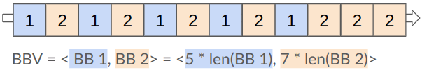

<!-- _class: title -->

## Sampled simulation with gem5

---

## Recap: What if the ROI is large

### We now know how to skip the "unimportant" part of the simulation, but what if the important part of the simulation is too too large?

<!-- some artistic image here -->

---

<!-- _class: start -->

## Sampling

---

## What is sampling

There are two major types of sampling:

1. Targeted sampling
2. Statistical sampling

---

## Targeted Sampling

Representative methodologies: SimPoint, LoopPoint
<!-- _class: center-image -->

Targeted sampling selects samples based on specific characteristics that are discovered by analysis.

---

## More about Targeted Sampling

Well-known simulation sampling methods that use the targeted sampling approach include **SimPoint** and **LoopPoint**.​

Both methods divided the whole program execution into regions that each executes a fixed number of instructions.
They record the basic block execution pattern inside each region to be the signature of the program behavior for the region. It's known as the **basic block vector**. Here is an example of a basic block vector.
<!-- _class: center-image -->

They use the basic block vectors to cluster and find the representative regions. They will predict the overall performance of the program by collecting only the representative regions' performance and sum them with weights.

---

## Statistical Sampling
<!-- _class: center-image -->
Representative methodologies: SMARTS, FSA

Statistical sampling, as the name suggests, statistically selects its sampling units.

---

## More about Statistical Sampling

The representative simulation sampling methods in statistical sampling include **SMARTS** and **FSA**.

​Both methods periodically or randomly simulated in detailed for a small amount of execution throughout the whole program execution, and fast-forward between the detailed simulations.
They use the performance of the randomly distributed samples to predict the overall performance of the whole program execution.

---

## What should we know before we apply the techinuqes

<!-- warn people that different types of samplings guarentee different things -->
### No matter how great a tool or a technique is, misusing it can be DANGEROUS

Before using any of the sampling techiques, we need to make sure the sampling techique works for our experiments.
For example, SimPoint is designed to work with single-threaded workloads only, so **if our experiments require multi-threaded workloads, we should NOT use SimPoint with them.**
<!-- _class: center-image -->

---

## What gem5 offers

In gem5, we have infrastructures for

1. SimPoint ([paper](https://cseweb.ucsd.edu/~calder/papers/ASPLOS-02-SimPoint.pdf))
2. LoopPoint ([paper](https://alenks.github.io/pdf/looppoint_hpca2022.pdf))
3. ElFie ([paper](https://heirman.net/papers/patil2021elfies.pdf))
4. SMARTS ([paper](https://web.eecs.umich.edu/~twenisch/papers/isca03.pdf))
5. FSA ([paper](https://ieeexplore.ieee.org/document/7314164)) (Might not be supported officially)

---

<!-- _class: start -->

## Targeted Sampling in gem5

---

## Targeted Sampling in gem5

- gem5 provides infrastructures for **SimPoint** and **LoopPoint** to analyze the program, take checkpoints for the representative regions, and run the representative regions.
Note that LoopPoint's analysis support is not currently supported in gem5 24.0 but is tested and prepared to be upstream to gem5 24.1.
- gem5 also provides infrastructures for **ElFies** to be executed in SE mode, but gem5 does not support creating ElFies files and information.

---

## SimPoint

As mentioned before, there are three steps in using SimPoint:

1. Analysis
2. Taking checkpoints
3. Run the regions

There are two key files related to using SimPoint in gem5:
1. [src/python/gem5/utils/simpoint.py](https://github.com/gem5/gem5/blob/stable/src/python/gem5/utils/simpoint.py)
2. [src/cpu/simple/probes/SimPoint.py](https://github.com/gem5/gem5/blob/stable/src/cpu/simple/probes/SimPoint.py)

We will step through them in this section

---

## SimPoint Analysis

In gem5, we use the `SimPoint` probe listener object to collect the information SimPoint needed to cluster the regions.
This object is defined in [src/cpu/simple/probes/SimPoint.py](https://github.com/gem5/gem5/blob/stable/src/cpu/simple/probes/SimPoint.py).

The `SimPoint` probe listener has two parameters: [interval](https://github.com/gem5/gem5/blob/stable/src/cpu/simple/probes/SimPoint.py#L47) and [profile_file](https://github.com/gem5/gem5/blob/stable/src/cpu/simple/probes/SimPoint.py#L48).

- The `interval` takes in a length as our definition of a region. It means that every time we execute n number of instructions, we see it as the end of a region. The default length is 100,000,000.
- The `profile_file` takes in a name for the output zip file. The default name is "simpoint.bb.gz".

In order to use this probe listener object, we need to attach it to an ATOMIC CPU. It will start collecting information as soon as the simulation starts and stops when the simulation ends.
After exiting the simulation, there will be a zip file with the basic block vector information for each region under the simulation outdir directory.

---

## SimPoint Analysis example

---

## ElFie

---

## ElFie example

---

## SMARTS

---

## SMARTS example

---

## Summary
