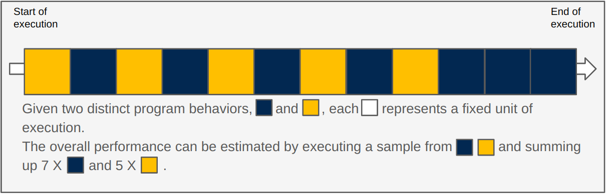
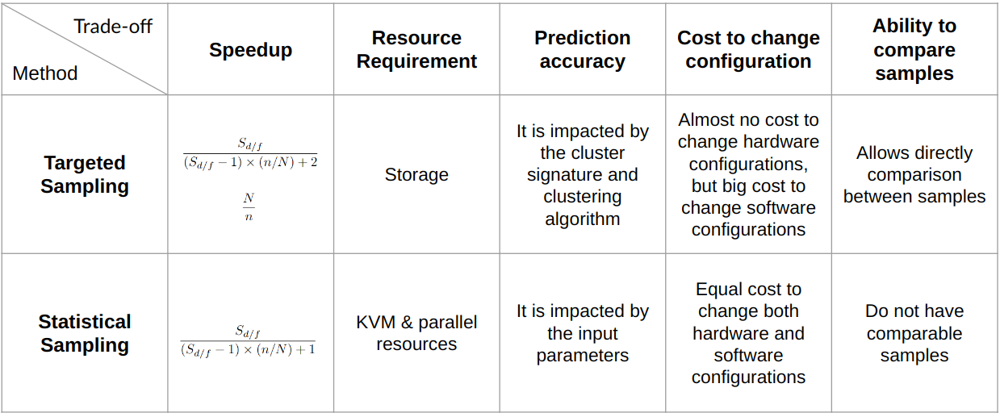

<!-- _class: title -->

## Sampled simulation with gem5

---


<!-- _class: center-image -->

## What if the ROI is large

### We now know how to skip the "unimportant" part of the simulation, but what if the important part of the simulation is too large?
### We now know how to skip the "unimportant" part of the simulation, but what if the important part of the simulation is too large?

What if we are not facing this


but actually facing this


---

<!-- _class: start -->

## Sampling

---

## What is sampling?

There are two major types of sampling:

1. Targeted sampling
2. Statistical sampling

---

## Targeted Sampling

Representative methodologies: SimPoint, LoopPoint
<!-- _class: center-image -->


Targeted sampling selects samples based on specific characteristics that are discovered by analysis.

---

## More About Targeted Sampling

Well-known simulation sampling methods that use the targeted sampling approach include **SimPoint** and **LoopPoint**.​

Both methods divide the whole program execution into regions that each execute a fixed number of instructions.

<!-- They record the basic block execution pattern inside each region as the signature of the program behavior for the region. This is known as the **basic block vector**. -->

They use **basic block vectors**, which are recordings of the execution pattern of basic blocks within a region of code and can be used to characterize program behavior.
Here is an example of a basic block vector.
<!-- _class: center-image -->


They use the basic block vectors to cluster and find the representative regions. They will predict the overall performance of the program by collecting only the representative regions' performance and sum them with weights.

---

## Statistical Sampling
<!-- _class: center-image -->
Representative methodologies: SMARTS, FSA


Statistical sampling, as the name suggests, statistically selects its sampling units.

---

## More about Statistical Sampling

The representative simulation sampling methods in statistical sampling include **SMARTS** and **FSA**.

​Both methods periodically or randomly simulate in detail for a small amount of execution throughout the whole program execution and fast-forward between the detailed simulations.

They use the performance of the randomly distributed samples to predict the overall performance of the whole program execution.

---

## What should we know before we apply the techniques

<!-- warn people that different types of samplings guarentee different things -->
### No matter how great a tool or a technique is, misusing it can be DANGEROUS

Before using any of the sampling techniques, we need to make sure the sampling technique works for our experiments.
For example, SimPoint is designed to work with single-threaded workloads only, so **if our experiments require multi-threaded workloads, we should NOT use SimPoint with them.**
<!-- _class: center-image -->


---

## What gem5 offers

In gem5, we have the infrastructure for

1. SimPoint ([paper](https://cseweb.ucsd.edu/~calder/papers/ASPLOS-02-SimPoint.pdf))
2. LoopPoint ([paper](https://alenks.github.io/pdf/looppoint_hpca2022.pdf))
3. ELFie ([paper](https://heirman.net/papers/patil2021elfies.pdf))
4. SMARTS ([paper](https://web.eecs.umich.edu/~twenisch/papers/isca03.pdf))
5. FSA ([paper](https://ieeexplore.ieee.org/document/7314164)) (Might not be supported officially)

---

<!-- _class: start -->

## Targeted Sampling in gem5

---

## Targeted Sampling in gem5

- gem5 provides infrastructure for **SimPoint** and **LoopPoint** to analyze the program, take checkpoints for the representative regions, and run the representative regions.
Note that LoopPoint analysis support is not currently supported in gem5 v24.0 but is tested and prepared to be upstream in gem5 v24.1.
- gem5 also provides the infrastructure for **ELFies** to be executed in SE mode, but gem5 does not support creating ELFie files and weight information.

---

<!-- _class: start -->

## SimPoint in gem5

---

## SimPoint

As mentioned before, there are three steps to using SimPoint:

1. Analysis
2. Taking checkpoints
3. Run the regions

There are two key files related to using SimPoint in gem5:
1. [src/python/gem5/utils/simpoint.py](https://github.com/gem5/gem5/blob/stable/src/python/gem5/utils/simpoint.py)
2. [src/cpu/simple/probes/SimPoint.py](https://github.com/gem5/gem5/blob/stable/src/cpu/simple/probes/SimPoint.py)

We will be seeing them throughout this section.

---

## SimPoint Analysis

In gem5, we use the `SimPoint` probe listener object to collect the information SimPoint needs to cluster the regions.
This object is defined in [src/cpu/simple/probes/SimPoint.py](https://github.com/gem5/gem5/blob/stable/src/cpu/simple/probes/SimPoint.py).

The `SimPoint` probe listener has two parameters: [interval](https://github.com/gem5/gem5/blob/stable/src/cpu/simple/probes/SimPoint.py#L47) and [profile_file](https://github.com/gem5/gem5/blob/stable/src/cpu/simple/probes/SimPoint.py#L48).

- The `interval` takes a length as our definition of a region. It means that every time we execute `n` number of instructions, we see it as the end of a region. The default length is 100,000,000.
- The `profile_file` takes a name for the output zip file. The default name is `simpoint.bb.gz`.

In order to use this probe listener object, we need to attach it to an ATOMIC CPU. It will start collecting information as soon as the simulation starts and will stop when the simulation ends.
After exiting the simulation, there will be a zip file with the basic block vector information for each region under the simulation outdir directory.

---

## Hands-On Time!

### 01-simpoint

All materials can be found under [materials/02-Using-gem5/09-sampling/01-simpoint](../../materials/02-Using-gem5/09-sampling/01-simpoint). The completed version is under [materials/02-Using-gem5/09-sampling/01-simpoint/complete](../../materials/02-Using-gem5/09-sampling/01-simpoint/complete).
In this exercise, we will only run scripts without modifying them.
We will only work with [materials/02-Using-gem5/09-sampling/01-simpoint/simpoint-analysis.py](../../materials/02-Using-gem5/09-sampling/01-simpoint/simpoint-analysis.py) and [materials/02-Using-gem5/09-sampling/01-simpoint/simpoint3.2-cmd.sh](../../materials/02-Using-gem5/09-sampling/01-simpoint/simpoint3.2-cmd.sh).

### Goal

1. Run the SimPoint analysis
2. Process the data to get the representative regions and their weights

---

## 01-simpoint

Because the profiling and getting the baseline performance might take a while, we will run the simulation first with the following command.

```bash
gem5 -re --outdir=full-detailed-run-m5out full-detailed-run.py
gem5 -re --outdir=simpoint-analysis-m5out simpoint-analysis.py
```

In this exercise, we are trying to create SimPoints for a simple workload.
The source code of the simple workload can be found in [materials/02-Using-gem5/09-sampling/01-simpoint/workload/simple_workload.c](../../materials/02-Using-gem5/09-sampling/01-simpoint/workload/simple_workload.c).
This simple workload allocates an array of one thousand 64 bit elements, assigns each a number, then sums it all up with one thousand iterations.
We can expect the program behavior of this workload to be really repetitive.

---

## 01-simpoint

The script [materials/02-Using-gem5/09-sampling/01-simpoint/simpoint-analysis.py](../../materials/02-Using-gem5/09-sampling/01-simpoint/simpoint-analysis.py) uses the `SimPoint` probe listener object that we introduced earlier to collect basic block information for this simple workload.
The script [materials/02-Using-gem5/09-sampling/01-simpoint/simpoint-analysis.py](../../materials/02-Using-gem5/09-sampling/01-simpoint/simpoint-analysis.py) uses the `SimPoint` probe listener object that we introduced earlier to collect basic block information for this simple workload.
It connects the ATOMIC CPU core to the `SimPoint` probe listener using

```python
processor.get_cores()[0].core.addSimPointProbe(1_000_000)
```

The definition of this `addSimPointProbe()` function can be found under [src/cpu/simple/BaseAtomicSimpleCPU.py](https://github.com/gem5/gem5/blob/stable/src/cpu/simple/BaseAtomicSimpleCPU.py#L65).

In this example, we set the `interval_length` as 1,000,000, which means that we define a region as 1,000,000 instruction executed (committed).

---

## 01-simpoint

After the simulation finishes, we will see a zip file named `simpoint.bb.gz` under the [simpoint-analysis-m5out](../../materials/02-Using-gem5/09-sampling/01-simpoint/simpoint-analysis-m5out) folder.
We can unzip it with the following command:

```bash
gzip -d -k simpoint.bb.gz
```

After unzipping it, we can look at the `simpoint.bb` file.
This file contains all basic block vector information for the simple workload.
There are 9 regions found in this workload.
Each region has a basic block vector, which starts with a `T`.

---

## 01-simpoint

As we can see, regions 2 to 9 have almost identical basic block vectors.

```bash
T:1900:222 :1901:222 :1902:999216 :1903:333
T:1900:222 :1901:222 :1902:999225 :1903:333
T:1900:222 :1901:222 :1902:999225 :1903:333
T:1900:222 :1901:222 :1902:999225 :1903:333
T:1900:222 :1901:222 :1902:999216 :1903:333
T:1900:222 :1901:222 :1902:999225 :1903:333
T:1900:222 :1901:222 :1902:999225 :1903:333
T:1900:222 :1901:222 :1902:999225 :1903:333
```

The similar basic block vectors indicate that program behavior for regions 2 to 9 are very similar. Therefore, we can expect to cluster regions 2 to 9 together and pick one region out of it to be our representative region. This region will represent the performance of all regions from region 2 to region 9.

---

## 01-simpoint

Let's further understand what this line means.

```bash
T:1900:222 :1901:222 :1902:999216 :1903:333
```

- `T` means the start of the region's basic block vector.
- `:1900:222` means that basic block 1900 executed (committed) 222 instructions. The key here is that 222 is NOT the number of times the basic block has been executed, but the number of times the basic block has been executed multiplied by the total instructions in the basic block . If we sum up all the instructions that have been executed by the basic blocks, we will get roughly the length of the region. $222+222+999216+333=999993$.

The next step is to use this information to cluster the regions and find the representative regions.
There are many methods to do it. In this exercise, we will be using the SimPoint3.2 tool that was provided by the SimPoint paper's authors. [Link](https://cseweb.ucsd.edu/~calder/simpoint/) to the tool.

---

## 01-simpoint

The tool is already compiled under [materials/02-Using-gem5/09-sampling/01-simpoint/simpoint](../../materials/02-Using-gem5/09-sampling/01-simpoint/simpoint).
We also provided a runscript with the following command in [materials/02-Using-gem5/09-sampling/01-simpoint/simpoint3.2-cmd.sh](../../materials/02-Using-gem5/09-sampling/01-simpoint/simpoint3.2-cmd.sh).

```bash
/workspaces/2024/materials/02-Using-gem5/09-sampling/01-simpoint/simpoint \
    -inputVectorsGzipped -loadFVFile simpoint-analysis-m5out/simpoint.bb.gz -k 5 -saveSimpoints \
    results.simpts -saveSimpointWeights results.weights
```

Let's look at this command.
It passes in `simpoint.bb.gz` to the tool.
It sets the number of clusters expected to 5 using `-k 5`.
It saves the SimPoint information in `results.simpts` and their weights in `results.weight`.

---

## 01-simpoint

After running the command with `./simpoint3.2-cmd.sh`, we will see the following.

```bash
#results.simpts             # results.weights
2 0                         0.666667 0
1 1                         0.222222 1
0 3                         0.111111 3
```

This means that it found 3 SimPoints out of this program.
Region 2 is SimPoint 0, which has a weight of 0.666667.
Region 1 is SimPoint 1, which has a weight of 0.222222.
Region 0 is SimPoint 3, which has a weight of 0.111111.

There are not 5 clusters because the algorithm found that 3 clusters are enough to represent all the program behaviors.
The SimPoint tag number might not be continuous because it is the tag number for the cluster.

---

## SimPoint Checkpoint

Now that we have the representative regions and their weights, we will need to find a way to get to those SimPoints.

As introduced in [08-accelerating-simulation](08-accelerating-simulation.md), there are two methods to get to the region of interest. With SimPoint, we usually use checkpointing.

To do it in gem5, we will be using [set_se_simpoint_workoad](https://github.com/gem5/gem5/blob/stable/src/python/gem5/components/boards/se_binary_workload.py#L166C9-L166C33), the [SimPoint class](https://github.com/gem5/gem5/blob/stable/src/python/gem5/utils/simpoint.py#L41), and the [simpoints_save_checkpoint_generator](https://github.com/gem5/gem5/blob/stable/src/python/gem5/simulate/exit_event_generators.py#L146).

---

## Hands-On Time!

## 01-simpoint

All materials can be found under [materials/02-Using-gem5/09-sampling/01-simpoint](../../materials/02-Using-gem5/09-sampling/01-simpoint). The completed version is under [materials/02-Using-gem5/09-sampling/01-simpoint/complete](../../materials/02-Using-gem5/09-sampling/01-simpoint/complete).
We will not be modifying any scripts.

### Goal

- Use the output file from the SimPoint3.2 tool to create checkpoints for all 3 SimPoints

Because it might take some time to take the checkpoints, let's start taking checkpoints with the following command:

```bash
gem5 -re --outdir=simpoint-checkpoint-m5out simpoint-checkpoint.py
```

---

## 01-simpoint

Let's look at [materials/02-Using-gem5/09-sampling/01-simpoint/simpoint-checkpoint.py](../../materials/02-Using-gem5/09-sampling/01-simpoint/simpoint-checkpoint.py).

There are three key parts:

```python
# key 1: pass in the representative regions information
from gem5.utils.simpoint import SimPoint
simpoint_info = SimPoint(
    simpoint_interval=1_000_000,
    simpoint_file_path=Path("/workspaces/2024/materials/02-Using-gem5/09-sampling/01-simpoint/results.simpts"),
    weight_file_path=Path("/workspaces/2024/materials/02-Using-gem5/09-sampling/01-simpoint/results.weights"),
    warmup_interval=1_000_000
)
# key 2: pss in the SimPoint object to set up the workload
board.set_se_simpoint_workload(
    binary=BinaryResource(local_path=Path("/workspaces/2024/materials/02-Using-gem5/09-sampling/01-simpoint/workload/simple_workload").as_posix()),
    simpoint=simpoint_info
)
# key 3: register exit event handler to take the checkpoints
simulator = Simulator(
    board=board,
    on_exit_event={
        ExitEvent.SIMPOINT_BEGIN: simpoints_save_checkpoint_generator(dir, simpoint_info)
    },
)
```

---

## 01-simpoint

Let's zoom in to key 1.

```python
from gem5.utils.simpoint import SimPoint
simpoint_info = SimPoint(
    simpoint_interval=1_000_000,
    simpoint_file_path=Path("/workspaces/2024/materials/02-Using-gem5/09-sampling/01-simpoint/results.simpts"),
    weight_file_path=Path("/workspaces/2024/materials/02-Using-gem5/09-sampling/01-simpoint/results.weights"),
    warmup_interval=1_000_000
)
```

The name of the parameters for `simpoint_interval`, `simpoint_file_path`, and `weight_file_path` should speak for themselves, but `warmup_interval` is new to us in this section.
As mentioned in [08-accelerating-simulation](08-accelerating-simulation.md), we should expect most of the micro-architectural states to be cold when restoring a checkpoint. Therefore, we need to reserve a warm up period for our region of interest to warm up the micro-architectural states of the system.
As such, we need to set up a `warmup_interval` value here, so when we restore the checkpoint, we can expect to have this length of simulation to warm up our micro-architectural states.

---

## 01-simpoint

The SimPoint class can also detect how much space we have for the warm up period. If there is not enough space, it will automatically shrink the warm up period of that SimPoint to the space available. For example, if we have a SimPoint that starts at the beginning of the program, then the warm up period for it should be 0 instructions.

The SimPoint class also automatically sorts the SimPoints based on when they start in terms of instructions.

It also provides getter functions that might be helpful, such as `get_weight_list()` that returns the list of the weights for each SimPoint.

More information can be found in the [SimPoint](https://github.com/gem5/gem5/blob/stable/src/python/gem5/utils/simpoint.py) class definition.

---

## 01-simpoint

Let's just trust keys 2 and 3 because they both rely on the information passed in from the `SimPoint` object.

We can declare where we want to store the SimPoint checkpoints by passing in the destination path to the `simpoints_save_checkpoint_generator` as a parameter. For more details, we can find the generator in [src/python/gem5/simulate/exit_event_generators.py](https://github.com/gem5/gem5/blob/stable/src/python/gem5/simulate/exit_event_generators.py#L146).

---

## 01-simpoint

After we finish checkpointing, we should find all of the SimPoint checkpoints under [materials/02-Using-gem5/09-sampling/01-simpoint/simpoint-checkpoint](../../materials/02-Using-gem5/09-sampling/01-simpoint/simpoint-checkpoint) because we pass in `simpoint-checkpoint` to the `simpoints_save_checkpoint_generator` as our directory to save the SimPoint checkpoints.

There should be three checkpoint folders called `cpt.SimPoint0`, `cpt.SimPoint1`, and `cpt.SimPoint2`.

We can now use them to run our SimPoints for the simple workload.

---

## Running SimPoint

Now we have the representative SimPoint checkpoint, we can run them with the systems we want to measure and predict the overall performance of running the whole simple workload.

SimPoint relies on the weights we got from the analysis stage to do the prediction.
The weight is calculated with

$$
\text{Weight of cluster } i = \frac{\text{Number of regions in cluster } i}{\text{Total number of regions in the workload execution}}
$$

For example, if we want to calculate the predicted IPC, we should use
$$
\text{Predicted IPC} = \sum_{i=1}^{n} (\text{Weight of cluster } i \times \text{IPC of cluster } i)
$$

---

## 01-simpoint

All materials can be found under [materials/02-Using-gem5/09-sampling/01-simpoint](../../materials/02-Using-gem5/09-sampling/01-simpoint). The completed version is under [materials/02-Using-gem5/09-sampling/01-simpoint/complete](../../materials/02-Using-gem5/09-sampling/01-simpoint/complete).
We will still not modify any scripts.

Unlike the simple systems we used for SimPoint analysis and SimPoint checkpointing, we now need to use the systems for which we actually want to measure the performance.

We will be using [materials/02-Using-gem5/09-sampling/01-simpoint/simpoint-run.py](../../materials/02-Using-gem5/09-sampling/01-simpoint/simpoint-run.py) to run our SimPoints.
For our baseline, we are using [materials/02-Using-gem5/09-sampling/01-simpoint/full-detailed-run.py](../../materials/02-Using-gem5/09-sampling/01-simpoint/full-detailed-run.py), which runs the whole simple workload with the detailed system.

Let's start by running the SimPoints before explaining how it works due to time constraints.
We provided a runscript to run all three in [materials/02-Using-gem5/09-sampling/01-simpoint/run-all-simpoint.sh](../../materials/02-Using-gem5/09-sampling/01-simpoint/run-all-simpoint.sh)

```bash
./run-all-simpoint.sh
```

---

## 01-simpoint

Let's look at [materials/02-Using-gem5/09-sampling/01-simpoint/simpoint-run.py](../../materials/02-Using-gem5/09-sampling/01-simpoint/simpoint-run.py). It has a detailed system that matches the one that is used in our baseline [materials/02-Using-gem5/09-sampling/01-simpoint/full-detailed-run.py](../../materials/02-Using-gem5/09-sampling/01-simpoint/full-detailed-run.py).
There are a few key points that we want to look at. Let's start with the ones we are familiar with.

```python
# key 1:
from gem5.utils.simpoint import SimPoint
simpoint_info = SimPoint(
    simpoint_interval=1_000_000,
    simpoint_file_path=Path("/workspaces/2024/materials/02-Using-gem5/09-sampling/01-simpoint/results.simpts"),
    weight_file_path=Path("/workspaces/2024/materials/02-Using-gem5/09-sampling/01-simpoint/results.weights"),
    warmup_interval=1_000_000
)
# key 2:
board.set_se_simpoint_workload(
    binary=BinaryResource(local_path=Path("/workspaces/2024/materials/02-Using-gem5/09-sampling/01-simpoint/workload/simple_workload").as_posix()),
    simpoint=simpoint_info,
    checkpoint=Path(f"simpoint-checkpoint/cpt.SimPoint{args.sid}")
)
```

Here, we pass in the SimPoint information and use it to set up a workload that restores the checkpoint with our target SimPoint id.

---

## 01-simpoint

<!-- _class: code-50-percent -->

```python
# key 3:
def max_inst():
    warmed_up = False
    while True:
        if warmed_up:
            print("end of SimPoint interval")
            yield True
        else:
            print("end of warmup, starting to simulate SimPoint")
            warmed_up = True
            # Schedule a MAX_INSTS exit event during the simulation
            simulator.schedule_max_insts(
                board.get_simpoint().get_simpoint_interval()
            )
            m5.stats.dump()
            m5.stats.reset()
            yield False

simulator = Simulator(
    board=board,
    on_exit_event={ExitEvent.MAX_INSTS: max_inst()},
)
```

Here is an exit event handler we defined for handling the warm up period and detailed simulation period.
It schedules an end for the SimPoint after the warm up period. It also dumps and resets the stats for detailed measurement.

---

## 01-simpoint

<!-- _class: code-60-percent -->

```python
# key 4:
warmup_interval = board.get_simpoint().get_warmup_list()[args.sid]
if warmup_interval == 0:
    warmup_interval = 1
print(f"Starting Simulation with warmup interval {warmup_interval}")
simulator.schedule_max_insts(warmup_interval)
simulator.run()

print("Simulation Done")
print(f"Ran SimPoint {args.sid} with weight {board.get_simpoint().get_weight_list()[args.sid]}")
```

Before the starting the simulation, we need to set up an exit event to indicates the end of the warm up period.
We use the `simulator.schedule_max_insts()` function to do so.
We can use `get_warmup_list()` from the `SimPoint` object to get the warm up period length for each SimPoint.
Here is one limitation of the `simulator.schedule_max_insts()` function. If it gets the value `0`, there won't be any exit event scheduled, so if the warm up period length is `0`, we have to set it to `1`.

---

## 01-simpoint

After setting up the above keys, the script is ready to run the SimPoint. Note that each simulation can only run one SimPoint.

After the running the SimPoints, we should see the output folder `simpoint0-run`, `simpoint1-run`, and `simpoint2-run`.

Also, we should have the baseline output in `full-detailed-run-m5out`.

Let's try to use the SimPoints' performance to predict the overall IPC!

We have a Python script ready to do the prediction in [materials/02-Using-gem5/09-sampling/01-simpoint/predict_overall_ipc.py](../../materials/02-Using-gem5/09-sampling/01-simpoint/predict_overall_ipc.py).

We can run it with

```python
python3 predict_overall_ipc.py
```

---

## 01-simpoint

We should see something like this

```bash
predicted IPC: 1.2577933618669999
actual IPC: 1.247741
relative error: 0.8056449108428648%
```

The Python script reads the IPC from our baseline.
It also reads the detailed simulation period's IPC from all our SimPoints' stats files.
Then it performs the calculation with

```python
predicted_ipc = 0.0
for i in range(num_simpoints):
    predicted_ipc += simpoint_ipcs[i] * simpoint_weights[i]
```
As the output suggests, the relative error between the predicted IPC and the actual baseline IPC is around 0.81%.

---

## Summary in SimPoint

Congratulations! We walked through the whole process of sampling with the SimPoint method.

Let's recap what we did:

1. Analyzing the program
2. Checkpointing the representative regions
3. Running the regions and predicting the performance

Good news: this process is very similar for the majority of the methods in targeted sampling.
Therefore, if we know how to do sampling with the SimPoint method, it should not be hard for us to use other methods, such as LoopPoint, which enable multi-threaded workload sampling.

---

<!-- _class: start -->

## LoopPoint and ELFies in gem5

---

## LoopPoint and ELFies

LoopPoint is similar to SimPoint with some key differences.

LoopPoint uses the number of times a loop is executed to mark the regions instead of using instructions executed. Therefore, we need to collect the loop execution information in the analysis stage in addition to the basic block execution information. Other than this, it is very similar to SimPoint in terms of the process (the 3 step process we did in 01-simpoint).

We will not do a detailed example on LoopPoint, but there are examples under [configs/example/gem5_library/looppoints](https://github.com/gem5/gem5/tree/stable/configs/example/gem5_library/looppoints). We have the infrastructure ready for LoopPoint checkpointing and running the LoopPoint in gem5 v24.0. The LoopPoint analysis is tested and ready to be upstream in gem5 v24.1.

---

## LoopPoint and ELFies

ELFies is a checkpointing method that creates checkpoint executables out of a large workload execution. It can be used with LoopPoint to create executables of the representative regions.

Like LoopPoint, it uses the number of times a loop has been executed to mark the beginning and the end of the region of interest, so we need that information to execute ELFies in gem5.

[Link](https://looppoint.github.io/hpca2023/) for more information about LoopPoint and ELFies.

---

## ELFies

gem5 does not produce ELFies, but we have support to run ELFies in SE mode.
All the weights and loop information should come with the ELFies workload.

We can run ELFies with the [ELFieInfo class](https://github.com/gem5/gem5/blob/stable/src/python/gem5/resources/elfie.py#L36).

There is an example in [materials/02-Using-gem5/09-sampling/02-elfies/run-elfies.py](../../materials/02-Using-gem5/09-sampling/02-elfies/run-elfies.py)

We can run it with the following command but it is not suggested because it will take too long.

```bash
gem5 -re run-elfies.py
```

It is a 8-threaded experiment with a detailed system that might run for eight hundred million instructions so it will take some time to finish.
We have a completed m5out under the [materials/02-Using-gem5/09-sampling/02-elfies/complete/m5out](../../materials/02-Using-gem5/09-sampling/02-elfies/complete/m5out) if you are interested in looking at the output.

---

## ELFies Example

We provide some ELFie workloads, such as [wrf-s.1_globalr13](https://resources.gem5.org/resources/wrf-s.1_globalr13?version=1.0.0), in gem5 resources. Its marker (loop execution) information can be found in [elfie-info-wrf-s.1_globalr13](https://resources.gem5.org/resources/elfie-info-wrf-s.1_globalr13/raw?database=gem5-resources&version=1.0.0).

We can set up the ELFies workload as a normal executable.

```python
board.set_se_binary_workload(
    binary=obtain_resource("wrf-s.1_globalr13")
)
```

Then, we can set up the beginning and end marker with

```python
from gem5.resources.elfie import ELFieInfo
elfie = ELFieInfo(start = PcCountPair(int("0x100b643",0),1), end = PcCountPair(int("0x526730",0),297879) )
elfie.setup_processor(
    processor = processor
)
```

---

## ELFies Example
<!-- _class: code-60-percent -->

After getting to the beginning and end markers, the simulator will raise a  `SIMPOINT_BEGIN` exit event. However, there is no default exit event handler for this, so we will need to define our own.

```python
def start_end_handler():
    # This is a generator to handle exit event produced by the
    # start marker and end marker.
    # When we reach the start marker, we reset the stats and
    # continue the simulation.
    print(f"reached {targets[0]}\n")
    print("now reset stats\n")
    m5.stats.reset()
    print("fall back to simulation\n")
    yield False
    # When we reach the end marker, we dump the stats to the stats file
    # and exit the simulation.
    print(f"reached {targets[1]}\n")
    print("now dump stats and exit simulation\n")
    m5.stats.dump()
    yield True

simulator = Simulator(
    board=board,
    on_exit_event={
        ExitEvent.SIMPOINT_BEGIN : start_end_handler()
    }
)
```

---

## Summary of LoopPoint and ELFies

After we finish running all of the ELFies for a macro-benchmark, we can use the weights provided by the ELFie files to predict the overall performance like we did for the SimPoint example.

Now we covered all the targeted sampling methods that are supported in gem5, let's dive into statistical sampling!

---

<!-- _class: start -->

## Statistical Sampling in gem5

---

## SMARTS

SMARTS is one of the statical sampling methods.

It uses a statistical model to predict the overall performance with randomly or periodically selected samples.
We use small samples distributed throughout the whole program execution to predict the average performance. We can also use the average performance to predict the overall performance, such as runtime.

Before running the simulation, we need to decide a few statistical parameters.

- `n`: the number of the samples. It is a number of count.
- `k`: the systematic sampling interval. It is a number of count.
- `U`: the sampling unit size. It is a number of the instructions to execute.
- `W`: the length of the detailed warm up period. It is a number of the instructions to execute.

<!-- add a visualization here -->

---

## Hands-On Time

### 03-SMARTS

All materials can be found under [materials/02-Using-gem5/09-sampling/03-SMARTS](../../materials/02-Using-gem5/09-sampling/03-SMARTS). The completed version is under [materials/02-Using-gem5/09-sampling/03-SMARTS/complete](../../materials/02-Using-gem5/09-sampling/03-SMARTS/complete).
We will not modify any scripts.

[materials/02-Using-gem5/09-sampling/03-SMARTS/SMARTS.py](../../materials/02-Using-gem5/09-sampling/03-SMARTS/SMARTS.py) is an example of how to use exit event handler to perform SMARTS.

We can run it with the following command

```bash
gem5 -re SMARTS.py
```

This script will use SMARTS on the workload from 01-simpoint, so we can use the baseline performance from [materials/02-Using-gem5/09-sampling/01-simpoint/full-detailed-run.py](../../materials/02-Using-gem5/09-sampling/01-simpoint/full-detailed-run.py) to validate our predicted performance using SMARTS.

---

## 03-SMARTS

Let's look at the `smarts_generator` with the statistical parameters.

- `n`: the number of the samples. It is a number of count.
- `k`: the systematic sampling interval. It is a number of count.
- `U`: the sampling unit size. It is a number of instructions executed.
- `W`: the length of the detailed warm up period. It is a number of instructions executed.


---

## 03-SMARTS

In order to determine `k` and `W`, we first need to determine our ideal `n`.
In the SMARTS paper, they define a large sample size as $n > 30$. For this exercise, let's set our ideal `n` as 50.
After setting up the ideal `n`, we can use it with the instructions executed in the workload to determine the ideal `k`.
Here is an example of how it can be done in Python.

```python
program_length = 9115640
ideal_region_length = math.ceil(program_length/50)
ideal_U = 1000
ideal_k = math.ceil(ideal_region_length/ideal_U)
ideal_W = 2 * ideal_U
```

With these parameters, we will have about 50 samples. Each sample has a gap $(k-1)*U=182000$ instructions from each other. Each sample has 1000 instructions in detailed measurement and 2000 instructions of warm up period.

---

## 03-SMARTS

This SMARTS exit generator only works with SwitchableProcessor.
When it reaches to the start of the detailed warmup part, it resets the stats; then it switches the core type and schedule for the end of the warmup part and the end of the interval. When it reaches to the end of the detailed warmup part, it resets the stats. When it reaches to the end of the detailed simulation, it dumps the stats; then it switches the core type and schedule for the start of the next detailed warmup part.


---

## 03-SMARTS

Now we understand what the `smarts_generator` will do, let's look at the system we are using in [materials/02-Using-gem5/09-sampling/03-SMARTS/SMARTS.py](../../materials/02-Using-gem5/09-sampling/03-SMARTS/SMARTS.py).

It uses exactly the same system as  [materials/02-Using-gem5/09-sampling/01-simpoint/full-detailed-run.py](../../materials/02-Using-gem5/09-sampling/01-simpoint/full-detailed-run.py), except that it uses a `SimpleSwitchableProcessor` to switch between ATOMIC CPU and O3 CPU for fast-forwarding and detailed simulation.

If the simulation is run with

```bash
gem5 -re SMARTS.py
```

we can run [materials/02-Using-gem5/09-sampling/03-SMARTS/predict_ipc.py](../../materials/02-Using-gem5/09-sampling/03-SMARTS/predict_ipc.py) to predict the overall IPC and calculate the relative error with the baseline IPC.

```bash
python3 predict_ipc.py
```

---

## 03-SMARTS

What [materials/02-Using-gem5/09-sampling/03-SMARTS/predict_ipc.py](../../materials/02-Using-gem5/09-sampling/03-SMARTS/predict_ipc.py) does is read the IPC from each sample, sum the IPCs, and divide by the total number of samples to calculate the average IPC of the program.

$\text{Average IPC} = \frac{\sum_{i=1}^{n} \text{IPC}_i}{n}$

Here is what we expect to see

```bash
Number of samples: 50
Predicted Overall IPC: 1.2563117400000001
Actual Overall IPC: 1.247741
Relative Error: 0.6869005667041583%
```
As the output suggests, the relative error between the predicted IPC and the actual baseline IPC is around 0.69%.

---

## Summary
<!-- _class: center-image -->

Now we experimented both targeted and statistical sampling in gem5, let's end it with the trade-offs.



---

## Question in Mind

### When we run the SimPoints, we need to run a separate simulation for each SimPoint. What if we could do it all in one simulation?

<!-- throw a hook to 11-multisim.md -->
