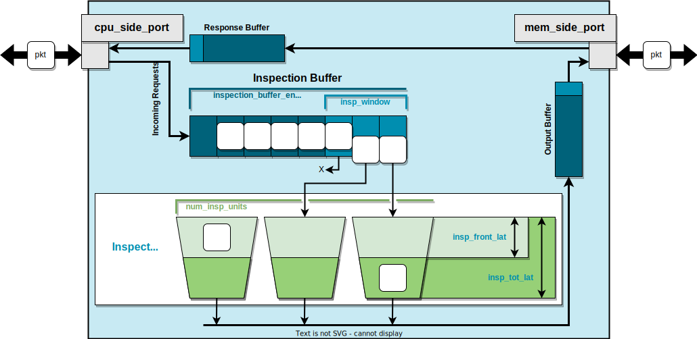

<!-- _class: title -->

## Modeling memory objects in gem5: Ports

**IMPORTANT**: This slide deck builds on top of what has already been developed in [Introduction to SimObjects](01-sim-objects-intro.md), [Debugging gem5](02-debugging-gem5.md), and [Event Driven Simulation](03-event-driven-sim.md).

---

- Idea of ports (request/response), packets, interface
- A simple memory object that forwards things
- Connecting ports and writing config files
- Adding stats to a SimObject
- Modeling bandwidth and latency with events

---

## Ports

In gem5, `SimObjects` can use `Ports` to send/request data. `Ports` are gem5's **main interface to the memory**. There are two types of `Ports` in gem5: `RequestPort` and `ResponsePort`.

As their names would suggest:

- `RequestPorts`  make `requests` and await `responses`.
- `ResponsePorts` await `requests` and send `responses`.

Make sure to differentiate between `request`/`response` and `data`. Both `requests` and `response` could have `data` with them.

---

## Packets

`Packets` are the facility that make communication through port happen. They can be `request` or `response`. **NOTE**: `Packet` in gem5 can change from a `request` to `response`. This happens when the `request` arrives at the `SimObject` that can respond to it.

Every `Packet` has the following fields:

- `Addr`: Address of the memory location being accessed.
- `Data`: Data associated with the `Packet` (data that `Packet` carries).
- `MemCmd`: It denotes what the `Packet` should do. Examples include: `readReq`/`readResp`/`writeReq`/`writeResp`.
- `RequestorID`: ID for the `SimObject` that created the request (requestor).

---
<!-- _class: code-50-percent -->

## Ports in gem5

Let's take a look at `src/mem/port.hh` to see the declaration for `Port` classes.

Let's focus on the following functions. These functions make the communication possible. Notice how `recvTimingReq` and `recvTimingResp` are `pure virtual` functions. This means that you can **not** instantiate an object of `RequestPort` or `ResponsePort` and have to extend them to implement them based on your use case.

```cpp
class RequestPort {
  ...
  public:
    bool sendTimingReq(PacketPtr pkt);
    // inherited from TimingRequestProtocol in `src/mem/protocol/timing.hh`
    virtual bool recvTimingResp(PacketPtr pkt) = 0;
    virtual void sendRetryResp();
   ...
};

class ResponsePort {
  ...
  public:
    bool sendTimingResp(PacketPtr pkt);
    // inherited from TimingResponseProtocol in `src/mem/protocol/timing.hh`
    virtual bool recvTimingReq(PacketPtr pkt) = 0;
    virtual void sendRetryReq();
   ...
};
```

---

## Access Modes: Timing, Atomic, Functional

`Ports` allow 3 modes of accessing the memory.

1- In `timing` mode, accesses advance simulator time. In this mode, `request` propagate down the memory hierarchy while each level imposes its latency and can potentially interleave processing of multiple requests. This mode is the only realistic mode in accessing the memory.
2- In `atomic` mode, accesses do not directly advance simulator time, rather it's left the **original** `requestor` to move simulator time. Accesses are done atomically (are **not** interleaved). This access mode is useful for fast-forwarding simulation.
3- In `functional` mode, access to the memory are done through a chain of function calls. `Functional` mode does not advance simulator time. All accesses are done in series and are not interleaved. This access mode is useful for initializing simulation from files, talking from the host to the simulator.

---

## Timing Protocol in Action

**IMPORTANT**: A `Port` can only be connected to **one other** `Port` that is of a different type, `RequestPort`/`ResponsePort` can only be connected to `ResponsePort`/`RequestPort`. If you look at `src/mem/port.hh` you'll see that class `RequestPort` has `private` member called `ResponsePort* _responsePort` that holds a pointer to the `ResponsePort` the `RequestPort` object is connected to (its `peer`). Moreover, if you look at the definition of `sendTimingReq`/`sendTimingResp` in `src/mem/port.hh` you'll see that they will call and return `peer::recvTimingReq`/`peer::recvTimingResp`.

Now let's look at 2 scenarios for communication, in these scenarios let's assume:

- `Requestor` is a `SimObject` that has a `RequestPort`.
- `Responder` is a `SimObject` that has a `ReponsePort`.

**NOTE**: Note that while in our scenarios `Requestor` and `Responder` have one `Port`, `SimObjects` can have multiple ports of different types.

---
<!-- _class: center-image -->

## Scenario: Everything Goes Smoothly: Diagram


---

## Scenario: Everything Goes Smoothly

In this scenario:

1- `Requestor` sends a `Packet` as the `request` (e.g. `readReq`). In C++ terms `Requestor::RequestPort::sendTimingReq` is called which in turn calls `Responder::ResponsePort::recvTimingReq`.
2- `Responder` is not busy and accepts the `request`. In C++ terms `Responder::ResponsePort::recvTimingReq` returns true. Since `Requestor` has received true, it will receive a `response` in the future.
3- Simulator time advances, `Requestor` and `Responder` continues execution. When `Responder` has the `response` (e.g. `readResp`) ready, it will send the `response` to the `requestor`. In C++ terms `Responder::ResponsePort::sendTimingResp` is called which in turn calls `Requestor::RequestPort::recvTimingResp`.
4- `Requestor` is not busy and accepts the `response`. In C++ terms `Requestor::RequestPort::recvTimingResp` returns true. Since `Responder` has received true, the transaction is complete.

---

## Scenario: Responder Is Busy: Diagram

---

## Scenario: Responder Is Busy

In this scenario:

1- `Requestor` sends a `Packet` as the `request` (e.g. `readReq`).
2- `Responder` is busy and rejects the `request`. In C++ terms `Responder::ResponsePort::recvTimingReq` returns false. Since `Responder` returned false. Since `Requestor` has received true, it waits for a `retry request` from `Responder`.
3- When `Responder` becomes available (is not busy anymore), it will send a `retry request` to `Requestor`. In C++ terms `Responder::ResponsePort::sendReqRetry` is called which in turn calls `Requestor::RequestPort::recvReqRetry`.
4- `Requestor` sends the `blocked Packet` as the `request` (e.g. `readReq`).
5- `Responder` is not busy and accepts the `request`.
6- Simulator time advances, `Requestor` and `Responder` continue execution. When `Responder` has the `response` ready it will send the `response` to the `requestor`.
7- `Requestor` is not busy and can accept the `response`.

---

## Other Scenarios

There are two other possible scenarios:

1- A scenario where the `Requestor` is busy.
2- A scenario where both `Requestor` and `Responder` are busy.

**CAUTION**: Scenarios where `Requestor` is busy should not happen normally. In reality, the `Requestor` makes sure it can receive the `response` for a `request` when it sends the request. I have never run into a situation where I had to design my `SimObjects` in a way that the `Requestor` will return false when `recvTimingResp` is called. That's not to say that if you find yourself in a situation like this, you have done something wrong; BUT I would look really hard into my code/design and verify I'm simulating something realistic.

You can find the ladder diagrams for scenario 1 and 2 in the next slide.

---

## Other Scenarios: Diagrams

---

## InspectorGadget

In this step, we will implement our new `SimObject` called `InspectorGadget`. `InspectorGadget` will monitor all the traffic to the memory and make sure all the traffic is safe. In this tutorial, we will do this in multiple steps as laid out below.

- Step 1: We will implement `InspectorGadget` to forward traffic from CPU to memory and back, causing latency for queueing traffic.
- Step 2: We will extend `InspectorGadget` to reject traffic to a certain address. It will return **all zeroes** for read traffic and ignore write traffic. To do this it will have to *inspect* the traffic, causing further delay (for `1 cycle`) for inspection.
- Step 3: We will extend `InpsectorGadget` like below:
  - It will do multiple inspection every cycle, resulting in higher traffic throughput.
  - It will expose `inspection_latency` as a parameter.
- Step 4: We will extend `InspectorGadget` to allow for pipelining of the inspections.

---

## InspectorGadget: Diagram

Here is a diagram of what `InspectorGadget` will look like eventually.



---
<!-- _class: start -->

## Step 1: Buffering Traffic

---
<!-- _class: code-60-percent -->

## ClockedObject

A `ClockedObject` is a child class of `SimObject` that provides facilities for managing time in `cycles`. Every `ClockedObject` has a `clk_domain` parameter that defines its clock frequency. Using the `clk_domain`, the `ClockedObject` provides functionalities like below:

- `clockEdge(Cycles n)`: A function that returns the time of the `nth` clock edge into the future.
- `nextCycle()`: A function that return the time of first clock edge into the future, i.e. `nextCycle() := clockEdge(Cycles(1))`.

This class is defined in `src/sim/clocked_object.hh` as shown below:

```cpp
class ClockedObject : public SimObject, public Clocked
{
  public:
    ClockedObject(const ClockedObjectParams &p);

    /** Parameters of ClockedObject */
    using Params = ClockedObjectParams;

    void serialize(CheckpointOut &cp) const override;
    void unserialize(CheckpointIn &cp) override;

    PowerState *powerState;
};
```

---

## InspectorGadget: Adding Files

Now let's go ahead and create a `SimObject` declaration file for `InspectorGadget`. Do it by running the following commands in the base gem5 directory.

```sh
mkdir bootcamp/inpsector-gadget
touch bootcamp/inspector-gadget/InspectorGadget.py
```

Now, let's also create a `SConscript` for registering `InspectorGadget`. Do it by running the following command in the base gem5 directory.

```sh
touch bootcamp/inspector-gadget/SConscript
```

---

## InspectoGadget: SimObject Declaration File

Now, inside `InspectorGadget.py`, let's define `InspectorGadget` as a `ClockedObject`. To do that, we need to import `ClockedObject`. Do it by adding the following line to `src/bootcamp/inspector-gadget/InspectorGadget.py`.

```python
from m5.objects.ClockedObject import ClockedObject
```

The remaining part of the declaration is for now similar to that of `HelloSimObject` in [Introduction to SimOjbects](01-sim-objects-intro.md). Do that part on your own. When you are done, you can find my version of the code in the next slide.

---

## InspectorGadget: SimObject Declaration File So Far

This is how `src/bootcamp/inspector-gadget/InspectorGadget.py` should look like now:

```python
from m5.objects.ClockedObject import ClockedObject

class InspectorGadget(ClockedObject):
    type = "InspectorGadget"
    cxx_header = "bootcamp/inspector-gadget/inspector_gadget.hh"
    cxx_class = "gem5::InspectorGadget"
```

---

## InspectorGadget: Ports in Python

So far we have looked at the declaration of `Ports` in C++. However, to create an instance of a C++ class in Python we need a declaration of that class in Python. `Ports` are defined under `src/python/m5/params.py`. However, `Ports` do not inherit from class `Param`. I strongly recommend that you take a short look at `src/python/m5/params.py`.

Try to find what kind of parameters you can add to any `SimObject`/`ClockedObject`.

Our next step is to define a `RequestPort` and a `ResponsePort` for `InspectorGadget`. To do this add the following import line to `InspectorGadget.py`.

```python
from m5.params import *
```

**NOTE**: My personal preference in python is to import modules very explicitly. However, when importing `m5.params`, I think it's ok to do import `*`. This is mainly because, when I'm creating `SimObjects`, I might need different kinds of parameters that I might not know about in advance.

---

## InspectorGadget: Adding Ports

Now, let's finally add two ports two `InspectorGadget`; One port will be on the side where the CPU would be in the computer system and one port will be on the side where the memory would be. Therefore, let's call them `cpu_side_port` and `mem_side_port` respectively.

**Question**: What type should `cpu_side_port` and `mem_side_port` be?

Before looking at the answer, try to answer the question for yourself.

**Answer**: `cpu_side_port` should be a `ResponsePort` and `mem_side_port` should be a `RequestPort`.

Make sure this answer makes sense to you, before moving on to the next slide.

---

## InspectorGadget: Adding Ports cont.

Add the following two lines under the declaration of `InspectorGadget` to add `cpu_side_port` and `mem_side_port`.

```python
    cpu_side_port = ResponsePort("ResponsePort to receive requests from CPU side.")
    mem_side_port = RequestPort("RequestPort to send received requests to memory side.")
```

Since we are going to buffer traffic, let's add a parameter for the number of entries in the internal FIFO. Our naming will be forward looking since we know that we will eventually call it the `inspectionBuffer`; Therefore, let's call it `inspection_buffer_entries`. Do it by adding the following line under the declaration of `InspectorGadget`.

```python
inspection_buffer_entries = Param.Int("Number of entries in the inspection buffer.")
```

---

## InspectorGadget: SimObject Declaration File

This is how `src/bootcamp/inspector-gadget/inspector_gadget.hh` should look like now.

```python
from m5.objects.ClockedObject import ClockedObject
from m5.params import *


class InspectorGadget(ClockedObject):
    type = "InspectorGadget"
    cxx_header = "bootcamp/inspector-gadget/inspector_gadget.hh"
    cxx_class = "gem5::InspectorGadget"

    cpu_side_port = ResponsePort("ResponsePort to received requests from CPU side.")
    mem_side_port = RequestPort("RequestPort to send received requests to memory side.")

    inspection_buffer_entries = Param.Int("Number of entries in the inspection buffer.")

```
---

## Updating SConscript

Remember to register `InspectorGadget` as a `SimObject` as well as a `DebugFlag` for it. in `src/bootcamp/inspector-gadget/inspector_gadget.hh`.

**NOTE**: In the next steps we will create `inspector_gadget.hh` and `inspector_gadget.cc`.

This is how `src/bootcamp/inspector-gadget/SConscript` should look like.

```python
Import("*")

SimObject("InspectorGadget.py", sim_objects=["InspectorGadget"])

Source("inspector_gadget.cc")

DebugFlag("InpsectorGadget")
```

---
