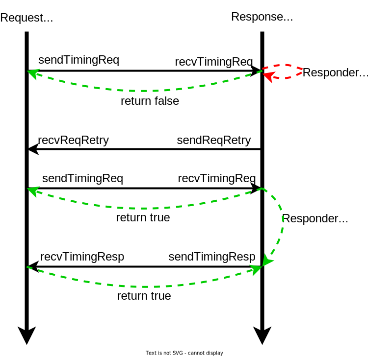

<!-- _class: title -->

## Modeling memory objects in gem5: Ports

**IMPORTANT**: This slide deck builds on top of what has already been developed in [Introduction to SimObjects](./01-sim-objects-intro.md), [Debugging gem5](./02-debugging-gem5.md), and [Event Driven Simulation](./03-event-driven-sim.md).

---

## Ports

In gem5, `SimObjects` can use `Ports` to send/request data. `Ports` are gem5's **main interface to the memory**. There are two types of `Ports` in gem5: `RequestPort` and `ResponsePort`.

As their names would suggest:

- `RequestPorts`  make `requests` and await `responses`.
- `ResponsePorts` await `requests` and send `responses`.

Make sure to differentiate between `request`/`response` and `data`. Both `requests` and `response` can carry `data` with them.

---
<!-- _class: two-col code-50-percent -->

## Packets

`Packets` facilitate communication through ports. They can be either `request` or `response` packets.
> **NOTE**: `Packet` in gem5 can change from a `request` to a `response`. This happens when the `request` arrives at a `SimObject` that can respond to it.

Every `Packet` has the following fields:

- `Addr`: Address of the memory location being accessed.
- `Data`: Data associated with the `Packet` (the data that `Packet` carries).
- `MemCmd`: Denotes the kind of `Packet` and what it should do.
  - Examples include: `readReq`/`readResp`/`writeReq`/`writeResp`.
- `RequestorID`: ID for the `SimObject` that created the request (requestor).

Class `Packet` is defined in [`gem5/src/mem/packet.hh`](../../gem5/src/mem/packet.hh). ‍Note that, in our tutorial, we will deal with `Packet` in pointers. `PacketPtr` is a type in gem5 that is equivalent to `Packet*`.

---
<!-- _class: no-logo code-50-percent -->

## Ports in gem5

Let's take a look at [`gem5/src/mem/port.hh`](../../gem5/src/mem/port.hh) to see the declarations for `Port` classes.

Let's focus on the following functions. These functions make communication possible. Notice how `recvTimingReq` and `recvTimingResp` are `pure virtual` functions. This means that you can **not** instantiate an object of `RequestPort` or `ResponsePort` and instead you must extend them to fit your use case.

```cpp
class RequestPort {
  ...
  public:
    bool sendTimingReq(PacketPtr pkt);
    // inherited from TimingRequestProtocol in `src/mem/protocol/timing.hh`
    virtual bool recvTimingResp(PacketPtr pkt) = 0;
    virtual void sendRetryResp();
   ...
};

class ResponsePort {
  ...
  public:
    bool sendTimingResp(PacketPtr pkt);
    // inherited from TimingResponseProtocol in `src/mem/protocol/timing.hh`
    virtual bool recvTimingReq(PacketPtr pkt) = 0;
    virtual void sendRetryReq();
   ...
};
```

---

## Access Modes: Timing, Atomic, Functional

`Ports` allow 3 memory access modes:

1: In **`timing`** mode, accesses advance simulator time. In this mode, `requests` propagate down the memory hierarchy while each level imposes its latency and can potentially interleave processing of multiple requests. This mode is the only realistic mode in accessing the memory.
2: In **`atomic`** mode, accesses do not directly advance simulator time, rather it's left to the **original** `requestor` to move simulator time. Accesses are done atomically (are **not** interleaved). This access mode is useful for fast-forwarding simulation.
3: In **`functional`** mode, accesses to the memory are done through a chain of function calls. `Functional` mode does not advance simulator time. All accesses are done in series and are not interleaved. This access mode is useful for initializing simulation from files, i.e. talking from the host to the simulator.

---

## Timing Protocol in Action

> **IMPORTANT**: A `Port` can only be connected to **one other** `Port` and it must be of a different type: `RequestPort`/`ResponsePort` can only be connected to `ResponsePort`/`RequestPort`.

If you look at [`gem5/src/mem/port.hh`](../../gem5/src/mem/port.hh) you'll see that class `RequestPort` has a `private` member called `ResponsePort* _responsePort` that holds a pointer to the `ResponsePort` that the `RequestPort` object is connected to (its `peer`).

Moreover, if you look at the definition of `sendTimingReq`/`sendTimingResp` in [`gem5/src/mem/port.hh`](../../gem5/src/mem/port.hh) you'll see that they will call and return `peer::recvTimingReq`/`peer::recvTimingResp`.

Now let's look at 2 scenarios for communication, in these scenarios let's assume:

- `Requestor` is a `SimObject` that has a `RequestPort`.
- `Responder` is a `SimObject` that has a `ReponsePort`.

**NOTE**: Note that while in our scenarios `Requestor` and `Responder` have one `Port`, `SimObjects` can have multiple ports of different types.

---
<!-- _class: center-image -->

## Scenario: Everything Goes Smoothly


---

## Scenario: Everything Goes Smoothly

In this scenario:

1: **`Requestor`** sends a `Packet` as the `request` (e.g. a `readReq`). In C++ terms `Requestor::RequestPort::sendTimingReq` is called which in turn calls `Responder::ResponsePort::recvTimingReq`.
2: **`Responder`** is not busy and accepts the `request`. In C++ terms `Responder::ResponsePort::recvTimingReq` returns **true**. Since `Requestor` has received true, it will receive a `response` in the future.
3: Simulator time advances, `Requestor` and `Responder` continues execution. When `Responder` has the `response` (e.g. `readResp`) ready, it will send the `response` to the `requestor`. In C++ terms `Responder::ResponsePort::sendTimingResp` is called which in turn calls `Requestor::RequestPort::recvTimingResp`.
4: **`Requestor`** is not busy and accepts the `response`. In C++ terms `Requestor::RequestPort::recvTimingResp` returns true. Since `Responder` has received true, the transaction is complete.

---
<!-- _class: center-image -->

## Scenario: Responder Is Busy: Diagram



---

## Scenario: Responder Is Busy

In this scenario:

1: **`Requestor`** sends a `Packet` as the `request` (e.g. a `readReq`).
2: **`Responder`** is busy and rejects the `request`. In C++ terms `Responder::ResponsePort::recvTimingReq` returns **false**. Since `Requestor` has received false, it waits for a `retry request` from `Responder`.
3: When **`Responder`** becomes available (is not busy anymore), it will send a `retry request` to `Requestor`. In C++ terms `Responder::ResponsePort::sendReqRetry` is called which in turn calls `Requestor::RequestPort::recvReqRetry`.
4: **`Requestor`** sends the `blocked Packet` as the `request` (e.g. a `readReq`).
5: **`Responder`** is not busy and accepts the `request`.
6: Simulator time advances, `Requestor` and `Responder` continue execution. When `Responder` has the `response` ready it will send the `response` to the `Requestor`.
7: **`Requestor`** is not busy and can accept the `response`.

---

## Other Scenarios

There are two other possible scenarios:

1- A scenario where the `Requestor` is busy.
2- A scenario where both `Requestor` and `Responder` are busy.

**CAUTION**: Scenarios where `Requestor` is busy should not happen normally. In reality, the `Requestor` makes sure it can receive the `response` for a `request` when it sends the request. I have never run into a situation where I had to design my `SimObjects` in a way that the `Requestor` will return false when `recvTimingResp` is called. That's not to say that if you find yourself in a situation like this, you have done something wrong; BUT I would look really hard into my code/design and verify I'm simulating something realistic.

---

## InspectorGadget

In this step, we will implement our new `SimObject` called `InspectorGadget`. `InspectorGadget` will monitor all the traffic to the memory and make sure all the traffic is safe. In this tutorial, we will do this in multiple steps as laid out below.

- Step 1: We will implement `InspectorGadget` to forward traffic from CPU to memory and back, causing latency for queueing traffic.
- Step 2: We will extend `InspectorGadget` to *inspect* the traffic, causing further delay (for `1 cycle`) for inspection.
- Step 3: We will extend `InpsectorGadget` like below:
  - It will do multiple inspection every cycle, resulting in higher traffic throughput.
  - It will expose `inspection_latency` as a parameter.
- Step 4: We will extend `InspectorGadget` to allow for pipelining of the inspections.

---

## InspectorGadget: Diagram

Here is a diagram of what `InspectorGadget` will look like eventually.


---
<!-- _class: start -->

## Step 1: Buffering Traffic

---
<!-- _class: no-logo code-50-percent -->

## ClockedObject

A `ClockedObject` is a child class of `SimObject` that provides facilities for managing time in `cycles`. Every `ClockedObject` has a `clk_domain` parameter that defines its clock frequency. Using the `clk_domain`, the `ClockedObject` provides functionalities like below:

- `clockEdge(Cycles n)`: A function that returns the time of the `nth` clock edge into the future.
- `nextCycle()`: A function that return the time of first clock edge into the future, i.e. `nextCycle() := clockEdge(Cycles(1))`.

This class is defined in [`gem5/src/sim/clocked_object.hh`](../../gem5/src/sim/clocked_object.hh) as shown below:

```cpp
class ClockedObject : public SimObject, public Clocked
{
  public:
    ClockedObject(const ClockedObjectParams &p);

    /** Parameters of ClockedObject */
    using Params = ClockedObjectParams;

    void serialize(CheckpointOut &cp) const override;
    void unserialize(CheckpointIn &cp) override;

    PowerState *powerState;
};
```

---

## InspectorGadget: Adding Files

Now let's go ahead and create a `SimObject` declaration file for `InspectorGadget`. Do it by running the following commands:

```sh
cd /workspaces/2024/gem5/src
mkdir -p bootcamp/inspector-gadget
cd bootcamp/inspector-gadget
touch InspectorGadget.py
```

Now, let's also create a `SConscript` for registering `InspectorGadget`. Do it by running the following command:

```sh
touch SConscript
```

---

## InspectoGadget: SimObject Declaration File

Now, inside `InspectorGadget.py`, let's define `InspectorGadget` as a `ClockedObject`. To do that, we need to import `ClockedObject`. Do it by adding the following line to `InspectorGadget.py`.

```python
from m5.objects.ClockedObject import ClockedObject
```

The remaining part of the declaration is for now similar to that of `HelloSimObject` in [Introduction to SimOjbects](01-sim-objects-intro.md). Do that part on your own. When you are done, you can find my version of the code in the next slide.

---

## InspectorGadget: SimObject Declaration File So Far

This is what should be in `InspectorGadget.py` now:

```python
from m5.objects.ClockedObject import ClockedObject

class InspectorGadget(ClockedObject):
    type = "InspectorGadget"
    cxx_header = "bootcamp/inspector-gadget/inspector_gadget.hh"
    cxx_class = "gem5::InspectorGadget"
```

---

## InspectorGadget: Ports in Python

So far we have looked at the declaration of `Ports` in C++. However, to create an instance of a C++ class in Python we need a declaration of that class in Python. `Ports` are defined under [`gem5/src/python/m5/params.py`](../../gem5/src/python/m5/params.py). However, `Ports` do not inherit from class `Param`. I strongly recommend that you take a short look at [`gem5/src/python/m5/params.py`](../../gem5/src/python/m5/params.py).

Try to find what kind of parameters you can add to any `SimObject`/`ClockedObject`.

Our next step is to define a `RequestPort` and a `ResponsePort` for `InspectorGadget`. To do this add the following import line to `InspectorGadget.py`.

```python
from m5.params import *
```

**NOTE**: My personal preference in python is to import modules very explicitly. However, when importing `m5.params`, I think it's ok to do import `*`. This is mainly because, when I'm creating `SimObjects`, I might need different kinds of parameters that I might not know about in advance.

---

## InspectorGadget: Adding Ports

Now, let's finally add two ports to `InspectorGadget`; One port will be on the side where the CPU would be in the computer system and one port will be on the side where the memory would be. Therefore, let's call them `cpu_side_port` and `mem_side_port` respectively.

**Question**: What type should `cpu_side_port` and `mem_side_port` be?

Before looking at the answer, try to answer the question for yourself.

**Answer**: `cpu_side_port` should be a `ResponsePort` and `mem_side_port` should be a `RequestPort`.

Make sure this answer makes sense to you, before moving on to the next slide.

---

<!-- _class: no-logo -->

## InspectorGadget: Adding Ports cont.

Add the following two lines under the declaration of `InspectorGadget` to add `cpu_side_port` and `mem_side_port`:

```python
cpu_side_port = ResponsePort("ResponsePort to receive requests from CPU side.")
mem_side_port = RequestPort("RequestPort to send received requests to memory side.")
```

To buffer traffic, we need two FIFOs: one for `requests` (from `cpu_side_port` to `mem_side_port`) and one for `responses` (from `mem_side_port` to `cpu_side_port`). For the the FIFO in the `request` path, we know that in the future we want to *inspect* the requests. Therefore, let's call it `inspectionBuffer`; we need a parameter to determine the the number of entries in this buffer so let's call that parameter `inspection_buffer_entries`. For the `response` path, we will simply call the buffer `response_buffer` and add a parameter for its entries named `response_buffer_entries`. Do it by adding the following lines under the declaration of `InspectorGadget`:

```python
inspection_buffer_entries = Param.Int("Number of entries in the inspection buffer.")
response_buffer_entries = Param.Int("Number of entries in the response buffer.")
```

---

<!-- _class: code-80-percent -->

## InspectorGadget: SimObject Declaration File

This is what should be in `InspectorGadget.py` now:

```python
from m5.objects.ClockedObject import ClockedObject
from m5.params import *


class InspectorGadget(ClockedObject):
    type = "InspectorGadget"
    cxx_header = "bootcamp/inspector-gadget/inspector_gadget.hh"
    cxx_class = "gem5::InspectorGadget"

    cpu_side_port = ResponsePort("ResponsePort to received requests from CPU side.")
    mem_side_port = RequestPort("RequestPort to send received requests to memory side.")

    inspection_buffer_entries = Param.Int("Number of entries in the inspection buffer.")
    response_buffer_entries = Param.Int("Number of entries in the response buffer.")
```

---

## Updating SConscript

Remember to register `InspectorGadget` as a `SimObject` as well as create a `DebugFlag` for it.

To do this, put the following in `gem5/src/bootcamp/inspector-gadget/SConscript`:

```python
Import("*")

SimObject("InspectorGadget.py", sim_objects=["InspectorGadget"])

Source("inspector_gadget.cc")

DebugFlag("InspectorGadget")
```

> **NOTE**: In the next steps we will create `inspector_gadget.hh` and `inspector_gadget.cc`.

---

## InspectorGadget: C++ Files

Now, let's go ahead and create a header and source file for `InspectorGadget` in `gem5/src/bootcamp/inspector-gadget`. Remember to make sure the path to your header file matches that of what you specified in `cxx_header` in `InspectorGadget.py` and the path for your source file matches that of what you specified in `SConscript`. Run the following commands from within our `inspector-gadget` directory:

```sh
touch inspector_gadget.hh
touch inspector_gadget.cc
```

Now, let's simply declare `InspectorGadget` as a class that inherits from `ClockedObject`. This means you have to import `sim/clocked_object.hh` instead of `sim/sim_object.hh`. Let's add everything that we have added in the Python to our class except for the `Ports`.

---
<!-- _class: code-60-percent -->

## InspectorGadget: Header File

```cpp
#ifndef __BOOTCAMP_INSPECTOR_GADGET_INSPECTOR_GADGET_HH__
#define __BOOTCAMP_INSPECTOR_GADGET_INSPECTOR_GADGET_HH__

#include "params/InspectorGadget.hh"
#include "sim/clocked_object.hh"

namespace gem5
{

class InspectorGadget : public ClockedObject
{
  private:
    int inspectionBufferEntries;
    int responseBufferEntries;

  public:
    InspectorGadget(const InspectorGadgetParams& params);
};


} // namespace gem5

#endif // __BOOTCAMP_INSPECTOR_GADGET_INSPECTOR_GADGET_HH__
```

---

## InspectorGadget::align Declaration

Since we're dealing with clocks and `Ticks`, let's add a function `align` that will return the time of the next clock cycle (in `Ticks`) after a given time (in `Ticks`).

To do this add the following lines under the `private` scope of `InspectorGadget` in `inspector_gadget.hh`:

```cpp
  private:
    Tick align(Tick when);
```

---

<!-- _class: code-80-percent -->

## InspectorGadget::align Definition

To define `align`, add the following code to `inspector_gadget.cc`:

```cpp
namespace gem5
{

Tick
InspectorGadget::align(Tick when)
{
    return clockEdge((Cycles) std::ceil((when - curTick()) / clockPeriod()));
}

} // namespace gem5
```

Make sure to add the following include statement to the top of the file since we're using `std::ceil`:

```cpp
#include <cmath>
```

---

## Extending Ports

Recall, `RequestPort` and `ResponsePort` classes were abstract classes, i.e. they had `pure virtual` functions which means objects can not be instantiated from that class. Therefore, for us to use `Ports` we need to extend the classes and implement their `pure virtual` functions.

Before anything, let's go ahead and import the header file that contains the declaration for `Port` classes. We also need to include [`mem/packet.hh`](../../gem5/src/mem/packet.hh) since we will be dealing with and moving around `Packets` a lot. Do it by adding the following lines to `inspector_gadget.hh`:

```cpp
#include "mem/packet.hh"
#include "mem/port.hh"
```

> **REMEMBER** to follow the right include order based on gem5's convention.

---
<!-- _class: no-logo code-50-percent -->

## Extending ResponsePort

Now, let's get to extending `ResponsePort` class. Let's do it inside the scope of our `InspectorGadget` class to prevent using names used by other gem5 developers. Let's go ahead an create `CPUSidePort` class that inherits from `ResponsePort` in the `private` scope. To do this, add the following code to `inspector_gadget.hh`.

```cpp
  private:
    class CPUSidePort: public ResponsePort
    {
      private:
        InspectorGadget* owner;
        bool needToSendRetry;
        PacketPtr blockedPacket;

      public:
        CPUSidePort(InspectorGadget* owner, const std::string& name):
            ResponsePort(name), owner(owner), needToSendRetry(false), blockedPacket(nullptr)
        {}
        bool needRetry() const { return needToSendRetry; }
        bool blocked() const { return blockedPacket != nullptr; }
        void sendPacket(PacketPtr pkt);

        virtual AddrRangeList getAddrRanges() const override;
        virtual bool recvTimingReq(PacketPtr pkt) override;
        virtual Tick recvAtomic(PacketPtr pkt) override;
        virtual void recvFunctional(PacketPtr pkt) override;
        virtual void recvRespRetry() override;
    };
```

---

<!-- _class: no-logo -->

## Extending ResponsePort: Deeper Look

Here is a deeper look into the declaration of `CPUSidePort`.

1: `InspectorGadget* owner` is a pointer to the instance of `InspectorGadget` that owns this instance of `CPUSidePort`. We need to access the owner when we receive `requests`, i.e. when `recvTimingReq` is called.
2: `bool needToSendRetry` tells us if we need to send a `retry request`. This happens when we reject a `request` because we are busy. When we are not busy, we check this before sending a `retry request`.
3: In addition to all the functions that are used for moving packets, the class `ResponsePort` has another `pure virtual` function that will return an `AddrRangeList` which represents all the address ranges for which the port can respond. Note that, in a system, the memory addresses can be partitioned among ports. Class `RequestPort` has a function with the same name, but it is already implemented and will just ask its peer `ResponsePort` for the ranges by calling `peer::getAddrRanges`.
4: We will need to implement all of the functions that relate to moving packets -- the ones that start with `recv`. We will use `owner` to implement most of the functionality of these functions within `InspectorGadget`.
5: We'll talk about `PacketPtr blockedPacket` in the next slides.

---
<!-- _class: no-logo code-60-percent -->

## Extending RequestPort

We're going to follow a similar approach for extending `RequestPort`. Let's create class `MemSidePort` that inherits from `RequestPort`. Again we'll do it in the `private` scope of `InspectorGadget`. Do it by adding the following code to `inspector_gadget.hh`.

```cpp
  private:
    class MemSidePort: public RequestPort
    {
      private:
        InspectorGadget* owner;
        bool needToSendRetry;
        PacketPtr blockedPacket;

      public:
        MemSidePort(InspectorGadget* owner, const std::string& name):
            RequestPort(name), owner(owner), needToSendRetry(false), blockedPacket(nullptr)
        {}
        bool needRetry() const { return needToSendRetry; }
        bool blocked() const { return blockedPacket != nullptr; }
        void sendPacket(PacketPtr pkt);

        virtual bool recvTimingResp(PacketPtr pkt) override;
        virtual void recvReqRetry() override;
    };
```

---

## Extending RequestPort: Deeper Look

Let's take a deeper look into what we added for class `MemSidePort`.

1: Like `CPUSidePort`, a `MemSidePort` instance holds a pointer to its `owner` with `InspectorGadget* owner`. We do this to access the owner when we receive `responses`, i.e. when `recvTimingResp` is called.
2: When `MemSidePort::sendTimingReq` receives false, it means the request was blocked. We track a pointer to this blocked `Packet` in `PacketPtr blockedPacket` so that we can retry the request later.
3: Function `blocked` tells us if we are blocked by the memory side, i.e. still waiting to receive a `retry request` from memory side.
4: Function `sendPacket` is a wrapper around `sendTimingReq` to give our code more structure. Notice we don't need to definte `sendTimingReq` as it is already defined by `TimingRequestProtocol`.
5: We will need to implement all of the functions that relate to moving packets -- the ones that start with `recv`. We will use `owner` to implement most of the functionality of these functions within `InspectorGadget`.

---

## Creating Instances of Ports in InspectorGadget

Now that we have declared `CPUSidePort` and `MemSidePort` classes (which are not abstract classes), we can go ahead and create an instance of each class in `InspectorGadget`. To do that, add the following two lines to `inspector_gadget.hh`

```cpp
  private:
    CPUSidePort cpuSidePort;
    MemSidePort memSidePort;
```

---
<!-- _class: code-50-percent -->

## SimObject::getPort

Let's take a look at [`gem5/src/sim/sim_object.hh`](../../gem5/src/sim/sim_object.hh) again. Below is a snippet of code from the declaration of the function `getPort` in the class `SimObject`.

```cpp
  public:
/**
     * Get a port with a given name and index. This is used at binding time
     * and returns a reference to a protocol-agnostic port.
     *
     * gem5 has a request and response port interface. All memory objects
     * are connected together via ports. These ports provide a rigid
     * interface between these memory objects. These ports implement
     * three different memory system modes: timing, atomic, and
     * functional. The most important mode is the timing mode and here
     * timing mode is used for conducting cycle-level timing
     * experiments. The other modes are only used in special
     * circumstances and should *not* be used to conduct cycle-level
     * timing experiments. The other modes are only used in special
     * circumstances. These ports allow SimObjects to communicate with
     * each other.
     *
     * @param if_name Port name
     * @param idx Index in the case of a VectorPort
     *
     * @return A reference to the given port
     *
     * @ingroup api_simobject
     */
    virtual Port &getPort(const std::string &if_name, PortID idx=InvalidPortID);
```

---

## SimObject::getPort cont.

This function is used for connecting ports to each other. As far as we are concerned, we need to create a mapping between our `Port` objects in C++ and the `Ports` that we declare in Python. To the best of my knowledge, we will never have to call this function on our own.

For now, let's implement this function to return a `Port&` when we recognize `if_name` (which would be the name that we gave to a `Port` in Python) and, otherwise, we will pass this up to the parent class `ClockedObject` to handle the function call.

Let's go ahead an add the declaration for this function to `inspector_gadget.hh`.

```cpp
  public:
    virtual Port& getPort(const std::string& if_name, PortID idxInvalidPortID);
```

---

## Enough with the Declarations! For Now!

So far, we have declared quite a few functions that we need to implement. Let's start defining some of them. In the next several slides, we will be defining functions from `CPUSidePort` and `MemSidePort`, as well as `getPort` from `InspectorGadget`.

Open `inspector_gadget.cc` and let's start by adding  the following include statements:

```cpp
#include "bootcamp/inspector-gadget/inspector_gadget.hh"

#include "debug/InspectorGadget.hh"
```

As we start defining functions, we will likely find the need to declare and define more functions. To keep things organized, let's just note them down as we go. We will then go back to declaring and defining them.

---
<!-- _class: no-logo code-60-percent -->

## Defining InspectorGadget::getPort

Let's start by implementing `InspectorGadget::getPort`. Add the following code inside `namespace gem5` in `inspector_gadget.cc` to do this:

```cpp
Port&
InspectorGadget::getPort(const std::string &if_name, PortID idx)
{
    if (if_name == "cpu_side_port") {
        return cpuSidePort;
    } else if (if_name == "mem_side_port") {
        return memSidePort;
    } else {
        return ClockedObject::getPort(if_name, idx);
    }
}
```

If you remember, `getPort` needs to create a mapping between `Port` objects in Python and `Port` objects in C++. In this function when `if_name == "cpu_side_port"` (the name comes from the Python declaration, look at `InspectorGadget.py`) we will retrun `cpuSidePort`. We do the same thing to map the name `"mem_side_port"` to our instance `memSidePort`. For now, you don't have to worry about `idx`. We will talk about it later in the context of `VectorPorts` -- ports that can connect to multiple peers.

---

## Defining Functions from CPUSidePort

Now, that we have implemented `InspectorGadget::getPort`, we can start declaring and defining the functions that simulate the `request` path (from `cpu_side_port` to `mem_side_port`) in `InspectorGadget`. Here are all the functions that we need to define from `CPUSidePort`.

```cpp
virtual AddrRangeList getAddrRanges() const override;

virtual bool recvTimingReq(PacketPtr pkt) override;
virtual Tick recvAtomic(PacketPtr pkt) override;
virtual void recvFunctional(PacketPtr pkt) override;
```

As we start defining these functions you will see that `Ports` are interfaces that facilitate communication between `SimObjects`. Most of these functions rely on `InspectorGadget` to provide the bulk of the functionality.

---

<!-- _class: no-logo code-50-percent -->

## CPUSidePort::recvAtomic, CPUSidePort::recvFunctional

These two functions are very simple to define. Basically, our responsibility is to pass the `PacketPtr` to `SimObjects` further down in the memory hierarchy. To implement them we will call functions with the same name from `InspectorGadget`. Add the following code to `inspector_gadget.cc`:

```cpp
Tick
InspectorGadget::CPUSidePort::recvAtomic(PacketPtr pkt)
{
    DPRINTF(InspectorGadget, "%s: Received pkt: %s in atomic mode.\n", __func__, pkt->print());
    return owner->recvAtomic(pkt);
}

void
InspectorGadget::CPUSidePort::recvFunctional(PacketPtr pkt)
{
    DPRINTF(InspectorGadget, "%s: Received pkt: %s in functional mode.\n", __func__, pkt->print());
    owner->recvFunctional(pkt);
}
```

We will also need to eventually declare the functions that we call from the owner, which is an `InspectorGadget`. Keep these in mind:

> **Declarations:**
`Tick InspectorGadget::recvAtomic(PacketPtr);`
`void InspectorGadget::recvFunctional(PakcetPtr);`

---

## CPUSidePort::getAddrRanges

Reminder: This function returns an `AddrRangeList` that represents the address ranges for which the port is a responder. To understand this better, think about dual channel memory. Each channel in the memory is responsible for a subset of all the addresses in your computer.

To define this function, we are again going to rely on `InspectorGadget` and call a function with the same name from `InspectorGadget`. Do this by adding the following code to `inspector_gadget.cc`:

```cpp
AddrRangeList
InspectorGadget::CPUSidePort::getAddrRanges() const
{
    return owner->getAddrRanges();
}
```

> **Declarations:**
`AddrRangeList InspectorGadget::getAddrRanges() const;`

---
<!-- _class: no-logo code-50-percent -->

## CPUSidePort::recvTimingReq

In this function we will do the following:

Ask the owner to receive the `Packet` the `Port` is receiving. To do this we will call a function with the same name from `InspectorGadget`. If `InspectorGadget` can accept the `Packet` then the `Port` will return true. Otherwise, the `Port` will return false as well as remember that we need to send a `retry request` in the future, i.e. we will set `needToSendRetry = true`.

To define this function add the following code to `inspector_gadget.cc`.

```cpp
bool
InspectorGadget::CPUSidePort::recvTimingReq(PacketPtr pkt)
{
    DPRINTF(InspectorGadget, "%s: Received pkt: %s in timing mode.\n", __func__, pkt->print());
    if (owner->recvTimingReq(pkt)) {
        return true;
    }
    needToSendRetry = true;
    return false;
}
```

> **Declarations:**
`bool InspectorGadget::recvTimingReq(PacketPtr);`

---

## Back to Declaration

Now that we are finished with defining functions from `CPUSidePort`, let's go ahead and declare the functions from `InspectorGadget` that we noted down.

To do this add the following code to the `public` scope of `InspectorGadget` in `inspector_gadget.hh`.

```cpp
  public:
    bool recvTimingReq(PacketPtr pkt);
    Tick recvAtomic(PacketPtr pkt);
    void recvFunctional(PacketPtr pkt);
```

---

<!-- _class: no-logo -->

## TimedQueue

As we mentioned, in this first step, all `InspectorGadget` does is buffer the traffic, forwarding `requests` and `responses`. To do that, let's create a "first in first out" (FIFO) structure for `inspectionBuffer` and `responseBuffer`. We will wrap `std::queue` to expose the following functionalities, the purpose of this structure is impose a minimum latency between the times when items are pushed to the queue and when they can be accessed. We will add a member variable called `latency` to make this delay configurable.

1: Method `front` that will return a reference to the oldest item in the queue, similar to `std::queue`.
2: Method `pop` that will remove the oldest item in the queue, similar to `std::queue`.
3: Method `push` that will add a new item to the queue as well as tracking the simulation time the item was inserted. This is useful for ensuring a minimum amount of time has passed before making it ready to be accessed, modeling the latency.
4: Method `empty` that will return true if queue is empty, similar to `std::queue`.
5: Method `size` that will return the number of items in the queue, similar to `std::queue`.
6: Method `hasReady` will return true if an item in the queue can be accessed at a given time (i.e. has spent a minimum latency in the queue).
7: Method `firstReadyTime` will return the time at which the oldest item becomes accessible.

---

<!-- _class: two-col code-50-percent -->

### Timed Queue: Details

Like `CPUSidePort` and `MemSidePort`, let's declare our class `TimedQueue` in the `private` scope of `InspectorGadget`. Do this by adding the lines on the right side of this slide to `inspector_gadget.hh`.

Make sure to add the following include statement to the top of the file as well.

```cpp
#include <queue>
```

```cpp
  private:
    template<typename T>
    class TimedQueue
    {
      private:
        Tick latency;

        std::queue<T> items;
        std::queue<Tick> insertionTimes;

      public:
        TimedQueue(Tick latency): latency(latency) {}

        void push(T item, Tick insertion_time) {
            items.push(item);
            insertionTimes.push(insertion_time);
        }
        void pop() {
            items.pop();
            insertionTimes.pop();
        }

        T& front() { return items.front(); }
        bool empty() const { return items.empty(); }
        size_t size() const { return items.size(); }
        bool hasReady(Tick current_time) const {
            if (empty()) {
                return false;
            }
            return (current_time - insertionTimes.front()) >= latency;
        }
        Tick firstReadyTime() { return insertionTimes.front() + latency; }
    };
```

---

## inspectionBuffer

Now, let's declare an instance of `TimedQueue` to buffer `PacketPtr` that `InspectorGadget` receives from `InspectorGadget::cpuSidePort::recvTimingReq`. Add the following line to the `private` scope of class `InspectorGadget` to do this.

```cpp
  private:
    TimedQueue<PacketPtr> inspectionBuffer;
```

Now that we have declared `inspectionBuffer`, we are ready to define the following functions. **NOTE**: For now we are focusing on the `request` path, i.e. we're not going to define `recvRespRetry` just yet.

```cpp
AddrRangeList getAddrRanges() const;
bool recvTimingReq(PacketPtr pkt);
Tick recvAtomic(PacketPtr pkt);
void recvFunctional(PacketPtr pkt);
```

---
<!-- _class: code-60-percent -->

## Let's Get the Easy Ones Out the Way

Between the four functions, `getAddrRanges` and `recvFunctional` are the most straight-forward functions to define. We just need to call the same functions from `memSidePort`. To define these two functions, add the following code under `namespace gem5` in `src/bootcamp/inspector-gadget/inspector_gadget.cc`.

```cpp
AddrRangeList
InspectorGadget::getAddrRanges() const
{
    return memSidePort.getAddrRanges();
}

void
InspectorGadget::recvFunctional(PacketPtr pkt)
{
    memSidePort.sendFunctional(pkt);
}
```

**NOTE**: These two functions are already defined by `RequestPort` and we don't need to redefine them. Notice, how for `Ports` you only have to define functions that relate to receiving signals.

---

## InspectorGadget::recvAtomic

Looking at the `recvAtomic`, this function returns a value of type `Tick`. This value is supposed to represent the latency of the access if that access was done in singularity, i.e atomically/without being interleaved. **CAUTION**: This latency is not an accurate representation of the actual latency of the access in a real setup. In a real setup there are many accesses happening at the same time and most of the time accesses do not happen atomically.

Let's add *one* cycle of latency to the latency of accesses in the lower level of memory hierarchy. To do this we are going to call `period` method from the parent class of `InspectorGadget` which is `ClockedObject`. This function return the period of the `clk_domain` in `Ticks`. Add the following code for definition of `InspectorGadget::recvAtomic` to `src/bootcamp/inspector-gadget/inspector_gadget.cc`.

```cpp
Tick
InspectorGadget::recvAtomic(PacketPtr pkt)
{
    return clockPeriod() + memSidePort.sendAtomic(pkt);
}
```

---
<!-- _class: code-80-percent -->

## On to the Hard Part

As we discussed before, `timing` accesses are the accesses that advance simulator time and represent real setups.
`InspectorGadget::recvTimingReq` will need check if there is at least one entry available in the `inspectionBuffer`. If there are no entries left, it should return false; otherwise, it should place the `Packet` at the end of the buffer, i.e. call `push` from `inspectionBuffer`, and return true.

To define `InspectorGadget::recvTimingReq`, add the following code under `namespace gem5` to `src/bootcamp/inspector-gadget/inspector-gadget.cc`.

```cpp
bool
InspectorGadget::recvTimingReq(PacketPtr pkt)
{
    if (inspectionBuffer.size() >= inspectionBufferEntries) {
        return false;
    }
    inspectionBuffer.push(pkt, curTick());
    return true;
}
```

---

## We're Not Done Yet!

So far, we have managed to program the movement of `Packets` from `cpuSidePort` into `inspectionBuffer`. Now what we need to do is send the `Packets` that are inside `inspectionBuffer` to `memSidePort`.

One would ask, why not `memSidePort.sendTimingReq` inside `InspectorGadget::recvTimingReq`? The answer is because we want to impose a latency on the movement of the `Packet` through `inspectionBuffer`. Think about how the real hardware would work. If the `Packet` is available on `cpuSidePort` on the rising edge of the clock, it would go inside `inspectionBuffer` by the falling edge of the clock, i.e. time will pass. Now, assuming that `Packet` is at the front of `inspectionBuffer`, it will be available on the rising edge of the next clock cycle. If you remember, we use `events` to make things happen in the future, by defining callback functions.

Now, let's go ahead and declare a `EventFunctionWrapper` for picking the `Packet` at the front of `inspectionBuffer` and sending it through `memSidePort`.

---

## nextReqSendEvent

We're going to declare `EventFunctionWrapper nextReqSendEvent` to send `Packets` through `memSidePort`. Remember what we need to do?

Add the following include statement to include the appropriate header file for class `EventFunctionWrapper`.

```cpp
#include "sim/eventq.hh"
```

If you remember from [Event Driven Simulation](/slides/03-Developing-gem5-models/03-event-driven-sim.md), we also need to declare a `std::function<void>()` to pass as the callback function for `nextReqSendEvent`. I would like to name these functions with `process` prefixing the name of the `event`. Let's go ahead and declare `nextReqSendEvent` as well as its callback function in the `private` scope of `InspectorGadget`. Do it by adding the following lines to `src/bootcamp/inspector-gadget/inspector_gadget.hh`.

```cpp
  private:
    EventFunctionWrapper nextReqSendEvent;
    void processNextReqSendEvent();
```

---

## Managing the Schedule of nextReqSendEvent

Now, that we have declared `nextReqSendEvent`, we can schedule `nextReqSendEvent` in `InspectorGadget::recvTimingReq`. We will see in a few slides why it is really helpful to have defined a function that decides if and when `nextReqSendEvent` should be scheduled. What I do when I write `SimObjects` is that for every `event`, I create a function to schedule that event. I name these functions with `schedule` prefixing the name of the event. Let's go ahead and a declare `scheduleNextReqSendEvent` under the `private` scope in `InspectorGadget`.

Open `src/bootcamp/inspector-gadget/inspector_gadget.hh` and add the following lines.

```cpp
  private:
    void scheduleNextReqEvent(Tick when);
```

We'll see that one `event` might be scheduled in multiple locations in the code. At every location, we might have a different perspective on when an `event` should be scheduled. `Tick when` denotes the earliest we think that `event` should be scheduled from the perspective of the location.

---

## Back to InspectorGadget::recvTimingReq

Now, we can finally go ahead and add a function call to `scheduleNextReqSendEvent` in `InspectorGadget::recvTimingReq`. Since we are assuming it will take **one** `cycle` to insert an item to `inspectionBuffer`, we're going to pass `nextCycle()` as `when` argument.

This is how `InspectorGadget::recvTimingReq` should look like after all the changes.

```cpp
bool
InspectorGadget::recvTimingReq(PacketPtr pkt)
{
    if (inspectionBuffer.size() >= inspectionBufferEntries) {
        return false;
    }
    inspectionBuffer.push(pkt, curTick());
    scheduleNextReqSendEvent(nextCycle());
    return true;
}
```

---
<!-- _class: code-50-percent -->

## MemSidePort::sendPacket

As mentioned before, it's a good idea to create a function for sending `Packets` through `memSidePort`. To do this, let's go ahead and define `MemSidePort::sendPacket`. We define this function now since we're going to need it in `processNextReqSendEvent`.

To define `MemSidePort::sendPacket` add the following code to `src/inspector-gadget/inspector_gadget.cc`

```cpp
void
InspectorGadget::MemSidePort::sendPacket(PacketPtr pkt)
{
    panic_if(blocked(), "Should never try to send if blocked!");

    DPRINTF(InspectorGadget, "%s: Sending pkt: %s.\n", __func__, pkt->print());
    if (!sendTimingReq(pkt)) {
        DPRINTF(InspectorGadget, "%s: Failed to send pkt: %s.\n", __func__, pkt->print());
        blockedPacket = pkt;
    }
}
```

**NOTE**: We call `panic` if this function is called when we have a blocked `Packet`. This is because if there is already a `Packet` that is rejected, we expect consequent `Packets` be rejected until we receive a `retry request`. We make sure to follow this by not trying to send `Packets` when blocked prior.

---

## InspectorGadget::processNextReqSendEvent cont.

Now that we have defined `sendPacket` we can use it in `processNextReqSendEvent`. Add the following code under `namespace gem5` in `src/bootcamp/inspector-gadget/inspector_gadget.cc` to define it.

```cpp
void
InspectorGadget::processNextReqSendEvent()
{
    panic_if(memSidePort.blocked(), "Should never try to send if blocked!");
    panic_if(!outputBuffer.hasReady(curTick()), "Should never try to send if no ready packets!");

    PacketPtr pkt = inspectionBuffer.front();
    memSidePort.sendPacket(pkt);
    inspectionBuffer.pop();

    scheduleNextReqSendEvent(nextCycle());
}
```

---

## InspectorGadget::processNextReqSendEvent: Deeper Look

Here is a few things to note about `processNextReqSendEvent`.

1- We should not try to send a `Packet` if `memSidePort.blocked()`. We made this design decision and checked for it in `MemSidePort::sendPacket` to prevent `Packets` from being lost or accidentally changing the order of `Packets`.
2- We should not try to send a `Packet` when there is no `Packet` ready at `curTick()`.

3- When are done, we need to try to schedule `nextReqSendEvent` in its callback event.

Let's take a step back. Are we done with `cpuSidePort` yet? If we look at `InspectorGadget::recvTimingReq` we return false, when there is not enough space in `inspectionBuffer`. Also, if you remember, if the `reponsder` (in our case `InspectorGadge`) rejects a `request` because it's busy (in our case because we don't have enough space in `inspectionBuffer`), the `responder` has to send a `request retry` when it becomes available (in our case, when there is room freed in `inspectionBuffer`). So let's go ahead and send a `request retry` to the `peer` of `cpuSidePort`. We need to send that retry **one cycle later**. So, we need another event for that. Let's go ahead and add it.

---
<!-- _class: code-50-percent -->

## nextReqRetryEvent

Let's add a declaration for `nextReqRetryEvent` as well as its callback function and its scheduler function. To do it add the following lines to the `private` scope of `InspectorGadget` in `src/bootcamp/inspector-gadget/inspector_gadget.hh`.

```cpp
  private:
    EventFunctionWrapper nextReqRetryEvent;
    void processNextReqRetryEvent();
    void scheduleNextReqRetryEvent(Tick when);
```

Define the functions by adding the following code under `namespace gem5` in `src/bootcamp/inspector-gadget/inspector_gadget.cc`.

```cpp
void
InspectorGadget::processNextReqRetryEvent()
{
    panic_if(!cpuSidePort.needRetry(), "Should never try to send retry if not needed!");
    cpuSidePort.sendRetryReq();
}

void
InspectorGadget::scheduleNextReqRetryEvent(Tick when)
{
    if (cpuSidePort.needRetry() && !nextReqRetryEvent.scheduled()) {
        schedule(nextReqRetryEvent, align(when));
    }
}
```

---
<!-- _class: code-70-percent -->
## Back to processNextReqSendEvent

Now all is left to do in `processNextReqSendEvent` is try to schedule `nextReqRetry` for `nextCycle` after we have sent a `Packet`. Let' go ahead and add that our code. This is how `processNextReqSendEvent` should look like after the changes.

```cpp
void
InspectorGadget::processNextReqSendEvent()
{
    panic_if(memSidePort.blocked(), "Should never try to send if blocked!");
    panic_if(!inspectionBuffer.hasReady(curTick()), "Should never try to send if no ready packets!");

    PacketPtr pkt = inspectionBuffer.front();
    memSidePort.sendPacket(pkt);
    inspectionBuffer.pop();

    scheduleNextReqRetryEvent(nextCycle());
    scheduleNextReqSendEvent(nextCycle());
}
```

Next we will see the details of the scheduler function for `nextReqSendEvent`.

---
<!-- _class: code-50-percent -->

## scheduleNextReqSendEvent

To define `scheduleNextReqSendEvent`, add the following code to `src/bootcamp/inspector-gadget/inspector_gadget.cc`.

```cpp
void
InspectorGadget::scheduleNextReqSendEvent(Tick when)
{
    bool port_avail = !memSidePort.blocked();
    bool have_items = !inspectionBuffer.empty();

    if (port_avail && have_items && !nextReqSendEvent.scheduled()) {
        Tick schedule_time = align(std::max(when, outputBuffer.firstReadyTime()));
        schedule(nextReqSendEvent, schedule_time);
    }
}
```

You might wonder why we need to calculate `schedule_time` ourself. As we mentioned `Tick when` is passed as the perspective of the call location on when `nextReqSendEvent` should be scheduled. However, we need to make sure that we schedule the event at the time that simulates latencies correctly.

Make sure to add the following include statement as well since we're using `std::max`.

```cpp
#include <algorithm>
```

---

## MemSidePort::recvReqRetry

We're almost done with defining the whole `request` path. The only thing that remains is to react to `request retries` we receive from the `peer` of `memSidePort`.

Since we track the last `Packet` that we have tried to send, we can simply try sending that packet again. Let's consider the following for this function.

1- We shouldn't receive a `request retry` if we're not blocked.
2- For now, let's accept that there might be scenarios when a `request retry` will arrive but when we try to send `blockedPacket` will be rejected again. So let's account for that when writing `MemSidePort::recvReqRetry`.
3- If sending `blockedPacket` succeeds, we can now try to schedule `nextReqSendEvent` for `nextCycle` (we have to ask `owner` to do this).

---
<!-- _class: code-60-percent -->

## MemSidePort::recvReqRetry cont.

Add the following code to `src/bootcamp/inspector-gadget/inspector_gadget.cc` to define `MemSidePort::recvReqRetry`

```cpp
void
InspectorGadget::MemSidePort::recvReqRetry()
{
    panic_if(!blocked(), "Should never receive retry if not blocked!");

    DPRINTF(InspectorGadget, "%s: Received retry signal.\n", __func__);
    PacketPtr pkt = blockedPacket;
    blockedPacket = nullptr;
    sendPacket(pkt);

    if (!blocked()) {
        owner->recvReqRetry();
    }
}
```

**DECLARE**:
`void InspectorGadget::recvReqRetry();`

---

## InspectorGadget::recvReqRetry

Let's go ahead and declare and define `recvReqRetry` in the `public` scope of `InspectorGadget`. Add the following lines to `src/bootcamp/inspector-gadget/inspector_gadget.hh` to declare `InpsectorGadget::recvReqRetry`.

```cpp
  private:
    void recvReqRetry();
```

Now, let's get to defining it. We simply need to try to schedule `nextReqSendEvent` for the `nextCycle`. Add the following code under `namespace gem5` in `src/bootcamp/inspector-gadget/inspector_gadget.cc`.

```cpp
void
InspectorGadget::recvReqRetry()
{
    scheduleNextReqSendEvent(nextCycle());
}
```

---

## Let's Do All of This for Response Path

So far, we have completed the functions required for the `request` path (from `cpuSidePort` to `memSidePort`). Now we have to do all of that for the `response` path. I'm not going to go over the details of that in this since they are going to look very similar to the functions for the `request` path.

However, here is a high level representation of both paths.

**Request Path** (without retries)
`CPUSidePort.recvTimingReq->InspectorGadget.recvTimingReq->InspectorGadget.processNextReqSendEvent->MemSidePort.sendPacket`

**Response Path** (without retries)
`MemSidePort.recvTimingResp->InspectorGadget.recvTimingResp->InspectorGadget.processNextRespSendEvent->CPUSidePort.sendPacket`

---

## Response Path Additions to Header File

Let's declare the following in `src/bootcamp/inspector-gadget/inspector_gadget.hh` to implement the `response` path.

```cpp
  private:
    TimedQueue<PacketPtr> responseBuffer;

    EventFunctionWrapper nextRespSendEvent;
    void processNextRespSendEvent();
    void scheduleNextRespSendEvent();

    EventFunctionWrapper nextRespRetryEvent;
    void processNextRespRetryEvent();
    void scheduleNextRespSendEvent();

  public:
    bool recvTimingResp(PacketPtr pkt);
```

---

## Defining Functions for the Response Path

Here is a comprehensive list of all the functions we need to declare and define for the `response` path. Let's not forget about `InspectorGadget::recvRespRetry`.

```cpp
bool MemSidePort::recvTimingResp(PacketPtr pkt);
void CPUSidePort::sendPacket(PacketPtr pkt);
void CPUSidePort::recvRespRetry();
bool InspectorGaget::recvTimingResp(PacketPtr pkt);
void InspectorGaget::recvRespRetry();
void InspectorGaget::processNextRespSendEvent();
void InspectorGaget::scheduleNextRespSendEvent(Tick when);
void InspectorGaget::processNextRespRetryEvent();
void InspectorGaget::scheduleNextRespSendEvent(Tick when);
```

To find the definition for all these functions please look at the [complete version](/materials/03-Developing-gem5-models/04-ports/step-1/src/bootcamp/inspector-gadget/inspector_gadget.cc) of `inspector_gadget.cc`. You can search for `Too-Much-Code` to find these functions.

---

## InspectorGadget::InspectorGadget

Now, what we have to do is define the constructor of `InspectorGadget`. To do it add the following code under `namespace gem5` in `src/bootcamp/inspector-gadget/inspector_gadget.cc`.

```cpp
InspectorGadget::InspectorGadget(const InspectorGadgetParams& params):
    ClockedObject(params),
    cpuSidePort(this, name() + ".cpu_side_port"),
    memSidePort(this, name() + ".mem_side_port"),
    inspectionBufferEntries(params.inspection_buffer_entries),
    inspectionBuffer(clockPeriod()),
    responseBufferEntries(params.response_buffer_entries),
    responseBuffer(clockPeriod()),
    nextReqSendEvent([this](){ processNextReqSendEvent(); }, name() + ".nextReqSendEvent"),
    nextReqRetryEvent([this](){ processNextReqRetryEvent(); }, name() + ".nextReqRetryEvent"),
    nextRespSendEvent([this](){ processNextRespSendEvent(); }, name() + ".nextRespSendEvent"),
    nextRespRetryEvent([this](){ processNextRespRetryEvent(); }, name() + ".nextRespRetryEvent")
{}
```

---
<!-- _class: code-70-percent -->

## SimObject::init

Last step before compilation is to define `init` function. Since `InspectorGadget` is a `Responder` object, the convention is to let `peer` ports that they can ask for their address range when they know the ranges are known. `init` is a `virtual` and `public` function from `SimObject`. Let's go ahead and declare it to override it. To do it add the following declaration to the `public` scope of `InspectorGadget` in `src/bootcamp/inspector-gadget.hh`.

```cpp
virtual void init() override;
```

To define it, we need to simply call `sendRangeChange` from `cpuSidePort`. Add the following code under `namespace gem5` to define `init` in `src/bootcamp/inspector-gadget.cc`

```cpp
void
InspectorGadget::init()
{
    cpuSidePort.sendRangeChange();
}
```

---

## Let's Compile

We're ready to compile gem5. Let's do it and while we wait we will work on the configuration scripts. Run the following command in the base gem5 directory to rebuild gem5.

```sh
scons build/NULL/gem5.opt -j$(nproc)
```

---

## Let's Create a Configuration Script

For this step we're going to borrow some of the material from [Running Things in gem5](/slides/02-Using-gem5/03-running-in-gem5.md). We are specifically going to copy the materials for using *TrafficGenerators*. We are going to further expand that material by extending the *ChanneledMemory* class to put an `InspectorGadget` right before the memory controller.

Run the following commands in the base gem5 directory to create a directory for our configurations and copy the materials needed.

```sh
cp -r ../materials/03-Developing-gem5-models/04-ports/step-1/configs/bootcamp configs/
```

---

## InspectedMemory

We will need to do the following to extend `ChanneledMemory`.

1- In `InspectedMemory.__init__`, we should create an object of `InspectorGadget` for every memory channel. Let's store all of them in `self.inspectors`. We need to remember to expose `inspection_buffer_entries` and `response_buffer_entries` from `InspectorGadget` to the user. Make sure to also expose the input arguments of `ChanneledMemory.__init__`.
2- Override `incorporate_memory` from `ChanneledMemory` for first call `ChanneledMemory.incorporate_memory` and after that connect `mem_side_port` from one `InspectorGadget` object to `port` from one `MemCtrl` object.
3- Override `get_mem_ports` from `ChanneledMemory` to replace `port` from `MemCtrl` objects with `cpu_side_port` from `InspectorGadget` objects.

---
<!-- _class: two-col code-50-percent -->
### InspectedMemory: Code

This is how the `configs/bootcamp/inspector-gadget/components/inspected_memory.py` should look.

```python
from typing import Optional, Sequence, Tuple, Union, Type

from m5.objects import (
    AddrRange,
    DRAMInterface,
    InspectorGadget,
    Port,
)

from gem5.components.boards.abstract_board import AbstractBoard
from gem5.components.memory.memory import ChanneledMemory
from gem5.utils.override import overrides

class InspectedMemory(ChanneledMemory):
    def __init__(
        self,
        dram_interface_class: Type[DRAMInterface],
        num_channels: Union[int, str],
        interleaving_size: Union[int, str],
        size: Optional[str] = None,
        addr_mapping: Optional[str] = None,
        inspection_buffer_entries: int = 16,
        response_buffer_entries: int = 32,
    ) -> None:
```

###

```python

        super().__init__(
            dram_interface_class,
            num_channels,
            interleaving_size,
            size=size,
            addr_mapping=addr_mapping,
        )
        self.inspectors = [
            InspectorGadget(
                inspection_buffer_entries=inspection_buffer_entries,
                response_buffer_entries=response_buffer_entries,
            )
            for _ in range(num_channels)
        ]

    @overrides(ChanneledMemory)
    def incorporate_memory(self, board: AbstractBoard) -> None:
        super().incorporate_memory(board)
        for inspector, ctrl in zip(self.inspectors, self.mem_ctrl):
            inspector.mem_side_port = ctrl.port

    @overrides(ChanneledMemory)
    def get_mem_ports(self) -> Sequence[Tuple[AddrRange, Port]]:
        return [
            (ctrl.dram.range, inspector.cpu_side_port)
            for ctrl, inspector in zip(self.mem_ctrl, self.inspectors)
        ]
```

---
<!-- _class: code-60-percent -->

## simple-traffic-generators.py

Now, let's just simply add the following imports to `configs/bootcamp/inspector-gadget/simple-traffic-generators.py`

```python
from components.inspected_memory import InspectedMemory
from m5.objects.DRAMInterface import DDR3_1600_8x8
```

Let's now create an object of `InspectedMemory` with the following parameters.

```python
memory = InspectedMemory(
    dram_interface_class=DDR3_1600_8x8,
    num_channels=2,
    interleaving_size=128,
    size="1GiB",
)
```

Now, let's run the following command to simulate our configuration script.

```sh
./build/NULL/gem5.opt --debug-flags=InspectorGadget configs/bootcamp/inspector-gadget/first-inspector-gadget-example.py
```

---

## Output: first-inspector-gadget-example.py

Here is a recording of my terminal when running the command above.

[](https://asciinema.org/a/9j5QCBXn5098Oa63FpEmoYvLK)

---

## Statistics

In this step, we see how to add statistics to our `SimObjects` so that we can measure things with them. For now let's add statistics to measure the following.

1- The sum of the queueing latency in `inspectionBuffer` experienced by each `Packet`. Let's use the name `totalInspectionBufferLatency` for this statistic.
2- Total number of `requests` forwarded. Let'use the name `numRequestsFwded`.
3- The sum of the queueing latency in `responseBuffer` experienced by each `Packet`. Let's use the name `totalResponseBufferLatency` for this statistic.
4- Total number of `requests` forwarded. Let'use the name `numResponsesFwded`.

---
<!-- _class: code-50-percent -->

## Statistics:: Header File

gem5 has its own internal classes for measuring statistics (stats for short). Let's go ahead and include the header files for them in `src/bootcamp/inspector-gadget.hh`

```cpp
#include "base/statistics.hh"
#include "base/stats/group.hh"
```

gem5 stats have multiple types, each useful for measuring specific types of data. We will look at using `statistics::Scalar` stats since all the things we want to measure are scalars.

Let's go ahead a declare a new `struct` called `InspectorGadgetStats` inside the `private` scope of `InspectorGadget` and also declare an instance of it. It will inherit from `statistics::Group`. Add the following lines to `src/bootcamp/inspector-gadget.hh` to do this.

```cpp
  private:
    struct InspectorGadgetStats: public statistics::Group
    {
        statistics::Scalar totalInspectionBufferLatency;
        statistics::Scalar numRequestsFwded;
        statistics::Scalar totalResponseBufferLatency;
        statistics::Scalar numResponsesFwded;
        InspectorGadgetStats(InspectorGadget* inspector_gadget);
    };
    InspectorGadgetStats stats;
```

---
<!-- _class: code-50-percent -->

## Statistics: Source File

Let's define the constructor of `InspectorGadgetStats`. Add the following code under `namespace gem5` to do this.

```cpp

InspectorGadget::InspectorGadgetStats::InspectorGadgetStats(InspectorGadget* inspector_gadget):
    statistics::Group(inspector_gadget),
    ADD_STAT(totalInspectionBufferLatency, statistics::units::Tick::get(), "Total inspection buffer latency."),
    ADD_STAT(numRequestsFwded, statistics::units::Count::get(), "Number of requests forwarded."),
    ADD_STAT(totalResponseBufferLatency, statistics::units::Tick::get(), "Total response buffer latency."),
    ADD_STAT(numResponsesFwded, statistics::units::Count::get(), "Number of responses forwarded.")
{}
```

Few things to note:

1- Initialize our stat object by adding `stats(this)` to the initialization list in the constructor `InspectorGdaget`.
2- `statistics::Group::Group` takes a pointer to an object of `statistics::Group` that will be its parent. Class `SimObject` inherits from `statistics::Group` so we can use a pointer to `InspectorGadget` as that input.
3- The macro `ADD_STAT` registers and initializes our statistics that we have defined under the struct. The order of arguments are `name`, `unit`, `description`. To rid yourself of any headache, make sure the order of `ADD_STAT` macros match that of statistic declaration.

---
<!-- _class: code-70-percent -->

## Counting Things

Now let's go ahead and start counting things with stats. We can simply count `numRequestsFwded` and `numResponsesFwded` in `processNextReqSendEvent` and `processNextRespSendEvent` respectively.

To do it, simply add the following lines inside the body of those functions.

```cpp
void
InspectorGadget::processNextReqSendEvent()
{
    // ...
    stats.numRequestsFwded++;
    PacketPtr pkt = inspectionBuffer.front();
}

void
InspectorGadget::processNextReqSendEvent()
{
    // ...
    stats.numResponsesFwded++;
    PacketPtr pkt = responseBuffer.front();
}
```

---

## Measuring Queueing Latencies

To measure the queueing latency in `inspectionBuffer` and `responseBuffer` we need to track the time each `Packet` is inserted in these buffers as well the time they are removed. We already track the insertion time for each `Packet`. We only need to make it accessible from the outside. We can use `curTick()` in `processNextReqSendEvent` and `processNextRespSendEvent` to track the time each `Packet` is removed from `inspectionBuffer` and `responseBuffer` respectively.

Let's go ahead an add the following function inside the `public` scope of `TimedQueue`.

```cpp
  public:
    Tick frontTime() { return insertionTimes.front(); }
```

---
<!-- _class: code-70-percent -->

## Measuring Queueing Latencies cont.

This is how `processNextReqSendEvent`, `processNextRespSendEvent` would look for measuring all statistics.

```cpp
void
InspectorGadget::processNextReqSendEvent()
{
    // ...
    stats.numRequestsFwded++;
    stats.totalInspectionBufferLatency += curTick() - inspectionBuffer.frontTime();
    PacketPtr pkt = inspectionBuffer.front();
}

void
InspectorGadget::processNextReqSendEvent()
{
    // ...
    stats.numResponsesFwded++;
    stats.totalResponseBufferLatency += curTick() - responseBuffer.frontTime();
    PacketPtr pkt = responseBuffer.front();
}
```

---
<!-- _class: no-logo code-50-percent -->

## Let's Rebuild and Simulate

We're ready to compile gem5. Let's do it and while we wait we will work on the configuration scripts. Run the following command in the base gem5 directory to rebuild gem5.

```sh
scons build/NULL/gem5.opt -j$(nproc)
```

Now, let's go ahead and run the simulation again. We don't need to make any changes to our configuration script. Run the following command in the base gem5 directory to run the simulation.

```sh
./build/NULL/gem5.opt configs/bootcamp/inspector-gadget/first-inspector-gadget-example.py
```

Now if you search for the name of the stats we added in `m5out/stats.txt`. This is what we will see. **NOTE**: I did by searching for the name of the `InspectorGadget` objects in the file using `grep inspectors m5out/stats.txt` in the base gem5 directory.

```sh
system.memory.inspectors0.totalInspectionBufferLatency         7334                       # Total inspection buffer latency. (Tick)
system.memory.inspectors0.numRequestsFwded           22                       # Number of requests forwarded. (Count)
system.memory.inspectors0.totalResponseBufferLatency         8608                       # Total response buffer latency. (Tick)
system.memory.inspectors0.numResponsesFwded           22                       # Number of responses forwarded. (Count)
system.memory.inspectors0.power_state.pwrStateResidencyTicks::UNDEFINED   1000000000                       # Cumulative time (in ticks) in various power states (Tick)
system.memory.inspectors1.totalInspectionBufferLatency         6003                       # Total inspection buffer latency. (Tick)
system.memory.inspectors1.numRequestsFwded           18                       # Number of requests forwarded. (Count)
system.memory.inspectors1.totalResponseBufferLatency         7746                       # Total response buffer latency. (Tick)
system.memory.inspectors1.numResponsesFwded           18                       # Number of responses forwarded. (Count)
```

---
<!-- _class: start -->

## End of Step 1

---

## Adding Inspection

In this step, we're going to add an *inspection* step to the process of forwarding requests that we receive. You'll see that we will **not** create any class that models the inspection. For the purposes of this tutorial, the process of *inspection* is completely trivial; we just care about its latency. In this step, let's just assume that inspection takes `1 cycle` to inspect the `request`.

This is how the `request path` will look like after our changes in this step.

`CPUSidePort.recvTimingReq->InspectorGadget.recvTimingReq->[inspection]->InspectorGadget.processNextReqSendEvent->MemSidePort.sendPacket`

Again, we need to model latency. Therefore, we need to declare a new event that moves the time for the process of *inspection*. In addition, we will need to add a `TimedQueue` called the `outputBuffer` to hold the `Packets` that are *inspected* and are not sent yet. We also need to add a parameter to limit the number of entries in `outputBuffer`, let's call that `output_buffer_entries`.

---

## Adding Inspection: Header File

To declare `nextInspectionEvent`, add the following lines under the `private` scope of `InspectorGadget` in `src/bootcamp/inspector-gadget/inspcetor_gadget.hh`.

```cpp
  private:
    TimedQueue<PacketPtr> outputBuffer;

    EventFunctionWrapper nextInspectionEvent;
    void processNextInspectionEvent();
    void scheduleNextInspectionEvent(Tick when);
```

Add the following line under the declaration of `InspectorGadget` in `src/bootcamp/inspector-gadget/InspectorGadget.py`

```python
    output_buffer_entries = Param.Int("Number of entries in output buffer.")
```

---

## Changing the Request Path

Now, what we want to do is add `nextInspectionEvent` after receiving a `Packet` in `InspectorGadget::recvTimingReq` and before sending a `Packet` in `InspectorGadget::processNextReqSendEvent`.

We also need to be careful to change the `retry path` to account for this change.

We'll go through this process in detail in the next slides.

Let's get rid of the easy things first. Add the lines below to the initialization list in `InspectorGadget::InspectorGadget` in `src/bootcamp/inspector-gadget/inspector_gadget.cc`.

```cpp
    outputBufferEntries(params.output_buffer_entries),
    outputBuffer(clockPeriod()),
    nextInspectionEvent([this]() { processNextInspectionEvent(); }, name() + ".nextInspectionEvent")
```

---
<!-- _class: two-col code-50-percent -->

### Changing the Request Path: InspectorGadget::recvTimingReq

The next thing we need to is schedule `nextInspectionEvent` in `InspectorGadget::recvTimingReq`. Currently, we schedule `nextReqSendEvent` in `InspectorGadget::recvTimingReq`. This is how the code in `src/bootcamp/inspector-gadget/inspector_gadget.cc` looks like right now (before our changes).

```cpp
bool
InspectorGadget::recvTimingReq(PacketPtr pkt)
{
    if (inspectionBuffer.size() >= inspectionBufferEntries) {
        return false;
    }
    inspectionBuffer.push(pkt, curTick());
    scheduleNextReqSendEvent(nextCycle());
    return true;
}
```

###

We will just simply replace `scheduleNextReqSendEvent(nextCycle());` with `scheduleNextInspectionEvent(nextCycle());` in this function. This is how the function should look like after the changes.

```cpp
bool
InspectorGadget::recvTimingReq(PacketPtr pkt)
{
    if (inspectionBuffer.size() >= inspectionBufferEntries) {
        return false;
    }
    inspectionBuffer.push(pkt, curTick());
    scheduleNextInspectionEvent(nextCycle());
    return true;
}
```

---
<!-- _class: no-logo code-60-percent -->

## Changing the Request Path: InspectorGadget::scheduleNextInspectionEvent

Let's take a step back. Each *inspection* takes a `request` from `inspectionBuffer`, *inspects* the `request` and puts it in `outputBuffer`. To determine whether `nextInspectionEvent` has to be scheduled we need to check **a**) if there is a `Packet` in `inspectionBuffer` and **b**) if there is at least one empty entry in `outputBuffer`. If both conditions are satisfied, we need to calculate the right time it should be scheduled for like we have been doing it already.

Add the following code to `src/bootcamp/inspector-gadget/inspector_gadget.cc` under `namespace gem5` to define `InspectorGadget::scheduleNextInspectionEvent`.

```cpp
void
InspectorGadget::scheduleNextInspectionEvent(Tick when)
{
    bool have_packet = !inspectionBuffer.empty();
    bool have_entry = outputBuffer.size() < outputBufferEntries;

    if (have_packet && have_entry && !nextInspectionEvent.scheduled()) {
        Tick schedule_time = align(std::max(when, inspectionBuffer.firstReadyTime()));
        schedule(nextInspectionEvent, align(when));
    }
}
```

---

## Little Bit About SenderState

As I mentioned before, for the purposes of this tutorial functionality of *inspection* is trivial. Let's take advantage of this and learn about `Packet::SenderState`. We will use `SenderState` to attach a *sequence number* to `requests` that we inspect to count the number of displacements in the order `responses` arrive.

### Packet::SenderState

Struct `Packet::SenderState` allows adding additional information to a `Packet` object. This is specifically useful when you want to design a `SimObject` that interacts with the memory (like we are doing right now).

We don't really have to concern ourselves with the details of `Packet::SenderState`. All we need is to extend this struct to store a *sequence number*.

---

## Changing the Request Path: SequenceNumberTag

Now, let's declare a new class that inherits from `Packet::SenderState`. Let's do it under the `private` scope of `InspectorGadget` in `src/bootcamp/inspector-gadget/inspector_gadget.hh`.

```cpp
    struct SequenceNumberTag: public Packet::SenderState
    {
        uint64_t sequenceNumber;
        SequenceNumberTag(uint64_t sequenceNumber):
            SenderState(), (sequenceNumber)
        {}
    };
```

---
<!-- _class: code-50-percent -->

## InspectorGadget::inspectRequest: Declaring Additional Members

Now, let's go ahead and declare and define a function that does the inspection for us. To count the number of displacements we need to keep track of the next *sequence number* we expect. We need to increment this variable every time we receive a response. In addition, we need to generate new *sequence numbers* as well. Therefore, we need to keep track of the next available *sequence number*. Lastly, we need to count the number of displacement in a variable. Let's add that to `InspectorGadgetStats`. Add the following lines under the `private` scope of `InspectorGadgetStats` in `src/bootcamp/inspector-gadget/inspector_gadget.hh`.

```cpp
  private:
    uint64_t nextAvailableSeqNum;
    uint64_t nextExpectedSeqNum;
```

```cpp
  private:
    struct InspectorGadgetStats: public statistics::Group
    {
        // ...
        statistics::Scalar numReqRespDisplacements;
        InspectorGadgetStats(InspectorGadget* inspector_gadget);
    };
```

---

## InspectorGadget::inspectRequest: Initializing Additional Members

Now, let's go ahead and add the following lines to the initialization list in `InspectorGadget::InspectorGadget` in `src/bootcamp/inspector-gadget/inspector_gadget.cc`.

```cpp
    nextAvailableSeqNum(0), nextExpectedSeqNum(0)
```

Add the following line to the initialization list in `InspectorGadget::InspectorGadget::InspectorGadgetStats` in `src/bootcamp/inspector-gadget/inspector_gadget.cc`.

```cpp
    ADD_STAT(numReqRespDisplacements, statistics::units::Count::get(), "Number of request-response displacements.")
```

---
<!-- _class: no-logo code-50-percent -->

## InspectorGadget::inspectRequest

Now, let's go ahead an declare a function that *inspects* `requests` as they are popped from `inspectionBuffer`. To do this, add the following line under the `private` scope of `InspectorGadget` in `src/bootcamp/inspector-gadget/inspector-gadget.hh`.

```cpp
  private:
    void inspectRequest(PacketPtr pkt);
```

Add the following code under `namespace gem5` in `src/bootcamp/inspector-gadget/inspector_gadget.cc` to define `inspectRequest`.

```cpp
void
InspectorGadget::inspectRequest(PacketPtr pkt)
{
    panic_if(!pkt->isRequest(), "Should only inspect requests!");
    SequenceNumberTag* seq_num_tag = new SequenceNumberTag(nextAvailableSeqNum);
    pkt->pushSenderState(seq_num_tag);
    nextAvailableSeqNum++;
}
```

**NOTE**: In this function we call `pushSenderState` from `Packet` to attach our `SequenceNumberTag` to the `pkt`. We can use this tag on the **response path** to identify displacements.

---

## InspectorGadget::processNextInspectionEvent

Now, we need to define the callback function for `nextInspectionEvent`.

To simulate inspection and its latency, we need to pop the first item in `inspectionBuffer`, *inspect* it and push it in the `outputBuffer` for it to be sent to the memory.  Then we can schedule `nextReqSendEvent`  for `nextCycle`.

Now, since `processNextInspectionEvent` is popping items off of `inspectionBuffer`, it now becomes responsible for sending `retry requests` from `cpuSidePort`. This means we need to schedule `nextReqRetryEvent` for `nextCycle` as well.

We also need to schedule `nextInspectionEvent` for `nextCycle`. We discussed why before. So far we have added `nextInspectionEvent` after `recvTimingReq`. In the next slides, we change `nextReqSendEvent` accordingly.

Lastly, we need to measure `totalInspectionBufferLatency` in this function now.

---

## InspectorGadget::processNextInspectionEvent cont.

Add the following code under `namespace gem5` in `src/bootcamp/inspector-gadget/inspector_gadget.cc`.

```cpp
void
InspectorGadget::processNextInspectionEvent()
{
    panic_if(!inspectionBuffer.hasReady(curTick()), "Should never try to inspect if no ready packets!");

    stats.totalInspectionBufferLatency += curTick() - inspectionBuffer.frontTime();
    PacketPtr pkt = inspectionBuffer.front();
    inspectRequest(pkt);
    outputBuffer.push(pkt, curTick());
    inspectionBuffer.pop();

    scheduleNextReqSendEvent(nextCycle());
    scheduleNextReqRetryEvent(nextCycle());
    scheduleNextInspectionEvent(nextCycle());
}
```

---
<!-- _class: two-col code-50-percent -->

## InspectorGadget::scheduleNextReqSendEvent

Now that we have add `nextInspectionEvent` and `outputBuffer`, we need to change the way we schedule `nextReqSendEvent`.

What we are going to change is that `nextReqSendEvent` is going to pop items off of `outputBuffer` instead of `inspectionBuffer`.

This is how `scheduleNextReqSendEvent` in `src/bootcamp/inspector-gadget/inspector_gadget.cc` looks like before the changes.

```cpp
void
InspectorGadget::scheduleNextReqSendEvent(Tick when)
{
    bool port_avail = !memSidePort.blocked();
    bool have_items = !inspectionBuffer.empty();

    if (port_avail && have_items && !nextReqSendEvent.scheduled()) {
        Tick schedule_time = align(std::max(when, inspectionBuffer.firstReadyTime()));
        schedule(nextReqSendEvent, schedule_time);
    }
}
```

This is how it should look like after the changes.

```cpp
void
InspectorGadget::scheduleNextReqSendEvent(Tick when)
{
    bool port_avail = !memSidePort.blocked();
    bool have_items = !outputBuffer.empty();

    if (port_avail && have_items && !nextReqSendEvent.scheduled()) {
        Tick schedule_time = align(std::max(when, inspectionBuffer.firstReadyTime()));
        schedule(nextReqSendEvent, schedule_time);
    }
}
```

---
<!-- _class: two-col code-50-percent -->

## InspectorGadget::processNextReqSendEvent

Now, let's go ahead and change the definition of `processNextReqSendEvent`. We need to do the following.

1- Pop items off of `outputBuffer` instead of `inspectionBuffer`.
2- Schedule `nextInspectionEvent` for `nextCycle`.
3- Remove scheduling of `nextReqRetryEvent`.
4- Remove measuring of `totalInspectionBufferLatency`.

This is how this function looks like right now.

```cpp
void
InspectorGadget::processNextReqSendEvent()
{
    panic_if(memSidePort.blocked(), "Should never try to send if blocked!");
    panic_if(!inspectionBuffer.hasReady(curTick()), "Should never try to send if no ready packets!");

    stats.numRequestsFwded++;
    stats.totalInspectionBufferLatency += curTick() - inspectionBuffer.frontTime();

    PacketPtr pkt = inspectionBuffer.front();
    memSidePort.sendPacket(pkt);
    inspectionBuffer.pop();

    scheduleNextReqRetryEvent(nextCycle());
    scheduleNextReqSendEvent(nextCycle());
}
```

This is how it should look like after the changes.

```cpp
void
InspectorGadget::processNextReqSendEvent()
{
    panic_if(memSidePort.blocked(), "Should never try to send if blocked!");
    panic_if(!inspectionBuffer.hasReady(curTick()), "Should never try to send if no ready packets!");

    stats.numRequestsFwded++;
    PacketPtr pkt = outputBuffer.front();
    memSidePort.sendPacket(pkt);
    outputBuffer.pop();

    scheduleNextInspectionEvent(nextCycle());
    scheduleNextReqSendEvent(nextCycle());
}
```

---
<!-- _class: two-col code-50-percent -->

## InspectorGadget::inspectResponse

We're not going to change anything in the **response path**. However, we are going to add the process of counting displacement when we put `Packets` in the `responseBuffer`.

Let's declare `inspectResponse` under the `private` scope of `InspectorGadget` in `src/bootcamp/inspector-gadget/inspector_gadget.hh`.

```cpp
  private:
    void inspectResponse(PacketPtr pkt);
```

All we need to do is to count the number of the times `pkt` has a different sequence number than what we expect to see. To define `inspectResponse`, add the following code under `namespace gem5` in `src/bootcamp/inspector-gadget/inspector_gadget.cc`.

We will use `Packet::findNextSenderState` to find the `SequenceNumberTag` object we attach to the request. After we're done, we should make sure to release the memory location for the object and remove it from `pkt`.

```cpp
void
InspectorGadget::inspectResponse(PacketPtr pkt)
{
    panic_if(!pkt->isResponse(), "Should only inspect responses!");
    SequenceNumberTag* seq_num_tag = pkt->findNextSenderState<SequenceNumberTag>();
    panic_if(seq_num_tag == nullptr, "There is not tag attached to pkt!");
    if (seq_num_tag->sequenceNumber != nextExpectedSeqNum) {
        stats.numReqRespDisplacements++;
    }
    delete pkt->popSenderState();
    nextExpectedSeqNum++;
}
```

---
<!-- _class: no-logo code-50-percent -->
## InspectorGadget::processNextRespSendEvent

Now, let's go ahead and call `inspectResponse` in the response path. Do it by adding a function call to `inspectResponse` in `processNextRespSendEvent`. This is how the function should look like after the changes.

```cpp
void
InspectorGadget::processNextRespSendEvent()
{
    panic_if(cpuSidePort.blocked(), "Should never try to send if blocked!");
    panic_if(!responseBuffer.hasReady(curTick()), "Should never try to send if no ready packets!");

    stats.numResponsesFwded++;
    stats.totalResponseBufferLatency += curTick() - responseBuffer.frontTime();

    PacketPtr pkt = responseBuffer.front();
    inspectResponse(pkt);
    cpuSidePort.sendPacket(pkt);
    responseBuffer.pop();

    scheduleNextRespRetryEvent(nextCycle());
    scheduleNextRespSendEvent(nextCycle());
}
```

### Let's Rebuild

We are now done with making all the required changes. Let's run the following command in the base gem5 directory to rebuild gem5.

```sh
scons build/NULL/gem5.opt -j$(nproc)
```

---
<!-- _class: two-col code-50-percent -->

## Let's Extend InspectedMemory

Now that we have added a new parameter to class `InspectorGadget`, let's go ahead and extend `InspectedMemory` to expose `output_buffer_entries` as an argument to its constructor (`__init__`).

Open `configs/bootcamp/inspector-gadget/components/inspected_memory.py` and make the appropriate changes. You only need to change `InspecteMemory.__init__`. This is how the function should look like after the changes.

```python
class InspectedMemory(ChanneledMemory):
    def __init__(
        self,
        dram_interface_class: Type[DRAMInterface],
        num_channels: Union[int, str],
        interleaving_size: Union[int, str],
        size: Optional[str] = None,
        addr_mapping: Optional[str] = None,
        inspection_buffer_entries: int = 8,
        output_buffer_entries: int = 8,
        response_buffer_entries: int = 32,
    ) -> None:
        super().__init__(
            dram_interface_class,
            num_channels,
            interleaving_size,
            size=size,
            addr_mapping=addr_mapping,
        )
        self.inspectors = [
            InspectorGadget(
                inspection_buffer_entries=inspection_buffer_entries,
                output_buffer_entries=output_buffer_entries,
                response_buffer_entries=response_buffer_entries,
            )
            for _ in range(num_channels)
        ]
```

---

## Let's Simulate

After the compilation is over, run the following command in the base gem5 directory to simulate the new version of `InspectorGadget`. You should now see a stat for `numReqRespDisplacements`.

```sh
./build/NULL/gem5.opt configs/bootcamp/inspector-gadget/first-inspector-gadget-example.py
```
