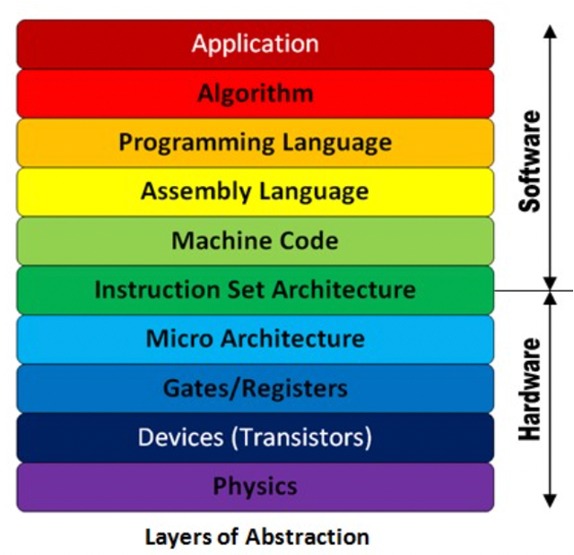
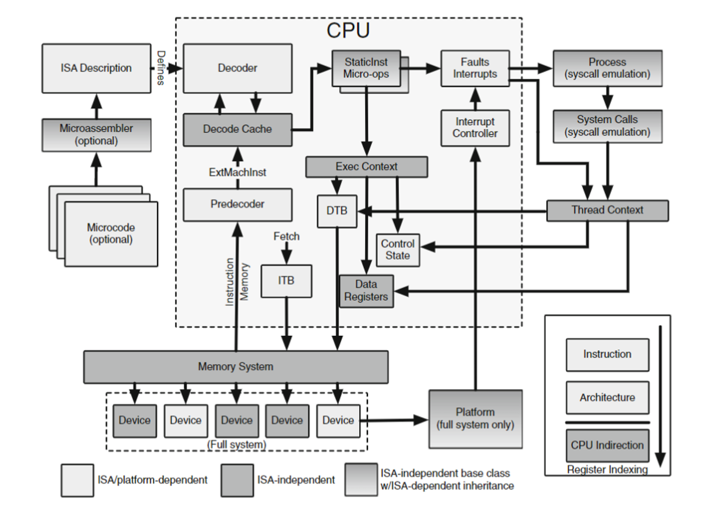
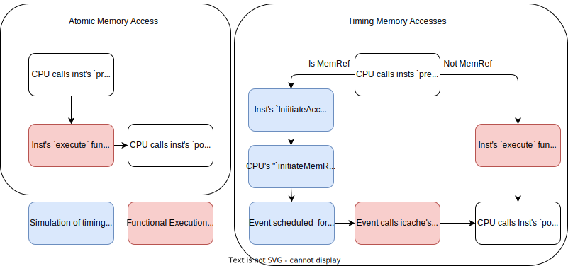
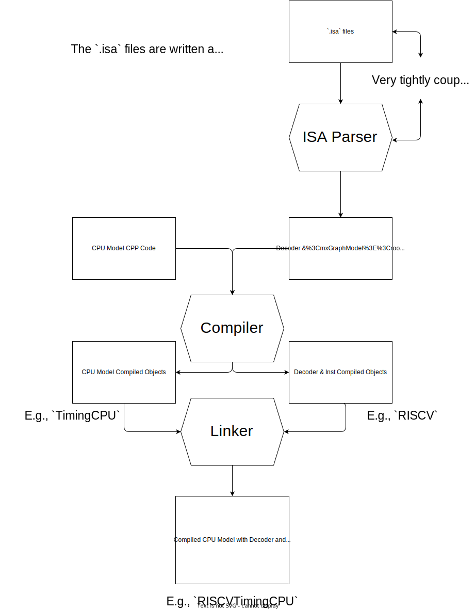
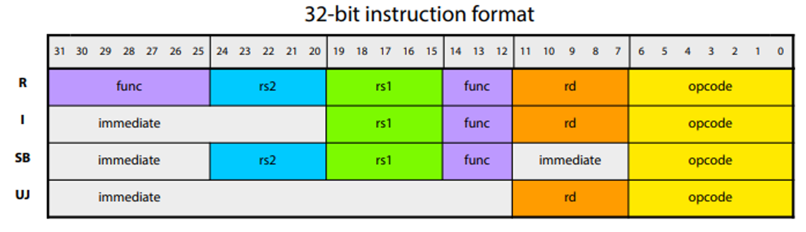

<!-- _class: title -->

## Modeling Cores in gem5

---

## What is an ISA?

The _Instuction Set Architecture_ (ISA) is the interface between the software and the hardware.

An ISA defines:

* The instructions that a processesor can exectue.
* The registers that are available
* The memory model
* Exception and interrupt handling

---



---

## ISA's gem5 can simulate

* ARM
* RISC-V
* x86
* MIPS
* SPARC

Realistically you'll probably only use ARM, RISC-V, and x86.

The remainder, though available, are not as well tested or maintained.

---

## gem5's ISA-CPU Independence

Unlike in real hardware, where the CPU is tightly coupled to the ISA it is designed to run, gem5 simplfies things by defoupling the two.
In doing so gem5 CPU models become ISA aignostic (or ISAs become CPU model agnostic).

While there are limits to this independence, the goal is to allow for the easy addition, and extension  of new ISAs and CPU models without dealing with massive code changes and rewrites.
As a high level summary, this independence is achieved by having a seperate "decoder" for each ISA, which is convert instructions to objects desribing their behavior.

**Note**: I will use the word "decoder" here broadly to describe the process of parsing bits and bytes of an instruction to determine its behavior and how it is to interact with the CPU model. In gem5 this is part of the ISA definition to be "plugged-in" to the CPU model.

It doesn't funciton or have the same responsibilities as a decoder in a real CPU.

---

## ISA-CPU Independence Diagram



---

## The important part: StaticInst

The important take away of this complex design is the Decoder, regardless of the ISA is created for, parses an instruction received by the CPU into a `StaticInst` object.

A `StaticInst` is an object containing static information about a particular ISA instruction for all instances of that instruciton.

It contains information on

* The operation class
* Source and destination registers
* Flags to show if the instruction has micro-ops
* Functions defining the instruction's behavior
  * `execute()`
  * `initiateAcc()`
  * `completeAcc()`
  * `dissasemble()`

---

## DynamicInst

`DynamicInst` objects contains the information that is specific to a particular instance of an instruction.
They are constructed from information in the `StaticInst` objects.

They contains information on:

* PC and predicated next-PC
* Instruction result
* Thread number
* CPU
* Renamed register indices
* Provides the `ExecContext` interface

---

## ExecContext

The `ExecContext` interface provides methods in which a instruction may interface with a CPU model in a standardized way.

`DynamicInst` objects implement the `ExecContext` interface.

---

## Journey of an Instruction in gem5

In this example we will use GDB to trace the execution of an instruction in gem5.

To start we will run the script in [materials/03-Developing-gem5-models/05-modeling-cores/01-inst-trace.py](../../materials/03-Developing-gem5-models/05-modeling-cores/01-inst-trace.py) via GDB.

Using GDB we will add breakpoints to the `Add::Add` function and the `Add::execute` function.

To startL

```shell
gdb gem5
```

The, add breakpoints to for functions in `StaticInst` object representing the `Add`instruction.

---

Add breakpoints to the `Add::Add` function.
This is just the constructor for the `Add` class. It created the `StaticInst`
object that represents the `Add` instruction.

```shell
(gdb) break Add::Add
```

Then add breakpoints to the `Add::execute` function.
This is function called to execute the `Add` instruction.

```shell
(gdb) break Add::execute
```

Start execution of gem5:

```shell
(gdb) run 01-inst-trace.py
```

---

## RISC-V `Add::Add` Backtrace

You should have reached the first breakpoint in the `Add::Add` function:

```shell
Breakpoint 1, 0x0000555555a3b1b0 in gem5::RiscvISAInst::Add::Add(unsigned int) ()
```

Next we'll do a backtrace. A backtrace shows the functions that have been called to reach the current function.
Let's see the last 10 functions that have been called:

```shell
(gdb) bt 10
```

---

Output:

```shell
0 {PC} in gem5:: RiscvISAInst::Add: :Add(unsigned int) ()
1 {PC} in gem5:: RiscvISA:: Decoder: :decodeInst(unsigned long) ()
2 {PC} in gems:: RiscvISA: :Decoder: : decode(unsigned long, unsigned long)
3 {PC} in gem5:: RiscvISA: :Decoder:: decode (gem5:: PCStateBase&) ()
4 {PC} in gem5:: BaseSimpleCPU:: preExecute ()
5 {PC} in gem5:: TimingSimpleCPU:: IcachePort:: ITickEvent:: process () ()
6 {PC} in gem5:: EventQueue:: serviceone() ()
7 {PC] in gem5: :doSimLoop (gem5:: EventQueue*) ()
8 {PC} in gem5:: simulate(unsigned long) ()
9 {PC} in pybind11::pp_function:: initialize<gem5: :GlobalSimLoopExitEve ...
```

Here the 0th function call is the `Add::Add` function.
and each subsequent index is the function that called the previous (i.e., the 1st function called the 0th function, the 2nd function called the 1st function, etc.)

---

The 5th function is the `TimingSimpleCPU` model's `process` function, the function used to process an instruction.
The functions at indexes > 6 are gem5's internal functions called prior to the instruction execution which we needn't concern ourselves with here.

```shell
4 {PC} in gem5:: BaseSimpleCPU:: preExecute ()
```

The `preExecute` is a function called in the CPU model before the instruction is executed. It is used to perform any necessary setup..

You can go to ["src/cpu/simple/base.cc"](https://github.com/gem5/gem5/blob/v24.0/src/cpu/simple/base.cc#L328) in the gem5 repo to see the `BaseSimpleCPU`'s `preExecute` function.

---

The next function in the backtrace is the RISC-V ISA's decoder.

```shell
3 {PC} in gem5:: RiscvISA: :Decoder:: decode (gem5:: PCStateBase&) ()
```

This function is called from the following line in the `BaseSimpleCPU`'s `preExecute` function:

```cpp
        //Decode an instruction if one is ready. Otherwise, we'll have to
        //fetch beyond the MachInst at the current pc.
        instPtr = decoder->decode(pc_state);
```

You can follow this call through to `Decoder:: decode` which can be found in [src/arch/riscv/decoder.cc](https://github.com/gem5/gem5/blob/v24.0/src/arch/riscv/decoder.cc#110) in the gem5 repository

---

<!-- _class: code-60-percent -->

```cpp
StaticInstPtr
Decoder::decode(PCStateBase &_next_pc)
{
    if (!instDone)
        return nullptr;
    instDone = false;

    auto &next_pc = _next_pc.as<PCState>();

    if (compressed(emi)) {
        next_pc.npc(next_pc.instAddr() + sizeof(machInst) / 2);
        next_pc.compressed(true);
    } else {
        next_pc.npc(next_pc.instAddr() + sizeof(machInst));
        next_pc.compressed(false);
    }
    emi.vl      = next_pc.vl();
    emi.vtype8  = next_pc.vtype() & 0xff;
    emi.vill    = next_pc.vtype().vill;
    emi.rv_type = static_cast<int>(next_pc.rvType());

    return decode(emi, next_pc.instAddr());
}
```

This function loads the next instruction into the decoder before calling calling [`Decoder::decode(ExtMachInst mach_inst, Addr addr)`](https://github.com/gem5/gem5/blob/v24.0/src/arch/riscv/decoder.cc#93).

---

```cpp
StaticInstPtr
Decoder::decode(ExtMachInst mach_inst, Addr addr)
{
    DPRINTF(Decode, "Decoding instruction 0x%08x at address %#x\n",
            mach_inst.instBits, addr);

    StaticInstPtr &si = instMap[mach_inst];
    if (!si)
        si = decodeInst(mach_inst);

    si->size(compressed(mach_inst) ? 2 : 4);

    DPRINTF(Decode, "Decode: Decoded %s instruction: %#x\n",
            si->getName(), mach_inst);
    return si;
}
```

---

## Decode function

This function mostly serves as a simple wrapper to call the `Decoder::decodeInst` function plus setting the size and allowing for some debug information.

The `decodeInst` function is the next function on the backtrace but it's _generated_.

The `decideInst` function is generated code and will only be available to you if you build gemt (`scons build/ALL/gem5.opt -j$(nproc)`).
A copy of these generated files has been added for your reference in [materials/03-Developing-gem5-models/05-modeling-cores/build-riscv-generated-files](../../materials/03-Developing-gem5-models/05-modeling-cores/build-riscv-generated-files/).

---

Here is a snippet of "decode-method.cc.inc", removing supurflous lines, to show the path to the statement returning `Add` instruction:

```cpp
// ...
case 0xc:
    switch (FUNCT3) {
    case 0x0:
        switch (KFUNCT5) {
        case 0x0:
            switch (BS) {
            case 0x0:
                // ROp::add(['\n   Rd = rvSext(Rs1_sd + Rs2_sd);\n   '],{})
                    return new Add(machInst);
                break;
```

This decode function takes the machine instruction and returns the appropriate `StaticInst` object (`Add(machInst)`).
It is just a giant map.

---

## RISC-V `Add::Execute` Backtrace

Let's continue  in GDB to reach the next breakpoint:

```shell
(gdb) c
```

If successful you should see the following output:

```shell
Breakpoint 2, {PC} in gem5:: RiscvISAInst::Add::execute...
```

Next, we'll do a backtrace to see the functions that have been called to reach the current function:

```shell
(gdb) bt 5
```

As you can see, the execute function is called via the `TimingSimpleCPU` model's `process` function.

---

The following code can be found in ["src/cpu/simple/timing.cc](https://github.com/gem5/gem5/blob/v24.0/src/cpu/simple/timing.cc):

```cpp
void
TimingSimpleCPU::IcachePort::ITickEvent::process()
{
    cpu->completeIfetch(pkt);
}
```

Then follows through to:

```cpp
// non-memory instruction: execute completely now
        Fault fault = curStaticInst->execute(&t_info, traceData);
```

This is the function that calls the `execute` function of the `StaticInst` object which will carry out all the work for the instruction.
**Note:** This is because `Add` non-memory instructiion. Memory instructions are immediately executed. Without memory accesses instrctions are simulated as being instantaneous.

---

## Different memory accesses and instruction execution

The `StaticInst` object has three functions that are used to execute an instruction: `execute()`, `initiateAcc()`, and `completeAcc()`.

`execute()` is used to execute the instruction via single function call.
This is used two circumstances: when running atomic mode and when the instruction is a non-memory instruction.

`initiateAcc()` is used to initiate a memory access through the memory system.
It does everyhitng right up to the actual instruciton operation access before requesting the memory system to perform the access. The memory system will then, eventually, call `completeAcc()` to complete the access and trigger the exectuon of the instruction.

The latter two functions are used for memory instructions such as Timed memory accesses mode and when the instruction is a memory instruction (i.e., the instruction loads from meory and therefore timing information is needed).

---

## The Inst-CPU control flow (for SimpleCPU)



---

## The gem5 ISA Parser

So far we've seen, how an instruction is decoded then executed in gem5.
However, we haven't seen how this decoding process is defined and the behavior of the instrucion's execution is defined.
This is where it gets complicated...

### ISA Specification and Parsing

The "src/arch/*/isa directory contains the ISA definition.
This is written in bespoke language we refer to as the ISA Domain Specific Language (ISA DSL)

When gem5 is built the build system parses these files using the ["src/arch/isa/isa_parser/isa_parser.py"](https://github.com/gem5/gem5/blob/v24.0/src/arch/isa/isa_parser/isa_parser.py) script which generates  the necessary CPP code.
These generated files can be found in "build/ALL/arch/*/generated/".
The gem5 build system then compiles thes generated files into the gem5 binary.

---

## The important high-level ideas



The problem with the ISA definition is it's very indirect and you can get lost in trying to understand the little details of how the CPP code is generated.

Keeping the high-level ideas in mind is more important to understanding how the ISA is defined and how the instructions are decoded and executed.

The painfull truth is that to extend or add to an ISA most developers will `grep` for similar instructions and attempt to understand the templates involed without fully understanding all parts.

---

## Let's try to understand one RISC-V instruction

In the following we are going to look at the `LW` instruction in the RISC-V and how it is specified, decoded, and executed in gem5.

---

## The RISC-V instruction formats

To understand the RISC-V ISA, and how the gem5 RISC-V decoder works, we need to understand the base instruction formats.
The base instruction formats are the R, I, S, B, U, and J types which use thye following formats:



---

* R type: for register-register operations.
* I type: for immediate and load operations.
* S type: for store operations.
* B type: for branch operations.
* U type: for upper immediate operations.
* J type: for jump operations.

---

## RISC-V's "Load word" (LW) instruction

Load Word (instruction: `LW`) is an I-type instruction which loads a 32-bit value from memory into a register.
It is defined by the folowing format:

```shell
LW rd,offset(rs1) # rd = mem[rs1+imm]
```

* `lw` is the mnemonic for the instruction.
* `rd` is the destination register.
* `imm` immediate value: termines the offset (can be used to access sub-word data).
* `rs1` is the source register.

It loads the value of source register  `rs1` into the destination register `rd + imm`. If `imm` is zero, the full word (32-bits) of `rs1` is loaded into `rd`. This `imm` value is used to load subword data. However, if non-zero, `imm` is used to load subword data. `imm` shifts the bits in the `rs1` register prior to loading to `rd`. So, if `imm = 15`, the value of `rs1` is shifted by 15 bits before being loaded into `rd`.

---

## RISC-V's LW Instruction Breakdown

Consider the following instruction:

```txt
000000000000000000000000100100110001100011
```

It's a LW instruction, which is an I-type instruction.
The instruction is therefore broken down as follows:

```txt
|   31  --  20   |  19 -- 15  |  14 -- 12  |  11 -- 7  |  6 -- 0 |
|  000000000001  |    00010   |    010     |   00011   |  000011 |
|       imm      |     rs1    |   func3    |    rd     |  opcode |
```

In this example the register with address 2 (`rs1`, `00010`) is loaded into the register with address 3 (`rd`, `00011`) with an offset of 1 (`imm`). `funct3` is the function code for the LW instruction (this is always 010 for the LW instruction), and `opcode` is the operation code for the LW instruction (also always the same).

---

**Note**: In gem5 we additionally refer to `QUANDRANT` or `QUAD` which is the last two bits of the opcode (`11` in this case), and `OPCODE5` which refers to the `opcode` bit shift right by 2 (basically `opcode` without `QUAD`, `0000` in this case).
Ergo `opcode` = (`OPCODE5` << 2 )+ `QUAD`.

---

## Understanding the decoding of LW

What the ISA definition does is define how the instruction is decoded is broken down and how the "parts" (bitfields) of the instruction are used to decode the instruction.

Go to the "src/arch/riscv/isa/bitfields.hsh directory"  in the gem5 repository.
Below is a snippet.

```cpp
// Bitfield definitions.
//
def bitfield RVTYPE rv_type;

def bitfield QUADRANT <1:0>;
def bitfield OPCODE5 <6:2>;
```

This defines the bitfields, like those decribed on the previous slide.
THe decoder uses these bitfirelds to decode the instruction.

---

Go to "decoder.isa" and search for the `lw` instruction

The following shows the path to the instruction definition via parsing of the instruction's `opcode` and `funct3` fields:

```txt
# A reduced decoder.isa to focus just on the path to `lw`.
decode QUADRANT default Unknown::unknown() {
    0x3: decode OPCODE5 { # if QUADRANT == 0x03; then decode OPCODE5
        0x00: decode FUNCT3 { # if OPCODE5 == 0x00; then decode FUNCT3
            format Load { # This tells use to use the `Load` format whewn decoding (more on this later)
                0x2: lw({{ # if QU # if FUNCT3 == 0x02 then declare lw instruction
                    Rd_sd = Mem_sw;
                }});
            }
        }
    }
}
```

`Rd_sd` is the destination register, and `Mem_sw` is the memory address to be loaded into the destination register.

---

<!-- _class: code-80-percent -->

### Generating code from the LW ISA definition

You can compare side by side decoder.isa and decode-method.cc.inc to see how the ISA definition is used to generate the CPP decoder code.

This is done by the ISA parser script (isa_parser.py) which is used by the gem5 build system to generate the CPP code.

```txt
decode QUADRANT default Unknown::unknown() {
```

becomes

```cpp
using namespace gem5;
StaticInstPtr
RiscvISA::Decoder::decodeInst(RiscvISA::ExtMachInst machInst)
{
    using namespace RiscvISAInst;
  switch (QUADRANT) {
```

---

```txt
0x3: decode OPCODE5 {
```

becomes

```cpp
case 0x3:
      switch (OPCODE5) {
```


---

```txt
0x00: decode FUNCT3 {
```

becomes

```cpp
case 0x00:
    switch (FUNCT3) {
```

---

Finally,

```txt
format Load {
    0x2: lw({{ # if QU # if FUNCT3 == 0x02 then declare lw instruction
        Rd_sd = Mem_sw;
    }});
}
```

becomes

```cpp
case 0x2:
    // Load::lw(['\n                    Rd_sd = Mem_sw;\n                '],{})
    return new Lw(machInst);
    break;
```

---

The compelte translation is :

```cpp
using namespace gem5;
StaticInstPtr RiscvISA::Decoder::decodeInst(RiscvISA::ExtMachInst machInst) {
    using namespace RiscvISAInst;
    switch (QUADRANT) { case 0x3:
            switch (OPCODE5) { case 0x0:
                    switch(FUNCT3) {
                        case 0x2:
                            // Load::lw(['Rd_sd = Mem_sw;'],{})
                            return new Lw(machInst);
                            break;
                    }
            }
    }
}
```

---

<!-- _class: code-50-percent -->

### The generated function to execute the LW instruction

```cpp
    setRegIdxArrays(
        reinterpret_cast<RegIdArrayPtr>(
            &std::remove_pointer_t<decltype(this)>::srcRegIdxArr),
        reinterpret_cast<RegIdArrayPtr>(
            &std::remove_pointer_t<decltype(this)>::destRegIdxArr));
            ;
    setDestRegIdx(_numDestRegs++, ((RD) == 0) ? RegId() : intRegClass[RD]);
    _numTypedDestRegs[intRegClass.type()]++;
    setSrcRegIdx(_numSrcRegs++, ((RS1) == 0) ? RegId() : intRegClass[RS1]);
    flags[IsInteger] = true;
    flags[IsLoad] = true;
    memAccessFlags = MMU::WordAlign;;
        offset = sext<12>(IMM12);;
```

If you go to the declaration of `Load` in "src/arch/riscv/isa/formats/mem.isa" you can figure out how this was constructed:

```txt
def format Load(memacc_code, ea_code = {{EA = rvZext(Rs1 + offset);}},
        offset_code={{offset = sext<12>(IMM12);}},
        mem_flags=[], inst_flags=[]) {{
    (header_output, decoder_output, decode_block, exec_output) = \
        LoadStoreBase(name, Name, offset_code, ea_code, memacc_code, mem_flags,
        inst_flags, 'Load', exec_template_base='Load')
}};
```

You can follow this through to see how this constructor is generated but it's a bit of a rabbit hole.

---

From "decoder-ns.hh.inc", youi can see the generated class definition for the `Lw` instruction:

```cpp
    class Lw : public Load
    {
      private:
        RegId srcRegIdxArr[1]; RegId destRegIdxArr[1];

      public:
        /// Constructor.
        Lw(ExtMachInst machInst);

        Fault execute(ExecContext *, trace::InstRecord *) const override;
        Fault initiateAcc(ExecContext *, trace::InstRecord *) const override;
        Fault completeAcc(PacketPtr, ExecContext *,
                          trace::InstRecord *) const override;
    };
```

---

## You can keep exploring in your own time

As previously mentioned, the ISA definition is a rabbit hole and can be difficult to understand.

The templates are complex and typically build on other templates and specialized translation code in the `isa_parser.py` script.

By analysing the ISA definition and the `isa_parser.py` script you can get a better understanding of how the ISA is defined and how the instructions are decoded and executed.

The generated is valid CPP code and can understood by trying to  understanding the generated code.

Using breakpoints in GDB to trace the execution of an instruction in gem5 is a good way to understand how the generated code is used to decode and execute an instruction.

---

<!-- _class: code-50-percent no-logo -->

## Exercise: Implement `ADD16` instruction

In this inxercise you're going to implement `ADD16` to the gem5 RISC-V ISA.

The `ADD16` instruction is a 16-bit addition instruction that adds two 16-bit values and stores the result in a 16-bit register.

Format:
```txt
| 31 -- 25 | 24 -- 20 | 19 -- 15 | 14 -- 12 | 11 -- 7 |  6 -- 0  |
|  0100000 |   rs2    |   rs1    |   000    |   rd    |  0110011 |
|  funct7  |          |          |  funct3  |         |  opcode  |

1 -- 0 (`11`) is the quadrant field.
```

**Syntax**:

```txt
ADD16, Rs1, Rs2
```

**Purpose**: Perform 16-bit integer element additions in parallel.

**Description**: This instruction adds the 16-bit ingeger elements in `Rs1` with the 16-bit integer elements in `Rs2`, and then writes the 16-bit element to the `Rd` register.

---

Try implementing the `ADD16` instruction to gem5 byself.
The best advice when getting stuck is to find similar instructions and try figure out how they work.

Resources to get you started can be found [materials/03-Developing-gem5-models/05-modeling-cores/02-add16-instruction](../../materials/03-Developing-gem5-models/05-modeling-cores/02-add16-instruction/).
Of note, this contains a binary with the ADD16 instruction compiled in, and a config file to run binary in an RISC-V system.
This config will let you know if you have implemented the instruction correctly.

---

### Use the format to specify the decoder

Let's work backwards and specify each bitfied in the instruction format.

```txt
| 31 -- 25 | 24 -- 20 | 19 -- 15 | 14 -- 12 | 11 -- 7 |  6 -- 0  |
|  0100000 |   rs2    |   rs1    |   000    |   rd    |  0110011 |
|  funct7  |          |          |  funct3  |         |  opcode  |
```

* quadrant: 0x3
* opcode5: 0x1d
* funct3: 0x0
* funct7: 0x20

---

add16({{}}, IntAluOp);

From this we can specify the decoder in the ISA definition:

```txt
decode QUADRANT default Unknown::unknown() {
    0x3 : decode OPCODE5 {
        0x1d: decode FUNCT3 {
            format ROp {
                0x0: decode FUNCT7 {
                    0x20: // Add the ADD16 instruction here
                }
            }
        }
    }
}
```

**Note**: The `ROp` format is used for register-register operations.
I figured out which format to use for you butr you can find this in the ISA definition.

---

Next, let's add this to the RISC-V "decoder.isa" file.

The important thing to note is they are already other insturctions defined in this file which share the same QUADRANT and OPCODE5 values. Ergo, we just need to insert:

```txt
        0x1d: decode FUNCT3 {
            format ROp {
                0x0: decode FUNCT7 {
                    0x20:
```

in to the correct place.

---

Next let's add the instruction name:

```txt
                    0x20: add16({{

                    }});
```

The space space between the curly braces is where the  instruction's behavior is declared.

---

Finally we add the code.
This is just a matter of understanding the operations and doing the appropriate operations.
In out case, we're mkeeping this as close to CPP as possible.

```txt
    0x20: add16({{
            uint16_t Rd_16 = (uint16_t)(Rs1_ud) +
                                    (uint16_t)(Rs2_ud);
        uint16_t Rd_32 = (uint16_t)((Rs1_ud >> 16) +
                                    (Rs2_ud >> 16));
        uint16_t Rd_48 = (uint16_t)((Rs1_ud >> 32) +
                                    (Rs2_ud >> 32));
        uint16_t Rd_64 = (uint16_t)((Rs1_ud >> 48) +
                                    (Rs2_ud >> 48));
        uint64_t result = Rd_64;
        result = result << 16 | Rd_48;
        result = result << 16 | Rd_32;
        result = result << 16 | Rd_16;
        Rd = result;
    }});
```

---
