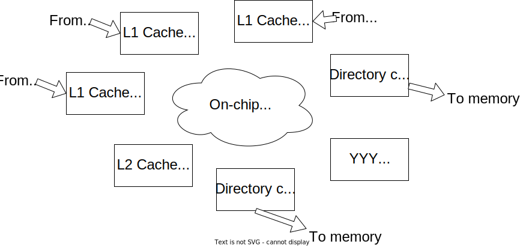

<!-- _class: title -->

## Modeling Cache Coherence in gem5

---

## Outline

- A bit of history and coherence reminder
- Components of a SLICC protocol
- Debugging protocols
- Where to find things in Ruby
- Included protocols

### What we're not going to do

Write a new protocol from scratch (we will fill in a few missing pieces, though)

---

## gem5 history

M5 + GEMS = gem5

**M5**: "Classic" caches, CPU model, requestor/responder port interface

**GEMS**: Ruby + network

---

## Cache Coherence Reminder

Single-Writer Multiple-Reader (SWMR) invariant


---

<!-- _paginate: hold -->

## Cache Coherence Reminder

Single-Writer Multiple-Reader (SWMR) invariant


---

## Ruby Architecture


---

## Ruby Inside the Black Box



---

## Ruby Components

- **Controller Models** *(e.g, caches)*: Manage coherence state and issue requests
- **Controller Topology** *(how the caches are connected)*: Determines how messages are routed
- **Interconnect Model** *(e.g., on-chip routers)*: Determines performance of routing
- **Interface** *(how to get messages in/out of Ruby)*

> **Note**: The main goal of Ruby is ***flexibility***, not ***usability***.

---

## Controller Models

- Implemented in "SLICC"
  - **S**pecification **L**anguage for **I**ncluding **C**ache **C**oherence
- SLICC is a domain-specific language
  - Describes the coherence protocol
  - Generates C++ code
  - See `build/.../mem/ruby/protocol` for generated files (but you really don't want to read these.)

---

## Cache coherence example to implement

- **MSI**: Modified, Shared, Invalid
- From Nagarajan, Sorin, Hill, and Wood. [A Primer on Memory Consistency and Cache Coherence](https://link.springer.com/book/10.1007/978-3-031-01764-3).
- [Excerpt of 8.2 download](https://www.gem5.org/pages/static/external/Sorin_et-al_Excerpt_8.2.pdf)


---

## SLICC Original Purpose

- Create these tables

> Actual output!


---

## How auto generated code works

> **IMPORTANT** Never modify these files!


---

## Cache state machine outline

- **Parameters**: These are the `SimObject` parameters (and some special things)
  - **Cache memory**: Where the data is stored
  - **Message buffers**: Sending and receiving messages from the network
- **State declarations**: The stable and transient states
- **Event declarations**: State machine events that will be "triggered"
- **Other structures and functions**: Entries, TBEs, get/setState, etc.
- **In ports**: Trigger events based on incoming messages
- **Actions**: Execute single operations on cache structures
- **Transitions**: Move from state to state and execute actions

**In ports** read **Cache memory** then *triggers* **Events**.
**Events** cause **Transitions** based on the **State** which execute **Actions**.
**Actions** can update **Cache memory** and send **Messages** via **Message buffers**.

---

## Cache memory

- See `src/mem/ruby/structures/CacheMemory`
- Stores the cache data (in an `Entry` as defined in the SLICC file)
- Can use the function `cacheProbe()` to get the replacement address when a cache miss occurs
  - Interacts with replacement policies in `src/mem/cache/replacement_policies`

> **IMPORTANT**: Always call `setMRU()` when you access an `Entry` otherwise the replacement policy won't work.

(You should never have to modify `CacheMemory` unless you're modifying Ruby itself.)

---

## Message buffers

```c++
MessageBuffer * requestToDir, network="To", virtual_network="0", vnet_type="request";
MessageBuffer * forwardFromDir, network="From", virtual_network="1", vnet_type="forward";
```

- Declaring message buffers is quite confusing.
- The to/from declares them as either "in_port" type or "out_port" type.
- Virtual network is required when some messages have higher priority than others.
- `vnet_type` is the message type. "Response" means that the message carries data and is used in Garnet for counting buffer credits.
- Message buffers have the following interface
  - `peek()`: Get the head message
  - `pop()`: Remove the head message (Don't forget this or you'll have deadlock!)
  - `isReady()`: Check if there is a message to read
  - `recycle()`: Take the head message and put it on the tail (useful to get blocking messages out of the way)
  - `stallAndWait()`: Move the head message to a separate queue (don't forget to call `wakeUpDependents()` later!)

---

## Hands-on: Writing and debugging protocols

See [`materials/03-Developing-gem5-models/06-modeling-cache-coherence/README.md`](../../materials/03-Developing-gem5-models/06-modeling-cache-coherence/README.md)

You will:

1. Declare the protocol for the compiler
2. Fill in the message types
3. Complete the message buffers
4. Test the protocol
5. Find a bug
6. Fix the bug
7. Test with the ruby random tester

Step 0: Copy the template

```sh
cp -r materials/03-Developing-gem5-models/06-modeling-cache-coherence/MyMSI* gem5/src/mem/ruby/protocol
```

---

## Declaring a protocol

Modify [`src/mem/ruby/protocol/MyMSI.slicc`](../../gem5/src/mem/ruby/protocol/MyMSI.slicc)

- Need to tell Scons about the state machine files
- In a file called `<protocol>.slicc`
- You can use the same state machine (`.sm`) files for multiple protocols
- Usually, you want to do this in the [`src/mem/ruby/protocol`](../../gem5/src/mem/ruby/protocol/) directory.

```text
protocol "MyMSI";
include "RubySlicc_interfaces.slicc";
include "MyMSI-msg.sm";
include "MyMSI-cache.sm";
include "MyMSI-dir.sm";
```

> Remember the caveat that each protocol must be compiled separately.
> Hopefully this isn't a requirement forever.

---

## Declaring the message types

Modify [`src/mem/ruby/protocol/MyMSI-msg.sm`](../../gem5/src/mem/ruby/protocol/MyMSI-msg.sm)

```c++
enumeration(CoherenceRequestType, desc="Types of request messages") {
    GetS,       desc="Request from cache for a block with read permission";
    GetM,       desc="Request from cache for a block with write permission";
    PutS,       desc="Sent to directory when evicting a block in S (clean WB)";
    PutM,       desc="Sent to directory when evicting a block in M";
    ...
}
enumeration(CoherenceResponseType, desc="Types of response messages") {
    Data,       desc="Contains the most up-to-date data";
    InvAck,     desc="Message from another cache that they have inv. the blk";
}
```

---

## Message buffers for the directory

Modify [`src/mem/ruby/protocol/MyMSI-dir.sm`](../../gem5/src/mem/ruby/protocol/MyMSI-dir.sm)

```c++
    // Forwarding requests from the directory *to* the caches.
    MessageBuffer *forwardToCache, network="To", virtual_network="1",
          vnet_type="forward";
    // Response from the directory *to* the cache.
    MessageBuffer *responseToCache, network="To", virtual_network="2",
          vnet_type="response";

    // Requests *from* the cache to the directory
    MessageBuffer *requestFromCache, network="From", virtual_network="0",
          vnet_type="request";

    // Responses *from* the cache to the directory
    MessageBuffer *responseFromCache, network="From", virtual_network="2",
          vnet_type="response";
```

---

## Compile your new protocol

First, register the protocol with the `Kconfig` builder. Modify [`src/mem/ruby/protocol/Kconfig`](../../gem5/src/mem/ruby/protocol/Kconfig).

```Kconfig
config PROTOCOL
    default "MyMSI" if RUBY_PROTOCOL_MYMSI
```

and

```Kconfig
cont_choice "Ruby protocol"
    config RUBY_PROTOCOL_MYMSI
        bool "MyMSI"
```

---

## Run scons to compile

Create a new build directory for the gem5 binary with your protocol. Let's start with the configuration from `build_opts/ALL` and modify it. You need to change the protocol, and you should enable the HTML output.

```sh
scons defconfig build/ALL_MyMSI build_opts/ALL
```
Install the necessary locale and launch menuconfig.
```
apt-get update && apt-get install locales
locale-gen en_US.UTF-8
export LANG="en_US.UTF-8"
scons menuconfig build/ALL_MyMSI
# Ruby -> Enable -> Ruby protocol -> MyMSI
```

```sh
scons -j$(nproc) build/ALL_MyMSI/gem5.opt PROTOCOL=MyMSI
```

---

## Create a run script

Modify [`configs/learning_gem5/part3/msi_caches.py`](../../gem5/configs/learning_gem5/part3/msi_caches.py) to use your new protocol.
This file sets up the Ruby protocol for the MSI caches already in gem5's codebase. We'll use it for simplicity.

```sh
build/ALL_MyMSI/gem5.opt configs/learning_gem5/part3/simple_ruby.py
```

While we're waiting on the compilation, let's look at some of the details of the code.
(It is way too much code to write all yourself today... so let's just read it)

---

<!-- _class: "tooMuchCode" -->

## Let's look at some code: In-port definition

From [`gem5/src/learning_gem5/part3/MSI-cache.sm`](../../gem5/src/learning_gem5/part3/MSI-cache.sm)

```c++
in_port(mandatory_in, RubyRequest, mandatoryQueue) {
    if (mandatory_in.isReady(clockEdge())) {
        peek(mandatory_in, RubyRequest, block_on="LineAddress") {
            Entry cache_entry := getCacheEntry(in_msg.LineAddress);
            TBE tbe := TBEs[in_msg.LineAddress];
            if (is_invalid(cache_entry) &&
                    cacheMemory.cacheAvail(in_msg.LineAddress) == false ) {
                Addr addr := cacheMemory.cacheProbe(in_msg.LineAddress);
                Entry victim_entry := getCacheEntry(addr);
                TBE victim_tbe := TBEs[addr];
                trigger(Event:Replacement, addr, victim_entry, victim_tbe);
            } else {
                if (in_msg.Type == RubyRequestType:LD ||
                        in_msg.Type == RubyRequestType:IFETCH) {
                    trigger(Event:Load, in_msg.LineAddress, cache_entry,
                            tbe);
                } else if (in_msg.Type == RubyRequestType:ST) {
                    trigger(Event:Store, in_msg.LineAddress, cache_entry,
                            tbe);
                } else {
                    error("Unexpected type from processor");
                }
            }
        }
    }
}
```

---

## State declarations

See [`gem5/src/mem/ruby/protocol/MSI-cache.sm`](../../gem5/src/mem/ruby/protocol/MSI-cache.sm)

```c++
state_declaration(State, desc="Cache states") {
 I,      AccessPermission:Invalid, desc="Not present/Invalid";
 // States moving out of I
 IS_D,   AccessPermission:Invalid, desc="Invalid, moving to S, waiting for data";
 IM_AD,  AccessPermission:Invalid, desc="Invalid, moving to M, waiting for acks and data";
 IM_A,   AccessPermission:Busy,    desc="Invalid, moving to M, waiting for acks";

 S,      AccessPermission:Read_Only, desc="Shared. Read-only, other caches may have the block";
 . . .
}
```

**`AccessPermission:...`**: Used for functional accesses
**`IS_D`**: Invalid, waiting for data to move to shared

---

## Event declarations

See [`gem5/src/mem/ruby/protocol/MSI-cache.sm`](../../gem5/src/mem/ruby/protocol/MSI-cache.sm)

```c++
enumeration(Event, desc="Cache events") {
 // From the processor/sequencer/mandatory queue
 Load,           desc="Load from processor";
 Store,          desc="Store from processor";

 // Internal event (only triggered from processor requests)
 Replacement,    desc="Triggered when block is chosen as victim";

 // Forwarded request from other cache via dir on the forward network
 FwdGetS,        desc="Directory sent us a request to satisfy GetS. ";
                      "We must have the block in M to respond to this.";
 FwdGetM,        desc="Directory sent us a request to satisfy GetM. ";
 . . .
```

---

## Other structures and functions

See [`gem5/src/mem/ruby/protocol/MSI-cache.sm`](../../gem5/src/mem/ruby/protocol/MSI-cache.sm)

- **Entry**: Declare the data structure for each entry
  - Block data, block state, sometimes others (e.g., tokens)
- **TBE/TBETable**: Transient Buffer Entry
  - Like an MSHR, but not exactly (allocated more often)
  - Holds data for blocks in transient states
- **get/set State, AccessPermissions, functional read/write**
  - Required to implement AbstractController
  - Usually just copy-paste from examples

---

## Ports and message buffers

Not gem5 ports!

- **out_port**: "Rename" the message buffer and declare message type
- **in_port**: Much of the SLICC "magic" here.
  - Called every cycle
  - Look at head message
  - Trigger events

> **Note**: (General rule of thumb) You should only ever have `if` statements in `in_port` blocks. Never in **actions**.

---

## In port blocks

```c++
in_port(forward_in, RequestMsg, forwardToCache) {
 if (forward_in.isReady(clockEdge())) {
   peek(forward_in, RequestMsg) {
     Entry cache_entry := getCacheEntry(in_msg.addr);
     TBE tbe := TBEs[in_msg.addr];
     if (in_msg.Type == CoherenceRequestType:GetS) {
        trigger(Event:FwdGetS, in_msg.addr, cache_entry, tbe);
     } else
 . . .
```

It's weird syntax that looks like a function call, but it's not.
Automatically populates a "local variable" called `in_msg`.

`trigger()` looks for a *transition*.
It also automatically ensures all resources are available to complete the transition.

---

## Actions

```c++
action(sendGetM, "gM", desc="Send GetM to the directory") {
 enqueue(request_out, RequestMsg, 1) {
    out_msg.addr := address;
    out_msg.Type := CoherenceRequestType:GetM;
    out_msg.Destination.add(mapAddressToMachine(address, MachineType:Directory));
    out_msg.MessageSize := MessageSizeType:Control;
    out_msg.Requestor := machineID;
 }
}
```

**`enqueue`** is like `peek`, but it automatically populates `out_msg`

Some variables are implicit in actions. These are passed in via `trigger()` in `in_port`.
These are `address`, `cache_entry`, `tbe`

---

## Transitions

```c++
transition(I, Store, IM_AD) {
  allocateCacheBlock;
  allocateTBE;
  ...
}
transition({IM_AD, SM_AD}, {DataDirNoAcks, DataOwner}, M) {
  ...
  externalStoreHit;
  popResponseQueue;
}
```

- **`(I, Store, IM_AD)`**: From state `I` on event `Store` to state `IM_AD`
- **`({IM_AD, SM_AD}, {DataDirNoAcks, DataOwner}, M)`**: From either `IM_AD` or `SM_AD` on either `DataDirNoAcks` or `DataOwner` to state `M`
- Almost always `pop` at the end
- Don't forget to use stats!

---

## Now, the exercise

The code should be compiled by now!

See [`materials/03-Developing-gem5-models/06-modeling-cache-coherence/README.md`](../../materials/03-Developing-gem5-models/06-modeling-cache-coherence/README.md)

You will:

1. Declare the protocol for the compiler
2. Fill in the message types
3. Complete the message buffers
4. Test the protocol
5. Find a bug
6. Fix the bug
7. Test with the ruby random tester

---

## Debugging protocols

### Run a parallel test

```sh
build/ALL_MyMSI/gem5.opt configs/learning_gem5/part3/simple_ruby.py
```

Result is a failure!

```termout
build/ALL_MyMSI/mem/ruby/protocol/L1Cache_Transitions.cc:266: panic: Invalid transition
system.caches.controllers0 time: 73 addr: 0x9100 event: DataDirNoAcks state: IS_D
```

### Run with protocol trace

```sh
build/ALL_MyMSI/gem5.opt --debug-flags=ProtocolTrace configs/learning_gem5/part3/simple_ruby.py
```

Start fixing the errors and fill in the `MyMSI-cache.sm`

---

## Fixing the errors: Missing transition

- Missing IS_D transition in cache
  - write the data to the cache
  - deallocate the TBE
  - mark that this is an "external load hit"
  - pop the response queue

```c++
transition(IS_D, {DataDirNoAcks, DataOwner}, S) {
    writeDataToCache;
    deallocateTBE;
    externalLoadHit;
    popResponseQueue;
}
```

---

## Fixing the errors: Missing action

- Fill in the "write data to cache" action
  - Get the data out of the message (how to get the message?)
  - set the cache entry's data (how? where does `cache_entry` come from?)
  - Make sure to have `assert(is_valid(cache_entry))`

```c++
action(writeDataToCache, "wd", desc="Write data to the cache") {
    peek(response_in, ResponseMsg) {
        assert(is_valid(cache_entry));
        cache_entry.DataBlk := in_msg.DataBlk;
    }
}
```
Try again (have to recompile after any change to the protocol):
```sh
scons build/ALL_MyMSI/gem5.opt -j$(nproc) PROTOCOL=MYMSI
build/ALL_MyMSI/gem5.opt --debug-flags=ProtocolTrace configs/learning_gem5/part3/simple_ruby.py
```

---

## Fixing the error: Why assert failure?

- Why assert failure?
  - Fill in `allocateCacheBlock`!
  - Make sure to call `set_cache_entry`. Asserting there is an entry available and that `cache_entry` is invalid is helpful.

```c++
action(allocateCacheBlock, "a", desc="Allocate a cache block") {
    assert(is_invalid(cache_entry));
    assert(cacheMemory.cacheAvail(address));
    set_cache_entry(cacheMemory.allocate(address, new Entry));
}
```

Try again:

```sh
scons build/ALL_MyMSI/gem5.opt -j$(nproc) PROTOCOL=MYMSI
build/ALL_MyMSI/gem5.opt --debug-flags=ProtocolTrace configs/learning_gem5/part3/simple_ruby.py
```

---

## When debugging takes too long: RubyRandomTester

**At some point it might be taking while to get to new errors, so...**

Run the ruby random tester. This is a special "CPU" which exercises coherence corner cases.

- Modify the `test_caches.py` the same way as `msi_caches.py`

```sh
build/ALL_MyMSI/gem5.opt --debug-flags=ProtocolTrace configs/learning_gem5/part3/ruby_test.py
```

Notice you may want to change `checks_to_complete` and `num_cpus` in `test_caches.py`.
You may also want to reduce the memory latency.

---

## Using the random tester

```sh
build/ALL_MyMSI/gem5.opt --debug-flags=ProtocolTrace configs/learning_gem5/part3/ruby_test.py
```

- Wow! now it should be way faster to see the error!
- Now, you need to handle this in the cache! `transition(S, Inv, I)`
  - If you get an invalidate...
  - Send an ack, let the CPU know that this line was invalidated, deallocate the block, pop the queue
- So, now, hmm, it looks like it works??? But here's still one more
  - Some transitions are very rare: `transition(I, Store, IM_AD)`
  - Try varying the parameters of the tester (without `ProtocolTrace`!) to find a combination which triggers an error (100000 checks, 8 CPUs, 50ns memory...)
- Now, you can fix the error!

---
## Transitions


```sh

transition(S, Inv, I) {
  sendInvAcktoReq;
  forwardEviction;
  deallocateCacheBlock;
  popForwardQueue;
}

transition(I, Store,IM_AD) {}
  allocateCacheBlock;
  allocateTBE;
  sendGetM;
  popMandatoryQueue;
}

```
------


## Fixing the error: Deadlock

- Possible deadlock... hmm... This happens if *nothing* happens in the caches for a long time.
  - What was the last thing that happened before the deadlock? Let's check what was *supposed* to happen
  - Fill that in!

```c++
transition({SM_AD, SM_A}, {Store, Replacement, FwdGetS, FwdGetM}) {
    stall;
}

action(loadHit, "Lh", desc="Load hit") {
  // Set this entry as the most recently used for the replacement policy
  // Send the data back to the sequencer/CPU. NOTE: False means it was not an "external hit", but hit in this local cache.
  assert(is_valid(cache_entry));
  // Set this entry as the most recently used for the replacement policy
  cacheMemory.setMRU(cache_entry);
  // Send the data back to the sequencer/CPU. NOTE: False means it was not an "external hit", but hit in this local cache.
  sequencer.readCallback(address, cache_entry.DataBlk, false);
}
```

Try again:

```sh
build/ALL_MyMSI/gem5.opt --debug-flags=ProtocolTrace configs/learning_gem5/part3/ruby_test.py
```

---

## Fixing the error: What to do on a store

- Fix the next error (what to do on a store??)
  - Allocate a block, allocate a TBE, send a message, pop the queue
  - Also make sure that all actions that you need
  - When sending, you need to construct a new message. See `RequestMsg` in `MyMSI-msg.sm`

```c++
 action(sendGetM, "gM", desc="Send GetM to the directory") {
        // Fill this in with an enqueue on the request output port
    enqueue(request_out, RequestMsg, 1) {
      out_msg.addr := address;
      out_msg.Type := CoherenceRequestType:GetM;
      out_msg.Destination.add(mapAddressToMachine(address,
                                    MachineType:Directory));
      out_msg.MessageSize := MessageSizeType:Control;
      out_msg.Requestor := machineID;
    }
  }
```

---

## Final error: What to do when there is sharing?

- Next error: What to do when there is sharing??
  - get data from memory (yes, this is an unoptimized protocol..)
  - remove the *requestor* from the sharers (just in case)
  - send an invalidate to all other sharers
  - set the owner
  - and pop the queue
- Now edit `MyMSI-dir.sm`
```c++
transition(S, GetM, M_m) {
    sendMemRead;
    removeReqFromSharers;
    sendInvToSharers;
    setOwner;
    popRequestQueue;
}
```
Try again: (note: no protocol trace this time since it is mostly working)

```sh
build/ALL_MyMSI/gem5.opt configs/learning_gem5/part3/ruby_test.py
```

---

## Now that it's working... look at the stats

Re-run the simple pthread test and lets look at some stats!

```sh
build/ALL_MyMSI/gem5.opt configs/learning_gem5/part3/simple_ruby.py
```
- How many forwarded messages did the L1 caches receive?
`grep -i fwd m5out/stats.txt`

  - (`...FwdGetM` + `...FwdGetS`) =  (16+13) = 29
- How many times times did a cache have to upgrade from S -> M?
`grep -i system.caches.L1Cache_Controller.SM_AD.DataDirNoAcks::total m5out/stats.txt`          565
- What was the average miss latency for the L1?
`grep -i system.caches.MachineType.L1Cache.miss_mach_latency_hist_seqr::[mean OR gmean]  m5out/stats.txt` 19.448276
- What was the average miss latency *when another cache had the data*?
`grep -i system.caches.RequestTypeMachineType.ST.L1Cache.miss_type_mach_latency_hist_seqr::mean m5out/stats.txt`(18) +
`grep -i system.caches.RequestTypeMachineType.LD.L1Cache.miss_type_mach_latency_hist_seqr::mean` (19.7) = 27.5


---

## Ruby config scripts

- Don't follow gem5 style closely :(
- Require lots of boilerplate
- Standard Library does a much better job

### What's needed in these scripts?

1. Instantiate the controllers
Here is where you pass all of the parameters to the `.sm` files
2. Create a `Sequencer` for each CPU (and DMA, etc.)
More details in a moment
3. Create and connect all of the network routers

---

## Creating the topology

- You can connect the routers any way you like:
  - Mesh, torus, ring, crossbar, dragonfly, etc.
- Usually hidden in `create_topology` (see configs/topologies)
  - Problem: These make assumptions about controllers
  - Inappropriate for non-default protocols

After creating the topology (before simulation), Ruby's network model will find all of the valid paths from one node to another in the on-chip network.
Thus, the OCN is completely separate from the types of controllers and the protocol.

---

## Point-to-point example

```python
self.routers = [Switch(router_id = i) for i in range(len(controllers))]
self.ext_links = [SimpleExtLink(link_id=i, ext_node=c, int_node=self.routers[i])
                  for i, c in enumerate(controllers)]
link_count = 0
self.int_links = []
for ri in self.routers:
    for rj in self.routers:
        if ri == rj: continue # Don't connect a router to itself!
        link_count += 1
        self.int_links.append(SimpleIntLink(link_id = link_count, src_node = ri, dst_node = rj))
```

- **`self.routers`**: One router per controller in this case of point-to-point
  - Must have a router for "internal" links
- **`self.ext_links`**: Connects the controller to the router
  - You can have multiple external links per router, but not for this point-to-point example
- **`self.int_links`**: Connects the routers to each other

---

## Ports to Ruby to ports interface


Remember this picture?

- At the top, cores connect to Ruby via the `Sequencer` which is called `mandatory_queue` in the SLICC file.
  - When the request is complete, call `sequencer.readCallback` or `sequencer.writeCallback`.
  - Make sure to include if it's a hit or miss for statistics. You can even include where the miss was serviced for more detailed stats.
- At the bottom, any `Controller` can have a requestor port and you can send messages by using special message buffers `requestToMemory` and `responseFromMemory`.

---

## Where is...?

### Configuration

- configs/network: Configuration of network models
- configs/topologies: Default cache topologies
- configs/ruby: Protocol config and Ruby config
- **NOTE**: Want to move more to the standard library!
- Ruby config: configs/ruby/Ruby.py
  - Entry point for Ruby configs and helper functions
  - Selects the right protocol config "automatically"

### SLICC: *Don't be afraid to modify the compiler*

- src/mem/slicc: Code for the compiler
- src/mem/ruby/slicc_interface
  - Structures used only in generated code
  - AbstractController

---

## Where is...?

- src/mem/ruby/structures
  - Structures used in Ruby (e.g., cache memory, replace policy)
- src/mem/ruby/system
  - Ruby wrapper code and entry point
  - RubyPort/Sequencer
  - RubySystem: Centralized information, checkpointing, etc.
- src/mem/ruby/common: General data structures, etc.
- src/mem/ruby/filters: Bloom filters, etc.
- src/mem/ruby/network: Network model
- src/mem/ruby/profiler: Profiling for coherence protocols

---

## Current protocols

- GPU VIPER ("Realistic" GPU-CPU protocol)
- GPU VIPER Region (HSC paper)
- Garnet standalone (No coherence, just traffic injection)
- MESI Three level (like two level, but with L0 cache)
- MESI Two level (private L1s shared L2)
- MI example (Example: Do not use for performance)
- MOESI AMD (Core pairs, 3 level, optionally with region coherence)
- MOESI CMP directory
- MOESI CMP token
- MOESI hammer (Like AMD hammer protocol for opteron/hyper transport)
