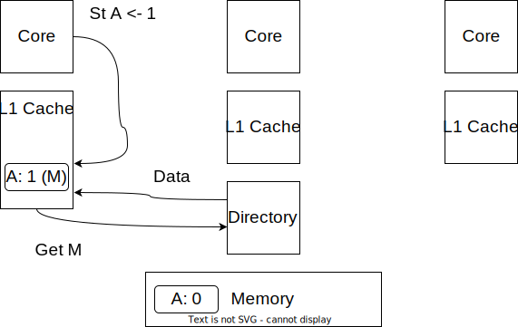

<!-- _class: title -->

## Modeling Cache Coherence in gem5

---

## Outline

- A bit of history and coherence reminder
- Components of a SLICC protocol
- Debugging protocols
- Where to find things in Ruby
- Included protocols

### What we're not going to do

- Write a new protocol from scratch
- See MSI example for this

---

## gem5 history

M5 + GEMS = gem5

**M5**: “Classic” caches, CPU model, requestor/responder port interface

**GEMS**: Ruby + network

---

## Cache Coherence Reminder

Single-Writer Multiple-Reader (SWMR) invariant

---

<!-- _paginate: hold -->

## Cache Coherence Reminder

Single-Writer Multiple-Reader (SWMR) invariant

