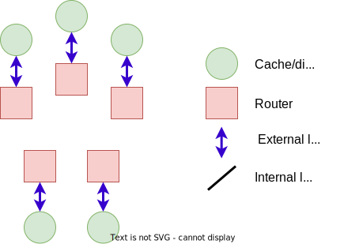
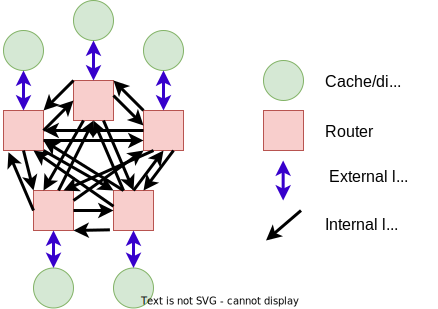
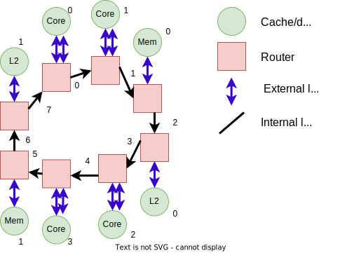

<!-- _class: title -->

## Modeling the on-chip network with Garnet

---

## What we'll cover

---

## Review of Ruby

- **Controller Models** *(e.g, caches)*: Manage coherence state and issue requests
- **Controller Topology** *(how the caches are connected)*: Determines how messages are routed
- **Interconnect Model** *(e.g., on-chip routers)*: Determines performance of routing
- **Interface** *(how to get messages in/out of Ruby)*


---

## Network on chip

Made up of both **topology** and **interconnect** model

### Topology

Specified in the python configuration with how routers/switches are connected

### Interconnect

- Simple: Fast, can only change link bandwidth/latency
- Garnet: Detailed model for routers, flow control, and link architecture

First we'll create a new topology (a ring) and then we'll extend it to use Garnet.

---

## Creating a new topology

From [Modeling Cache Coherence](06-modeling-cache-coherence.md)
Need an *external link* between each controller and a router.

```python
self.routers = [
    Switch(router_id = i)
    for i in range(len(controllers))
]
self.ext_links = [
    SimpleExtLink(
        link_id=i, ext_node=c,
        int_node=self.routers[i])
    for i, c in enumerate(controllers)
]
```



---

## Creating a new topology

From [Modeling Cache Coherence](06-modeling-cache-coherence.md)
Create internal links between routers.

```python
for ri in self.routers:
    for rj in self.routers:
        # Don't connect a router to itself!
        if ri == rj: continue
        link_count += 1
        self.int_links.append(
            SimpleIntLink(
                link_id = link_count,
                src_node=ri, dst_node=rj
            )
        )
```



---

## Let's create a ring topology for the CHI protocol

Building off of [CHI protocol](07-chi-protocol.md)



---

## Create the topology file

Open [../../materials/07-chi-protocol/ring.py](../../materials/07-chi-protocol/ring.py)

Note: There are a lot off oddities in this code. Most of it, you'll just have to take my word for it...

---

## Extend the `SimpleNetwork` class

```python
class Ring(SimpleNetwork):
    def __init__(self, ruby_system):
        super().__init__()
        self.netifs = []
        self.ruby_system = ruby_system
```

Note that netifs is only used for Garnet. Also, the `ruby_system` has to be set manually.

---

## The `connectControllers` metho

This is where the meat of the topology is created.
In our case, we are going to make this topology very specific.

Important note: the layout of the topology is tightly related to the number of cores, L2 banks, memory controllers, etc.

Think about how you would lay out a mesh topology, for instance.

```python
def connectControllers(
    self, l1i_ctrls, l1d_ctrls, l2_ctrls, mem_ctrls, dma_ctrls
):
    assert len(l1i_ctrls) == 4
    assert len(l1d_ctrls) == 4
    assert len(l2_ctrls) == 2
    assert len(mem_ctrls) == 2
```

---

## Create routers caches

L1I and L1D can share the same router. L2s get their own routers.

```python
self.l1_routers = [Switch(router_id=i) for i in range(4)]
self.l1i_ext_links = [
    SimpleExtLink(link_id=i, ext_node=c, int_node=self.l1_routers[i])
    for i, c in enumerate(l1i_ctrls)
]
self.l1d_ext_links = [
    SimpleExtLink(link_id=4+i, ext_node=c, int_node=self.l1_routers[i])
    for i, c in enumerate(l1d_ctrls)
]
```

Note: the `link_id` is important. You have to manually increment it and make sure that the ids are all unique for each type.
Like many things, there are probably better ways, but this is how it's done...

---

## Create routers for the L2s and memory

```python
self.l2_routers = [Switch(router_id=4+i) for i in range(2)]
self.l2_ext_links = [
    SimpleExtLink(link_id=8+i, ext_node=c, int_node=self.l2_routers[i])
    for i, c in enumerate(l2_ctrls)
]

self.mem_routers = [Switch(router_id=6+i) for i in range(2)]
self.mem_ext_links = [
    SimpleExtLink(link_id=10+i, ext_node=c, int_node=self.mem_routers[i])
    for i, c in enumerate(mem_ctrls)
]
```

Don't forget the link ids!

---

## Finally, if we're running is FS mode, we need DMAs

```python
if dma_ctrls:
    self.dma_ext_links = [
        SimpleExtLink(
            link_id=12+i, ext_node=c, int_node=self.mem_routers[0]
        )
        for i, c in enumerate(dma_ctrls)
    ]
```

---

## Create internal links

This is where we create our ring.
For something different, let's do a uni-directional ring.

```python
self.int_links = [
    SimpleIntLink(
        link_id=0,
        src_node=self.l1_routers[0],
        dst_node=self.l1_routers[1],
    ),
    SimpleIntLink(
        link_id=1,
        src_node=self.l1_routers[1],
        dst_node=self.mem_routers[0],
    ),
...
```


---

## A little more boilerplate

We have to tell the parent network class about our links and routers. It requires the member variables `routers`, `ext_links`, and `int_links`.

```python
self.ext_links = (
    self.l1i_ext_links
    + self.l1d_ext_links
    + self.l2_ext_links
    + self.mem_ext_links
    + getattr(self, "dma_ext_links", [])
)
self.routers = (
    self.l1_routers
    + self.l2_routers
    + self.mem_routers
)
```

---

## Testing results

```sh
gem5 run-test.py
```

```text
board.processor.cores0.generator.readBW  2095164513.646249
board.processor.cores1.generator.readBW  2219964305.979394
board.processor.cores2.generator.readBW  2057532576.265793
board.processor.cores3.generator.readBW  2124156465.403641
```

Note: this is almost 10% lower than what we saw with point-to-point!

---

<!-- _class: two-col -->

## Idea! Swap the L2 and the memory

```python
    dst_node=self.l2_routers[0],
),
SimpleIntLink(
    link_id=2,
    src_node=self.l2_routers[0],
    dst_node=self.mem_routers[0],
),
SimpleIntLink(
    link_id=3,
    src_node=self.mem_routers[0],
    dst_node=self.l1_routers[2],
```

```python
SimpleIntLink(
    link_id=5,
    src_node=self.l1_routers[3],
    dst_node=self.l2_routers[1],
),
SimpleIntLink(
    link_id=6,
    src_node=self.l2_routers[1],
    dst_node=self.mem_routers[1],
),
SimpleIntLink(
    link_id=7,
    src_node=self.mem_routers[1],
```

---

## Run again

```sh
gem5 run-test.py
```

```text
board.processor.cores0.generator.readBW  2370664319.434113
board.processor.cores1.generator.readBW  2472807299.127889
board.processor.cores2.generator.readBW  2414887877.684990
board.processor.cores3.generator.readBW  2504614981.400951
```

---

<!-- _class: start -->

## Garnet

---

<!-- _class: two-col -->

## Simple vs Garnet

### Router microarchitecture

- Switch: Simple network
  - Router latency
  - Number of virtual channels
- Garnet Router: Garnet network
  - Number of virtual channels
  - Number of virtual networks
  - Size of flits (flow control units)

### Link microarchitecture

- Simple network:
  - Just specifies the "bandwidth factor"
- Garnet network:
  - Separate links for data link and flow control links: Network and credit links
  - Supports clock domain crossing
  - Serialization and deserialization
  - Width of the link

---

## Routing

- Table-based Routing
  - Shortest path
  - Chooses the route with minimum number of link traversals
  - Link weight  impacts routing
- Custom Routing algorithms

---

## Garnet Extensions

- Clock domain crossings
  - If the external and internal links operating at a different frequency this should be enabled for the `GarnetExtLink`
  - If two internal links have different frequencies, this should be enabled for the `GarnetIntLink`
- Serialization and deserialization
  - This is required if the external link has a different flit size than the internal link for the `GarnetExtLink`
  - This is required if two internal links have a different flit sizes for the `GarnetIntLink`
- Credit links and bridges for clock domains are automatically created

---

## Example?

... Unfortunately, this isn't working. But I have a hack...

There is definitely a buffer filling up somewhere that's causing a deadlock.

The problem is I'm not sure if it's in the network, the protocol, or something else.

So it goes, when using Ruby and Garnet!

---

## Changes for Garnet

1. Make a copy of `ring.py`

```sh
cp ring.py ring_garnet.py
```

2. Change `hierarchy.py` to use `ring_garnet` and also remove the following line

```diff
-     self.ruby_system.network.setup_buffers()
```

3. Make the following substitutions in `ring_garnet.py`

- `SimpleNetwork` -> `GarnetNetwork`
- `SimpleExtLink` -> `GarnetExtLink`
- `SimpleIntLink` -> `GarnetIntLink`

---

## One more change (and a hack)

Also add the following to `Ring.connectControllers`

```python
self.netifs = [GarnetNetworkInterface(id=i) \
            for (i,n) in enumerate(self.ext_links)]
```

Add the following to the constructor to hack around the deadlock.

```python
# There's definitely something wrong with something if I have to
# do this to get it to work.
self.ni_flit_size = 64
self.vcs_per_vnet = 16
```

---

## Now, run the test again!

```sh
gem5 run-test.py
```

```text
board.processor.cores0.generator.readBW  3248115023.780479
board.processor.cores1.generator.readBW  3149747416.759070
board.processor.cores2.generator.readBW  3317362747.135825
board.processor.cores3.generator.readBW  3113523561.473372
```

Notice: It takes a lot longer to simulate with Garnet than it does with `SimpleNetwork`.
More fidelity means longer simulation!
