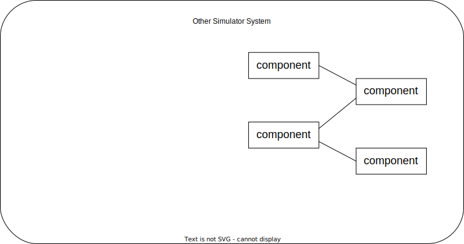
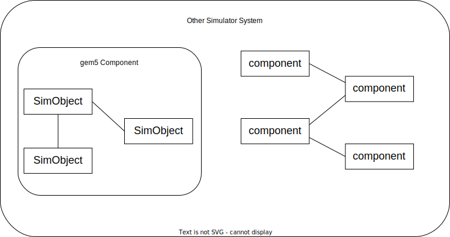
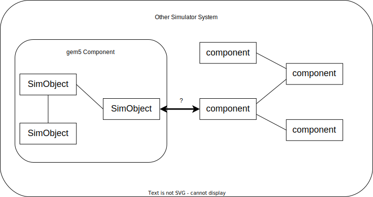
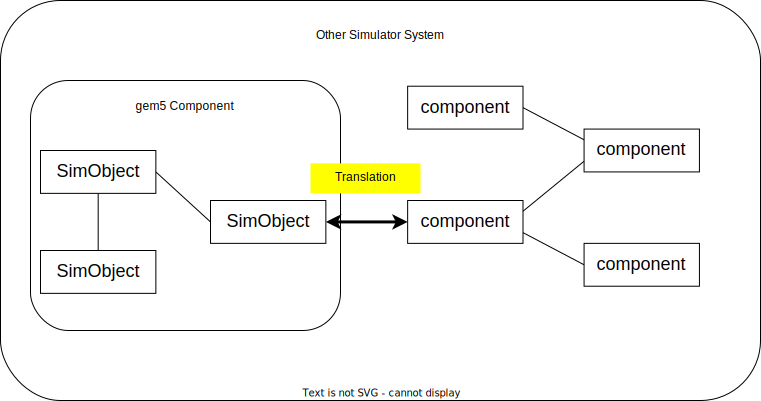
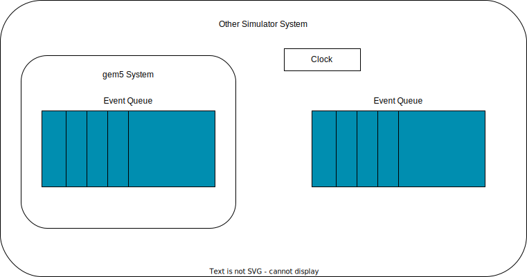
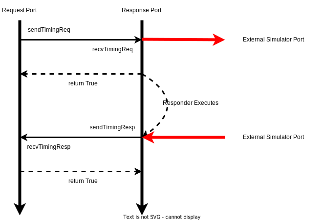
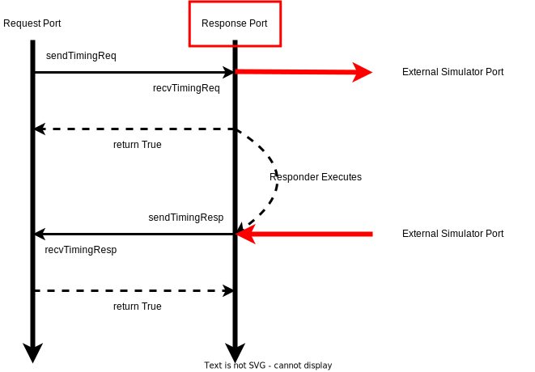

<!-- _class: title -->

## gem5/SST Integration

---

## What is SST?

The structural simulator toolkit (SST) is another computer archoitecture simulator though, unlike gem5, SST was developed to explore _large_,  _highly concurrent_ systems.

Simulations in SST typically model nodes in a network which communicate with eachother through a communication system. SST is highlightly parallelized due to the inherent parallelism in these systems and is therefore relatively fast at simulating these system


---

## Compared to gem5

In comparison gem5 lacks any real support for distributed systems. The focus of gem5 is on accurately simulating a single. In addition, it a single threaded and simply does not scale well when attempting to model large systems (e.g., super computers).

However, the fidelity of a singlular node is considerably higher gem5 than SST.


---

## Why would you want gem5/SST integration?


---

## First step: Install SST

We're not going to do this today.

What we'll do instead is use a docker container with sst installed. The Dockerfile for this container can be found at [util/dockerfiles/sst/Dockerfile](https://github.com/gem5/gem5/blob/v24.0.0.0/util/dockerfiles/sst/Dockerfile). This describes how to build an environment with SST installed.

To enter the container, run the following command:

```sh
cd /workspaces/lpos2024
docker run --volume `pwd`:`pwd` -w `pwd` -it --rm ghcr.io/gem5/sst-env:latest
```

---

## gem5 as a Library: Hello, World!

To use gem5 as a "component" in SST, you need to build it as a library.
This is yet another unique build target...


First we use `defconfig` to define the build:

```bash
cd gem5/
scons defconfig build/for_sst build_opts/RISCV
```

Here we are saying we want standard RISC-V build and for the sources and binary to be build in `build/for_sst` (this keeps is separate from the standard build).

---

We can then build gem5 as library by specifying `libgem5_opt.so` as the target. (If you're building on a Mac, it's not `.so` it's `.dynlib`).


```bash
scons build/for_sst/libgem5_opt.so -j8 --without-tcmalloc --duplicate-sources
```


**Note**: There are some funny build requirements here.
Notably we must build the gem5 library without tcmalloc and with "duplicate sources". Please remember these when building gem5 as a library.

---

## Building the gem5 component in gem5

Compiling gem5 component

```bash
cd ext/sst
cp Makefile.linux Makefile
```

Change the line with `ARCH=RISCV` to `ARCH=for_sst`. This sets the target "architecture" to the we just built.

We then build with:

```sh
make -j8
```

Running the simulation,

```bash
sst --add-lib-path=. sst/example.py
```

---

## gem5 as a Library: instantiation



---

## gem5 as a Library: instantiation



---

## gem5 as a Library: instantiation



---

## gem5 as a Library: instantiation



---


## gem5 as a Library

How to set up gem5 in another simulator?

* Step 1: Setting up the gem5 Python environment.
    * Need to manually import the m5 module
* Step 2: Reading the gem5 Python system configuration file.
    * This includes setting up the communication data path for gem5 and the other simulator


* Notes:
    * `m5.instantiate()` must be called before any simulation.
    * `m5.simulate(K)` runs the gem5 simulation for `K` ticks.

---

## gem5 as a Library: simulation



---

## gem5 as a Library: simulation

For every external simulator clock tick:

```python
external_simulator.advance_to_next_event()
gem5_system.advance(n_ticks)
```

where `n_ticks` = time difference between this event and previous event of the external simulator

---

## Case study: gem5/SST integration

SST: Structural Simulation Toolkit
http://sst-simulator.org/

* A highly parallelized discrete event simulator.
* Consists of:
    * SST-Core (the simulator)
    * SST-Elements (components)
    * SST-Macro

---

## SST: Brief Overview

* Simulation objects:
    * SST::Component (similar to gem5::SimObject)
    * SST::Link (allows two components to send SST::Event to each other)
        * Bidirectional
    * SST::Event (similar to gem5::Event)
        * Sent via SST::Link

* Parallelization,
    * SST partitions components to multiple partitions.
    * Communication between partitions are done via MPI.
    * The partitioning process can be done automatically or manually

---

## gem5/SST Integration



---

## gem5/SST Integration



---

## gem5/SST Integration

* gem5 provides:
    * OutgoingRequestBridge: a Request port sending requests to external components.
    * SSTResponderInterface: an interface for a Response port for an external component.
* gem5 Component is an SST::Component, which has multiple SSTResponder's implementing the SSTReponderInterface.
* The packet translation happens within the gem5 Component.

---

## gem5/SST Integration


---

## gem5/SST Integration

* Example (arm and RISC-V):
    * gem5 as an SST component: gem5/ext/sst/
    * SST system configuration: gem5/ext/sst/sst/example.py
    * gem5 system configuration: gem5/configs/example/sst/riscv_fs.py
* System setup:
    * SST drives the simulation.
    * One gem5 component, which consists of 4 detailed cores.
    * Cache and memory are SST::Components from SST-Elements.

---

## gem5/SST Integration

* System setup:
    * SST drives the full-system simulation.
    * One gem5 component, which consists of 4 detailed cores.
    * Cache and memory are SST::Components from SST-Elements.
* Limitations:
    * gem5 cores wake up frequently per CPU clock tick.
    * The cores are frequently synchronized due to cache coherency protocol.
    * Needs work for block devices to work.

---

## gem5/SST Integration

* However, we can set up multiple-node simulation.
* How?
    * Having multiple gem5 components, each represents a node.
    * Each gem5 component is in a different partition.
    * Communication between gem5 instances can be done via gem5 PIO devices.
* Why?
    * There are more parallelism at the node granularity.

---

## Other Notes

* SST has its own Python environment, so gem5 within SST should not initialize the Python environment again.
* However, the m5 and gem5 libraries should be manually imported.
* m5 library has a function to find SimObject given a SimObject name.
    * Useful for finding the owner for a port in an external simulator.

---

## Documentation

* Setup
    * gem5/ext/sst/README.md
* gem5 interfaces for communication with an external simulator,
    * gem5/src/sst
* gem5 as a component in an external library,
    * gem5/ext/sst
* Compiling the bootloader + kernel + custom workload in a binary,
    * https://gem5.googlesource.com/public/gem5-resources/+/refs/heads/stable/src/riscv-boot-exit-nodisk/README.md
