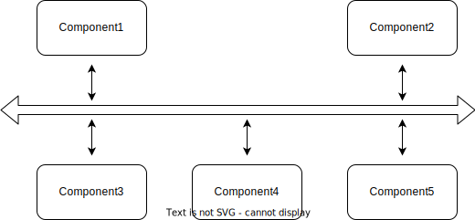

<!-- _class: title -->

## gem5/SST Integration

---

## What is SST?

The structural simulator toolkit (SST) is another computer architecture simulator, yet, unlike gem5, SST has been developed to explore _large_,  _highly concurrent_  designs. In particular, it has utility in helping researchers with interests in communication considerations between computer components and distributed system architectures.

The focus of its design is the holistic  effects of  protocols, networks, and  other communication considerations that concern computer architects. It focuses considerably less on accurately simulating individual machines or components within machines.

---

SST uses the following nomenclature to describe its design:

* **Components**: The individual elements of the system being simulated. The may contain multiple subcomponents which are specialized components subclass. As such, (subcomponents can contain other subcomponents. Using a computer cluster as an example, a component would likely be a node in the cluster.
* **Events**: Events are, at the most basic of levels, a generic interface for components to communicate with one another (through **ports** via **links**, see below). Each component has its own event handler which is tasked with understanding the events it receives. Simulations are typically events triggering components to send other events, thus creating a chain of events.
* **Ports**: The exposed entry/exit points for events between component. **Warning**: Unlike in gem5 a port does not connect directly to port. Ports are connected via **links**.
* **Links**: The connections between ports that allow events to be sent between components.
Properties of these connections between ports are defined here (e.g., latency).

---

## SST's design

In terms of software design and build considerations, the SST simulator is split between the **SST core** and the **SST elements library**. The core is the simulator itself but without any Components to. The elements library contains the components that can be loaded and run, in an SST simulation.

This design allows SST to be highly parallelized: a very nice feature that allows it to scale to larger systems.

<!-- This needs moved around and probably resized -->


---

## SST, in comparison to gem5

* gem5 lacks any real support for simulating distributed systems or communications between machines.

* gem5 focused efforts on simulating the individual computer systems well.

* gem5 is a single threaded application. While a user is always able create more more gem5 processes (one per simulated system), there's no framework allowing them to communicate with one another.


---

## Why would you want gem5/SST integration?

**To get the best of both worlds of course!**

The general idea for having gem5/SST integration is that we can use gem5 to gather high-fidelity per-component data while using SST to simulate the larger-scale system interconnections.

The idea is to have _gem5 as a SST compoent_.

**Note**: At present this is just one gem5 component per SST simulation.
This is ok if you design your simulations well!


---

## Ok then! Let's do it! To start, let's (not) install SST

Before using SST you must first install it... though this isn't very interesting so we'll use a docker container with sst already installed to save us the hassle.

The Dockerfile for this container can be found at [util/dockerfiles/sst/Dockerfile](https://github.com/gem5/gem5/blob/v24.0.0.0/util/dockerfiles/sst/Dockerfile). If interested you may use this for reference on how to install SST.

To enter the container, run the following command:

```sh
cd /workspaces/lpos2024
docker run --volume `pwd`:`pwd` -w `pwd` -it --rm ghcr.io/gem5/sst-env:latest
```

That should be all your need to do. You should now be in an environment with SST installed.

---

## To have an gem5 component, we must first build gem5

To use gem5 as a "component" in SST, you need to build it as a library so it can by incorporated in into a CPP-based wrapper.

To compile gem5 as a library we first use `defconfig` to define the build:

```bash
cd gem5/
scons defconfig build/for_sst build_opts/RISCV
```

Here we are saying:

* We want to use the RISC-V build configuration
* We want sources and binary to be built in `build/for_sst`.

---

## Building the gem5 library

We  then build gem5 as library by specifying `libgem5_opt.so` as the target. (If you're building on a Mac, it's not `.so` it's `.dynlib`).

```bash
scons build/for_sst/libgem5_opt.so -j8 --without-tcmalloc --duplicate-sources
```

**Note**: There are some funny build requirements here.
We must build the gem5 library without tcmalloc and with "duplicate sources". The reasons for this isn't important.

---


## Making a toy SST simulation

While we wait for that complication... let's make a simple SST simulation.

Here we're going to learn the basics of SST with a pre-built component called `example0`, the full type of which is `simpleElementExample.example0`.


**Note**: we will skip how this is created and loaded into SST for now. This example component, unlike others, comes pre-loaded with SST so we needn't worry about the incorporation process.

`example0` is a very simple component. It :

1. Has 1 port to connect to another component (in our case we'll connect to another `example0` component).
2. Simulates a set number of events  to the component it's connected to.

 The simulation ceases after this set number of events have been sent.

---

To inspect any component loaded into SST we can use the `st-info` command.

```bash
st-info simpleElementExample.example0
```

If you do this the following should be returned:

<!-- _class: code-60-percent -->

```shell
ELEMENT LIBRARY 0 = simpleElementExample ()
Components (8 total)
   Component 6: example0
      Description: Simple Demo Component
      ELI version: 0.9.0
      Compiled on: Aug 19 2024 17:13:20, using file: example0.h
      Category: PROCESSOR COMPONENT
      Parameters (2 total)
         eventsToSend: How many events this component should send.  [<required>]
         eventSize: Payload size for each event, in bytes.  [16]
      Ports (1 total)
         port: Link to another component
      SubComponent Slots (0 total)
      Statistics (0 total)
      Profile Points (0 total)
      Attributes (0 total)

SubComponents (4 total)
```

---

## A simple SST system with two `example0` components

The following code can be found in [materials/05-Other-simulators/01-sst/01-sst-tutorial.py](/materials/05-Other-simulators/01-sst/01-sst-tutorial.py). We will be expanding it to create a full SST simulation.

```python
import sst

component0 = sst.Component("c0", "simpleElementExample.example0")
component1 = sst.Component("c1", "simpleElementExample.example0")
```

This is creating two  `example0` components with names `c0` and `c1`. It should be noted that all SST components much have a unique name.

**Note**: A complete example can be found in the SST repository at [`materials/05-Other-simulators/01-sst/sst-tutorial.py`](/materials/05-Other-simulators/01-sst/01-sst-tutorial.py).

---

## Add SST components' parameters

Next we need to set the components' parameters with their `addParam()` methods:

```python
param_set = { "eventsToSend" : 20, "eventSize" : 32 }
component0.addParams(param_set)
component1.addParams(param_set)
```

In this case each component is set simulate the sending of 20 events of size 32 bytes.

---

## Link the SST components

Finally, we need to create a link between the two components' ports.

```python
link0 = sst.Link("link_c0_c1")
link0.connect( (component0, "port", "1ns"), (component1, "port", "1ns") )
```

This:

* Creates a link between the `port` of `component0` and the `port` of `component1`.
* Sets the latency of the link to `1ns` (both directions).
* Names the link `link_c0_c1` (must be unique).


We can already infer what this will simulate: each component will send 20 events, each of which will take 1ns to complete complete.

---

## Running the SST simulation

At this stage you can run your  SST simulator with the following command:

```bash
sst sst-tutorial.py
```

This will output the following:

```shell
Simulation is complete, simulated time: 22 ns
```

While this configuration is very basic, it demonstrates how SST can be used to simulate a system.

---

## Now back to to incorporating gem5

Hopefully your `libgem5_opt.so` has finished building by now. If so, we can now compile a gem5 component for SST and register it with SST.

In our work we want to use gem5 as a component to respond to events. This will be a bit more complex than the simple components we've seen so far, but the basic idea is the same.

We start by selecting the right Makefile for the build:

```bash
cd ext/sst
cp Makefile.linux Makefile
```

---

## Building the gem5 component for SST

We then change  `ARCH=RISCV` to `ARCH=for_sst` in the Makefile. This sets the target "architecture" to the we just built.

Then build with:

```bash
make -j8
```

You can tell from the build output that a gem5 component has been built and dynamically linked to SST. Let's go into a bit more detail about how this works before using it.

---

## Understanding the SST-gem5 integration (well, some of it)

The `ext/sst/gem5.hh` file (found inside the gem5 repo) is relatively simple and gives a high-level view of how gem5 (or, rather, the gem5 library) can be declared and used as a component in SST.

<!-- _class: code-60-percent -->

```cpp

class gem5Component: public SST::Component
{
  public:
    gem5Component(SST::ComponentId_t id, SST::Params& params);
    ~gem5Component();

    void init(unsigned phase);
    void setup();
    void finish();
    bool clockTick(SST::Cycle_t current_cycle);
```

By creating a `SST::Component` subclass we are creating a new component. The methods here override the virtual methods of the `SST::Component` class and are called by SST at various points in the simulation.

---

The remainder of this class definition in `gem5.hh` are the methods used by SST to interact with gem5.

The important part are the MACROS are where our gem5 component links with the SST core.
They are part Element Language Interface (ELI) which is SST's  API for registering components and allowing for them to be dynamically loaded in SST simulations.

---

## The SST_ELI_REGISTER_COMPONENT macro

```cpp
public: // register the component to SST
    SST_ELI_REGISTER_COMPONENT(
        gem5Component, // The component class
        "gem5", // The library SST will search for (in this case "libgem5.so")
        "gem5Component", // The compoenet name (used in the Python code to lookup the component)
        SST_ELI_ELEMENT_VERSION(1, 0, 0), // The version of the component
        "Initialize gem5 and link SST's ports to gem5's ports", // A description of the component
        COMPONENT_CATEGORY_UNCATEGORIZED // The category of the component
    )
```

All SST components must be registered with SST using the this macro. When declared, and during compilation, SST will attempt to dynamically link with the library and wrap it as a SST component.

---

## The SST_ELI_DOCUMENT_PARAMS macro

```cpp
    SST_ELI_DOCUMENT_PARAMS(
        {"cmd", "command to run gem5's config"}
    )
```

This is used to declare the parameters of the component.

In this case the gem5 component has a single parameter, `cmd`, which is the command to run gem5's configuration.

---

## The SST_ELI_DOCUMENT_PORTS macro

```cpp
    SST_ELI_DOCUMENT_SUBCOMPONENT_SLOTS(
        // These are the generally expected ports.
        {"system_port", "Connection to gem5 system_port", "gem5.gem5Bridge"},
        {"cache_port", "Connection to gem5 CPU", "gem5.gem5Bridge"}
    )
```

This is used to register and  document the ports of the component.

In this case the gem5 component has two ports, `system_port` and `cache_port`, which are used to connect to the gem5 system port and CPU respectively.

---

## How does this gem5 simulation inside SST keep in-sync with SST?

We've defined the component but how is a gem5 simulation and used in SST?

The most important question here is regarding timing: How does gem5 know when to simulate to and for how long?

gem5 simulates at the granularity of ticks (picoseconds).
SST simulates at the granularity of cycles (nanoseconds).

In short: **SST schedules a gem5 simulation at every cycle


The short answer here is gem5 keeps in lockstep with the SST clock but let's look at the code that does so in `ext/sst/gem5.cc`:

```cpp
bool
gem5Component::clockTick(SST::Cycle_t currentCycle)
{
    // what to do in a SST's cycle
    gem5::GlobalSimLoopExitEvent *event = simulateGem5(currentCycle);
```

`clockTick` is a virtual method  part of the `SST::Component` class and is called on every SST clock tick. We use this to keep gem5 in sync with SST.

---

Navigating to the `simulateGem5` function we see the following:

<!-- _class: code-70-percent -->

```cpp
uint64_t next_end_tick = \
    timeConverter->convertToCoreTime(current_cycle);

// Here, if the next event in gem5's queue is not executed within the next
// cycle, there's no need to enter the gem5's sim loop.
if (gem5::mainEventQueue[0]->empty() ||
    next_end_tick < gem5::mainEventQueue[0]->getHead()->when()) {
    return gem5::simulate_limit_event;
}
gem5::simulate_limit_event->reschedule(next_end_tick);
gem5::Event *local_event = doSimLoop(gem5::mainEventQueue[0]);
gem5::BaseGlobalEvent *global_event = local_event->globalEvent();
gem5::GlobalSimLoopExitEvent *global_exit_event =
    dynamic_cast<gem5::GlobalSimLoopExitEvent *>(global_event);
return global_exit_event;
```

This code figures out the gem5 `Tick` it will have simulate to to finish at the end of the SST's next clock cycle. The gem5 simulator then simulates to that tick and exits. gem5 then waits for SST to run its cycle and starts again

---

The process is as follows:

1. SST lets gem5 know the current cycle.
2. gem5 Figures out the tick it should be at for the next SST cycle.
3. gem5 simulates to that tick.
4. SST executes it's cycle then returns to step 1.

---

## Let's run gem5 in SST

In [materials/05-Other-simulators/01-sst/02-gem5-in-sst.py](/materials/05-Other-simulators/01-sst/02-gem5-in-sst.py) you will find a partially implement SST configuration script that we will build upon. Provided are the various parameter values.

A completed script for this exercise can be found in [materials/05-Other-simulators/01-sst/completed/02-gem5-in-sst.py](/materials/05-Other-simulators/01-sst/completed/02-gem5-in-sst.py).

What we are going to try and create in this exercise is a computer system which gem5 simulates the processor and SST simulates the memory and cache.

---

Probably most notable of the parameters provided is at the end of the script:

```python
cpu_params = {
    "frequency": cpu_clock_rate,
    "cmd": " ../../configs/example/sst/riscv_fs.py"
            + f" --cpu-clock-rate {cpu_clock_rate}"
            + f" --memory-size {memory_size_gem5}",
    "debug_flags": "",
    "ports" : " ".join(port_list)
}
```

These are the parameters we are going to pass to the gem5 component. We _have_ to pass the `cmd` parameter as this is the command that gem5 will run to simulate the processor. The other parameters are optional and are used to set the frequency of the CPU, any debug flags, and the ports that gem5 will use to communicate with SST.

---

## Create the SST component

We append to the file:

```python
gem5_node = sst.Component("gem5_node", "gem5.gem5Component")
gem5_node.addParams(cpu_params)
```

This creates the gem5 component and sets its parameters.

We then add the cache bus.

```python
cache_bus = sst.Component("cache_bus", "memHierarchy.Bus")
cache_bus.addParams( { "bus_frequency" : cpu_clock_rate } )
```

```python
system_port = gem5_node.setSubComponent(port_list[0], "gem5.gem5Bridge", 0)
system_port.addParams({ "response_receiver_name": sst_ports["system_port"]})

cache_port = gem5_node.setSubComponent(port_list[1], "gem5.gem5Bridge", 0)
cache_port.addParams({ "response_receiver_name": sst_ports["cache_port"]})
```

The above maps the SubComponent to the corresponding simobject.

We then add an L1 Cache and a Memory System, both SST components.

```python
# L1 cache
l1_cache = sst.Component("l1_cache", "memHierarchy.Cache")
l1_cache.addParams(l1_params)

# Memory
memctrl = sst.Component("memory", "memHierarchy.MemController")
# `addr_range_end` should be changed accordingly to memory_size_sst
memctrl.addParams({
    "debug" : "0",
    "clock" : "1GHz",
    "request_width" : "64",
    "addr_range_end" : addr_range_end,
})
memory = memctrl.setSubComponent("backend", "memHierarchy.simpleMem")
memory.addParams({
    "access_time" : "30ns",
    "mem_size" : memory_size_sst
})
```

We then connect the component's ports.

Start with connecting CPU to the L1 cache.

```python
cpu_cache_link = sst.Link("cpu_l1_cache_link")
cpu_cache_link.connect(
    (cache_port, "port", cache_link_latency),
    (cache_bus, "high_network_0", cache_link_latency)
)
system_cache_link = sst.Link("system_cache_link")
system_cache_link.connect(
    (system_port, "port", cache_link_latency),
    (cache_bus, "high_network_1", cache_link_latency)
)
cache_bus_cache_link = sst.Link("cache_bus_cache_link")
cache_bus_cache_link.connect(
    (cache_bus, "low_network_0", cache_link_latency),
    (l1_cache, "high_network_0", cache_link_latency)
)
```

Then the L1 Cache to the Memory:

```python
# L1 <-> mem
cache_mem_link = sst.Link("l1_cache_mem_link")
cache_mem_link.connect(
    (l1_cache, "low_network_0", cache_link_latency),
    (memctrl, "direct_link", cache_link_latency)
)
```

Then we enable our stats

```python
stat_params = { "rate" : "0ns" }
sst.setStatisticLoadLevel(5)
sst.setStatisticOutput("sst.statOutputTXT", {"filepath" : "./sst-stats.txt"})
sst.enableAllStatisticsForComponentName("l1_cache", stat_params)
sst.enableAllStatisticsForComponentName("memory", stat_params)
```

## Running our example

```bash
sst materials/05-Other-simulators/01-sst/02-gem5-in-sst.py
```


## Appending
