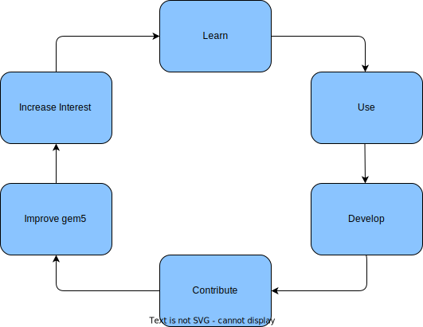
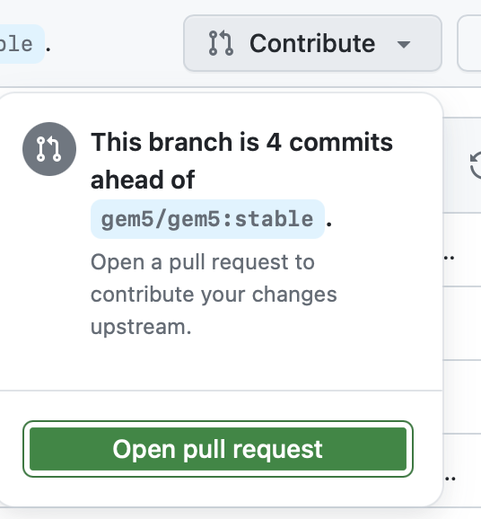
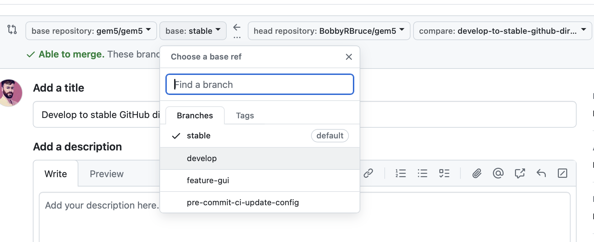

<!-- _class: title -->

## Contributing to gem5

---

## Introduction

The gem5 simulator is an open source, collaborative project.

Anyone willing to submit a contribution may do so and they will be evaluated and incorporated if suitable.

It can be a new feature, bug fix, or even documentation updates. Small or large, across the whole gem5 project.

---

## Our Strategy



---

## Why should I contribute?

- **You're nice and community-minded** :
  - You've found a bug and have a fix.
  - You've developed something truly useful and want to share it.
  - This is your way of "giving back" to something you got for free.
- **Good advertisement for your research**:
  - Many researchers use gem5. Having your work in the mainline gem5 codebase is a good way to advertise your research and make it easier to replicate and use.
**Note:** the gem5 devs will only accept code that is of high quality and well tested, and of general use, so this may not applicable in all cases.
  - Honestly, we're going to be more willing to help you with your work with gem5 the more you're willing to help us. gem5 is a community and all communities are based on give and take.

---

- **Looks good to employers**:
  - Contributions to open source projects are a good way to build dev experience.
 As gem5 is open source these contributions are public and are therefore a good way to prove your skills to potential employers.

---

## "I'm scared to contribute"

That's understandable.

However, please keep the following in mind:

1.  _Everyone_, even the most experienced gem5 devs, have had their changes rejected.
There will always exist a pull-request on the gem5 GitHub so the changes are never "gone".
The reasons for rejection are not personal, but are often concerns about how it will affect users or long term maintainability.
If a change would be a lot of time to implement, try contacting the community to see if it'd be welcome before starting.
2. The gem5 devs are nice people and are not trying to be mean.
We have to critique code contributed but we try our best to ensure it's constructive. Where possible we'll suggest how address our concerns.
Again, nothing is personal.

---

3. Very very few changes of any magnitude are accepted without some back and forth requests.
Everyone who's worked on gem5 long enough has changes that needed 5 or 6 iterations before they were accepted. It shouldn't be feared or seen as a bad thing.
4. No one fully understands the gem5 codebase.
There are parts of gem5 no one understands. It's ok to feel you don't understand the codebase completely, but it's not a reason to not contribute to the parts you do.

---

## What can I contribute?

Of course, please contribute changes you've made that you believe could be of use the community.
Bug fixes are obviously welcome, but so are new features, improvements to existing features, and documentation updates.

If you just want to try contributing, but don't have a specific idea, try looking through our GitHub Issues page: <https://github.com/gem5/gem5/issues>.

---

## What can't I contribute?

1. _Anything that'll be a burden for the community to maintain_: If you've developed something complex that would be seen to require significant updates as gem5 changes, it's unlikely to be accepted.
A large part of avoiding or fixing changes to get around this regards testing.
2. _Something for which we can't validate correctness, now or in the future_: If you've developed something that's hard to test, or that we can't easily validate is correct, it's unlikely to be accepted. We can't just read the code and always understand that it's functional. **To avoid this provide tests with your changes** (more of this later).
3. _Features that are overly niche and lack general applicability to the typical gem5 user_: If it's something you and only one or two other people will use, it's unlikely to be accepted. In these cases it's probably better to maintain a fork of gem5 with your changes.
4. _It doesn't conform our standards_:  (typically style guidelines) the code is fine, it works, but you need to make some changes to make it conform to our style guidelines. This is a common reason for changes to be rejected, but it's also one of the easiest to fix.

---

## Let's get started: Forking the repo

We use the GitHub Pull Request (PR) system for contributions via forked repositories.

A forked repository is a copy of a repository that you own and can make changes to without affecting the origin.

When you've finished implementing changes in your forked repo, you can submit a PR to request that changes from your forked repo be merged into the original.

---

## Let's get started: Forking the repo

You can go to the gem5 GitHub page and click the "Fork" button to create a fork of the gem5 repo.


**Uncheck "Copy the stable branch only"**. We don't use the stable branch for development, so you'll want to fork the `develop` branch.

You can clone it locally:

```shell
git clone https://github.com/your-username/gem5.git
```

---

## Your forked repo: Some tips and good housekeeping

- In gem5, don't  makes changes to your repo's `stable` and `develop` branch.
It's best to keep these as branches as reference to the main gem5 repo.
Instead create new branch from these:

```shell
git switch develop # Gets the branch locally the first time it is run
git branch -c develop new-branch.
```

Then move to these branches to begin making changes:

```shell
git switch new-branch
```

**Note**: name your new branches something descriptive of the changes you're making.

---

## Your forked repo: Some tips and good housekeeping

- Never make changes on the `stable` branch, make them on the `develop` branch.
In gem5, developers' changes are only merged into the `develop` branch. The `develop` branch is periodically merged into the `stable` branch to create a new gem5 release.
- Keep your forked repo's `stable` and `develop` branches up to date with the main gem5 repo.

---

## Keeping your repo up to date

There are multiple ways to do this.

1. Via the web interface: Go to your forked repo on GitHub go to the `stable` or `develop` branch and click the "Fetch upstream" button "sync fork" (note: you have to do this for each branch). Then pull the changes into your local repo with `git pull origin stable` and/or `git pull origin develop`.
2. Use the GitHub CLI: `gh repo sync {username}/gem5 -b develop && gh repo sync {username}/gem5 -b stable` will sync your forked repo (on GitHub) with the main gem5 repo.
You can then pull the changes into your local repo with `git switch stable && git pull && git switch develop && git pull`.

> **Note**: We will not cover this in this tutorial. See (https://cli.github.com/)

3. Through the git tool in your local repo by fetching the (the main gem5 repo) and merge the upstream into your local repo.

---

## Syncing your local repo

```shell
git remote -v
```
Typically you'll have an `origin` which is your GitHub repo you pulled this from.
GitHub will also add a remote called `upstream`, for forked repos, which is the main gem5 repo.
We'll keep with this naming convention, but please be aware these "remotes" can be named anything.

If you need to add the upstream you can do with

```shell
git remote add upstream https://github.com/gem5/gem5.git
```

Then you can fetch the changes from the main gem5 repo with:

```bash
git fetch upstream
git switch develop
git merge upstream/develop
```

---

## More syncing your local repo

You can then push this update to your repo on GitHub with:

```shell
git switch stable
git push origin stable
git switch develop
git push origin develop
```

**Please note:** To push to your GitHub you'll need to authenticate yourself on the system you're using.
There's a few ways to do this and may be dependent on how you've set up your GitHub account. We won't cover this here, but you can find out more here: <https://docs.github.com/en/authentication/keeping-your-account-and-data-secure/about-authentication-to-github>. Pushing in this tutorial isn't important. You can figure this out in your own time.

> [More on github's help page](https://docs.github.com/en/pull-requests/collaborating-with-pull-requests/working-with-forks/syncing-a-fork)

---

<!-- _class: start -->

## Making changes and submitting

---

## Making changes and submitting them (basic flow)

Let's ignore style guidelines, etc. for now and focus on the basic flow of making changes and submitting them.

1. Create a branch from `develop` and make changes there.

```shell
git switch develop
git switch -c my-change
```

---

## Making changes and submitting them (basic flow)

2. Make your changes. If it's a big change, break it up over multiple commits.

```shell
echo "Hello, world" > hello.txt
git add hello.txt
git commit -m "misc: Adding hello.txt"

echo "Goodbye, world" >> hello.txt
git add hello.txt
git commit -m "misc: Adding goodbye to hello.txt"
```

Please, for now, include `misc:` in your commit messages.
This will be explained later.

---

## Making changes and submitting them (basic flow)

3. Push your changes to your forked repo on GitHub.
The first time you'll likely need to set the upstream branch with:

```shell
git push --set-upstream origin my-change
```

This is done to inform your git repo that this local branch is to be pushed to the "origin" remote (your GitHub repo) and that it should track the remote branch. This is what `--set-upstream` does.

**Note**: It's unfortunate "upstream" is used in two different contexts here. In this case upstream is your GitHub based repo: it is what is immediately "upstream" to this your local repo. However the upstream in `git remote -v` is the main gem5 repo. In this case it's what's "upstream" from origin.
There's a chain of upstreams: your local repo contributes upstream to your GitHub repo which, via a pull request, contributes upstream to the main gem5 repo.

---

## Making changes and submitting them (basic flow)

4. Create a pull request. Look for the contribute button in the GitHub repo for your fork of gem5.



---

## Making changes and submitting them (basic flow)



**Note**: By default the PR will try to create a request to merge into the gem5 `stable` branch.
Make sure you select the `develop` branch instead.

---

## The PR review process and making updates

Once you've submitted a PR, the gem5 devs will review it.
You can see PRs currently under review at <https://github.com/gem5/gem5/pulls>.

There are two things that must happen before the PR is merged into the `develop` branch:

1. The PR must pass the Continuous Integration (CI) tests.
These are run automatically by GitHub when you submit a PR.
2. Reviewers must approve the PR.

When both these conditions have been met, a member of the gem5 maintainer team will merge the PR into the `develop` branch. The gem5 maintainer therefore has the final say on whether a PR is merged.

If the CI tests fail or a reviewer requests changes before approval you'll need to make updates to the PR.

---

## Updating the PR

In Github, all you need to do is update the branch you've submitted the PR from on Github.
(i.e., the branch from your forked repo).

### Add a commit

If you need to add a commit to the PR, you can do this locally and push it to your forked repo on GitHub.

```shell
# Make your changes ()
echo "bla" >> hello.txt

# Add them and commit them
git add hello.txt
git commit -m "misc: Adding bla to hello.txt"

# Push them to the branch your PR is on.
git push origin my-change
```

---

## Rebasing when gem5 is updated

You can _rebase_ your branch to make changes to existing commits in it.
This is useful if you need to change a commit message or change the order of commits, change contents of commits, merge commits, or delete commits.

It is very powerful but can be dangerous if you're not sure what you're doing.

```shell
# Rebase the last 3 commits (3 is an example, you can change this number)
git rebase -i HEAD~3
```

This returns an interactive display like this:

```shell
pick i7j8k9l misc: Adding hello.txt
pick e4f5g6h misc: Adding goodbye to hello.txt
pick a1b2c3d misc: Adding bla to hello.txt
```

---

## Rebasing

Using this you can reorder commits:

```shell
pick i7j8k9l misc: Adding hello.txt
pick a1b2c3d misc: Adding bla to hello.txt
pick e4f5g6h misc: Adding goodbye to hello.txt
```

delete commits:

```shell
pick i7j8k9l misc: Adding hello.txt
pick a1b2c3d misc: Adding bla to hello.txt
```

Tag a commit message to be reworded:

```shell
pick i7j8k9l misc: Adding hello.txt
reword a1b2c3d misc: Adding bla to hello.txt
```

---

## Rebasing

Tag a commit to be edited (this allows the commit to be changed in the same way as when you're making a commit):

```shell
edit i7j8k9l misc: Adding hello.txt
reword a1b2c3d misc: Adding bla to hello.txt
```

or squash commits:

```shell
pick i7j8k9l misc: Adding hello.txt
fixup a1b2c3d misc: Adding bla to hello.txt
```

**Warning**: Rebase errors can arise (similar to merge conflicts) and can be difficult to fix.
If you're not sure what you're doing, it's best to avoid rebasing and just add commits.
Generally though, using `fixup` and `squash` are safe, as is `reword`.
Difficulties arise when moving, deleting, or editing commits.

---

## The gem5 project's contribution requirements

The following are basic requirements for a PR to be accepted:

- It conforms to the gem5 Python style guide.
- It conforms to gem5 C++ style guide.
- Commit messages must be in the correct format and include tags.
- Commit messages contain a Change-Id.

---

## Using `pre-commit`

Fortunately there's a tool which can help with _most_ of this: Python `pre-commit`.
`pre-commit` is a tool that runs a series of checks on your code before you commit it.
It checks for code style and formatting issues, and runs some other basic checks in your local repo, allowing you to catch problems before you submit a PR.


For the following `pre-commit` will detect and automatically and correct any problems:

- gem5 Python code style errors.
- Missing commit ids.

Pre-commit will warn (but not correct) for:

- Commit messages being in the correct format and including tags.


For the case of CPP formatting, `pre-commit` runs some limited checks but these are not all inclusive.
For now CPP formatting is a manual process.

---

## Installing pre-commit

`pre-commit` triggers a series of checks when `git commit` is run. It is a git hook which is executed before the commit is made.

To install `pre-commit` execute the following:

```shell
./util/pre-commit-install.sh
```

---

## Running pre-commit

Try doing the following and see how it works.

1. Add some random white space at the end of lines in a Python file. `git add <file> && git commit -m "misc: Adding white space"`.
`pre-commit` will fail and remove the whitespace, advising you to add the file again and commit.
2. Add a random commit `echo "hello" >>hello.txt && git add hello.txt && git commit -m "misc: hello"`.
Use `git log` to observe the addition of a `Change-Id` to the commit message.
3. Add a commit without `misc:` and see `pre-commit` fail : `echo "hello" >>hello.txt && git add hello.txt && git commit -m "hello"`.

---

## Formatting a commit message

A commit message should be in the following format to avoid complaint by `pre-commit` and our CI system:

```txt
test,base: A header no greater than 65 chars inc. tags

A description of the change. This is not necessary but recommended.
Though not enforced we advise line lengths <= 72 chars.

Each header should be a comma separated list of tags followed by ':'
A short description of the change. The valid tags are found in the
"MAINTAINERS.yaml" file in the gem5 repo. Typically one tag is enough.

Issue: https://github.com/gem5/gem5/issues/123
```

---

## Formatting a commit message

A description may spawn multiple paragraphs if desired. It can be useful to add metadata about the change at the end. In particular, a link to the Issue it addresses is helpful.

**Important**:

1. Include tags! At least one.
2. Tags must be from the "MAINTAINERS.yaml" file.
3. Headers should be no longer than 65 characters.

**Recommended** (but not enforced):

1. A description of the change.
2. Description Line lengths <= 72 characters.
3. A link to the issue the change addresses.

---

## gem5's Code Style Guide

For Python we simply recommend whatever `pre-commit` suggests and formats your code to.
It uses the Black formatter which is a widely used Python formatter.

For CPP, only part of the style guide is enforced by `pre-commit`.
The full style guide can be found here: <https://www.gem5.org/documentation/general_docs/development/coding_style>

Despite the formality of the style guide we advise **conforming to the style of the code you're working on**.

---

## High level CPP style guide points

**Lines, indentation, and braces**:

- Lines must be no longer than 79 characters.
- Indentation is 4 spaces.
- Use spaces, not tabs.
- Control block (i.e., `if`, `while`, `for`, etc.) bodies must be indented.
- Control block bodies must be enclosed in curly brackets, with the exception of single line statements.
- Control block opening brackets must be on the same line as the control block and closing brackets on their own line.
- Function return types should be on their own line.
- Function or class opening and bracket should be on its own line
- `else` and `if else` must be on the same line of the closing brace of the previous block.
- Access specifiers (`public`, `private` in classes) should be on their own line and indented by 2.

---

## Code style example

```cpp
class ExampleClass
{
  public:
    int exampleVar = 0;

    int
    exampleFunc(bool condition, bool another_condition)
    {
        if (condition) {
           this->exampleVar = 5;
        } else {
           if (another_condition) this->exampleVar;
        }
    }
};
```

---

## Spacing

- One space between keywords (if, for, while, etc.) and opening parentheses
- One space around binary operators (+, -, <, >, etc.) including assignment operators (=, +=, etc.)
- No space around ‘=’ when used in parameter/argument lists, either to bind default parameter values (in Python or C++) or to bind keyword arguments (in Python)
- No space between function names and opening parentheses for arguments
- No space immediately inside parentheses, except for very complex expressions. Complex expressions are preferentially broken into multiple simpler expressions using temporary variables.

---

## Naming

- Class and Type names are CamelCase starting with a capital letter (e.g., `MyClass`).
- Class member variables are camelCase starting with a lowercase letter (e.g. `classVar`).
- Class member variables intended to be accessed via an accessor function are prepended with an underscore. (`_accessorVar`).
- Accessor functions are named after their accessor variables without the underscore (e.g., `accessorVar()`).
- Function names are camelCase starting with a lowercase letter (e.g., `myFunction()`).
- Local variables are lower case snake case (e.g., `local_var`).
This includes function arguments (e.g., `myFunction(int arg_one, int arg_two)`).

---

## Another code example

```cpp
class FooBarCPU
{
  private:
    static const int minLegalFoo = 100;
    int _fooVariable;
    int barVariable;

  public:
    int fooVariable() const { return _fooVariable; }

    void
    fooVariable(int new_value)
    {
        _fooVariable = new_value;
    }
};
```

---

<!-- _class: code-60-percent -->

## Include blocks

For `include` statements we split them into blocks, each separated by a blank line. Each block is ordered alphabetically.

```cpp
// Include Python.h first if you need it.
#include <Python.h>

// Include your main header file before any other non-Python headers
#include "main_header.hh"

// C includes in sorted order
#include <fcntl.h>
#include <sys/time.h>

// C++ includes
#include <cerrno>
#include <string>

// Shared headers living in include/.
// These are used both in the simulator and utilities such as the m5 tool.
#include <gem5/asm/generic/m5ops.h>

// M5 includes
#include "base/misc.hh"
#include "cpu/base.hh"
#include "params/BaseCPU.hh"
#include "sim/system.hh"
```
---

## Congratulations!

You now know everything you need to know to contribute to gem5.
